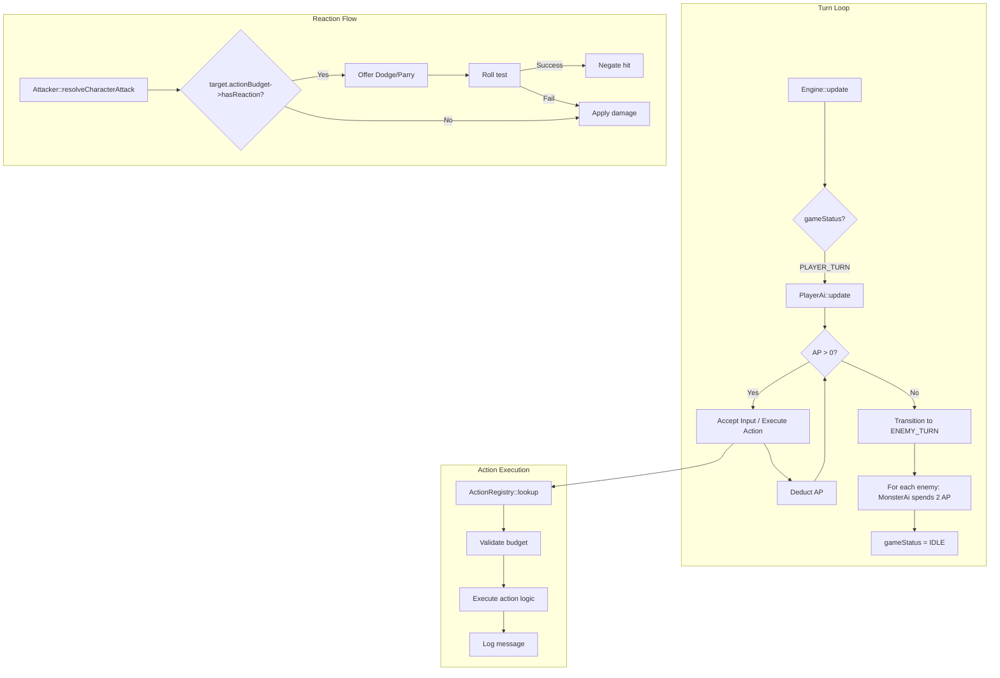

# Design Document: Action System

## Overview

This design replaces the current 1-action-per-turn model with a Rogue Trader RPG-style action economy (per RT-CoreMechanics §4). Each actor receives 2 Action Points (AP) per turn and can spend them on Half Actions (1 AP), Full Actions (2 AP), or Free Actions (0 AP). A separate Reaction resource (1 per round) enables defensive responses (Dodge/Parry) during enemy turns.

The key architectural changes are:

1. **ActionBudget component** — new component on Actor tracking AP, reactions, and aim bonus state
2. **Action registry** — enum + metadata table mapping action identifiers to cost/type
3. **Engine state machine** — new `PLAYER_TURN` state that loops until AP=0, replacing immediate `NEW_TURN` transition
4. **PlayerAi refactor** — consume AP per action instead of ending the turn on any move/attack
5. **MonsterAi refactor** — AI loop spending 2 AP per turn via action selection
6. **InputHandler** — numpad support (KP_1–KP_9, KP_5 = end turn)
7. **Reaction hooks** — integration into `Attacker::resolveCharacterAttack` using reaction budget
8. **GUI** — AP display in the right sidebar, action log with colour-coded messages
9. **Charge pathfinding** — line-of-sight movement up to AgB×3 tiles

## Architecture



### State Machine Transition

Current:
```
IDLE → (player input) → NEW_TURN → (all enemies update) → IDLE
```

New:
```
IDLE → (any player input) → PLAYER_TURN → (loop: accept input, deduct AP) → 
  AP=0 → ENEMY_TURN → (each enemy spends 2 AP) → IDLE
```

The `NEW_TURN` status is retained as an internal signal but no longer exposed to the player-facing loop. `PLAYER_TURN` and `ENEMY_TURN` are added to `Engine::GameStatus`.

## Components and Interfaces

### ActionBudget Component

```cpp
// Headers/ActionBudget.h
#pragma once

// Tracks the action point budget, reaction availability, and aim bonus
// for a single actor across one turn/round.
class ActionBudget : public Persistent {
public:
    static constexpr int MAX_AP = 2;
    static constexpr int MAX_REACTIONS = 1;
    static constexpr int MAX_AIM_BONUS = 20;
    static constexpr int AIM_PER_ACTION = 10;

    ActionBudget();

    // ── Turn lifecycle ──
    void beginTurn();   // resets AP to MAX_AP, refreshes reaction, clears aim bonus
    void endTurn();     // clears any unused aim bonus

    // ── AP management ──
    int  getAP() const;
    bool canAfford(int cost) const;
    bool spend(int cost);       // returns false if insufficient AP
    void setAP(int value);      // for End_Turn (set to 0)

    // ── Reaction management ──
    bool hasReaction() const;
    void useReaction();
    void forfeitReaction();     // for All_Out_Attack
    void refreshReaction();     // called at start of actor's turn

    // ── Aim bonus ──
    int  getAimBonus() const;
    void addAimBonus();         // +10 per call, capped at +20
    void consumeAimBonus();     // resets to 0 after attack
    void clearAimBonus();       // called on turn end

    // ── Serialization ──
    void save(TCODZip& zip) override;
    void load(TCODZip& zip) override;

private:
    int ap_ = MAX_AP;
    int reactions_ = MAX_REACTIONS;
    int aimBonus_ = 0;
};
```

### Action Registry

```cpp
// Headers/ActionRegistry.h
#pragma once

#include <array>
#include <string_view>

enum class ActionType { HALF, FULL, FREE, REACTION };

enum class ActionId {
    // Half Actions (cost 1)
    MOVE,
    STANDARD_ATTACK_MELEE,
    STANDARD_ATTACK_RANGED,
    AIM,
    RELOAD,
    OPEN_DOOR,
    PICK_UP_ITEM,
    USE_ITEM,

    // Full Actions (cost 2)
    CHARGE,
    ALL_OUT_ATTACK,
    RUN,

    // Free Actions (cost 0)
    END_TURN,

    // Reactions (cost 0 AP, cost 1 Reaction)
    DODGE,
    PARRY,

    COUNT
};

struct ActionMeta {
    ActionId    id;
    int         apCost;
    ActionType  type;
    std::string_view name;  // display name for log messages
};

namespace ActionRegistry {
    // Returns metadata for the given action. Asserts on out-of-bounds.
    const ActionMeta& get(ActionId id);

    // Returns true if the actor can afford this action given current AP.
    bool canAfford(ActionId id, int currentAP);

    // Validates that cost matches type (Half=1, Full=2, Free=0, Reaction=0).
    // Used at compile-time / startup to assert registry consistency.
    bool validateRegistry();
}
```

**Registry Data (constexpr array):**

```cpp
// Source/ActionRegistry.cpp
static constexpr std::array<ActionMeta, static_cast<int>(ActionId::COUNT)> ACTIONS = {{
    { ActionId::MOVE,                   1, ActionType::HALF, "Move" },
    { ActionId::STANDARD_ATTACK_MELEE,  1, ActionType::HALF, "Standard Attack (Melee)" },
    { ActionId::STANDARD_ATTACK_RANGED, 1, ActionType::HALF, "Standard Attack (Ranged)" },
    { ActionId::AIM,                    1, ActionType::HALF, "Aim" },
    { ActionId::RELOAD,                 1, ActionType::HALF, "Reload" },
    { ActionId::OPEN_DOOR,              1, ActionType::HALF, "Open Door" },
    { ActionId::PICK_UP_ITEM,           1, ActionType::HALF, "Pick Up Item" },
    { ActionId::USE_ITEM,               1, ActionType::HALF, "Use Item" },
    { ActionId::CHARGE,                 2, ActionType::FULL, "Charge" },
    { ActionId::ALL_OUT_ATTACK,         2, ActionType::FULL, "All-Out Attack" },
    { ActionId::RUN,                    2, ActionType::FULL, "Run" },
    { ActionId::END_TURN,               0, ActionType::FREE, "End Turn" },
    { ActionId::DODGE,                  0, ActionType::REACTION, "Dodge" },
    { ActionId::PARRY,                  0, ActionType::REACTION, "Parry" },
}};
```

### Engine State Machine Changes

```cpp
// In Engine.h — add to GameStatus enum:
enum GameStatus {
    STARTUP,
    IDLE,
    PLAYER_TURN,    // NEW: player has AP remaining, accepting input
    ENEMY_TURN,     // NEW: processing enemy AI turns sequentially
    NEW_TURN,       // retained for internal compatibility
    VICTORY,
    DEFEAT,
    TARGETING,
    INVENTORY,
    PICKUP_MENU,
    LOOK,
    CHARACTER_SHEET,
    ADVANCES,
    TABBED_MENU,
    WORLD_MAP,
    CHARACTER_GEN
};
```

**Engine::update() changes:**

```cpp
void Engine::update() {
    // ... existing modal state handlers (CHARACTER_GEN, TARGETING, etc.) ...

    if (gameStatus == STARTUP) { map->computeFOV(); gameStatus = IDLE; }

    pollInput(inputState);

    // ── PLAYER_TURN: player has AP, keep accepting input ──
    if (gameStatus == PLAYER_TURN) {
        player->update();  // PlayerAi reads input, executes action, deducts AP

        if (player->actionBudget->getAP() <= 0) {
            // Player turn over → run enemy turns
            runEnemyTurns();
            gameStatus = IDLE;
        }
        return;
    }

    // ── IDLE: waiting for first input to start player turn ──
    if (gameStatus == IDLE) {
        player->actionBudget->beginTurn();
        gameStatus = PLAYER_TURN;
        player->update();

        if (player->actionBudget->getAP() <= 0) {
            runEnemyTurns();
            gameStatus = IDLE;
        }
    }
}

void Engine::runEnemyTurns() {
    map->currentScentValue++;
    for (auto& actorPtr : actors) {
        if (actorPtr.get() != player && actorPtr.get() != nullptr) {
            if (actorPtr->ai && actorPtr->actionBudget) {
                actorPtr->actionBudget->beginTurn();
            }
            actorPtr->update();
        }
    }
}
```

### PlayerAi Refactor

The core change: instead of setting `engine.gameStatus = Engine::NEW_TURN` on every action, PlayerAi now calls `owner->actionBudget->spend(cost)` and only returns. The Engine loop detects AP=0 and transitions.

```cpp
void PlayerAi::update(Actor* owner) {
    if (owner->destructible && owner->destructible->isDead()) return;
    if (!owner->actionBudget) return;

    // Modal sub-states (door direction) handled first, unchanged...

    int dx = 0, dy = 0;
    ActionId pendingAction = ActionId::COUNT; // sentinel = no action

    // ── Parse input into (dx,dy) or action ──
    switch (engine.inputState.key.key) {
        // Arrow keys
        case SDLK_UP:    dy = -1; break;
        case SDLK_DOWN:  dy =  1; break;
        case SDLK_LEFT:  dx = -1; break;
        case SDLK_RIGHT: dx =  1; break;

        // Numpad
        case SDLK_KP_7:  dx = -1; dy = -1; break;
        case SDLK_KP_8:  dy = -1; break;
        case SDLK_KP_9:  dx =  1; dy = -1; break;
        case SDLK_KP_4:  dx = -1; break;
        case SDLK_KP_6:  dx =  1; break;
        case SDLK_KP_1:  dx = -1; dy =  1; break;
        case SDLK_KP_2:  dy =  1; break;
        case SDLK_KP_3:  dx =  1; dy =  1; break;
        case SDLK_KP_5:  pendingAction = ActionId::END_TURN; break;

        default:
            if (engine.inputState.key.c != 0) {
                handleActionKey(owner, engine.inputState.key.c);
            }
            return;
    }

    // ── End Turn (free action) ──
    if (pendingAction == ActionId::END_TURN) {
        owner->actionBudget->setAP(0);
        engine.gui->message(Colors::lightGrey, "You end your turn.");
        return;
    }

    // ── Movement ──
    if (dx != 0 || dy != 0) {
        if (!owner->actionBudget->canAfford(1)) {
            engine.gui->message(Colors::lightGrey, "Not enough AP to move.");
            return;
        }
        if (moveOrAttack(owner, owner->getX() + dx, owner->getY() + dy)) {
            engine.map->computeFOV();
        }
        // moveOrAttack deducts AP internally (1 for move, 1 for attack)
    }
}
```

### MonsterAi Refactor

```cpp
void MonsterAi::update(Actor* owner) {
    if (owner->destructible && owner->destructible->isDead()) return;

    // If no ActionBudget, use legacy 1-action behaviour
    if (!owner->actionBudget) {
        moveOrAttack(owner, engine.player->getX(), engine.player->getY());
        return;
    }

    // Spend AP budget (2 AP = two half actions)
    while (owner->actionBudget->getAP() > 0) {
        if (!selectAndExecuteAction(owner)) {
            break; // no valid action available
        }
    }
}

bool MonsterAi::selectAndExecuteAction(Actor* owner) {
    const int ap = owner->actionBudget->getAP();
    const float distance = owner->getDistance(engine.player->getX(), engine.player->getY());

    // Adjacent — attack (1 AP)
    if (distance < 2.0f && ap >= 1) {
        owner->actionBudget->spend(1);
        if (owner->attacker) {
            owner->attacker->attack(owner, engine.player);
        }
        return true;
    }

    // Far away with 2 AP — consider Charge (Full Action, 2 AP)
    if (ap >= 2 && distance <= getChargeRange(owner) && distance >= 2.0f) {
        if (attemptCharge(owner, engine.player)) {
            owner->actionBudget->spend(2);
            return true;
        }
    }

    // Move toward player (1 AP)
    if (ap >= 1) {
        owner->actionBudget->spend(1);
        moveToward(owner, engine.player->getX(), engine.player->getY());
        return true;
    }

    return false;
}
```

### Reaction System Integration

The reaction check replaces the current inline dodge/parry logic in `Attacker::resolveCharacterAttack`. Instead of always rolling, the system checks the target's `ActionBudget::hasReaction()` first.

```cpp
// Inside Attacker::resolveCharacterAttack, after hit is confirmed:

if (target->actionBudget && target->actionBudget->hasReaction()) {
    ReactionResult result = resolveReaction(target, owner, /*isMelee=*/true);
    if (result == ReactionResult::NEGATED) {
        return; // hit negated
    }
}
// ... continue to damage calculation ...
```

```cpp
enum class ReactionResult { NEGATED, FAILED, NO_REACTION };

ReactionResult resolveReaction(Actor* target, Actor* attacker, bool isMelee) {
    if (!target->actionBudget || !target->actionBudget->hasReaction()) {
        return ReactionResult::NO_REACTION;
    }

    // Determine available reactions
    bool canParry = isMelee && hasEquippedMeleeWeapon(target);
    bool canDodge = true; // always available

    // For player: prompt choice (Dodge / Parry / Skip)
    // For AI: pick best option (higher stat)
    ReactionChoice choice = pickReaction(target, canDodge, canParry);

    if (choice == ReactionChoice::SKIP) {
        return ReactionResult::NO_REACTION;
    }

    target->actionBudget->useReaction();

    if (choice == ReactionChoice::DODGE) {
        int targetAg = target->characteristics->get(CharId::Ag);
        int roll = target->attacker->rollD100();
        if (roll <= targetAg) {
            logReactionMessage(target, "dodges", true);
            return ReactionResult::NEGATED;
        }
        logReactionMessage(target, "dodge", false);
        return ReactionResult::FAILED;
    }

    if (choice == ReactionChoice::PARRY) {
        int targetWS = target->characteristics->get(CharId::WS);
        int roll = target->attacker->rollD100();
        if (roll <= targetWS) {
            logReactionMessage(target, "parries", true);
            return ReactionResult::NEGATED;
        }
        logReactionMessage(target, "parry", false);
        return ReactionResult::FAILED;
    }

    return ReactionResult::NO_REACTION;
}
```

### Charge Pathfinding

Charge requires line-of-sight straight-line movement up to AgB × 3 tiles, ending adjacent to the target with a +20 WS melee attack.

```cpp
// Headers/ChargeResolver.h
#pragma once

struct ChargeResult {
    bool valid = false;
    int endX = 0, endY = 0;  // tile to stop on (adjacent to target)
    int tilesTraversed = 0;
};

namespace ChargeResolver {
    // Computes whether a charge from (startX,startY) to a tile adjacent to
    // (targetX,targetY) is valid. Checks:
    //   1. Distance <= AgB * 3
    //   2. Straight-line path (Bresenham) is unobstructed
    //   3. Final tile is walkable and adjacent to target
    // Returns a ChargeResult with valid=true and the end position if successful.
    ChargeResult compute(int startX, int startY, int targetX, int targetY,
                         int agilityBonus, const Map& map);
}
```

**Algorithm:**
1. Compute AgB from `owner->characteristics->bonus(CharId::Ag)`
2. Max charge range = AgB × 3
3. Use Bresenham line from owner to target
4. Walk the line tile-by-tile; stop if a tile is non-walkable (wall, blocking actor)
5. If we reach a tile adjacent to the target within range, charge is valid
6. Move actor to that tile, resolve melee attack with +20 WS modifier

### Input Handler — Numpad Support

The existing `pollInput()` already translates SDL3 key events into `KeyState`. The numpad keys (`SDL_SCANCODE_KP_1` through `SDL_SCANCODE_KP_9`) are mapped via their SDL_Keycode values:

```cpp
// SDL3 numpad keycodes (already defined in SDL3):
// SDLK_KP_1 through SDLK_KP_9, SDLK_KP_5

// No InputHandler changes needed — SDL3 always reports SDLK_KP_* regardless of Num Lock state.
// The PlayerAi switch statement handles them directly (shown above).
```

For Num Lock independence: SDL3's `SDLK_KP_*` keycodes are scancode-based — they always report the numpad key identity regardless of Num Lock state. No additional handling is required.

### GUI — AP Display

AP is rendered in the right sidebar, below the existing health bar:

```cpp
// In Gui::renderRightSidebar():
void Gui::renderRightSidebar() {
    // ... existing health bar rendering ...

    // Action Points display
    if (engine.player->actionBudget) {
        int ap = engine.player->actionBudget->getAP();
        int maxAp = ActionBudget::MAX_AP;

        // Render AP pips: "AP: [■][■]" or "AP: [■][ ]" or "AP: [ ][ ]"
        rightSidebarConsole->printf(1, apRow, "AP:");
        for (int i = 0; i < maxAp; ++i) {
            TCODColor pipColor = (i < ap) ? Colors::apFull : Colors::apEmpty;
            rightSidebarConsole->setDefaultForeground(pipColor);
            rightSidebarConsole->printf(5 + i * 3, apRow, "[%c]", i < ap ? 0xFE : ' ');
        }
    }
}
```

### Action Log Message Colours

```cpp
// In Colors.h — add action log colours:
namespace Colors {
    // ... existing colours ...
    inline const TCODColor playerAction  = TCODColor(180, 220, 255); // light blue
    inline const TCODColor enemyAction   = TCODColor(255, 180, 100); // orange
    inline const TCODColor reactionEvent = TCODColor(200, 255, 200); // light green
    inline const TCODColor apFull        = TCODColor(100, 255, 100); // bright green
    inline const TCODColor apEmpty       = TCODColor(80, 80, 80);    // dark grey
}
```

### Actor Changes

```cpp
// In Actor.h — add ActionBudget component:
class ActionBudget;

class Actor {
    // ... existing members ...
    std::shared_ptr<ActionBudget> actionBudget;  // non-null for actors that take turns
};
```

All actors with an `Ai` component also receive an `ActionBudget`. This is initialized during actor creation (player in `Engine::init()`, enemies during spawn from Lua templates).

## Data Models

### ActionBudget State

| Field | Type | Default | Description |
|-------|------|---------|-------------|
| `ap_` | int | 2 | Remaining action points this turn |
| `reactions_` | int | 1 | Remaining reactions this round |
| `aimBonus_` | int | 0 | Accumulated aim bonus (0, 10, or 20) |

### ActionMeta (Registry Entry)

| Field | Type | Description |
|-------|------|-------------|
| `id` | ActionId | Unique action identifier |
| `apCost` | int | AP cost (0, 1, or 2) |
| `type` | ActionType | HALF, FULL, FREE, or REACTION |
| `name` | string_view | Display name for log messages |

### ChargeResult

| Field | Type | Description |
|-------|------|-------------|
| `valid` | bool | Whether the charge path is unobstructed within range |
| `endX`, `endY` | int | World position to move the charger to |
| `tilesTraversed` | int | Number of tiles actually moved |

### Serialization

`ActionBudget` is saved/loaded alongside other components in `Actor::save/load`. Format:

```
[int: ap_] [int: reactions_] [int: aimBonus_]
```

Since AP resets each turn, the saved values only matter for mid-turn save/load (e.g., save scumming protection). The reaction count persists across the round.

## Correctness Properties

*A property is a characteristic or behavior that should hold true across all valid executions of a system — essentially, a formal statement about what the system should do. Properties serve as the bridge between human-readable specifications and machine-verifiable correctness guarantees.*

### Property 1: AP budget conservation

*For any* sequence of valid actions performed by an actor in a single turn, the sum of AP costs deducted SHALL equal the initial AP budget (2) minus the remaining AP at turn end.

**Validates: Requirements 1.1, 1.2, 1.3, 1.4**

### Property 2: Action rejection preserves AP

*For any* actor with insufficient AP for a requested action, attempting that action SHALL leave the AP value unchanged.

**Validates: Requirements 1.5, 1.6**

### Property 3: Turn termination at zero AP

*For any* actor whose AP reaches exactly 0, the system SHALL not accept further non-free actions from that actor until the next turn begins.

**Validates: Requirements 1.7, 2.2**

### Property 4: Reaction refresh round-trip

*For any* actor, calling `beginTurn()` SHALL reset reactions to 1, and after exactly one `useReaction()` call, `hasReaction()` SHALL return false until the next `beginTurn()`.

**Validates: Requirements 4.1, 4.2, 4.3**

### Property 5: Aim bonus lifecycle

*For any* actor, the aim bonus after N aim actions (N ∈ {0,1,2}) SHALL equal min(N × 10, 20), and after `consumeAimBonus()` or `endTurn()` the aim bonus SHALL be 0.

**Validates: Requirements 12.1, 12.2, 12.3, 12.4**

### Property 6: Action registry consistency

*For any* action in the registry, the AP cost SHALL match its declared type: Half=1, Full=2, Free=0, Reaction=0.

**Validates: Requirements 11.2**

### Property 7: Charge range bounded by agility

*For any* actor with agility bonus AgB, a valid charge path SHALL have length ≤ AgB × 3 tiles, and an invalid charge (blocked or out of range) SHALL leave AP unchanged.

**Validates: Requirements 8.1, 8.2**

### Property 8: All-Out Attack forfeits reaction

*For any* actor performing All-Out Attack, after execution `hasReaction()` SHALL return false for the remainder of the round.

**Validates: Requirements 8.3, 4.4**

### Property 9: Dodge test correctness

*For any* actor attempting a Dodge reaction with a d100 roll ≤ their Agility, the hit SHALL be negated; for any roll > Agility, the hit SHALL apply normally.

**Validates: Requirements 5.1, 5.2, 5.3**

### Property 10: Parry eligibility

*For any* actor attempting a Parry, the reaction SHALL only succeed against melee attacks AND only if the actor has a melee weapon equipped. Parry against ranged attacks or without a melee weapon SHALL be denied.

**Validates: Requirements 6.4, 6.5**

### Property 11: End Turn is always available

*For any* AP value (including 0), the End_Turn free action SHALL be accepted and set AP to 0.

**Validates: Requirements 9.1, 9.2**

## Error Handling

| Scenario | Handling |
|----------|----------|
| Actor without ActionBudget attempts action | Legacy path: behave as current 1-action system (backward compat during migration) |
| Charge path blocked mid-way | Reject charge, log "Path blocked", AP unchanged |
| Parry attempted without melee weapon | Deny parry, auto-offer Dodge instead |
| Reaction triggered but actor has 0 reactions | Skip reaction opportunity silently |
| Invalid ActionId passed to registry | Assert in debug, return a "null" ActionMeta with cost=99 in release (prevents execution) |
| Save file with no ActionBudget data | Load as nullptr; actor uses legacy 1-action path |
| Numpad input with Num Lock off | SDL3 reports same SDLK_KP_* codes regardless — no special handling needed |

## Testing Strategy

### Property-Based Tests (Catch2 + RapidCheck)

The following properties are tested with minimum 100 iterations each using RapidCheck:

- **AP budget conservation**: Generate random action sequences, verify AP accounting
- **Action rejection**: Generate random (action, AP-remaining) pairs where cost > AP, verify no change
- **Turn termination**: Generate action sequences that exhaust AP, verify no further actions accepted
- **Reaction lifecycle**: Generate random beginTurn/useReaction sequences, verify state transitions
- **Aim bonus lifecycle**: Generate random aim/attack/endTurn sequences, verify bonus values
- **Registry consistency**: Iterate all entries, verify cost matches type
- **Charge range**: Generate random (position, target, AgB) triples, verify path validity
- **All-Out Attack reaction forfeit**: Generate pre-conditions, verify reaction state after
- **Dodge test**: Generate (Agility, roll) pairs, verify hit/negate outcome
- **Parry eligibility**: Generate (hasWeapon, attackType) combinations, verify acceptance/denial
- **End Turn availability**: Generate random AP values, verify End_Turn always succeeds

Each test is tagged: `// Feature: action-system, Property N: <property text>`

### Unit Tests (Catch2)

- Engine state machine transitions (IDLE → PLAYER_TURN → ENEMY_TURN → IDLE)
- PlayerAi numpad key mapping (each KP key produces correct dx/dy)
- MonsterAi spending exactly 2 AP per turn
- GUI AP display updates on spend
- Charge pathfinding with obstacles
- Message log colour differentiation (player vs enemy vs reaction)

### Integration Tests

- Full player turn: move + attack (2 half actions) → enemy turn fires
- Charge into enemy: Full Action → attack resolves → reaction offered
- Aim + Attack combo: aim (1 AP) → attack with +10 (1 AP) → turn ends

### Test Library

- **Catch2 v3** — test framework (existing)
- **RapidCheck** — property-based testing (existing in project)
- Minimum **100 iterations** per property test
- Tag format: `Feature: action-system, Property N: <description>`
