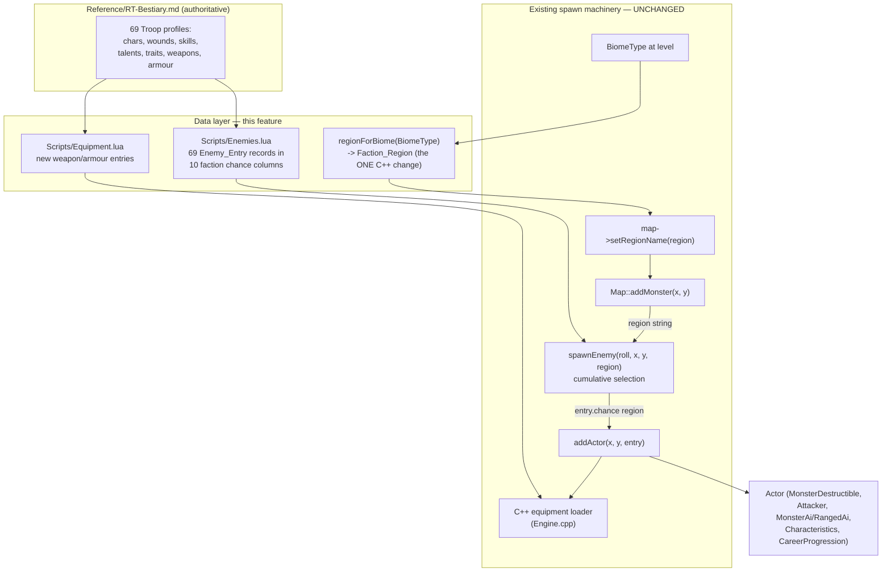

# Design Document

## Overview

This feature is **data-and-mapping only**. It populates the game's enemy data (`Scripts/Enemies.lua`) with an `Enemy_Entry` for every Troop-tagged NPC in `Reference/RT-Bestiary.md` (69 entries), adds the weapon and armour entries those NPCs reference (`Scripts/Equipment.lua`), and organises spawning by faction. Each faction owns a single `Faction_Region` column, and a whole level can be designated a `Faction_Region`.

The feature deliberately does **not** change the C++/Lua spawn boundary, the `spawnEnemy(roll, x, y, region)` contract, the `Enemy_Entry` schema, the equipment loader, or the cumulative-selection algorithm. It reuses the region-based spawn architecture delivered by `region-based-npc-spawns` and the enemy stat-block wiring delivered by `npc-stat-blocks` / `npc-skills-talents-wiring`.

All stat blocks are cited from `Reference/RT-Bestiary.md` (authoritative per the project's Rogue Trader mechanics fallback steering). Chapter IV faction sections (IV.1, IV.3–IV.9) supply 56 Troop profiles; Chapter V core-rulebook sections (5.1–5.4) supply 13 more; the six Colonist variants are built as modifications of the Colonist base template (`Reference/RT-Bestiary.md` §5.1).

### Scope Summary

**In scope (data + one mapping point):**

- New `Enemy_Entry` records for all 69 Troop profiles, using the existing schema.
- The Colonist base template plus its six variants (Adept, Bloodskinner, Entertainer, Hired Gun, Scum, Voidfarer) built as base-plus-overrides.
- Ten `Faction_Region` columns (`Chaos`, `Eldar`, `DarkEldar`, `Necron`, `Ork`, `Tau`, `Tyranid`, `ImperialHuman`, `Servitor`, `Warp`), one per faction, with per-entry cumulative chance tables.
- Reconciliation of the four legacy Ork entries (Gretchin, Ork, Shoota Boy, Nob) with the bestiary Ork Troop set.
- New weapon/armour entries in `Equipment.lua` so equipped NPCs resolve their gear.
- A single C++ change in `Source/WorldMap.cpp` `regionForBiome` to map biomes onto faction regions so faction levels are reachable in play.

**Out of scope (unchanged / deferred):** Elite- and Master-tier profiles; vehicles (`Reference/vehicles.md`); full psychic/Dark-Pact/bio-morph simulation; weighted multi-faction regions; per-tile spawn granularity; the C++/Lua spawn boundary, `spawnEnemy` signature, and selection algorithm.

### Key Findings (from code + reference review)

- **`spawnEnemy(roll, x, y, region)`** (`Scripts/Enemies.lua`) iterates a `local enemies` list in declaration order, reads `e.chance[region]` (nil if the entry has no column for that region), and calls the injected `addActor(x, y, e)` for the first entry with `roll < threshold`. No match ⇒ no spawn. This function and its algorithm are **unchanged** by this feature.
- **`addActor`** (`Source/Map.cpp`) reads every field via sol2 `entry.get_or(...)`. Characteristics default to 20 when absent. It builds `MonsterDestructible(hp, defense, corpse, xp)`, `Attacker(power, skill)`, `MonsterAi`, `ActionBudget`, `Characteristics`, and — when `skills`/`talents`/`traits` are present — a `CareerProgression` via `populateStatBlockFromLua`. Equipment: named `equipment` (looked up by exact string match against `engine.equipmentTemplates`; missing names warn and are skipped), `dropChance` (clamped 0..1), `equipTier` (tier-weighted selection **only when `equipment` is absent**). If the equipped weapon has `rangedStats`, the AI is swapped to `RangedAi`. Named `equipment` takes precedence over `equipTier`. **Unchanged** by this feature.
- **Equipment loader** (`Source/Engine.cpp`, runs before map init) reads global `equipment = { ... }` from `Scripts/Equipment.lua`. Required: `name`, `glyph`, `color`, `slot` (accepts `weapon`/`body`/`head`/`offhand`), `weight` (>= 0). Weapons need `sizeClass`, `weaponGroup`, `damageType` (validated by `WeaponTypes.cpp`) plus a `melee` and/or `ranged` sub-table; `damageDice` must parse via `DiceRoller` and `range` must be > 0. Armour uses `armourLocations`. Invalid entries are skipped with a Gui warning (non-fatal). **Unchanged** by this feature.
- **`regionForBiome(BiomeType)`** (`Source/WorldMap.cpp`) is the single biome→`Region_Name` derivation point. Currently a total, exhaustive `switch` over the five `BiomeType` values (`TOXIC_SWAMP`, `DEAD_FOREST`, `ASH_DESERT`, `WASTELAND`, `HIVE_CITY`) that all return `"Ork"`. `resolveDefaultRegion()` reads `config.defaultRegion` from `Scripts/Config.lua` (currently `"Ork"`) with compiled fallback `DEFAULT_REGION_FALLBACK = "Ork"`. `map->setRegionName(regionForBiome(biome))` sets the active level's region. This is the **one** C++ change point.
- **Fallback**: if `Scripts/Enemies.lua` fails to load/execute, `Map` catches the `sol::error` and falls back to a hard-coded Ork spawn (`roll < 80` → Ork, else Nob).
- **Reference profiles** cite characteristics as integers 0–100, Wounds as integers, Unnatural multipliers in parentheses (e.g. `S 40 (8)`) with the matching `Unnatural X (×N)` trait on the Traits line, em-dashes for absent BS/Fel, and `Weapon (Class Range; RoF; Damage; Pen; Clip; Reload; Qualities)` weapon lines.

## Architecture

Because the spawn machinery already exists, this feature changes only **data** (`Enemies.lua`, `Equipment.lua`) and **one mapping table** (`regionForBiome`). No new components, no interface changes.



### Faction-Region Model

Each faction owns one `Faction_Region` column. The ten `Region_Name` values are:

| Region_Name | Faction | Source sections |
|---|---|---|
| `Chaos` | Renegades/Heretics/Mutants + Daemons | IV.1, IV.3 |
| `Eldar` | Craftworld Eldar + Eldar Corsair | IV.4, §5.3 |
| `DarkEldar` | Harlequins & Dark Eldar | IV.5 |
| `Necron` | Necrons | IV.6 |
| `Ork` | Orks + Ork Freebooter | IV.7, §5.3 |
| `Tau` | Tau/Kroot/Vespid + Kroot Mercenary | IV.8, §5.3 |
| `Tyranid` | Tyranids | IV.9 |
| `ImperialHuman` | Imperial Humans (Colonist + variants + officers) | §5.1 |
| `Servitor` | Servitors | §5.2 |
| `Warp` | Denizens of the Warp | §5.4 |

Each `Enemy_Entry` carries a **single-key** `chance` table naming its own faction, e.g. `chance = { Tyranid = 40 }`. Because `spawnEnemy` reads `e.chance[region]` and skips entries whose table lacks the requested key, an entry is only ever selectable in its own faction's region. This gives **faction purity** for free from the existing algorithm (Requirement 6.4).

#### How a level is designated a faction

The single point at which a level becomes a faction is `regionForBiome(BiomeType)` (Requirement 6.3). This feature expands the placeholder all-`"Ork"` mapping so each of the five biomes maps to a faction region, making those factions reachable in play:

```cpp
std::string regionForBiome(BiomeType biome) {
    switch (biome) {
    case BiomeType::HIVE_CITY:   return "ImperialHuman";
    case BiomeType::ASH_DESERT:  return "Ork";
    case BiomeType::DEAD_FOREST: return "Eldar";
    case BiomeType::WASTELAND:   return "Servitor";
    case BiomeType::TOXIC_SWAMP: return "Chaos";
    }
    return DEFAULT_REGION_FALLBACK; // "Ork" — out-of-range cast only
}
```

This is a **recommended, light** approach: it keeps `regionForBiome` the single derivation point, stays a total exhaustive `switch` (a new biome surfaces a compiler warning), and remains engine-isolated so property tests can call it directly. The five biomes reach five of the ten factions; the remaining factions (`DarkEldar`, `Necron`, `Tau`, `Tyranid`, `Warp`) are defined and selectable but are reached only when a level is explicitly designated their region.

**Alternatives considered (noted, not chosen for this iteration):**

- **Config-driven designation.** Add an optional `config.levelFactionRegion` (or a per-depth table) to `Scripts/Config.lua`, read alongside `resolveDefaultRegion()`, letting designers pin a level to any of the ten factions without a biome mapping. This is compatible and can be layered later; deferred to keep the change minimal (Requirement 6.5 permits deferring the assignment mechanism).
- **Level-metadata designation.** Store a `Faction_Region` on the level/world-map tile struct. Higher-touch; deferred.

Whichever mechanism is used, `DEFAULT_REGION_FALLBACK` stays `"Ork"` and any unknown region resolves to `"Ork"` (a defined column), so selection never crashes and always has a valid column to fall back to (Requirement 6.6). `config.defaultRegion` remains `"Ork"`.

> **Explicitly deferred:** weighted multi-faction regions and per-tile spawn granularity. A whole level is a single faction region.

### Ownership and Responsibility

- **`Scripts/Enemies.lua`** owns every `Enemy_Entry`, its derived stat fields, `skills`/`talents`/`traits`, `equipment`/`dropChance`/`equipTier`, and its single-key `chance` column.
- **`Scripts/Equipment.lua`** owns every new weapon/armour entry referenced by an `Enemy_Entry`.
- **`regionForBiome`** (`Source/WorldMap.cpp`) owns the biome→faction-region assignment; no other code derives a region from a biome.
- **`spawnEnemy`**, **`addActor`**, the **equipment loader**, and **`Map::addMonster`** are unchanged and continue to own selection, actor construction, gear resolution, and the C++/Lua boundary.

## Components and Interfaces

### Touched files

| File | Change | Kind |
|---|---|---|
| `Scripts/Enemies.lua` | Replace the four legacy Ork entries with 69 Troop `Enemy_Entry` records in 10 faction columns; keep `spawnEnemy` unchanged | Data |
| `Scripts/Equipment.lua` | Add new weapon/armour entries referenced by new NPCs; retain all existing entries unchanged | Data |
| `Source/WorldMap.cpp` (`regionForBiome`) | Expand the placeholder all-`"Ork"` switch to map each biome to a faction region | One C++ change |

**Not changed:** `Source/Map.cpp` `addActor`, the equipment loader in `Source/Engine.cpp`, the `spawnEnemy` contract, the `Enemy_Entry`/`Equipment_Entry` schemas, and the cumulative-selection algorithm.

### 1. `regionForBiome` (the only code change)

`Headers/WorldMap.hpp` signature is unchanged; only the `switch` body in `Source/WorldMap.cpp` changes (see the snippet above). Properties preserved: total over the five biomes, non-empty result, exhaustive `switch` with the trailing `return DEFAULT_REGION_FALLBACK` covering out-of-range casts, pure/engine-isolated. If the config-driven alternative is later adopted, `regionForBiome` stays the biome path and the config lookup layers on top in `Map` where the region is set.

### 2. `Scripts/Enemies.lua` — Enemy_Entry construction

Each Troop profile maps to one `Enemy_Entry` using the existing schema. The mapping rules:

- **Characteristics** (`ws bs s t ag int per wp fel`): copied verbatim as the **base** integer in `[0, 100]` from the profile's stat row (Requirements 2.1, 2.4). An **em-dash** (`—`) becomes `0` (Requirement 2.2). The parenthetical `(N)` after a characteristic is an Unnatural bonus and is **excluded** from the stored integer (Requirement 2.4).
- **`hp`** = the profile's **Wounds** value (Requirement 3.1). If Wounds is cited as `0`/omitted (e.g. Screamer of Tzeentch, Wych — both print Wounds 0), `hp` is set to `1` or greater with a comment documenting the source-omitted value (Requirement 3.5).
- **`skills`** = name→rank table (rank derived from the profile's `+X` suffix, defaulting to `0`); **`talents`** and **`traits`** = string lists. All three are always present, using an empty table `{}` when the profile cites none (Requirements 3.2, 3.4).
- **Unnatural multipliers** are recorded as `traits` strings of the form `Unnatural <Characteristic> (x<N>)` (Requirement 2.3). Where the profile's Traits line already names the multiplier (`Unnatural Toughness (×2)`), that exact rank is used; where only a parenthetical bonus appears, the RT convention (bonus = characteristic-bonus × multiplier) fixes the rank.
- **Machine / Daemonic / Fear / Flyer / Size** traits are copied as `traits` strings (Requirement 3.3), e.g. `"Machine (4)"`, `"Fear (2)"`, `"Flyer (12)"`, `"Size (Puny)"`, `"Daemonic (3)"`.
- **`equipment`** lists resolve by exact name to `Equipment.lua`. Where a profile offers a weapon choice (`A -or- B`), the design picks one representative loadout per entry. `dropChance` and `equipTier` follow existing Ork conventions.
- **Cosmetic fields** (`glyph`, `color`, `corpse`, `xp`, `power`, `skill`, `defense`) are chosen per the heuristics below; they are not constrained by the reference.

#### Cosmetic / derived heuristics

- **`glyph`** (`string.byte("x")`): a lowercase letter for rank-and-file, uppercase for larger/leader Troops, chosen per faction family (e.g. Orks `o`/`N`, Tyranids `t`/`T`, Eldar `e`, Necrons `n`, Servitors `s`, Daemons `d`).
- **`color`**: a faction-themed palette name from `Headers/Colors.hpp` (e.g. Orks `desaturatedGreen`, Necrons `lightGrey`/`metalGrey`, Tyranids `crimson`, Warp `purple`). Named colours must exist in `Colors.hpp` (`colorFromName` falls back gracefully but a real name is preferred).
- **`hp`** = Wounds directly (float).
- **`power`** (base melee power fed to `Attacker`): scaled from the profile's principal weapon and Strength — a simple heuristic of `power ≈ round(SB + weaponDiceAverageBonus/3)`, clamped to the range the existing Ork set uses (2.0–5.0). Exact values are chosen in the tasks phase; the reference constrains only characteristics/wounds/skills/talents/traits/equipment.
- **`skill`** (base to-hit fed to `Attacker`): the profile's `WS` for melee-primary Troops, or `BS` for ranged-primary Troops (matching the existing Ork convention where `skill` tracks the dominant combat characteristic).
- **`xp`**: scaled by Wounds and threat (e.g. `xp ≈ Wounds × 2` for rank-and-file, higher for leaders), consistent with the existing Gretchin 15 / Ork 35 / Nob 100 spread.
- **`corpse`**: `"dead <name>"` or a faction-flavoured string (e.g. `"Ork carcass"`), matching existing conventions.
- **`defense`**: a small float reflecting armour/agility, following the existing set (0.0–1.5).

#### Worked example — Ork Boy (IV.7)

Profile: `WS 35 BS 25 S 45 T 45(6) Ag 30 Int 20 Per 30 WP 25 Fel 20`, Wounds 18, Choppa + Slugga/Shoota, Talents (Furious Assault, Iron Jaw, …), Traits (Brutal Charge (1), Mob Rule, Size (4), Sturdy, Unnatural Toughness (×2)).

```lua
{
    chance  = { Ork = 55 },              -- position within the Ork column
    glyph   = string.byte("o"),
    name    = "Ork Boy",
    color   = "desaturatedGreen",
    hp      = 18.0,                      -- Wounds 18
    defense = 0.0,
    corpse  = "dead Ork Boy",
    xp      = 40,
    power   = 3.0,
    skill   = 35,                        -- WS (melee-primary)
    ws = 35, bs = 25, s = 45, t = 45, ag = 30, int = 20, per = 30, wp = 25, fel = 20,
    equipment  = { "Choppa", "Slugga" },
    dropChance = 0.4,
    equipTier  = { common = 80, uncommon = 18, rare = 2 },
    skills  = { Athletics = 1, Fortitude = 0, Intimidate = 0 },
    talents = { "Bulging Biceps", "Furious Assault", "Hardy", "Iron Jaw",
                "Street Fighting", "Unarmed Warrior" },
    traits  = { "Brutal Charge (1)", "Mob Rule", "Size (Hulking)", "Sturdy",
                "Unnatural Toughness (x2)" },
}
```

Note the parenthetical `T 45(6)` stores `t = 45`; the multiplier becomes the `Unnatural Toughness (x2)` trait.

#### Worked example — Ripper Swarm (Tyranid, IV.9)

A representative Tyranid Troop with faction glyph/color. (Exact characteristics finalised against IV.9 in the tasks phase; shape shown.)

```lua
{
    chance  = { Tyranid = 30 },
    glyph   = string.byte("t"),
    name    = "Ripper Swarm",
    color   = "crimson",
    hp      = 12.0,                      -- Wounds from IV.9 profile
    defense = 0.0,
    corpse  = "ripper remains",
    xp      = 24,
    power   = 2.0,
    skill   = 30,                        -- WS (melee-only; BS em-dash -> 0)
    ws = 30, bs = 0, s = 30, t = 25, ag = 40, int = 5, per = 30, wp = 20, fel = 0,
    equipment = {},                      -- natural weapons only
    skills  = {},
    talents = {},
    traits  = { "Size (Swarm)", "Unnatural Toughness (x2)", "Fearless" },
}
```

#### Worked example — Servitor Drone (§5.2) with em-dash Fel and Machine trait

Profile: `WS 15 BS 15 S 50 T 40 Ag 15 Int 10 Per 20 WP 30 Fel 05`, Wounds 10, Traits `Machine (4), Natural Weapon (Fist)`, weapon Fist. (Servitor Drone has `Fel 05`; other Servitors — Battle Servitor, Grapplehawk, Servo Skull — carry em-dash Fel/BS → `0`.)

```lua
{
    chance  = { Servitor = 45 },
    glyph   = string.byte("s"),
    name    = "Servitor Drone",
    color   = "lightGrey",
    hp      = 10.0,                      -- Wounds 10
    defense = 0.0,
    corpse  = "wrecked servitor",
    xp      = 20,
    power   = 3.0,
    skill   = 15,                        -- WS (melee-only)
    ws = 15, bs = 15, s = 50, t = 40, ag = 15, int = 10, per = 20, wp = 30, fel = 5,
    equipment = {},                      -- Fist is a natural weapon, represented as a trait
    skills  = { Trade = 1 },
    talents = {},
    traits  = { "Machine (4)", "Natural Weapon (Fist)" },
}
```

For the **Battle Servitor (Charron-Pattern)**, `Fel —` becomes `fel = 0`, and the `S 40 (8)` / `T 40 (8)` parentheticals store `s = 40`, `t = 40` with `traits` including `"Unnatural Strength (x2)"`, `"Unnatural Toughness (x2)"`, `"Machine (4)"`, `"Armour Plated"`, `"Flyer (2)"`, `"Sturdy"`.

### 3. Colonist base + variants (§5.1)

The Colonist base has characteristics `WS 25, BS 20, S 30, T 30, Ag 30, Int 25, Per 25, WP 25, Fel 30`, Wounds 9, talents `Basic Weapon Training (SP)`, `Melee Weapon Training (Primitive)` (Requirement 4.1). Each variant is the base with only the cited overrides applied; every non-overridden characteristic keeps the base value (Requirement 4.2):

| Variant | Characteristic overrides | hp | Added skills/talents |
|---|---|---|---|
| Adept | Int 30 | 9 | +Common Knowledge, Literacy, Speak (High Gothic) |
| Bloodskinner | WS 35, BS 30, Per 35 | 9 | +Navigation, Survival, Tracking, Wrangling; +Weapon Training (Primitive, Chain) |
| Entertainer | Fel 35 | 9 | +Carouse, Charm, Deceive, (Acrobatics/Gamble/Performer) |
| Hired Gun | BS 35 | **12** | +Climb, Intimidate; +Weapon/Pistol Training (Universal) |
| Scum | WS 30, Per 30 | 9 | +Carouse, Chem-Use, Deceive, Gamble, Silent Move; +Jaded, Pistol Training |
| Voidfarer | S 38, T 38 | 9 | +Speak (Void Cant), Tech-Use |

Each variant's `skills`/`talents`/`traits` are the Colonist base entries **plus** the variant additions (Requirement 4.4). Only the Hired Gun overrides Wounds to 12 (Requirement 4.3).

### 4. `Scripts/Enemies.lua` — per-region chance columns

Every entry declares a single-key `chance` table naming its faction. Within a column, cumulative values are strictly ascending in declaration order and the final entry equals 100 (Requirements 7.2, 7.3). See Data Models for the assignment formula and a worked column.

### 5. `Scripts/Equipment.lua` — new weapon/armour entries

Every `Equipment_Reference` in a new `Enemy_Entry` must resolve to exactly one entry whose `name` is byte-for-byte equal (Requirement 9.1). New entries follow the existing schema (Requirement 9.2): non-empty `name`, single-char `glyph`, `color`, `slot ∈ {weapon, body, head, offhand}`, `weight >= 0`.

**Reuse first:** many bestiary weapons already exist in `Equipment.lua` and are reused by name — `Choppa`, `Slugga`, `Shoota`, `Big Choppa`, `Power Klaw`, `Ork Armor`, `Combat Knife`, `Chainsword`, `Autogun`, `Laspistol`, `Flak Armor`. Only genuinely new references get new entries.

**Parsing weapon lines:** the reference format is `Name (Damage; Pen X; Class Range; RoF; Clip N; Reload; Qualities)`. Map into schema as:

- ranged → `ranged = { damageDice, penetration, range, rateOfFire, clipSize, reloadTime }` (Requirement 9.3), with `sizeClass`/`weaponGroup`/`damageType` classification fields (validated by `WeaponTypes.cpp`);
- melee → `melee = { damageDice, penetration, qualities }` (Requirement 9.4);
- body armour → `armourLocations = { head, body, leftArm, rightArm, leftLeg, rightLeg }`, `0` for uncited locations (Requirement 9.5).

`damageDice` carries any flat bonus in the string (e.g. `"1d10+4"`), exactly as the existing Ork weapons do. `range` must be `> 0` and `damageDice` must parse via `DiceRoller`, or the loader skips the entry with a warning (non-fatal).

Example new ranged weapon (Lasgun, from Hired Gun: `1d10+3 E; Pen 0; Basic 30m; S/3/–; Clip 60; Reload Full; Reliable`):

```lua
{
    name    = "Lasgun",
    glyph   = "}",
    color   = "lightRed",
    slot    = "weapon",
    weight  = 4.0,
    tier    = "common",
    sizeClass   = "Basic",
    weaponGroup = "Las",
    damageType  = "E",
    melee  = { damageDice = "1d5", penetration = 0, qualities = {} },
    ranged = { damageDice = "1d10+3", penetration = 0, range = 30,
               rateOfFire = 3, clipSize = 60, reloadTime = 1 },
}
```

Example new armour (Light Flak Coat, from Hired Gun: `Arms 2, Body 2, Legs 2`):

```lua
{
    name    = "Light Flak Coat",
    glyph   = "[",
    color   = "lighterOrange",
    slot    = "body",
    weight  = 6.0,
    tier    = "common",
    armourLocations = {
        head = 0, body = 2, leftArm = 2, rightArm = 2, leftLeg = 2, rightLeg = 2,
    },
}
```

**Unresolvable references:** if a bestiary weapon has no citable profile or cannot be expressed in the schema, the reference is either omitted from the `equipment` list or defined minimally so the C++ loader accepts it (Requirement 9.6). Preferring omission keeps data clean; the enemy then relies on `power`/`skill` for combat. Every existing equipment entry is retained unchanged (Requirement 9.7).

### 6. Unchanged interfaces

`spawnEnemy(roll, x, y, region)` keeps its signature (Requirement 10.1), calls `addActor` with the selected entry (Requirement 10.2), spawns nothing when no column entry's threshold exceeds the roll (Requirement 10.3), keeps `Region_Name` values as strings decoupled from the boundary (Requirement 10.4), and retains the C++ hard-coded Ork fallback on Lua load failure (Requirement 10.5).

## Data Models

### Enemy_Entry (existing Lua schema, reused)

| Field | Type | Source / rule |
|---|---|---|
| `chance` | table `{ <Faction> = int [0,100] }` (single key) | Assigned per faction column |
| `glyph` | byte via `string.byte("x")` | Cosmetic heuristic |
| `name` | string (unique across Bestiary) | Profile name (Requirement 1.11) |
| `color` | string (name in `Colors.hpp`) | Faction palette |
| `hp` | float | Profile Wounds; `>= 1` if Wounds 0/omitted |
| `defense` | float | Cosmetic (0.0–1.5) |
| `corpse` | string | `"dead <name>"` convention |
| `xp` | int | Scaled by Wounds/threat |
| `power` | float | Scaled from weapon + SB |
| `skill` | int | WS (melee) or BS (ranged) |
| `ws bs s t ag int per wp fel` | int `[0,100]` | Profile base value; em-dash → 0; multiplier excluded |
| `equipment` | string list (may be `{}`) | Resolves to Equipment_Script names |
| `dropChance` | float `[0,1]` | Existing convention |
| `equipTier` | table `{common, uncommon, rare}` | Existing convention |
| `skills` | table name→rank (may be `{}`) | Profile skills |
| `talents` | string list (may be `{}`) | Profile talents |
| `traits` | string list (may be `{}`) | Profile traits + `Unnatural X (xN)` + Machine/Daemonic/Fear/Flyer/Size |

### Equipment_Entry (existing Lua schema, reused)

| Field | Type | Rule |
|---|---|---|
| `name` | non-empty string | Byte-equal to the `Equipment_Reference` |
| `glyph` | single char | — |
| `color` | string | — |
| `slot` | `weapon`/`body`/`head`/`offhand` | Loader-accepted slots only |
| `weight` | float `>= 0` | — |
| `value`/`power`/`defense`/`maxHp`/`skill`/`tier` | optional | Defaults per loader |
| `sizeClass`/`weaponGroup`/`damageType` | strings (weapons) | Validated by `WeaponTypes.cpp` |
| `melee` | `{ damageDice, penetration, qualities }` | Melee weapons; `damageDice` parses via `DiceRoller` |
| `ranged` | `{ damageDice, penetration, range, rateOfFire, clipSize, reloadTime }` | Ranged weapons; `range > 0` |
| `armourLocations` | `{ head, body, leftArm, rightArm, leftLeg, rightLeg }` | Body/head armour; `0` for uncited |

### Faction-region columns

Ten `Region_Name` columns, one per faction (see the Faction-Region Model table). Each column is a `Race_Group`: the set of entries sharing that key. An entry lacking a column's key is never selected for that region (existing `spawnEnemy` semantics).

### Cumulative chance table construction

For a column with `n` entries in declaration order, assign strictly-ascending cumulative integers `c_1 < c_2 < … < c_n = 100`. The design uses **role/rarity weighting**: assign each entry a positive spawn weight `w_i` (common rank-and-file heavier, rare leaders lighter), then set the cumulative value

```
c_i = round( 100 × (w_1 + … + w_i) / (w_1 + … + w_n) )
```

adjusting any collision upward by 1 so the sequence stays strictly ascending, and forcing `c_n = 100`. An even split (`c_i = round(100 × i / n)`) is the degenerate case when all weights are equal.

**Worked column — Ork** (13 IV.7 Troops + Ork Freebooter = 14 entries). Rebuilt entirely from the bestiary (Requirement 8.1); the legacy Gretchin/Ork/Shoota Boy/Nob flat distribution is replaced (Requirement 8.4). Weighting common boyz heavier than specialists/leaders, one valid strictly-ascending assignment ending at 100:

| # | Entry | Cumulative |
|---|---|---|
| 1 | Snotling | 8 |
| 2 | Snotling Mob | 14 |
| 3 | Gretchin | 26 |
| 4 | Ork Boy | 45 |
| 5 | Burna Boy | 52 |
| 6 | Tankbusta | 59 |
| 7 | Loota | 66 |
| 8 | Storm Boy | 72 |
| 9 | Kommando | 78 |
| 10 | 'Ard Boy | 84 |
| 11 | Skar Boy | 89 |
| 12 | Runtherd | 93 |
| 13 | Attack Squig | 97 |
| 14 | Ork Freebooter | 100 |

Concrete intermediate percentages for the other nine columns are chosen the same way in the tasks phase; only the invariants (strictly ascending, terminal 100) are fixed here and captured as correctness properties.

### Ork reconciliation (Requirement 8)

The four legacy entries (`Gretchin`, `Ork`, `Shoota Boy`, `Nob`) are replaced by the bestiary Ork Troop set:

| Legacy entry | Disposition |
|---|---|
| `Gretchin` | Kept as a name (bestiary IV.7 Gretchin exists); characteristics/hp/skills/talents/traits realigned to the IV.7 profile (`WS 15 BS 35 S 20 T 20(3) Ag 45 Int 35 Per 35 WP 20 Fel 25`, Wounds 6, Grot Blasta) (Requirement 8.2) |
| `Ork` | Retired/renamed to `Ork Boy` (the IV.7 rank-and-file), whose profile is authoritative; no stale `Ork` duplicate remains (Requirement 8.3) |
| `Shoota Boy` | Retired — no distinct IV.7 "Shoota Boy" Troop exists; a shoota loadout is an Ork Boy weapon option, so it folds into `Ork Boy` (Requirement 8.3) |
| `Nob` | Retired — the bestiary Nob is **Elite**, out of scope; leadership presence in the Troop column is covered by `Runtherd` and `Ork Freebooter` (Requirement 8.3) |

The rebuilt `Ork` column is the 13 IV.7 Troops plus Ork Freebooter, strictly ascending, terminal 100 (Requirement 8.4). Because the legacy names are fully reconciled, no stale duplicate Ork entry survives.

### Deferred-scope documentation (Requirement 11)

`Enemies.lua` carries a header comment documenting that Elite-/Master-tier NPCs, weighted multi-faction regions, and per-tile spawn granularity are deferred, and that vehicles live in `Reference/vehicles.md` and are out of scope (Requirement 11.2). The schema and `spawnEnemy` signature are unchanged, so Elite/Master entries can be added later without structural change (Requirement 11.3).

## Correctness Properties

*A property is a characteristic or behavior that should hold true across all valid executions of a system — essentially, a formal statement about what the system should do. Properties serve as the bridge between human-readable specifications and machine-verifiable correctness guarantees.*

These properties suit property-based testing because the loaded bestiary data and the `spawnEnemy` selection function are pure, deterministic, and have universal invariants over a large input space (any region, any roll in 0..100). Tests load `Scripts/Enemies.lua` and `Scripts/Equipment.lua` through sol2 in the test binary and assert the properties over the resulting tables and over `spawnEnemy`. This project uses Catch2 v3 + RapidCheck.

### Property 1: Cumulative columns are strictly ascending and terminate at 100

*For any* defined `Faction_Region` column containing one or more entries, the cumulative `chance` values in declaration order are strictly ascending and the final entry's value equals exactly 100.

**Validates: Requirements 7.2, 7.3, 8.4**

### Property 2: Selection is total and faction-pure

*For any* `Faction_Region` `R` that is a defined column and *any* roll integer in `[0, 100]`, `spawnEnemy(roll, x, y, R)` selects at most one entry, and any selected entry belongs to `R` (its `chance` table contains key `R`); an entry is selected whenever `roll` is strictly less than the column's terminal value (100), and none is selected only when no cumulative value strictly exceeds `roll`.

**Validates: Requirements 6.4, 7.4, 7.5, 10.2, 10.3**

### Property 3: Every equipment reference resolves

*For any* `Enemy_Entry` and *any* name in its `equipment` list, there exists exactly one entry in `Equipment.lua` whose `name` is byte-for-byte equal to that reference (no dangling references).

**Validates: Requirements 9.1, 9.6**

### Property 4: Characteristics are integers in range

*For any* `Enemy_Entry`, each of the nine characteristics (`ws bs s t ag int per wp fel`) is an integer in `[0, 100]`.

**Validates: Requirements 2.1, 2.2, 5.1**

### Property 5: Entry names are unique

*For any* two distinct `Enemy_Entry` records in the Bestiary, their `name` values differ.

**Validates: Requirements 1.11**

### Property 6: Unknown region falls back safely

*For any* string that is not a defined `Faction_Region`, resolving a spawn region yields the defined fallback `"Ork"` (equal to `DEFAULT_REGION_FALLBACK`) and never crashes; `spawnEnemy` invoked with such a string selects nothing rather than erroring.

**Validates: Requirements 6.6, 10.4, 10.5**

### Property 7: Wounds map to positive hp

*For any* `Enemy_Entry`, `hp >= 1` (Wounds of zero or omitted are floored to at least 1).

**Validates: Requirements 3.1, 3.5**

### Property 8: Optional collections are present, never omitted

*For any* `Enemy_Entry`, the fields `skills`, `talents`, and `traits` are each present as a table (possibly empty), never absent.

**Validates: Requirements 3.4, 5.3**

### Property 9: Glyph/color pairs are distinct across the Bestiary

*For any* two distinct `Enemy_Entry` records, the pair `(glyph, color)` differs — no two NPCs share both the same glyph and the same color. Equivalently, the set of `(glyph, color)` pairs has the same cardinality as the roster. This keeps every NPC visually distinguishable on the map (two entries may share a glyph if their colors differ, or share a color if their glyphs differ, but never both).

**Validates: Requirements 5.4**

### Reflection and consolidation

The initial analysis produced candidate properties that were consolidated:

- "adding Ork Freebooter keeps the column ending at 100" and "each column ends at 100" merged into **Property 1** (one invariant over all columns).
- "selection picks exactly one entry" and "selected entry belongs to the region" merged into **Property 2** (totality + faction purity in one statement).
- Per-faction characteristic-range checks (Ork, Tyranid, Servitor, …) generalised into **Property 4** (over all entries).
- "Colonist variant characteristics equal base plus overrides" is validated by concrete example-based tests (see Testing Strategy), not a property, because it is a fixed finite mapping rather than a universally quantified invariant.

## Error Handling

| Condition | Handling | Requirement |
|---|---|---|
| `Scripts/Enemies.lua` fails to load/execute | `Map` catches `sol::error` and falls back to the hard-coded Ork spawn (`roll < 80` → Ork, else Nob). Unchanged. | 10.5 |
| Invalid `Equipment.lua` entry (bad slot, unparseable `damageDice`, `range <= 0`, `weight < 0`) | Equipment loader skips the entry with a Gui warning; non-fatal; other entries still load. | 9.2 |
| `equipment` reference names a template not present in `Equipment.lua` | `addActor` warns (`equipment template '#' not found`) and skips that item; the enemy still spawns. Property 3 exists to prevent this in shipped data. | 9.1, 9.6 |
| Spawn requested for an unknown / non-faction region | Region resolution supplies `"Ork"` (a defined column); no crash. If a raw unknown string still reaches `spawnEnemy`, no entry matches and the tile is left empty. | 6.6, 7.5 |
| Profile cites Wounds 0 / omitted (Screamer of Tzeentch, Wych) | `hp` set to `>= 1` with a documenting comment. | 3.5 |
| Characteristic cited as em-dash | Stored as `0`. | 2.2 |
| `dropChance` outside `[0,1]` | Clamped by `addActor` with a warning. Unchanged. | 5.2 |

All error paths are non-fatal: the game remains playable, and at worst an individual entry or item is skipped.

## Testing Strategy

The feature is data-and-mapping, so the strategy combines **Lua data-shape validation**, **property-based tests** over the loaded data and `spawnEnemy`, and **targeted example tests**. It follows the project's TDD workflow: the **qa-tester** writes failing tests first (from this design), then the **developer** makes them pass with data/mapping changes.

### Test harness

A C++ test file (e.g. `Tests/test_bestiary_data.cpp`) loads `Scripts/Enemies.lua` and `Scripts/Equipment.lua` through sol2 in the test binary, mirroring how the game loads them but **without** initialising the global `Engine` (per the test-isolation steering — no `engine.gui`, `engine.map`, etc.). The harness reads the `enemies` list and `equipment` table into C++ structures and exposes helpers to enumerate columns, so properties can be asserted directly. If the harness needs a shared helper compiled into a new `.cpp`, that file must be added to **both** `40kRL.vcxproj` and `Tests/40kRL_Tests.vcxproj` (Game source files ItemGroup); MSBuild is invoked via its full path per the msbuild steering.

### Property-based tests (RapidCheck, >= 100 iterations each)

Each correctness property maps to a single RapidCheck property test, tagged `Feature: bestiary-npcs, Property <n>: <text>`:

- **P1** — generate a random defined region, read its column, assert strictly ascending + terminal 100.
- **P2** — generate a random defined region and a roll in `[0,100]`; assert `spawnEnemy` selects ≤ 1 entry, any selection carries that region's key, and totality/no-selection boundaries hold. (Uses a stub `addActor` that records the selected entry rather than building an `Actor`, keeping the test engine-isolated.)
- **P3** — for every entry and every equipment name, assert an `Equipment.lua` entry with that exact name exists.
- **P4** — for every entry, assert each characteristic is an int in `[0,100]`.
- **P5** — assert pairwise-distinct names (generate random index pairs, or assert over the full set).
- **P6** — generate random non-faction strings; assert region resolution returns `"Ork"` and `spawnEnemy` does not throw.
- **P7** — for every entry, assert `hp >= 1`.
- **P8** — for every entry, assert `skills`/`talents`/`traits` are present tables.
- **P9** — for every pair of distinct entries, assert the `(glyph, color)` pairs differ (or assert the set of `(glyph, color)` pairs has the same cardinality as the roster).

RapidCheck `inRange` is inclusive in this project, so roll generators use `inRange(0, 100)` and column-index generators use `inRange(0, n - 1)`.

### Example-based unit tests (Catch2)

- **Roster completeness**: assert the Bestiary defines exactly the 69 named Troop entries (spot-check each faction section's count: Chaos 6 + 8, Eldar 2 (+Corsair), DarkEldar 5, Necron 3, Ork 13 (+Freebooter), Tau 7 (+Kroot Merc), Tyranid 12, ImperialHuman/§5.1, Servitor §5.2, Warp 1). (Requirement 1.)
- **Colonist variants**: assert each variant equals the Colonist base with only its cited overrides applied, and Hired Gun `hp == 12` while others `== 9`. (Requirement 4.)
- **Ork reconciliation**: assert no `Ork`/`Shoota Boy`/`Nob` legacy names survive, and Gretchin/Ork Boy align to the IV.7 profiles. (Requirement 8.)
- **`regionForBiome` mapping**: assert each of the five `BiomeType` values returns its expected faction region and an out-of-range cast returns `"Ork"`. (Requirement 6.)
- **Equipment schema**: spot-check a new ranged weapon (`ranged` populated), a new melee weapon (`melee` populated), and a new body armour (`armourLocations` populated), plus that all pre-existing entries remain byte-identical. (Requirement 9.)
- **Fallback**: simulate a Lua load failure and assert the hard-coded Ork fallback path is taken (or document this as covered by the existing region-based-npc-spawns tests). (Requirement 10.5.)

### Balance of tests

Property tests carry the universal invariants (data shape, selection totality/purity, resolution) across the whole roster; example tests pin the finite mappings (variant overrides, biome→region, reconciliation dispositions) that are not universally quantified. Together they give comprehensive coverage without over-testing any single concrete case.
