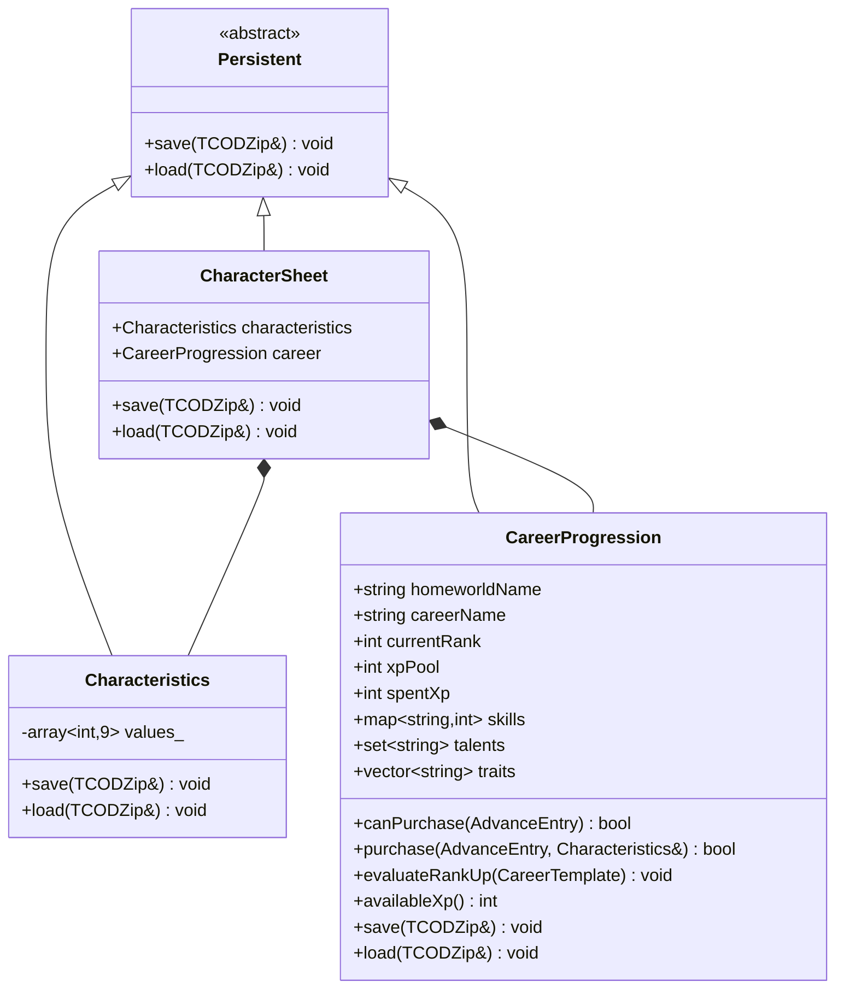
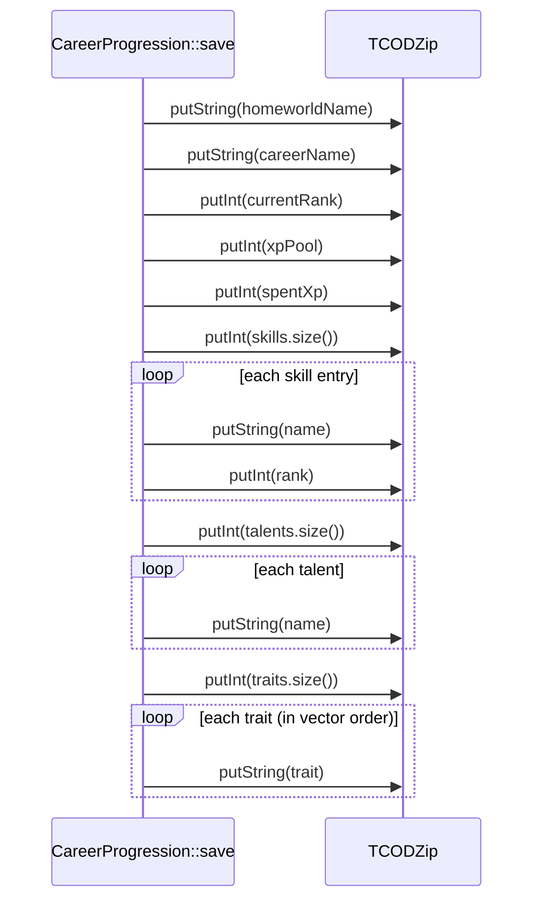

# Design Document

## Overview

This feature closes a silent data-loss bug and locks the `CharacterSheet` / `CareerProgression` behavior in place with automated tests.

`CharacterSheet::save`/`load` delegate to two child components in a fixed order — `Characteristics` first, then `CareerProgression`. `Characteristics` serialization works (nine ints in fixed `CharId` order), but `CareerProgression::save`/`load` are empty stubs in `Source/CareerProgression.cpp`. As a result, every career field (`homeworldName`, `careerName`, `currentRank`, `xpPool`, `spentXp`, `skills`, `talents`, `traits`) is dropped across a save/load cycle.

The design has two parts:

1. **Implement** `CareerProgression::save`/`load` using the project's existing `TCODZip` primitives and the count-then-elements collection pattern already used by `InjuryTracker` and `StatusEffectTracker`.
2. **Test** the full `CharacterSheet` / `CareerProgression` surface with Catch2 v3 unit tests and RapidCheck property-based tests: serialization round-trips, `canPurchase` eligibility rules, `purchase` mutation logic, `evaluateRankUp`, and `availableXp` arithmetic.

The existing `canPurchase`, `purchase`, `evaluateRankUp`, and `availableXp` implementations are treated as the specification to lock in — this feature does not change their behavior, only serialization (which was never implemented) and test coverage. All work is engine-independent per the test-isolation steering rules: no `engine.gui`, `engine.map`, or `engine.player` access. `purchase` takes a `Characteristics&`, so tests construct a local `Characteristics` object with no engine.

## Architecture

The components involved and their relationships:



Serialization ordering is the load-order contract: `CharacterSheet::load` must read the exact byte stream that `CharacterSheet::save` wrote, in the same order. Because `Characteristics` writes a fixed nine ints and `CareerProgression` follows immediately, the two streams concatenate cleanly. The only change required is filling in the `CareerProgression` half.

### Serialization Write/Read Order (the contract)

The save format and the load format must be mirror images. The write order defined below is authoritative; `load` reads fields back in the identical sequence.



## Components and Interfaces

### CareerProgression::save(TCODZip& zip)

Writes all eight fields in the fixed order above. Uses:
- `zip.putString(const char*)` for strings — `std::string::c_str()`.
- `zip.putInt(int)` for integers and for each collection's element count.
- Collections write their element count first (as with `InjuryTracker`), then each element.

Skills are written as `(name string, rank int)` pairs. Talents and traits write just the name string per element. `unordered_map` and `unordered_set` iteration order is unspecified, which is acceptable because `load` reconstructs by insertion and equality is membership-based (see Data Models → Equality Strategy). Traits are a `vector` and are written in index order to preserve sequence (Requirement 1.5 / 1.9).

No sentinel/version tag is used. `Characteristics::save` writes no sentinel, and `CharacterSheet` concatenates the two streams with no framing; introducing a sentinel here would be a save-format change with no backward-compatible payoff for a field that never serialized before. The load path relies on the strict write/read order contract.

### CareerProgression::load(TCODZip& zip)

Reads fields back in the identical order. Rules:
- **Clear collections first** (Requirement 1.10): call `skills.clear()`, `talents.clear()`, `traits.clear()` before repopulating so a reused instance does not accumulate stale entries.
- **Null-safe strings**: `zip.getString()` returns `const char*` and may be `nullptr`. Guard every read with a fallback: `const char* s = zip.getString(); std::string value = s ? s : "";`.
- Read the three ints (`currentRank`, `xpPool`, `spentXp`) directly.
- For each collection, read the count int, then loop reading elements. Skills insert `skills[name] = rank`; talents `talents.insert(name)`; traits `traits.push_back(name)`.

### CharacterSheet::save / load

Unchanged. They already delegate in the correct order (`characteristics` then `career`). Once `CareerProgression` serialization is implemented, `CharacterSheet` round-trips correctly with no code change (Requirement 3).

### Unchanged logic methods (locked in by tests, not modified)

- `availableXp() const` → `xpPool - spentXp`.
- `canPurchase(const AdvanceEntry&) const` → false if `availableXp() < cost`; false if SKILL already at rank ≥ 2; false if TALENT already owned; otherwise true.
- `purchase(const AdvanceEntry&, Characteristics&)` → false if `!canPurchase`; else `spentXp += cost` and apply effect: CHARACTERISTIC sets stat to `clamp(current + amount, 1, 99)` (unrecognized name → cost still deducted, no stat change); SKILL inserts at rank 1 if absent else increments; TALENT inserts into set.
- `evaluateRankUp(const CareerTemplate&)` → for each rank, if `spentXp >= rank.xpThreshold` and `rank.rankNumber > currentRank`, set `currentRank = rank.rankNumber`.

## Data Models

### CareerProgression (from `Headers/CareerProgression.hpp`)

| Field | Type | Default | Serialized as |
|-------|------|---------|---------------|
| `homeworldName` | `std::string` | `""` | string |
| `careerName` | `std::string` | `""` | string |
| `currentRank` | `int` | `1` | int |
| `xpPool` | `int` | `0` | int |
| `spentXp` | `int` | `0` | int |
| `skills` | `std::unordered_map<std::string,int>` | empty | count int, then (name string + rank int) per entry |
| `talents` | `std::unordered_set<std::string>` | empty | count int, then name string per entry |
| `traits` | `std::vector<std::string>` | empty | count int, then name string per entry (in order) |

### AdvanceEntry (from `Headers/CharacterData.hpp`)

`type` ∈ {`CHARACTERISTIC`, `SKILL`, `TALENT`}, `name` (string), `cost` (int), `amount` (int, default 5).

### CharId characteristic names

The `purchase` CHARACTERISTIC path maps names via `charIdFromName`: `WS, BS, S, T, Ag, Int, Per, WP, Fel`. Any other string is unrecognized (returns `CharId::COUNT`).

### Equality Strategy (for round-trip tests)

Round-trip tests compare an original instance against a loaded one field-by-field. There is no `operator==` on `CareerProgression`, so tests use an explicit helper:

- Scalars: `homeworldName`, `careerName`, `currentRank`, `xpPool`, `spentXp` compared directly with `==`.
- `traits` (`vector`): compared with `==` (order-sensitive, which is correct — traits preserve order).
- `skills` (`unordered_map`): compare `.size()` first, then for each key in the original assert the loaded map contains the key with the same value. Order-independent by construction.
- `talents` (`unordered_set`): compare `.size()` first, then for each name in the original assert the loaded set contains it. Order-independent.

For `CharacterSheet`, equality additionally compares the nine `characteristics.getBase(CharId)` values (base values, not modifier-adjusted) across `CharId::WS`..`CharId::Fel`.

### Test Data Generators (RapidCheck)

A helper generator builds an arbitrary `CareerProgression`:
- `homeworldName`, `careerName`: arbitrary `std::string`.
- `currentRank`, `xpPool`, `spentXp`: arbitrary `int` (round-trip must hold for any int; the fields carry no clamping invariant of their own).
- `skills`: arbitrary `std::unordered_map<std::string,int>` (or map built from a generated vector of name/rank pairs).
- `talents`: arbitrary `std::unordered_set<std::string>`.
- `traits`: arbitrary `std::vector<std::string>`.

A `CharacterSheet` generator additionally sets each of the nine base characteristics to a value in `[1, 99]`. **Bounds convention:** this project's `rc::gen::inRange(a, b)` is INCLUSIVE on both ends. Use `rc::gen::inRange(1, 99)` for characteristic values, and `rc::gen::inRange(0, N - 1)` for any index into a container of size N (never `inRange(0, N)`).

## Correctness Properties

*A property is a characteristic or behavior that should hold true across all valid executions of a system — essentially, a formal statement about what the system should do. Properties serve as the bridge between human-readable specifications and machine-verifiable correctness guarantees.*

This feature is well suited to property-based testing: `CareerProgression` serialization is a round-trip over structured data, `purchase`/`canPurchase` are deterministic logic over varied inputs, `evaluateRankUp` is a selection function, and `availableXp` is pure arithmetic. Each property below is derived from the prework analysis; the format-detail criteria (1.1–1.5, 1.6–1.9, 3.1–3.3) collapse into the round-trip properties they are verified by.

### Property 1: CareerProgression serialization round-trip

*For any* `CareerProgression` with arbitrary `homeworldName`, `careerName`, `currentRank`, `xpPool`, `spentXp`, `skills`, `talents`, and `traits`, saving it to a `TCODZip` and loading it into a fresh `CareerProgression` produces an instance whose fields all equal the original (scalars and `traits` by `==`; `skills` and `talents` by size plus element membership).

**Validates: Requirements 1.1, 1.2, 1.3, 1.4, 1.5, 1.6, 1.7, 1.8, 1.9, 2.1, 2.3**

### Property 2: Load clears stale state

*For any* two `CareerProgression` values `source` and `dirty`, saving `source` and then loading the produced data into `dirty` yields an instance equal to `source` (the `dirty` instance's prior `skills`, `talents`, and `traits` entries do not survive).

**Validates: Requirements 1.10**

### Property 3: CharacterSheet serialization round-trip

*For any* `CharacterSheet` with the nine characteristic base values in `[1, 99]` and arbitrary `CareerProgression` state, saving to a `TCODZip` and loading into a fresh `CharacterSheet` produces an instance whose nine base characteristics and all career fields equal the original.

**Validates: Requirements 3.1, 3.2, 3.3, 3.4**

### Property 4: Insufficient XP always rejects purchase

*For any* `CareerProgression` state and any `AdvanceEntry` whose `cost` exceeds `availableXp()`, `canPurchase` returns `false` regardless of the advance type.

**Validates: Requirements 4.1**

### Property 5: Rejected purchase is a no-op

*For any* `CareerProgression` and `AdvanceEntry` for which `canPurchase` returns `false`, calling `purchase` returns `false` and leaves `spentXp`, `skills`, `talents`, and the target `Characteristics` unchanged.

**Validates: Requirements 5.1**

### Property 6: Accepted purchase deducts exactly the cost

*For any* `CareerProgression` and `AdvanceEntry` for which `canPurchase` returns `true`, calling `purchase` returns `true` and increases `spentXp` by exactly `cost`.

**Validates: Requirements 5.2**

### Property 7: evaluateRankUp selects the highest eligible rank

*For any* `CareerProgression` and `CareerTemplate`, after `evaluateRankUp` the `currentRank` equals the maximum of the original `currentRank` and the largest `rankNumber` among ranks whose `xpThreshold <= spentXp` and whose `rankNumber` is greater than the original `currentRank` (independently recomputed reference).

**Validates: Requirements 6.1, 6.2, 6.3**

### Property 8: evaluateRankUp is idempotent

*For any* `CareerProgression` and `CareerTemplate`, calling `evaluateRankUp` a second time with no change to `spentXp` leaves `currentRank` equal to its value after the first call.

**Validates: Requirements 6.4**

### Property 9: availableXp equals xpPool minus spentXp

*For any* integer values of `xpPool` and `spentXp`, `availableXp()` returns `xpPool - spentXp`.

**Validates: Requirements 7.1, 7.2**

## Error Handling

This feature has a narrow error surface — it is in-memory serialization with no I/O, network, or user input at the component level.

- **Null strings from `TCODZip::getString`**: `getString` may return `nullptr`. Every string read in `load` uses a fallback to empty string: `const char* s = zip.getString(); std::string v = s ? s : "";`. This means a saved empty string round-trips as an empty string (whether the buffer returns `""` or `nullptr`), which is the correct and expected behavior.
- **Negative or zero collection counts**: `save` writes `static_cast<int>(container.size())`, always ≥ 0. `load` loops `for (int i = 0; i < count; ++i)`, so a zero count produces an empty collection and a negative count (only possible from corrupted data) simply skips the loop. No allocation is pre-sized from the count, so a bogus large count cannot cause an over-allocation.
- **Stale collection state**: `load` clears `skills`, `talents`, and `traits` before reading (Requirement 1.10), preventing accumulation when an instance is reused.
- **Format desync**: There is no sentinel/version framing (consistent with `Characteristics`). Correctness depends on `save` and `load` sharing the exact field order. This contract is the single source of truth in this document and is guarded by the round-trip property tests, which fail loudly if the orders ever diverge.
- **Malformed data during `purchase`**: an unrecognized characteristic abbreviation is not an error — `purchase` deducts the cost and makes no stat change, returning `true` (Requirement 5.7). This is existing behavior locked in by an edge-case test, not changed here.

No exceptions are thrown and none are expected; `TCODZip` operations do not throw in normal use.

## Testing Strategy

### Dual approach

- **Property tests (RapidCheck)** verify the nine universal properties above across ≥ 100 generated iterations each.
- **Unit tests (Catch2 v3)** verify concrete examples, branch coverage, and edge cases that are not universal.

All tests live in `Tests/test_character_sheet.cpp`, tag every case with `[character-sheet]`, and are registered in `Tests/40kRL_Tests.vcxproj` in the "Game source files" / test-sources ItemGroup so they compile and link into the test binary (Requirements 8.1–8.3). Tests are engine-independent: no `engine.gui`, `engine.map`, or `engine.player`. Because `purchase` needs a `Characteristics&`, tests construct a local `Characteristics` object directly (Requirement 8.4).

### Property-based test configuration

- Library: RapidCheck (already used across the test project), driven via `rc::check` inside Catch2 `TEST_CASE`s.
- Minimum 100 iterations per property (RapidCheck default satisfies this; do not lower it).
- Each property test carries a comment tag referencing its design property:
  `// Feature: charactersheet-tests, Property {n}: {property text}`
- Do not implement property-based testing from scratch.
- **Inclusive-bounds convention (critical):** `rc::gen::inRange(a, b)` is INCLUSIVE at both ends in this project. Use `rc::gen::inRange(1, 99)` for characteristic base values and `rc::gen::inRange(0, N - 1)` for any index into a container of size N. Never use `inRange(0, N)` for an index (Requirement 8.5).

### Generators

- `genCareerProgression()` → arbitrary `homeworldName`/`careerName` strings, arbitrary `int` `currentRank`/`xpPool`/`spentXp`, arbitrary `skills` map (name→rank), `talents` set, and `traits` vector.
- `genCharacterSheet()` → a `genCareerProgression()` plus nine base characteristics each `inRange(1, 99)`.
- For properties needing an eligible advance (Property 6), generate the advance then set `xpPool`/`spentXp` so `availableXp() >= cost` and the type-specific precondition holds; for the rejection property (Property 5), force `cost > availableXp()` or an already-owned talent / maxed skill.
- For Property 7, generate a `CareerTemplate` with a small vector of `RankDefinition` records (varied `rankNumber` and `xpThreshold`) and independently recompute the expected rank.

### Property-to-test mapping

| Property | Requirements | Test kind |
|----------|--------------|-----------|
| 1 CareerProgression round-trip | 1.1–1.9, 2.1, 2.3 | property (≥100) |
| 2 Load clears stale state | 1.10 | property (≥100) |
| 3 CharacterSheet round-trip | 3.1–3.4 | property (≥100) |
| 4 Insufficient XP rejects | 4.1 | property (≥100) |
| 5 Rejected purchase no-op | 5.1 | property (≥100) |
| 6 Accepted purchase deducts cost | 5.2 | property (≥100) |
| 7 evaluateRankUp selection | 6.1–6.3 | property (≥100) |
| 8 evaluateRankUp idempotence | 6.4 | property (≥100) |
| 9 availableXp arithmetic | 7.1, 7.2 | property (≥100) |

### Example / edge-case unit tests

These cover the criteria classified as EXAMPLE/EDGE_CASE in the prework (concrete branches not expressed as universal properties):

- **canPurchase branches (Req 4.2–4.6):** SKILL already at rank 2 → false; TALENT already owned → false; CHARACTERISTIC with sufficient XP → true; SKILL absent and SKILL at rank 1 with XP → true; TALENT absent with XP → true.
- **purchase effects (Req 5.3–5.6):** CHARACTERISTIC recognized name adds `amount` (plus clamp-high at 99 and clamp-low at 1 cases); SKILL absent → inserted at rank 1; SKILL present → rank incremented; TALENT → inserted into set.
- **purchase unrecognized characteristic (Req 5.7):** name like `"ZZ"` with sufficient XP → `spentXp` increases by `cost`, all nine characteristics unchanged, returns `true`.
- **evaluateRankUp thresholds (Req 6.2, 6.3):** no eligible rank → `currentRank` unchanged; all thresholds above `spentXp` → unchanged.
- **availableXp example (Req 7.1):** known `xpPool`/`spentXp` values.
- **Empty-collections round-trip (Req 2.3):** a `CareerProgression` with empty `skills`/`talents`/`traits` round-trips with all three restored empty.

### Build and run

Build the test project with MSBuild (full path — MSBuild is not on PATH), then run the tagged suite:

```powershell
& "C:\Program Files\Microsoft Visual Studio\18\Community\MSBuild\Current\Bin\MSBuild.exe" Tests/40kRL_Tests.vcxproj /p:Configuration=Debug /p:Platform=x64 /m /v:minimal
& ".\x64\Debug\40kRL_Tests.exe" "[character-sheet]"
```

Per the TDD workflow, the qa-tester writes these tests first (compiling but failing against the empty `CareerProgression::save`/`load` stubs), then the developer implements serialization to make them pass without altering any test assertions.
