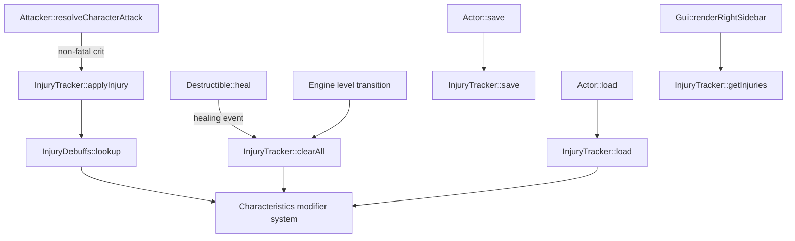

# Design Document: Critical Injuries

## Overview

The critical injury system introduces persistent mechanical consequences for non-fatal critical hits (magnitudes 1–4). When an attack reduces a target below 0 HP and the resulting critical magnitude is in the non-fatal range, the system creates an injury record on the target Actor and immediately applies Characteristic penalties. Repeated crits to the same body part escalate in severity rather than stacking, and healing events clear all injuries.

The design integrates with the existing component-based entity model by adding a new `InjuryTracker` component to `Actor`. The debuff lookup table uses a compile-time C++ constexpr structure (mirroring the existing `CriticalEffects` pattern), keeping all data self-contained without a Lua dependency for this core combat mechanic.

### Design Decisions

| Decision | Rationale |
|----------|-----------|
| C++ static table over Lua-driven | Matches the existing `CriticalEffects::critTable` pattern; avoids Lua load-order dependency for a core combat system that must work before scripts are loaded |
| Modifier overlay on Characteristics rather than direct mutation | Allows clean reversal on heal without tracking previous base values; separates base stats from debuffs |
| One injury per location (escalation model) | Simplifies serialization, prevents debuff stacking exploits, and directly matches the requirements |
| Clear-all on heal rather than per-injury healing | Matches Rogue Trader tabletop "medical attention removes all critical effects" and keeps the healing API simple |

## Architecture



### Integration Points

1. **Attacker** – After the critical hit resolution block in `resolveCharacterAttack`, when `critMagnitude` is in [1,4] and `!critEffect.fatal`, call `target->injuryTracker->applyInjury(loc, critMagnitude)`.
2. **Destructible** – In `heal()`, after restoring HP, call the owning Actor's `injuryTracker->clearAll()` if present. Also handle level-transition clearing in `Engine`.
3. **Characteristics** – Introduce a modifier layer: the existing `get()` method returns `base + sum(modifiers)` clamped to [1,99]. The `set()` method continues to write base values only.
4. **Actor serialization** – Append an `InjuryTracker` presence flag + payload after the existing `openable` section (backward-compatible sentinel pattern).
5. **Gui** – `renderRightSidebar()` queries `player->injuryTracker` to display active injuries; `renderMouseLook()` queries examined actors for injury display.

## Components and Interfaces

### InjuryTracker (new component)

```cpp
#pragma once
#include <array>
#include <vector>
#include "HitLocation.h"

class Actor;
class TCODZip;

// Tracks active critical injuries on an Actor and manages their stat modifiers.
class InjuryTracker : public Persistent {
public:
    static constexpr int MAX_LOCATIONS = static_cast<int>(HitLocation::COUNT);
    static constexpr int MAX_MAGNITUDE = 4; // non-fatal range
    
    InjuryTracker();
    
    // Applies or escalates an injury at the given location.
    // Returns true if the injury was applied/escalated within non-fatal range.
    // Returns false if escalation would exceed magnitude 4 (caller handles fatality).
    bool applyInjury(Actor* owner, HitLocation loc, int magnitude);
    
    // Removes all injuries and reverses all debuffs on the owner.
    void clearAll(Actor* owner);
    
    // Returns the current magnitude at a location (0 = no injury).
    int getMagnitude(HitLocation loc) const;
    
    // Returns true if any injury is active.
    bool hasInjuries() const;
    
    // Returns count of active injury locations.
    int activeCount() const;
    
    void save(TCODZip& zip) override;
    void load(TCODZip& zip) override;
    
    // Reapplies all debuffs to owner (used after load to restore modifier state).
    void reapplyDebuffs(Actor* owner);

private:
    // Magnitude per location. 0 = no injury, 1-4 = active.
    std::array<int, MAX_LOCATIONS> magnitudes_;
    
    // Removes debuff for a specific location (if any) from the owner's characteristics.
    void removeDebuff(Actor* owner, HitLocation loc, int magnitude);
    
    // Applies debuff for a specific location/magnitude to the owner's characteristics.
    void applyDebuff(Actor* owner, HitLocation loc, int magnitude);
};
```

### InjuryDebuffs (lookup namespace)

```cpp
#pragma once
#include <array>
#include "HitLocation.h"
#include "Characteristics.h"

namespace InjuryDebuffs {
    static constexpr int MAX_MODIFIERS_PER_INJURY = 3;
    
    struct Modifier {
        CharId stat;
        int penalty; // negative value (e.g., -5, -10, -20)
    };
    
    struct DebuffEntry {
        std::array<Modifier, MAX_MODIFIERS_PER_INJURY> modifiers;
        int count; // how many modifiers are active (0-3)
    };
    
    // Returns the debuff entry for a given location and magnitude.
    // magnitude must be in [1, 4]; location must be valid.
    constexpr DebuffEntry lookup(HitLocation loc, int magnitude);
}
```

### Characteristics Modifier System

The `Characteristics` class gains a modifier overlay:

```cpp
// Added to Characteristics class:
private:
    std::array<int, CHAR_COUNT> modifiers_; // sum of all active modifiers per stat

public:
    // Adds a modifier to the given stat (negative for penalties).
    void addModifier(CharId id, int amount);
    
    // Removes a modifier from the given stat.
    void removeModifier(CharId id, int amount);
    
    // Returns the total modifier for a stat.
    int getModifier(CharId id) const;
    
    // get() becomes: clamp(base + modifier)
    // getBase() added to return raw base value without modifiers
    int getBase(CharId id) const;
```

The existing `get()` method is updated to return `clamp(values_[id] + modifiers_[id])`. A new `getBase()` returns the raw base value. This is transparent to all existing callers since `get()` still returns the effective stat, just now inclusive of injury penalties.

## Data Models

### Debuff Lookup Table

The table is a constexpr 2D array indexed by `[HitLocation][magnitude-1]`:

| Location | Mag 1 | Mag 2 | Mag 3 | Mag 4 |
|----------|-------|-------|-------|-------|
| HEAD | Per -5 | Per -10, BS -5 | WS -10, BS -10 | WS -20, BS -20, Int -10 |
| RIGHT_ARM | WS -5 | WS -10, BS -5 | WS -10, BS -10 | WS -20, BS -20 |
| LEFT_ARM | WS -5 | WS -10, BS -5 | WS -10, BS -10 | WS -20, BS -20 |
| BODY | T -5 | T -10 | T -10, S -5 | T -20, S -10 |
| RIGHT_LEG | Ag -5 | Ag -10 | Ag -15, WS -5 | Ag -20, WS -10 |
| LEFT_LEG | Ag -5 | Ag -10 | Ag -15, WS -5 | Ag -20, WS -10 |

### Injury Record (per Actor)

```
InjuryTracker.magnitudes_: array<int, 6>
  Index 0 (HEAD):      0-4
  Index 1 (RIGHT_ARM): 0-4
  Index 2 (LEFT_ARM):  0-4
  Index 3 (BODY):      0-4
  Index 4 (RIGHT_LEG): 0-4
  Index 5 (LEFT_LEG):  0-4
```

Zero means no injury at that location. Values 1–4 indicate active injury magnitude.

### Serialization Format

```
InjuryTracker payload (appended to Actor save after openable):
  [int] presence flag (1 = has tracker, 0 = none)
  If present:
    [int] version sentinel (0x494E4A52 = "INJR")
    [int] magnitudes_[0] (HEAD)
    [int] magnitudes_[1] (RIGHT_ARM)
    [int] magnitudes_[2] (LEFT_ARM)
    [int] magnitudes_[3] (BODY)
    [int] magnitudes_[4] (RIGHT_LEG)
    [int] magnitudes_[5] (LEFT_LEG)
```

On load, debuffs are recomputed from the stored magnitudes via `reapplyDebuffs()` — no need to serialize the modifier overlay separately since it's derived data.

### Escalation Logic

```
applyInjury(owner, loc, newMagnitude):
  existing = magnitudes_[loc]
  if existing == 0:
    magnitudes_[loc] = clamp(newMagnitude, 1, 4)
    applyDebuff(owner, loc, magnitudes_[loc])
    return true
  else:
    escalated = existing + 1
    if escalated > 4:
      return false  // caller triggers fatal effect at magnitude 5
    removeDebuff(owner, loc, existing)
    magnitudes_[loc] = escalated
    applyDebuff(owner, loc, escalated)
    return true
```

When `applyInjury` returns false, the caller (Attacker) invokes `CriticalEffects::resolve(loc, 5)` and kills the target.


## Correctness Properties

*A property is a characteristic or behavior that should hold true across all valid executions of a system — essentially, a formal statement about what the system should do. Properties serve as the bridge between human-readable specifications and machine-verifiable correctness guarantees.*

### Property 1: Debuff lookup table matches specification

*For any* valid `(HitLocation, magnitude)` pair where magnitude is in [1,4], `InjuryDebuffs::lookup(loc, mag)` SHALL return exactly the Characteristic penalties defined in the requirements debuff table (Requirement 2).

**Validates: Requirements 2.1–2.16**

### Property 2: Injury application and debuff state invariant

*For any* sequence of `applyInjury` operations on an Actor with known base Characteristics, the effective value of each Characteristic (via `get()`) SHALL equal the base value plus the sum of all penalties from the debuff lookup table for each currently active injury location and magnitude, clamped to [1,99].

**Validates: Requirements 1.1, 1.2, 3.3**

### Property 3: Escalation increments magnitude

*For any* Actor with an existing injury at `HitLocation` L at magnitude M in [1,3], calling `applyInjury(owner, L, anyMagnitude)` SHALL result in `getMagnitude(L) == M + 1` and SHALL NOT create a second injury record at L.

**Validates: Requirements 3.1, 3.4**

### Property 4: Heal clears all injuries (round-trip)

*For any* Actor with an arbitrary set of active injuries (0–6 locations, magnitudes 1–4), calling `clearAll(owner)` SHALL result in `getMagnitude(L) == 0` for all locations L, and each Characteristic's effective value SHALL equal its base value.

**Validates: Requirements 4.1, 4.2**

### Property 5: Serialization round-trip

*For any* valid `InjuryTracker` state (0–6 locations with magnitudes 0–4), serializing via `save()` then deserializing via `load()` and calling `reapplyDebuffs()` SHALL produce an equivalent set of magnitudes and effective Characteristic values on the owner Actor.

**Validates: Requirements 5.1, 5.2, 5.3**

## Error Handling

| Scenario | Handling |
|----------|----------|
| `applyInjury` called with magnitude outside [1,4] | Clamp to valid range before applying |
| `applyInjury` called on location with magnitude 4 (escalation to 5) | Return `false`; caller triggers fatal effect and `die()` |
| `applyInjury` called on Actor without Characteristics component | No-op; injury is not recorded (guard check at call site) |
| `clearAll` called with no active injuries | No-op; safe to call unconditionally |
| `removeDebuff` attempts to reduce modifier below what was applied | Modifier system uses additive tracking; removal subtracts the exact penalty that was added |
| Load from archive without injury sentinel | Initialize empty tracker (zero magnitudes), backward-compatible |
| Invalid HitLocation index in serialized data | Clamp to valid range on load, log warning |
| `reapplyDebuffs` called on Actor whose Characteristics became null | Guard check; skip debuff application |

## Testing Strategy

### Property-Based Tests (RapidCheck + Catch2)

Each correctness property maps to a single property-based test with minimum 100 iterations:

1. **test_injury_debuff_lookup** — Generates random `(HitLocation, magnitude)` pairs, verifies lookup returns spec-defined penalties.
   - Tag: `Feature: critical-injuries, Property 1: Debuff lookup table matches specification`

2. **test_injury_debuff_invariant** — Generates random sequences of injury applications, verifies effective Characteristics always match expected base + modifiers.
   - Tag: `Feature: critical-injuries, Property 2: Injury application and debuff state invariant`

3. **test_injury_escalation** — Generates random locations with existing injuries at magnitudes 1–3, applies another injury, verifies magnitude increments by 1.
   - Tag: `Feature: critical-injuries, Property 3: Escalation increments magnitude`

4. **test_injury_heal_roundtrip** — Generates random injury states, applies all, calls clearAll, verifies all magnitudes zero and stats restored.
   - Tag: `Feature: critical-injuries, Property 4: Heal clears all injuries (round-trip)`

5. **test_injury_serialization_roundtrip** — Generates random injury states, saves/loads via TCODZip mock, verifies magnitudes preserved.
   - Tag: `Feature: critical-injuries, Property 5: Serialization round-trip`

### Unit Tests (Catch2)

- **Escalation to fatal**: Apply injury at magnitude 4, attempt escalation, verify `applyInjury` returns false (edge case from Req 3.2)
- **HP retention on low-magnitude crit**: Verify existing HP=1 behavior preserved for magnitudes 1–2 (Req 1.4)
- **Backward compatibility load**: Load archive without injury sentinel, verify empty tracker (Req 5.4)
- **Player and enemy parity**: Apply same injury to player and monster actors, verify identical debuff (Req 1.3)
- **Combat log messages**: Verify GUI message logged on injury apply and clear (Req 6.3)

### Integration Tests

- **Level transition clears injuries**: Simulate level change, verify player injuries cleared (Req 4.3)
- **Healing item clears injuries**: Use health potion on injured actor, verify injuries cleared (Req 4.4)
- **Full combat flow**: Run attack pipeline with forced crit, verify injury created and debuffs visible in stats (end-to-end)

### Test Configuration

- Library: RapidCheck (already available via `rc::check`) + Catch2 v3
- Minimum iterations: 100 per property test
- Generators: Custom generators for `HitLocation` (uniform over 6 values), magnitude (uniform [1,4]), and injury state (random subset of locations with random magnitudes)
- Test file: `Tests/test_critical_injuries.cpp`
- Both `40kRL.vcxproj` and `Tests/40kRL_Tests.vcxproj` must include the new source file `Source/InjuryTracker.cpp`
