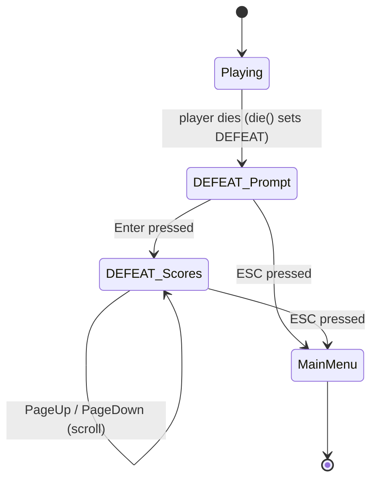
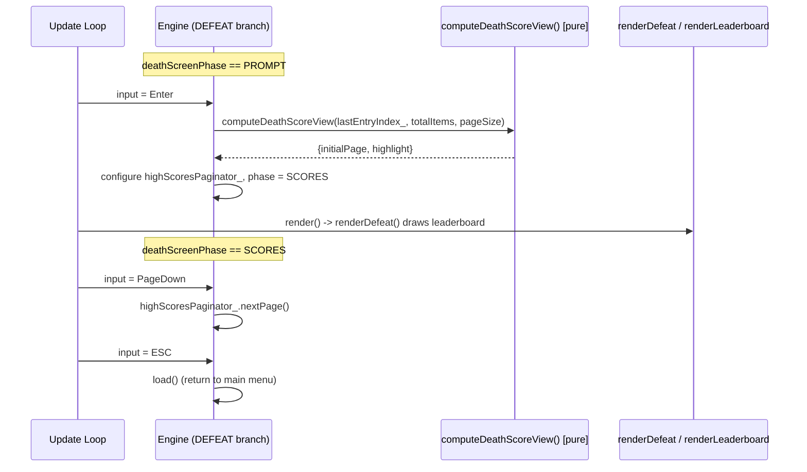

# Design Document: Death Screen High-Score Jump

## Overview

This feature turns the current single-view death screen into a **two-phase** experience. Today, when the game enters the `DEFEAT` state, `Engine::renderDefeat()` immediately renders the paginated leaderboard. This design inserts a **prompt phase** in front of it: on death the player first sees a brief "You died — press Enter" message, and only after pressing Enter does the leaderboard (the **high-score view**) appear.

The high-score view behaves differently depending on whether the run earned a place on the board (`lastEntryIndex_`):

- **Ranked run** (`lastEntryIndex_` set): the leaderboard opens scrolled to the page containing the earned entry, that entry is highlighted, and the title shows the placement number.
- **Unranked run** (`lastEntryIndex_` unset): the leaderboard opens at the first page (the Top 10 when the board has ≥10 entries, fewer if smaller, or an empty-state message if empty).

Within the high-score view, PageUp/PageDown scroll the board (bounded by the paginator), and ESC returns to the main menu using the existing post-death return flow (`load()`). ESC also works from the prompt phase.

This work builds directly on the `death-screen-not-showing` bugfix, which guarantees the game reliably enters and stays in `DEFEAT` so that `renderDefeat()` actually runs. Without that fix, none of this screen would render; this design assumes it is in place.

The core design tension is that `Engine::update()` and `Engine::render()` cannot run headless in the test binary (no SDL/libtcod/Gui). To keep the feature testable, the pure decision logic (which page to open on, whether to highlight, and the placement number) is extracted into a small **engine-free helper** that unit and property tests can exercise directly.

## Architecture

The death screen lives entirely inside the `Engine` game-loop layer. Two `Engine` methods participate:

- `Engine::update()` — the `DEFEAT` branch reads input and drives phase transitions and scrolling.
- `Engine::render()` — the `DEFEAT` branch calls `renderDefeat()`, which now renders either the prompt or the leaderboard depending on the phase.

A new pure helper (no `engine.*` access) computes the paginator's initial page and the highlight decision when transitioning from prompt to high-score view.



The phase is tracked by a new lightweight enum stored on `Engine`. It is reset to the prompt phase whenever a new run begins (in the same init path that already resets `defeatScreenInitialized_` and `lastEntryIndex_`), so a fresh death always starts at the prompt.



## Components and Interfaces

### Component 1: Death-screen phase state (Engine member)

**Purpose**: Track whether the death screen is showing the prompt or the high-score view.

**Interface** (added to `Headers/Engine.hpp`):

```cpp
// Which content the death screen is currently showing (death-screen-highscore-jump).
enum class DeathScreenPhase {
    PROMPT,   // "You died — press Enter" message
    SCORES    // paginated leaderboard (high-score view)
};

// ... inside class Engine, near defeatScreenInitialized_:
DeathScreenPhase deathScreenPhase_ = DeathScreenPhase::PROMPT;
```

**Responsibilities**:
- Holds the current phase while `gameStatus == DEFEAT`.
- Reset to `PROMPT` when a new run initializes (same place `defeatScreenInitialized_` / `lastEntryIndex_` are reset), so every death starts at the prompt.

Rationale for an enum over a `bool showingScores`: the enum reads clearly at call sites and leaves room if a future phase is added, at no extra cost. Either would satisfy the requirements; the enum is the recommendation.

### Component 2: Pure view-decision helper

**Purpose**: Decide, when leaving the prompt, what page the leaderboard should open on and whether to highlight the earned entry — with zero engine dependencies so it can be tested headless (per `test-isolation.md`).

**Interface** (new free functions/struct, declared in a header the test project links — see Dependencies):

```cpp
// Pure result describing how the high-score view should open on the death screen.
struct DeathScoreView {
    int  initialPage = 0;   // page the paginator should show first
    bool highlight   = false; // whether the earned entry should be highlighted
};

// Pure decision function — NO engine.* access (test-isolation.md).
//   lastEntryIndex : the run's earned entry index, or nullopt if unranked
//   totalItems     : number of leaderboard entries
//   pageSize       : entries per page (>= 1)
// Postconditions:
//   - if lastEntryIndex has value v in [0, totalItems): initialPage = v / pageSize, highlight = true
//   - otherwise: initialPage = 0, highlight = false
DeathScoreView computeDeathScoreView(std::optional<int> lastEntryIndex,
                                     int totalItems, int pageSize);

// Pure placement number: 1-based rank of the earned entry (entry index + 1).
// Precondition: entryIndex >= 0. Returns entryIndex + 1.
int placementNumber(int entryIndex);
```

**Responsibilities**:
- Encapsulate the "which page / highlight?" arithmetic currently inlined in `renderDefeat()`.
- Provide the placement number used in the title (`lastEntryIndex_ + 1`, 1-based, matching how `renderLeaderboard` prints rank as `i + 1`).
- Remain free of `engine.gui`, `engine.map`, `engine.player`, or any global engine state.

This helper is the single testable seam for the feature. It replaces the inline `*lastEntryIndex_ / pageSize` computation in `renderDefeat()` and the transition setup in `update()`, so both the transition code and the tests share one source of truth.

### Component 3: `Engine::update()` DEFEAT branch (modified)

**Purpose**: Drive phase transitions and scrolling from keyboard input.

**Behavior** (replacing the current scroll-only branch):

```cpp
if (gameStatus == DEFEAT) {
    if (inputState.key.pressed) {
        if (deathScreenPhase_ == DeathScreenPhase::PROMPT) {
            if (inputState.key.key == SDLK_RETURN) {
                // Transition to the high-score view.
                highScoresPaginator_.totalItems = highScores_.size();
                DeathScoreView v = computeDeathScoreView(
                    lastEntryIndex_, highScoresPaginator_.totalItems,
                    highScoresPaginator_.pageSize);
                highScoresPaginator_.currentPage = v.initialPage;
                deathScreenPhase_ = DeathScreenPhase::SCORES;
            } else if (inputState.key.key == SDLK_ESCAPE) {
                load(); // return to main menu
                return;
            }
        } else { // SCORES phase
            if (inputState.key.key == SDLK_PAGEDOWN) {
                highScoresPaginator_.nextPage();
            } else if (inputState.key.key == SDLK_PAGEUP) {
                highScoresPaginator_.prevPage();
            } else if (inputState.key.key == SDLK_ESCAPE) {
                load(); // return to main menu
                return;
            }
        }
    }
    return;
}
```

Note: the paginator's `pageSize`/`totalItems` are established during the first `renderDefeat()` (the existing lazy `defeatScreenInitialized_` init) or can be set on entry to DEFEAT. Because `render()` runs before or interleaved with `update()` per frame, `pageSize` will be valid by the time Enter is pressed. To be robust, the transition recomputes `totalItems` and relies on the lazily-initialized `pageSize`; if not yet initialized, `pageSize` defaults to the `Paginator` default of 20 (still valid, `>= 1`).

**Responsibilities**:
- PROMPT: Enter → configure paginator + switch to SCORES; ESC → main menu.
- SCORES: PageUp/PageDown → scroll (bounded by `Paginator`); ESC → main menu.

### Component 4: `Engine::renderDefeat()` (modified) and `render()` DEFEAT path

**Purpose**: Render the correct content for the current phase.

**Behavior**:

```cpp
void Engine::renderDefeat()
{
    // Lazy paginator init (pageSize/totalItems) — retained from current code so that
    // pageSize is valid before the prompt->scores transition needs it.
    if (!defeatScreenInitialized_) {
        highScoresPaginator_ = Paginator{};
        highScoresPaginator_.currentPage = 0;
        highScoresPaginator_.totalItems = highScores_.size();
        const int contentHeight = screenHeight - 5;
        highScoresPaginator_.pageSize = std::max(1, contentHeight / HS_ROWS_PER_ENTRY);
        defeatScreenInitialized_ = true;
    }

    if (deathScreenPhase_ == DeathScreenPhase::PROMPT) {
        renderDeathPrompt();   // "You died" + "Press Enter to see your placement"
        return;
    }

    // SCORES phase
    highScoresPaginator_.totalItems = highScores_.size();

    // Title reflects placement when ranked, generic Top-10 wording when unranked.
    std::string title;
    if (lastEntryIndex_) {
        title = "-- You placed #" + std::to_string(placementNumber(*lastEntryIndex_)) + " --";
    } else {
        title = "-- High Scores --";
    }

    renderLeaderboard(highScoresPaginator_,
                      lastEntryIndex_,               // highlight only when ranked
                      title.c_str(),
                      "PgUp/PgDn: scroll   ESC: menu");
}
```

`renderDeathPrompt()` is a small new private method that draws a framed message such as:

```
-- You Died --

    You have fallen.

    Press Enter to see your high-score placement.
    Press ESC to return to the main menu.
```

The `render()` DEFEAT dispatch is unchanged — it still calls `renderDefeat()`; the phase branching lives inside `renderDefeat()`.

**Note on the initial-page computation**: the transition in `update()` (Component 3) is now the authoritative place that sets `currentPage` via `computeDeathScoreView()`. The old inline `*lastEntryIndex_ / pageSize` line inside the lazy-init block is removed, because the page is set at the moment of transition (when we know the phase is becoming SCORES) rather than eagerly at first render (while still on the prompt).

## Data Models

### `DeathScreenPhase` (new enum)

| Value    | Meaning                                                 |
|----------|---------------------------------------------------------|
| `PROMPT` | Show the "You died — press Enter" message.              |
| `SCORES` | Show the paginated leaderboard (high-score view).       |

**Lifecycle / validation**:
- Initialized to `PROMPT`.
- Set to `PROMPT` in the run-init path (alongside `defeatScreenInitialized_ = false;` and `lastEntryIndex_.reset();`) so each new run starts fresh.
- Set to `SCORES` only by the Enter transition in the `DEFEAT` update branch.

### `DeathScoreView` (new pure struct)

| Field         | Type   | Meaning                                            |
|---------------|--------|----------------------------------------------------|
| `initialPage` | `int`  | Page the paginator opens on (`>= 0`).              |
| `highlight`   | `bool` | Whether the earned entry is highlighted.           |

**Invariants** (guaranteed by `computeDeathScoreView`):
- `highlight == true` **iff** `lastEntryIndex` has a value within `[0, totalItems)`.
- When `highlight`, `initialPage == *lastEntryIndex / pageSize` and the earned entry index lies within `[initialPage*pageSize, (initialPage+1)*pageSize)`.
- When not `highlight`, `initialPage == 0`.

### Existing state reused (unchanged shape)

- `highScores_` (`Leaderboard`) — sorted descending, capacity 100; `entries()`, `size()`, `empty()`.
- `lastEntryIndex_` (`std::optional<int>`) — earned entry index; drives highlight + placement.
- `highScoresPaginator_` (`Paginator`) — scroll state; `pageSize` derived from screen height.
- `defeatScreenInitialized_` (`bool`) — lazy paginator init guard.

## "Top 10" and page-size mapping

The requirements refer to the "Top 10". Because `Leaderboard::entries()` is sorted **descending** and capped at 100, the 10 highest-ranked runs are simply `entries()[0..9]` — the front of the list. For an unranked run, opening at page 0 (the first page) shows the top of the board.

The number of entries visible per page is `pageSize = max(1, (screenHeight - 5) / HS_ROWS_PER_ENTRY)` where `HS_ROWS_PER_ENTRY = 3` (each entry occupies two text lines plus a spacer). So:

- If `pageSize >= 10` (screen tall enough: `(screenHeight - 5) / 3 >= 10`, i.e. `screenHeight >= 35` rows), the first page shows all of the Top 10 at once, satisfying Requirement 3.2 directly.
- If `pageSize < 10` (shorter console), the first page shows as many top entries as fit; the remaining top entries are reachable by scrolling with PageDown. The "Top 10" is still the first 10 entries of the descending list; they are simply spread across the first pages. This is the honest, bounded interpretation given the shared paginated layout — the design does not force a special 10-row page just for the death screen.

For boards with 1–9 entries, page 0 shows all of them (Requirement 3.3). For an empty board, `renderLeaderboard` already prints "No runs recorded yet." (Requirement 3.4) — this path is reached because after Enter the SCORES phase renders the leaderboard, and `renderLeaderboard` handles `highScores_.empty()`.

## Correctness Properties

These properties target the pure helper `computeDeathScoreView()` and `placementNumber()`, which are the engine-free seam. They can be verified with RapidCheck property tests (min 100 iterations) plus Catch2 example tests.

### Property 1: Ranked opens on the containing page

For all `v` in `[0, totalItems)` and `pageSize >= 1`, `computeDeathScoreView(v, totalItems, pageSize).initialPage == v / pageSize`, and the earned index lies within that page's index window `[initialPage*pageSize, initialPage*pageSize + pageSize)`.

**Validates: Requirements 2.1**

### Property 2: Ranked always highlights; unranked never does

For all inputs, `computeDeathScoreView(v, ...).highlight == true` when `v` is a valid in-range index, and `computeDeathScoreView(nullopt, ...).highlight == false`.

**Validates: Requirements 2.2, 3.1**

### Property 3: Unranked opens at the first page

For all `totalItems >= 0` and `pageSize >= 1`, `computeDeathScoreView(nullopt, totalItems, pageSize).initialPage == 0`.

**Validates: Requirements 3.1, 3.2, 3.3**

### Property 4: Initial page is always a valid page index

For all valid inputs where `totalItems >= 1`, `0 <= initialPage < ceil(totalItems / pageSize)` (i.e. within `Paginator::totalPages()`), so the paginator never opens out of bounds.

**Validates: Requirements 2.1, 4.1, 4.2**

### Property 5: Placement is 1-based and matches the rendered rank

For all `entryIndex >= 0`, `placementNumber(entryIndex) == entryIndex + 1`, which equals the `i + 1` rank `renderLeaderboard` prints for that entry.

**Validates: Requirements 2.3**

### Property 6: Determinism and no side effects

For all inputs, repeated calls to `computeDeathScoreView` with the same arguments return equal results and do not touch global state (guaranteed by construction — no `engine.*` access).

**Validates: Requirements 2.1, 3.1**

## Error Handling

### Scenario 1: `pageSize` is zero or negative

**Condition**: A degenerate/uninitialized paginator could yield `pageSize <= 0`, risking division-by-zero in `v / pageSize`.
**Response**: `computeDeathScoreView` clamps `pageSize` to at least 1 internally (mirroring the `std::max(1, ...)` used when the paginator is built). Callers also derive `pageSize` via `std::max(1, ...)`.
**Recovery**: Computation proceeds safely with `pageSize = 1`.

### Scenario 2: `lastEntryIndex_` out of range vs. current board size

**Condition**: `lastEntryIndex_` holds an index `>= totalItems` (e.g. board reloaded/changed between death and render).
**Response**: `computeDeathScoreView` treats an out-of-range index as unranked (`highlight = false`, `initialPage = 0`) to avoid opening past the end of the board.
**Recovery**: The Top of the board is shown; no highlight. This is a defensive bound; in normal flow `lastEntryIndex_` is always valid for the current board.

### Scenario 3: Empty leaderboard in SCORES phase

**Condition**: Player pressed Enter but the board is empty.
**Response**: `renderLeaderboard` renders the existing empty-state message ("No runs recorded yet.").
**Recovery**: ESC returns to the main menu as normal.

### Scenario 4: Non-actionable key in either phase

**Condition**: Player presses a key that isn't Enter/ESC (prompt) or PageUp/PageDown/ESC (scores).
**Response**: The input is ignored; the phase and paginator are unchanged.
**Recovery**: The screen re-renders identically on the next frame.

## Testing Strategy

Per `tdd-workflow.md`, tests are written before implementation. Per `test-isolation.md`, tests never construct or touch the global `Engine`; they exercise only pure functions.

### Unit Testing Approach (Catch2 v3)

- `placementNumber(i) == i + 1` for representative indices (0, 9, 99).
- `computeDeathScoreView` example cases:
  - Ranked entry on page 0 (`v = 3, pageSize = 10 → initialPage 0, highlight true`).
  - Ranked entry on a later page (`v = 42, pageSize = 10 → initialPage 4, highlight true`).
  - Unranked (`nullopt → initialPage 0, highlight false`).
  - Empty board unranked (`nullopt, totalItems = 0 → initialPage 0, highlight false`).
  - Small board 1–9 entries: unranked stays on page 0.
  - Degenerate `pageSize = 0` clamps to 1 without crashing.
  - Out-of-range `lastEntryIndex` treated as unranked.

### Property-Based Testing Approach (RapidCheck, ≥100 iterations)

**Property Test Library**: RapidCheck (`rc::check`), as used elsewhere in the project. Generate `totalItems` in a bounded range (e.g. `inRange(0, 100)` — remember RapidCheck `inRange` is inclusive), `pageSize` in `inRange(1, 50)`, and an optional in-range `lastEntryIndex`.

- Property 1–5 above encoded as `rc::check` properties.
- Round-trip: for any ranked `v`, the earned index falls inside the returned page's index window.
- Invariant: `initialPage` is always `< totalPages` computed the same way `Paginator::totalPages()` does.

### Integration / Manual Verification

The phase transitions and rendering in `Engine::update()`/`render()` cannot run headless (no SDL/libtcod/Gui). These are verified manually in-game:
- Die with a ranked run → prompt appears → Enter → board opens on the earned entry's page, highlighted, title shows `#N` → PageUp/PageDown scroll → ESC → main menu.
- Die with an unranked run → prompt → Enter → board opens at Top 10 → ESC → main menu.
- Die with an empty board (fresh install) → prompt → Enter → "No runs recorded yet." → ESC → main menu.

## Build / Project Integration

- If `computeDeathScoreView`/`placementNumber` are placed in a **new** `.cpp` (e.g. `Source/DeathScreenView.cpp` with `Headers/DeathScreenView.hpp`), that source file MUST be added to **both** `40kRL.vcxproj` and `Tests/40kRL_Tests.vcxproj` (Game source files ItemGroup, per `test-project.md`) to avoid LNK2001 in the test build.
- Alternatively, the helper may live in the existing `Headers/HighScore.hpp` / `Source/HighScore.cpp` pair (already linked into both projects and already the home of pure high-score logic), which avoids adding a new file. **Recommended**: reuse `HighScore.hpp`/`HighScore.cpp` since the helper is conceptually part of the high-score/leaderboard domain and that module is already engine-free and test-linked.
- Build with MSBuild using the full path from `msbuild.md`; run tests via `.\x64\Debug\40kRL_Tests.exe`.

## Dependencies

- Existing high-score module: `Headers/HighScore.hpp`, `Headers/HighScoreStore.hpp`, `Leaderboard`.
- `Headers/Paginator.hpp` (`Paginator`) for scroll state and page arithmetic.
- `Engine` game loop (`Engine::update`, `Engine::render`, `Engine::renderDefeat`, `Engine::renderLeaderboard`, `Engine::load`).
- The `death-screen-not-showing` bugfix (prerequisite): guarantees `gameStatus` stays `DEFEAT` so the death screen renders.
- Standard library: `<optional>`, `<string>`, `<algorithm>`.
- SDL3 key codes (`SDLK_RETURN`, `SDLK_ESCAPE`, `SDLK_PAGEUP`, `SDLK_PAGEDOWN`) — already used by the existing DEFEAT branch.
