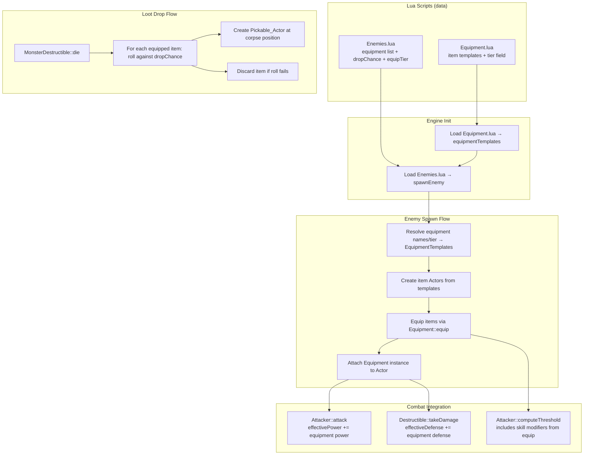

# Design Document: Enemy Equipment & Loot

## Overview

This feature extends the existing player-only Equipment system to enemy actors (NPCs), enabling enemies to spawn with equipment that modifies their combat stats and drops as loot on death. The design reuses the existing `Equipment` class, `Equippable` component, and `EquipmentTemplate` infrastructure — no new systems are created, only integration points are added.

Key design goals:
- Enemies use the **same Equipment class** as the player — no parallel hierarchy
- Equipment loadouts are defined in **Lua** (Enemies.lua) referencing templates from Equipment.lua
- Equipment stat modifiers apply to enemy combat (power, defense, skill) using the same mechanisms as the player
- On death, equipped items are converted to Pickable actors on the map via a configurable drop chance
- A tier system (common/uncommon/rare) enables weighted random equipment assignment

## Architecture



## Components and Interfaces

### Modified Components

#### Actor (Headers/Actor.h)
- Change comment on `equipment` field from "only non-null on the player actor" to "non-null on any actor with equipment"
- No structural change needed — `unique_ptr<Equipment>` already works for enemies

#### Attacker (Source/Attacker.cpp)
- `attack()` already checks `if (owner->equipment)` for power bonus — works for enemies automatically once they have an Equipment instance
- No code change needed for power calculation

#### Destructible (Source/Destructible.cpp)
- `takeDamage()` currently uses raw `defense` field. Must be modified to add equipment defense modifiers when the owner has an equipment component.
- Change: `damage -= defense` → `damage -= (defense + equipmentDefenseBonus)`

#### MonsterDestructible (Source/Destructible.cpp)
- `die()` must be extended to call the new loot drop logic before calling `Destructible::die()` (which clears the AI and transforms the actor into a corpse)

#### Engine (Source/Engine.cpp)
- Equipment template loading extended to parse the `tier` field
- Enemy spawning logic extended to:
  1. Read `equipment` list from Lua enemy table
  2. Read `dropChance` from Lua enemy table
  3. Read `equipTier` from Lua enemy table
  4. Resolve equipment (by name or tier-based random selection)
  5. Create Equipment instance on the enemy Actor
  6. Create item Actors and equip them

### New Components

#### EquipmentTemplate Extension
```cpp
// In Engine.h — extend existing EquipmentTemplate struct
enum class ItemTier { COMMON, UNCOMMON, RARE };

struct EquipmentTemplate {
    std::string name;
    int glyph;
    TCODColor color;
    EquipmentSlot slot;
    float weight;
    int value;
    StatModifiers modifiers;
    ItemTier tier = ItemTier::COMMON;  // NEW
};
```

#### EnemyEquipmentConfig (stored per enemy template, not a class)
```cpp
// Parsed from Lua during enemy template loading
struct EnemyEquipmentConfig {
    std::vector<std::string> equipmentNames;  // explicit item names
    float dropChance = 1.0f;                  // probability each item drops on death
    // Tier-based random selection (ignored if equipmentNames is non-empty)
    struct TierWeights {
        float common = 0.70f;
        float uncommon = 0.25f;
        float rare = 0.05f;
    } tierWeights;
    bool useTierSelection = false;  // true if "equipTier" field is present
};
```

#### Loot Drop Free Function
```cpp
// In a new header or in Destructible.h
// Called from MonsterDestructible::die() before base die()
void dropEnemyEquipment(Actor* enemy);
```

### Interface Contracts

#### Equipment Spawning
```
Input: Enemy template with equipment config + available EquipmentTemplates
Output: Actor with Equipment instance, items equipped in correct slots
Invariant: Each slot holds at most one item; last-listed item wins on conflict
```

#### Loot Drop
```
Input: Dying enemy Actor with Equipment instance
Output: 0..N Pickable_Actors placed on map at corpse position
Invariant: Each dropped item matches its source template (name, glyph, color, slot, weight, value, modifiers)
Invariant: Each item evaluated independently against dropChance
```

#### Combat Stat Calculation
```
effectivePower = attacker->power + equipment->getTotalPowerModifier()
effectiveDefense = destructible->defense + equipment->getTotalDefenseModifier()
effectiveSkill = attacker->computeThreshold()  // already includes modifiers added during equip()
```

## Data Models

### Equipment.lua Extension

```lua
equipment = {
    {
        name    = "Choppa",
        glyph   = "/",
        color   = "desaturatedGreen",
        slot    = "weapon",
        weight  = 4.0,
        value   = 20,
        power   = 2.0,
        defense = 0.0,
        maxHp   = 0.0,
        skill   = -5,
        tier    = "common",  -- NEW: "common" | "uncommon" | "rare"
    },
    -- existing items get tier = "common" by default if field is omitted
}
```

### Enemies.lua Extension

```lua
local enemies = {
    {
        chance  = 60,
        glyph   = string.byte("g"),
        name    = "Gretchin",
        color   = "desaturatedGreen",
        hp      = 5.0,
        defense = 0.0,
        corpse  = "dead Gretchin",
        xp      = 15,
        power   = 2.0,
        skill   = 25,
        -- NEW: explicit equipment by name
        equipment = { "Combat Knife" },
        dropChance = 0.3,
    },
    {
        chance  = 90,
        glyph   = string.byte("o"),
        name    = "Ork",
        color   = "desaturatedGreen",
        hp      = 10.0,
        defense = 0.0,
        corpse  = "dead Ork",
        xp      = 35,
        power   = 3.0,
        skill   = 35,
        -- NEW: tier-based random equipment
        equipTier = { common = 80, uncommon = 18, rare = 2 },
        dropChance = 0.4,
    },
    {
        chance  = 100,
        glyph   = string.byte("N"),
        name    = "Nob",
        color   = "darkerGreen",
        hp      = 16.0,
        defense = 1.0,
        corpse  = "Nob carcass",
        xp      = 100,
        power   = 4.0,
        skill   = 45,
        equipment = { "Chainsword", "Flak Armor" },
        dropChance = 0.5,
    },
}
```

### EquipmentTemplate In-Memory (C++)

| Field | Type | Source |
|-------|------|--------|
| name | std::string | Equipment.lua `name` |
| glyph | int | Equipment.lua `glyph` (first char) |
| color | TCODColor | Equipment.lua `color` (resolved via Colors::colorFromName) |
| slot | EquipmentSlot | Equipment.lua `slot` |
| weight | float | Equipment.lua `weight` |
| value | int | Equipment.lua `value` |
| modifiers | StatModifiers | Equipment.lua `power`, `defense`, `maxHp`, `skill` |
| tier | ItemTier | Equipment.lua `tier` (default: COMMON) |

### Enemy Actor Runtime State

When an enemy has equipment:
- `actor->equipment` — `unique_ptr<Equipment>`, non-null
- `actor->attacker->modifiers` — contains skill modifiers from equipped items (added via `Equipment::equip`)
- Equipment items are **not** stored in a Container (enemies don't need inventory management). Instead, item Actors are owned by a small internal list on the Equipment instance or stored as standalone allocations referenced by the slot pointers.

**Design Decision — Item Ownership for Enemies:**

The player's equipment system stores items in the Container (inventory) and the Equipment slots hold raw pointers into that inventory. Enemies don't need a full inventory system. Two options:

1. **Give enemies a Container** — simple but wasteful (enemies never browse inventory)
2. **Store item Actors directly in Equipment** — add a `std::vector<std::unique_ptr<Actor>> ownedItems` field to Equipment for lifetime management

**Chosen approach: Option 2.** Add an `ownedItems` vector to Equipment that owns the item Actors for enemies. The slot pointers reference into this vector. For the player, `ownedItems` remains empty (player items are owned by Container). This avoids adding unnecessary Container components to every enemy.

```cpp
class Equipment {
public:
    // ... existing interface unchanged ...

    // Owns item Actors for non-player entities that don't use Container.
    // Player equipment does NOT use this (items live in Container).
    std::vector<std::unique_ptr<Actor>> ownedItems;
    
    float dropChance = 1.0f;  // probability each item drops on death
};
```

## Correctness Properties

*A property is a characteristic or behavior that should hold true across all valid executions of a system — essentially, a formal statement about what the system should do. Properties serve as the bridge between human-readable specifications and machine-verifiable correctness guarantees.*

### Property 1: Equipment spawning assigns items to correct slots

*For any* valid equipment template name list and set of available equipment templates, spawning an enemy with that list shall result in each named item occupying the Equipment_Slot specified by its template, and the enemy's Equipment instance being non-null.

**Validates: Requirements 1.1, 2.1, 2.2**

### Property 2: Effective combat stats equal base stats plus equipment modifiers

*For any* enemy Actor with base power P, base defense D, and a set of equipped items with power modifiers [p1..pN] and defense modifiers [d1..dN], the effective power used in attack shall equal P + sum(p1..pN) and the effective defense used in damage reduction shall equal D + sum(d1..dN).

**Validates: Requirements 3.1, 3.2, 3.3**

### Property 3: Loot drop round-trip fidelity

*For any* equipment template used to create an enemy's equipped item, when that item is dropped on death (drop chance = 1.0), the resulting Pickable_Actor shall have identical name, glyph, color, Equipment_Slot, weight, value, and Stat_Modifiers to the original template.

**Validates: Requirements 4.2, 6.2, 6.4**

### Property 4: Each equipped item is evaluated independently for dropping

*For any* enemy with N equipped items and a drop chance C (0 < C < 1), each item's drop outcome shall be determined by an independent random roll against C, such that over many trials the observed drop rate of each item converges to C regardless of other items' outcomes.

**Validates: Requirements 4.1, 4.4, 5.2**

### Property 5: All dropped items are positioned at corpse location

*For any* enemy that drops K ≥ 1 items on death, all K Pickable_Actors shall have x,y coordinates equal to the enemy's position at time of death.

**Validates: Requirements 4.5**

### Property 6: One item per slot (last-write-wins)

*For any* sequence of equip operations targeting the same Equipment_Slot, the slot shall contain only the last item equipped, and the slot array shall never contain more than one item per slot index.

**Validates: Requirements 1.3, 2.4**

### Property 7: Tier-based selection produces items matching requested slot and tier

*For any* slot and tier combination where at least one matching template exists, the tier-based random selection shall always return a template whose slot and tier fields match the request.

**Validates: Requirements 8.3**

### Property 8: Tier weight distribution converges to configured weights

*For any* tier weight configuration (common=W1, uncommon=W2, rare=W3 where W1+W2+W3=100), over a large number of selections, the proportion of each tier selected shall converge to its configured weight within statistical tolerance.

**Validates: Requirements 8.4**

## Error Handling

| Scenario | Handling |
|----------|----------|
| Equipment template name not found | Log warning via `gui->message`, skip item, continue spawning enemy |
| Multiple items for same slot in enemy template | Equip last item listed, log warning about slot conflict |
| dropChance out of [0.0, 1.0] range | Clamp to nearest bound, log warning |
| Equipment.lua fails to load | No templates available; enemies with equipment fields log warnings and spawn without gear |
| Enemies.lua references equipment before Equipment.lua loads | Prevented by load order (Equipment.lua loaded first in Engine::init) |
| Tier-based selection finds no matching templates for slot+tier | Log warning, leave that slot empty |
| Enemy dies with null equipment pointer | No loot drop logic executes (early return) |

All error paths are non-fatal — the game continues running with degraded behavior rather than crashing.

## Testing Strategy

### Property-Based Tests (Catch2 + custom generators)

The project uses **Catch2 v3** for testing. Property-based tests will use Catch2's `GENERATE` macro with custom data generators to produce random inputs. Each property test runs a minimum of **100 iterations**.

**Library choice:** Catch2 v3 with `GENERATE(take(100, random(...)))` for randomized inputs. For structured data (equipment templates, enemy configs), custom generator functions produce valid random instances.

**Tag format:** Each property test is tagged with:
```
// Feature: enemy-equipment-loot, Property N: <property text>
```

Properties to implement:
1. Equipment spawning assigns items to correct slots
2. Effective combat stats equal base + equipment modifiers
3. Loot drop round-trip fidelity
4. Independent drop evaluation per item
5. Dropped items at corpse position
6. One item per slot (last-write-wins)
7. Tier selection matches requested slot and tier
8. Tier weight distribution convergence

### Unit Tests (Example-Based)

- Enemy spawns without equipment field → no Equipment instance
- Default drop chance = 1.0 when field omitted
- Drop chance = 0.0 → no items dropped
- Invalid template name → warning logged, enemy created
- Tier defaults to "common" when omitted
- Named equipment takes precedence over equipTier
- Tier field not displayed in item rendering

### Integration Tests

- Full spawn-fight-die-loot cycle: spawn enemy with equipment, player kills it, items drop, player picks them up and equips them
- Pickup respects carrying capacity
- Save/load round-trip with enemy equipment (if save system extended)
