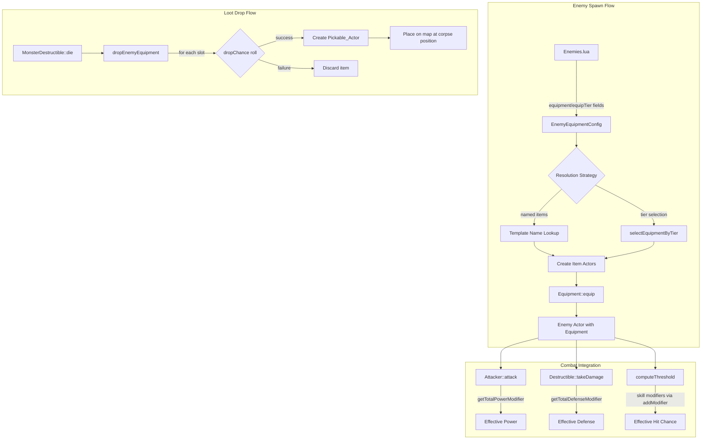

# Design Document: Enemy Equipment & Loot

## Overview

This feature extends the existing player-only Equipment system to enemy actors, enabling enemies to spawn with items, benefit from stat modifiers in combat, and drop those items as loot on death. The system reuses the same `Equipment` class and `EquipmentTemplate` data that the player uses, ensuring mechanical consistency. Enemies gain equipment through Lua configuration — either explicit named items or tier-weighted random selection — and the loot drop process converts equipped items into `Pickable_Actor` instances on the map that the player can loot via the existing pickup system.

### Design Goals

- **Reuse**: Enemies use the same `Equipment` class, `Equippable` component, and stat modifier calculations as the player
- **Data-driven**: All enemy loadouts and drop chances are configured in `Enemies.lua`, referencing templates from `Equipment.lua`
- **Probabilistic loot**: Each equipped item rolls independently against a configurable drop chance on death
- **Tier-weighted variety**: Enemies without explicit loadouts get random gear via weighted tier selection, providing controlled loot rarity

### Key Design Decisions

1. **Enemies use `Equipment::ownedItems` instead of `Container`** — Enemies don't need inventory management, so their items are owned directly by the Equipment instance rather than through a Container component. This avoids creating unnecessary Container instances for NPCs.

2. **Drop chance is per-enemy, not per-item** — A single `dropChance` float on the Equipment instance applies uniformly to all equipped items. This keeps configuration simple and matches the Lua schema.

3. **Drop creates new Actors** — Rather than transferring ownership of the enemy's item Actors, the loot system creates fresh `Pickable_Actor` instances with copied properties. This avoids lifetime issues with the dying enemy's owned items.

4. **Defense integration uses existing `takeDamage` path** — `Destructible::takeDamage` already queries `owner->equipment->getTotalDefenseModifier()`, so enemies with equipment automatically get defense bonuses without additional code.

## Architecture



### Data Flow Summary

1. **Spawn**: `Map::addMonster()` → Lua `spawnEnemy()` → `addActor` callback → parse `EnemyEquipmentConfig` → resolve templates → create item Actors → `Equipment::equip()`
2. **Combat**: `Attacker::attack()` reads `equipment->getTotalPowerModifier()` for offense; `Destructible::takeDamage()` reads `equipment->getTotalDefenseModifier()` for defense; `Equipment::equip()` calls `attacker->addModifier(skill)` for hit chance
3. **Death**: `MonsterDestructible::die()` → `dropEnemyEquipment()` → per-item roll → create `Pickable_Actor` with Equippable component → add to `engine.actors`

## Components and Interfaces

### Equipment Spawn Resolution (in Map::addMonster)

The `addActor` Lua callback parses equipment config and resolves items:

```cpp
// Already implemented in Map.cpp — pseudocode summary:
void resolveEnemyEquipment(Actor* spawned) {
    const auto& cfg = *spawned->equipConfig;
    spawned->equipment = std::make_unique<Equipment>();
    spawned->equipment->dropChance = cfg.dropChance;

    std::vector<const EquipmentTemplate*> resolved;

    if (!cfg.equipmentNames.empty()) {
        // Named list: look up each name in engine.equipmentTemplates
        for (const auto& name : cfg.equipmentNames) {
            const EquipmentTemplate* tmpl = findTemplate(name);
            if (!tmpl) { warn(); continue; }
            resolved.push_back(tmpl);
        }
    } else if (cfg.useTierSelection) {
        // Tier-based: selectEquipmentByTier for each slot
        for (each slot) {
            const EquipmentTemplate* sel = engine.selectEquipmentByTier(slot, cfg.tierWeights);
            if (sel) resolved.push_back(sel);
        }
    }

    // Create item Actors and equip them
    for (const auto* tmpl : resolved) {
        auto item = createItemActor(tmpl);
        Actor* ptr = item.get();
        spawned->equipment->ownedItems.push_back(std::move(item));
        spawned->equipment->equip(ptr, nullptr, spawned->attacker.get());
    }
    spawned->equipConfig.reset();
}
```

**Key behaviors:**
- `equip()` receives `nullptr` for Container (enemy path skips inventory management)
- `equip()` calls `attacker->addModifier(skill)` for non-zero skill modifiers
- Slot conflicts: last item in the list wins (previous item remains in ownedItems but is replaced in the slot)
- Named list takes precedence if both `equipment` and `equipTier` are specified

### Combat Stat Integration

**Effective Power** (already implemented in `Attacker::attack`):
```cpp
float effectivePower = power;
if (owner->equipment) {
    effectivePower += owner->equipment->getTotalPowerModifier();
}
```

**Effective Defense** (already implemented in `Destructible::takeDamage`):
```cpp
float equipDefenseBonus = owner->equipment ? owner->equipment->getTotalDefenseModifier() : 0.0f;
damage -= (defense + equipDefenseBonus);
```

**Skill Modifiers** (applied during `Equipment::equip`):
```cpp
// Equipment::equip calls attacker->addModifier(skill) for non-zero skill values
// This is included in Attacker::computeThreshold() via the modifiers vector
```

No additional code needed — enemies already use the same `Attacker::attack()` and `Destructible::takeDamage()` paths as the player, and `Equipment::equip()` already handles the skill modifier integration.

### Loot Drop System (dropEnemyEquipment)

```cpp
// Declared in Destructible.h, implemented in Destructible.cpp
void dropEnemyEquipment(Actor* enemy) {
    if (!enemy || !enemy->equipment) return;

    const float dropChance = enemy->equipment->dropChance;
    const auto& slots = enemy->equipment->getSlots();

    for (const auto* item : slots) {
        if (!item || !item->equippable) continue;

        // Roll against dropChance
        float roll = rng->getFloat(0.0f, 1.0f);
        if (roll >= dropChance) continue;

        // Create Pickable_Actor preserving all item properties
        auto dropped = std::make_unique<Actor>(
            enemy->getX(), enemy->getY(),
            item->getGlyph(), item->name, item->getColor());
        dropped->blocks = false;
        dropped->fovOnly = true;

        dropped->pickable = std::make_shared<Pickable>(nullptr, nullptr);
        dropped->pickable->weight = item->equippable->weight;
        dropped->pickable->value  = item->equippable->value;

        dropped->equippable = std::make_shared<Equippable>(
            item->equippable->slot,
            item->equippable->modifiers,
            item->equippable->weight,
            item->equippable->value);

        engine.actors.push_back(std::move(dropped));
        engine.sendToBack(engine.actors.back().get());
    }
}
```

Called from `MonsterDestructible::die()` before the base `die()` transforms the actor into a corpse:
```cpp
void MonsterDestructible::die(Actor* owner) {
    dropEnemyEquipment(owner);  // Drop loot before corpse transformation
    // ... XP award, message, base die() ...
}
```

### Tier Selection (Engine::selectEquipmentByTier)

```cpp
const EquipmentTemplate* Engine::selectEquipmentByTier(
    EquipmentSlot slot, const EnemyEquipmentConfig::TierWeights& weights)
{
    // 1. Normalize weights to sum to 1.0
    // 2. Roll to select tier (COMMON / UNCOMMON / RARE)
    // 3. Filter equipmentTemplates by matching slot + tier
    // 4. Random pick from candidates
    // Returns nullptr if no candidates match (logs warning)
}
```

This is already fully implemented. The tier selection provides variety for enemies using `equipTier` instead of explicit named equipment.

## Data Models

### EnemyEquipmentConfig (parsed from Lua)

| Field            | Type                | Default  | Description                                         |
|------------------|---------------------|----------|-----------------------------------------------------|
| equipmentNames   | vector\<string\>    | empty    | Explicit item names from "equipment" field          |
| dropChance       | float               | 1.0      | Probability each item drops on death [0.0, 1.0]     |
| tierWeights      | TierWeights struct  | 70/25/5  | Probabilities for tier-based random selection       |
| useTierSelection | bool                | false    | true if "equipTier" field is present in Lua         |

### TierWeights (nested in EnemyEquipmentConfig)

| Field    | Type  | Default | Description                          |
|----------|-------|---------|--------------------------------------|
| common   | float | 70.0    | Weight for common-tier items         |
| uncommon | float | 25.0    | Weight for uncommon-tier items       |
| rare     | float | 5.0     | Weight for rare-tier items           |

### Equipment (extended for enemies)

| Field      | Type                          | Description                                     |
|------------|-------------------------------|-------------------------------------------------|
| slots      | array\<Actor*, 4\>            | One item per slot (weapon, offhand, head, body) |
| ownedItems | vector\<unique_ptr\<Actor\>\> | Owns item Actors for enemies (no Container)     |
| dropChance | float                         | Per-item probability of drop on death           |

### Lua Schema: Enemies.lua

```lua
{
    -- Required fields (enemy stats)
    chance   = <int>,          -- cumulative spawn % (0-100)
    glyph    = <int>,          -- ASCII character code
    name     = <string>,       -- display name
    color    = <string>,       -- color name from Colors.h
    hp       = <float>,        -- max hit points
    defense  = <float>,        -- base damage reduction
    corpse   = <string>,       -- corpse name
    xp       = <int>,          -- XP awarded on kill
    power    = <float>,        -- base attack power
    skill    = <int>,          -- base hit chance [1-99]

    -- Optional equipment fields
    equipment  = { "ItemName1", "ItemName2", ... },  -- named loadout
    equipTier  = { common = 80, uncommon = 18, rare = 2 },  -- tier weights
    dropChance = <float>,      -- probability [0.0, 1.0], default 1.0
}
```

**Precedence rule:** If both `equipment` and `equipTier` are present, `equipment` takes precedence and `equipTier` is ignored.

### Lua Schema: Equipment.lua (tier field)

```lua
{
    name    = <string>,        -- required
    glyph   = <string>,        -- required (single character)
    color   = <string>,        -- required
    slot    = <string>,        -- required: "weapon"|"offhand"|"head"|"body"
    weight  = <float>,         -- required, >= 0
    value   = <int>,           -- optional, default 0
    power   = <float>,         -- optional, default 0.0
    defense = <float>,         -- optional, default 0.0
    maxHp   = <float>,         -- optional, default 0.0
    skill   = <int>,           -- optional, default 0
    tier    = <string>,        -- optional: "common"|"uncommon"|"rare", default "common"
}
```

### ItemTier Enum

| Value    | Description                              |
|----------|------------------------------------------|
| COMMON   | Basic gear, weakest stats                |
| UNCOMMON | Mid-tier gear, moderate stats            |
| RARE     | Powerful gear, strongest stats           |

### Dropped Pickable_Actor Structure

A loot drop creates an Actor with:
- Position: enemy's (x, y) at time of death
- Glyph, name, color: copied from the equipped item
- `blocks = false`, `fovOnly = true`
- `pickable`: Pickable component with weight and value from equippable
- `equippable`: Equippable component copying slot, modifiers, weight, value

## Correctness Properties

*A property is a characteristic or behavior that should hold true across all valid executions of a system — essentially, a formal statement about what the system should do. Properties serve as the bridge between human-readable specifications and machine-verifiable correctness guarantees.*

### Property 1: Named equipment resolves to correct slots

*For any* valid list of Equipment_Template names (where each name exists in `engine.equipmentTemplates`), resolving those names and equipping the resulting items SHALL place each item in the Equipment_Slot specified by its template.

**Validates: Requirements 1.1, 2.2**

### Property 2: Single item per slot invariant

*For any* sequence of equipment resolution operations (whether named or tier-based) on an Equipment instance, each Equipment_Slot SHALL contain at most one item. When multiple items target the same slot, only the last one equipped SHALL occupy the slot.

**Validates: Requirements 1.3, 2.4**

### Property 3: Effective power equals base plus equipment modifiers

*For any* Enemy_Actor with base power P and any set of equipped items with power modifiers [m1, m2, ..., mn], the effective power used in attack calculations SHALL equal P + m1 + m2 + ... + mn.

**Validates: Requirements 3.1**

### Property 4: Effective defense equals base plus equipment modifiers

*For any* Enemy_Actor with base defense D and any set of equipped items with defense modifiers [d1, d2, ..., dn], the effective defense used in damage reduction SHALL equal D + d1 + d2 + ... + dn.

**Validates: Requirements 3.2**

### Property 5: Skill modifiers integrated into hit chance

*For any* Enemy_Actor with base skill S and equipped items with skill modifiers [s1, s2, ..., sn], the Attacker's `computeThreshold()` SHALL return `clamp(S + s1 + s2 + ... + sn, 1, 99)`.

**Validates: Requirements 3.3**

### Property 6: Loot drop preserves item properties (round-trip)

*For any* equipped item on a dying Enemy_Actor whose drop chance roll succeeds, the resulting Pickable_Actor SHALL have identical name, glyph, color, Equipment_Slot, weight, value, and StatModifiers (power, defense, maxHp, skill) to the original equipped item. Additionally, the dropped Actor SHALL have both a Pickable component and an Equippable component.

**Validates: Requirements 4.2, 6.2, 6.4**

### Property 7: Independent drop evaluation

*For any* Enemy_Actor with N equipped items (1 ≤ N ≤ 4), each item's drop roll SHALL be evaluated independently. The probability of exactly K items dropping SHALL equal C(N,K) × dropChance^K × (1-dropChance)^(N-K) (binomial distribution), which implies no item's outcome affects any other.

**Validates: Requirements 4.4**

### Property 8: Tier selection returns valid slot and tier match

*For any* call to `selectEquipmentByTier(slot, weights)` where at least one template exists matching the selected tier and slot, the returned EquipmentTemplate SHALL have `template.slot == slot` and `template.tier` matching the randomly selected tier.

**Validates: Requirements 8.3**

### Property 9: Named list takes precedence over equipTier

*For any* EnemyEquipmentConfig where both `equipmentNames` is non-empty and `useTierSelection` would be true, the resolution SHALL use only the named equipment list and SHALL NOT perform tier-based random selection.

**Validates: Requirements 8.5**

## Error Handling

| Scenario                                         | Response                                                     |
|--------------------------------------------------|--------------------------------------------------------------|
| Equipment template name not found                | Log warning via gui->message, skip item, continue spawn      |
| Multiple items targeting same slot               | Equip last one, log warning about conflict                   |
| dropChance < 0.0                                 | Clamp to 0.0, log warning                                   |
| dropChance > 1.0                                 | Clamp to 1.0, log warning                                   |
| Tier weights sum to zero                         | Log warning, return nullptr (no equipment for that slot)     |
| No templates match slot + tier combination       | Log warning, skip that slot                                  |
| Enemy has no equipment field in Lua              | No Equipment instance created (equipment == nullptr)         |
| Lua script file fails to load                    | Fall back to hard-coded enemy spawn (no equipment)           |
| Enemy dies with null equipment                   | dropEnemyEquipment returns immediately (no-op)               |

All warnings use `engine.gui->message(Colors::damage, ...)` for in-game visibility during development. These can be gated behind `engine.debugMode` in a future pass.

## Testing Strategy

### Unit Tests (Catch2)

Specific examples and edge cases:
- Spawn enemy with named equipment list → verify items in correct slots
- Spawn enemy without equipment field → verify `equipment == nullptr`
- Spawn enemy with invalid template name → verify warning logged, other items still equipped
- Spawn enemy with slot conflict → verify last item wins
- Enemy attack with weapon equipped → verify effective power = base + weapon.power
- Enemy taking damage with armor → verify effective defense = base + armor.defense
- Kill enemy with dropChance=1.0 → verify all items appear on map
- Kill enemy with dropChance=0.0 → verify no items appear on map
- Kill enemy with no equipment → verify no crash, no items dropped
- Dropped item has Pickable + Equippable components
- Dropped item position matches enemy death position
- Default dropChance is 1.0 when field omitted
- dropChance clamping: -0.5 → 0.0, 1.5 → 1.0
- Tier selection with only common templates → always returns common
- equipTier ignored when equipment list is present
- Default tier weights: common=70, uncommon=25, rare=5

### Property-Based Tests (RapidCheck stub)

Each correctness property maps to a property-based test using the project's RapidCheck-compatible stub in `Tests/lib/rapidcheck.h`.

**Configuration:**
- Minimum 100 iterations per property test
- Tag format in comments: `// Feature: enemy-equipment-loot, Property N: <title>`

**Generators needed:**
- `genEquipmentSlot()` — random slot from {WEAPON, OFFHAND, HEAD, BODY}
- `genStatModifiers()` — random power/defense/maxHp in [0, 10], skill in [-15, 15]
- `genEquipmentTemplate()` — random template with valid name, slot, tier, modifiers
- `genEnemyEquipmentConfig()` — random config with named list or tier selection
- `genDropChance()` — random float in [0.0, 1.0]
- `genBasePower()` — random float in [1.0, 10.0]
- `genBaseDefense()` — random float in [0.0, 5.0]
- `genBaseSkill()` — random int in [1, 99]
- `genEquippedEnemy()` — enemy Actor with random equipment in 1-4 slots

**Property test file:** `Tests/test_enemy_equipment.cpp`

### Integration Tests

- Load Equipment.lua + Enemies.lua via sol2 → spawn enemies → verify equipment attached
- Full combat sequence: enemy with weapon attacks player → verify damage includes power modifier
- Full loot sequence: kill enemy → pick up drop → equip on player → verify stats apply
- Save game with equipped enemies → reload → verify equipment state preserved
- Tier selection statistical test: 1000 iterations with known weights, verify distribution within tolerance

### Test Dependencies

Tests are runnable without the rendering engine. The `Equipment`, `Attacker`, `Destructible`, and loot drop logic operate on data structures testable in isolation. Tests requiring Lua use sol2 directly. Tests requiring randomness inject a deterministic RNG via `Attacker::rollD100` or seed `TCODRandom`.
