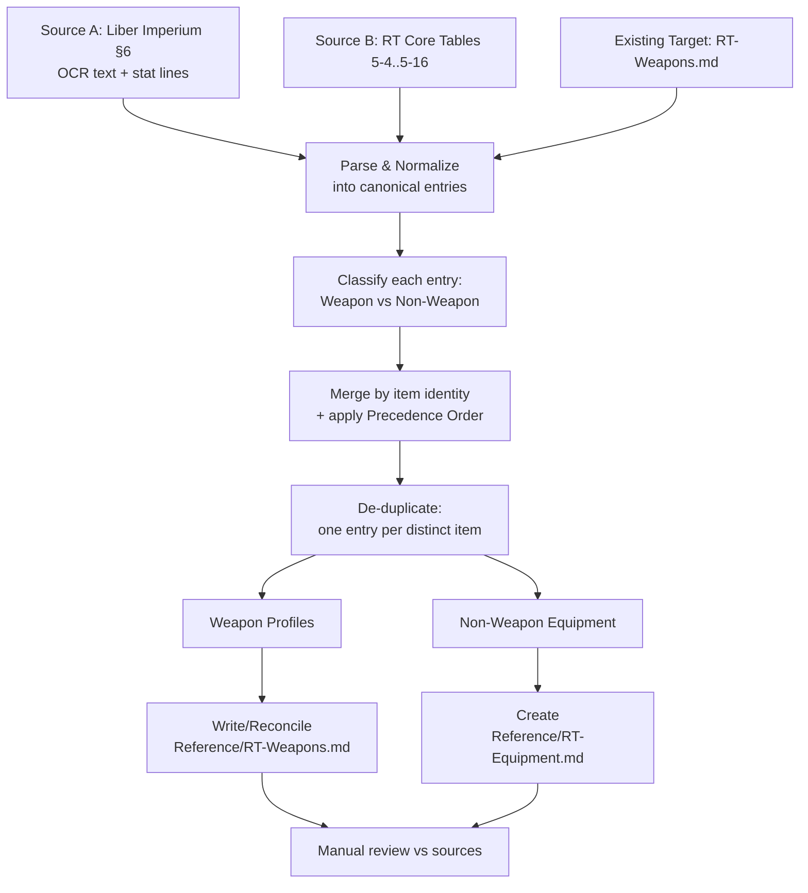

# Design Document

## Overview

This feature is a **documentation / data-curation** task. The Curator (the agent executing the extraction) reads three equipment sources, resolves conflicts by a fixed precedence, de-duplicates, and produces two curated Markdown reference documents in the `Reference/` folder:

- `Reference/RT-Weapons.md` — all Weapon Profiles (ranged weapons, melee weapons, weapon upgrades, ammunition). This file already exists and is reconciled in place. (Req 1.1, 1.2)
- `Reference/RT-Equipment.md` — all Non-Weapon Equipment (armour, force fields, gear, tools, drugs & consumables, cybernetics). This file is created new. (Req 1.3, 1.4)

There is **no runtime behavior, no compiled code, and no Lua wiring** produced by this feature. The output is structured reference data only. Wiring the data into `Scripts/Equipment.lua` and the C++/Lua game systems is explicitly out of scope and reserved for a future spec. (Req 9.1, 9.2, 9.3)

Because the deliverable is static Markdown reviewed by a human against the sources, there is **no automated property-based testing**. The "Correctness Properties" section is therefore intentionally omitted (see Testing Strategy for the rationale and the manual-review approach used instead).

### Source Summary

| Ref | Source | File | Nature |
|---|---|---|---|
| Source A | Liber Imperium §6 "Armoury & Acquisitions" | `Reference/LiberImperium/06-armoury-and-acquisitions.md` | ~13,400 lines of OCR'd prose interleaved with stat lines and availability/price markers. Highest precedence. |
| Source B | RT Core Rulebook Ch. V "Armoury" | `Reference/RT-CoreEquipment.md` | Clean, pre-formatted Markdown tables (5-4 … 5-16). Middle precedence. |
| Existing Target | Curated weapons doc | `Reference/RT-Weapons.md` | Existing curated weapon tables. Lowest precedence; reconciled in place. |

### Precedence Order (Req 3)

**Source A (Liber Imperium) > Source B (RT Core Equipment) > Existing Target (RT-Weapons.md).**

When the same item appears in more than one source with differing stat values, the highest-precedence value is recorded and the lower-precedence value is discarded/overwritten. A value present in only one source is recorded as-is and is **not** treated as a conflict. (Req 3.1–3.5)

## Architecture

Although no code is written, the curation follows a deterministic pipeline. Each stage is a manual/agent operation whose output feeds the next.



### Pipeline Stages

1. **Parse & Normalize** — Read each source and extract canonical equipment entries.
   - Source B is already tabular; each row maps directly to a canonical entry with its table citation (e.g., "RT Core Table 5-4"). (Req 2.2, 8.2)
   - Source A is OCR prose. Stat lines appear inline, e.g. `Inferno Pistol  Pistol  10m  S/-/-  2d10+10E  12  3  Full  Melta  3kg` with a nearby availability/price marker (`Very Rare/ Ŧ7,500`). The Curator extracts the columns from these stat lines and the associated availability marker, and captures any footnote/special rule prose attached to the entry. (Req 2.1, 7.7, 8.1)
   - The Existing Target rows are read as canonical weapon entries for reconciliation. (Req 2.3)

2. **Classify** — Each canonical entry is tagged as a **Weapon Profile** (ranged weapon, melee weapon, weapon upgrade, ammunition) or **Non-Weapon Equipment** (armour, force field, gear, tool, drug/consumable, cybernetic/augmetic). This routing determines the destination file. (Req 1.2, 1.4, 1.5, 1.6)

3. **Merge by Item Identity + Precedence** — Entries referring to the same item (matched by normalized name; see Item Identity below) are merged. For each stat field, the value from the highest-precedence source present wins. Absent values do not override present ones. (Req 3.1, 3.2, 3.3, 3.5)

4. **De-duplicate** — After merge, at most one entry per distinct item exists per file. Existing RT-Weapons.md entries are reconciled (updated in place), never duplicated. (Req 4.1, 4.2, 4.3)

5. **Write / Reconcile Output** — Weapon Profiles are written into `Reference/RT-Weapons.md` (existing structure preserved, entries updated/added). Non-Weapon Equipment is written into the new `Reference/RT-Equipment.md`. Each entry/section carries a Source Citation. (Req 1.1, 1.3, 8.1, 8.2, 8.3)

6. **Manual Review** — A human compares the two output files against the three sources for fidelity, correct routing, de-duplication, and citation. (Testing Strategy)

### Item Identity (matching rule for merge/de-dup)

Two entries refer to the **same item** when their names match after normalization:
- Trim whitespace, collapse internal spacing, case-insensitive compare.
- Strip parenthetical forge-world / pattern qualifiers used only in Source B (e.g., "Boltgun (Locke)" ↔ "Boltgun", "Heavy Bolter (Solar)" ↔ "Heavy Bolter", "Inferno Pistol (Mars)" ↔ "Inferno Pistol") when reconciling against the shorter canonical names already used in the Existing Target.
- Where two genuinely distinct patterns of the same base weapon exist in one source (e.g., "Heavy Stubber (Orthlack)" vs "Heavy Stubber (Ursid)" differ by Clip/Reload/Availability), they are kept as **distinct items** and the pattern qualifier is retained to disambiguate.

This rule is what makes Requirement 4 (de-duplication) and Requirement 3 (conflict resolution) actionable: conflict resolution only applies once two entries are judged to be the same item.

## Components and Interfaces

The "components" here are the documents and their internal contracts, not code modules.

### Component 1: `Reference/RT-Weapons.md` (reconciled)

- **Responsibility:** Hold every Weapon Profile (ranged, melee, upgrade, ammo). (Req 1.1, 1.2)
- **Contract:** Uses the Weapon Table Format columns and the existing AI-consumption-optimized style already present in the file (grouped by weapon family with `##` section headers and pipe tables). (Req 5.1, 5.4)
- **Interface to consumers:** A later wiring spec / `Scripts/Equipment.lua` author reads the pipe tables row-by-row. Column order is stable: `Name | Class | Range | RoF | Damage | Pen | Clip | Reload | Qualities` plus optional `Weight (kg)` and `Availability` columns where the source supplies them. (Req 5.1, 5.2, 5.3)
- **Excludes:** All Non-Weapon Equipment. (Req 1.5)

### Component 2: `Reference/RT-Equipment.md` (new)

- **Responsibility:** Hold every Non-Weapon Equipment entry, organized into sections: Armour, Force Fields, Gear, Tools, Drugs & Consumables, Cybernetics. (Req 1.3, 1.4, 6.1)
- **Contract:** Each section preserves that category's native columns (armour preserves AP-by-location; gear/tools/drugs/cybernetics preserve weight and availability where present). Matches the RT-Weapons.md / RT-Bestiary.md AI-consumption style. (Req 6.2, 6.3, 7.4)
- **Excludes:** All Weapon Profiles. (Req 1.6)

### Component 3: The Curator (process, not code)

- Executes the pipeline stages. Owns the Precedence Order, Item Identity rule, and Source Citation conventions.
- **Scope constraint:** May only write Markdown files under `Reference/`. May not modify `Scripts/Equipment.lua` or any compiled source. (Req 9.1, 9.2, 9.3)

### Source Citation Convention (Req 8)

Citations are recorded compactly so tables stay readable:

- **Source A entries:** cite `Liber Imperium §6`. (Req 8.1)
- **Source B entries:** cite the specific table, `RT Core Table 5-N` (e.g., `RT Core Table 5-12` for armour). (Req 8.2)
- **Conflict-resolved entries:** cite the source whose value was recorded (i.e., the winning source per precedence). (Req 8.3)

Placement options (choose per table for readability, applied consistently within a file):
- A trailing `Source` column on the table, **or**
- A per-section note (`> Source: …`) when every row in a section shares the same origin, **or**
- An inline footnote marker (`†`) on individual rows whose origin differs from the section default, with the footnote spelling out the citation and, for conflicts, the winning source.

## Data Models

These are the logical shapes each entry conforms to. They define the columns preserved for fidelity (Req 7) and drive the table layouts.

### Canonical Entry (internal, during merge)

```
CanonicalEntry {
  name:          string        // normalized identity key
  category:      Weapon | Armour | ForceField | Gear | Tool | Drug | Cybernetic | Upgrade | Ammo
  fields:        map<stat, value>   // only fields relevant to category
  citation:      "Liber Imperium §6" | "RT Core Table 5-N" | "existing"
  footnotes:     list<string>       // special rules / footnotes preserved verbatim
}
```

### Weapon Profile → `RT-Weapons.md`

Full ranged/melee weapon table columns (melee tables omit Range/RoF/Clip/Reload as the existing file does):

| Column | Notes | Requirement |
|---|---|---|
| Name | Normalized item name | 5.1 |
| Class | Pistol / Basic / Heavy / Melee / Thrown / Mounted | 5.1 |
| Range | Metres, or `—`/SB×N for melee/thrown | 5.1 |
| RoF | `S/B/A` | 5.1 |
| Damage | Dice + bonus + type (E/I/R/X), preserved verbatim | 5.1, 7.1 |
| Pen | Penetration, preserved verbatim | 5.1, 7.2 |
| Clip | Shots before reload | 5.1 |
| Reload | Half/Full actions | 5.1 |
| Qualities | Weapon qualities, preserved verbatim | 5.1, 7.3 |
| Weight (kg) | Included where the source provides it | 5.2, 7.5 |
| Availability | Included where the source provides it | 5.3, 7.6 |

Weapon Upgrades (Table 5-9) and Ammunition (Tables 5-10, 5-11) are Weapon Profiles by classification and live in `RT-Weapons.md`, using their native lighter columns (e.g., upgrades: `Name | Weight | Availability`; ammo: `Name | Availability` plus any special-rule footnote). (Req 1.2, 5.4, 7.7)

### Armour → `RT-Equipment.md` (Req 6.2, 7.4)

| Column | Notes |
|---|---|
| Name | Armour name |
| Covered (Locations) | Head / Arms / Body / Legs / All — preserved per source |
| AP | Armour Points; where AP varies by location, the per-location AP is preserved |
| Weight (kg) | Where provided (Req 7.5) |
| Availability | Where provided (Req 7.6) |

> Note on AP-by-location: Source B Table 5-12 gives a single AP with a "Covered" location list (e.g., "All 4"). Where a source specifies **different** AP for different locations, the table records each covered location's AP explicitly (e.g., `Head 5 / Body 6 / Arms 4 / Legs 4`) rather than collapsing to one number. (Req 7.4)

### Force Fields → `RT-Equipment.md`

| Column | Notes |
|---|---|
| Name | Field name (e.g., Refractor, Conversion) |
| Protection Rating | The field's block value, preserved verbatim |
| Overload | Overload range, preserved verbatim |
| Weight (kg) / Availability | Where provided |

(Force fields come primarily from Source A §6; Source B has no dedicated force-field table. Citation `Liber Imperium §6`.) (Req 6.1, 8.1)

### Gear / Tools / Drugs & Consumables / Cybernetics → `RT-Equipment.md`

Each preserves its source's native columns:

- **Gear** (5-13): `Name | Weight (kg) | Availability` + footnote where present (Req 7.5–7.7)
- **Tools** (5-15): `Name | Weight (kg) | Availability`
- **Drugs & Consumables** (5-14): `Name | Weight | Availability`
- **Cybernetics** (5-16): `Name | Availability` + footnote (e.g., `†` Mechanicus-restricted) (Req 7.7)

### Known Conflicts (worked examples, Req 3.4)

These are called out because the requirements name them explicitly. Source A wins in all three:

| Item | Source A (§6) | Source B | Recorded (winner) |
|---|---|---|---|
| Inferno Pistol — Pen | Pen 12 | Pen 13 | **12** (Source A) |
| Multi-Melta — Damage | 2d10+16 E | 4d10+5 E | **2d10+16 E** (Source A) |
| Heavy Bolter — Damage | 1d10+8 X | 2d10+2 X | **1d10+8 X** (Source A) |

Each recorded value cites `Liber Imperium §6` as the winning source. (Req 3.1, 3.4, 8.3)

> The Existing Target `RT-Weapons.md` currently lists Inferno Pistol Pen 12, Multi-Melta 2d10+8 E / Pen 12, and Heavy Bolter 1d10+8 X. Where these differ from the Source A value they are overwritten to the Source A value per Req 3.3; where they already match Source A they are left unchanged.

## Error Handling

Since the deliverable is static Markdown, "errors" are curation defects rather than runtime failures. The Curator handles each defect class as follows:

- **Ambiguous OCR value in Source A** — Source A is OCR'd; a stat may be smudged or mis-split. When a Source A value is unreadable or clearly corrupted, fall back to the next source in the Precedence Order (Source B, then Existing Target) for that specific field, and cite the source actually used. Do **not** invent values. (Req 3, 8.3)
- **Missing value in the winning source** — If the highest-precedence source omits a field that a lower-precedence source provides, record the present value from the lower source (absence is not a conflict) and cite that source for that field. (Req 3.5)
- **Category ambiguity** — If an entry's category is unclear (e.g., a combi-weapon or a tool with an integral weapon), route the weapon-firing profile to `RT-Weapons.md` and the non-weapon aspects to `RT-Equipment.md`, cross-referencing by name so neither file loses the item, while never duplicating the same profile within a file. (Req 1.5, 1.6, 4.2, 4.3)
- **Duplicate detection failure** — Before writing, scan each output file for repeated normalized names; if a duplicate is found, merge per Precedence Order and keep a single entry. (Req 4.2, 4.3)
- **Scope violation guard** — The Curator must not touch `Scripts/Equipment.lua` or compiled source. If a change seems to require code edits, stop: that work belongs to the future wiring spec. (Req 9.2, 9.3)
- **Footnote/special-rule loss** — When an entry carries a footnote or special rule (e.g., Power Fist "add SB×2 to Damage", virus grenade cascade rule, Mechanicus-restricted cybernetics), preserve it verbatim as a table footnote; never silently drop it. (Req 7.7)

## Testing Strategy

### Why there is no property-based testing

This feature produces **static Markdown reference documents** — it is a data-curation deliverable with no functions, no inputs/outputs, and no runtime behavior. Per the project's testing guidance, property-based testing is **not appropriate** for documentation artifacts: there is no "for all inputs X, property P(X) holds" statement to assert against, and nothing to execute 100+ times. The requirements document states this explicitly ("no automated property-based testing; verification is by manual review"). Accordingly, the **Correctness Properties section is intentionally omitted** and no `prework` analysis is run.

### Verification approach: manual review against sources

Verification is a structured human review of the two produced files against the three sources. The reviewer confirms each of the following against the acceptance criteria:

**Routing & Split (Req 1)**
- Every weapon, weapon upgrade, and ammunition entry is in `RT-Weapons.md`; none in `RT-Equipment.md`.
- Every armour, force field, gear, tool, drug/consumable, and cybernetic entry is in `RT-Equipment.md`; none in `RT-Weapons.md`.
- `RT-Equipment.md` exists and is organized into the six required sections. (Req 6.1)

**Coverage (Req 2)**
- Spot-check that each category from Source A is represented.
- Confirm every Source B table (5-4 … 5-16) has its rows represented.
- Confirm every pre-existing RT-Weapons.md entry was reconciled (present, updated, not duplicated).

**Conflict Resolution (Req 3)**
- Verify the three named conflicts resolve to the Source A value: Inferno Pistol Pen 12, Multi-Melta 2d10+16 E, Heavy Bolter 1d10+8 X.
- Spot-check other multi-source items to confirm Precedence Order (A > B > Existing).
- Confirm single-source values were recorded without being treated as conflicts.

**De-Duplication (Req 4)**
- Grep each output file for repeated item names; expect at most one entry per distinct item.

**Format Consistency (Req 5, 6)**
- Weapon tables use the `Name | Class | Range | RoF | Damage | Pen | Clip | Reload | Qualities` columns, with Weight (kg) / Availability where the source supplies them.
- Non-weapon tables preserve each category's native columns; armour preserves AP-by-location.
- Both files match the AI-consumption-optimized style of the existing `RT-Weapons.md` and `RT-Bestiary.md` (`##` section headers, pipe tables, `—` for absent values).

**Source Fidelity (Req 7)**
- Cross-check a sample of damage formulas, penetration values, qualities, armour AP-by-location, weights, availabilities, and footnotes against the selected source.

**Source Citation (Req 8)**
- Every entry/section carries a citation (`Liber Imperium §6` or `RT Core Table 5-N`).
- Conflict-resolved entries cite the winning source.

**Scope Boundary (Req 9)**
- Confirm the change set touches only Markdown files under `Reference/` — no `Scripts/Equipment.lua`, no compiled source.

### Review checklist (acceptance gate)

A lightweight checklist mapped 1:1 to the requirements above serves as the acceptance gate. The feature is complete when every checklist item passes on manual review. No build, unit test, or property test is run, because there is no executable artifact.
