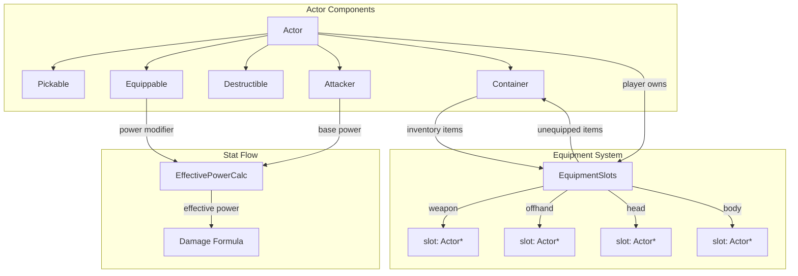

# Design Document: Equipment System

## Overview

The equipment system extends the existing component-based Actor architecture with an `Equippable` component that enables items to be worn or wielded in designated body slots. When equipped, items apply stat modifiers (power, defense, maxHp) to the player. The system integrates with the existing `Container` (inventory), `Attacker` (damage), `Destructible` (defense/HP), and `Persistent` (save/load) subsystems.

Phase 1 targets melee weapons that increase attack power. The architecture accommodates future armor slots and a shop system by storing item weight and gold value on all items from the outset.

### Design Goals

- Minimal coupling: the Equippable component is optional — existing items remain unchanged
- Data-driven: weapon definitions live in Lua, matching the existing `Items.lua` pattern
- Consistent serialization: equipment state integrates into the existing TCODZip save/load order
- Weight system as a strategic constraint without adding tedious micromanagement

## Architecture



The player Actor gains an `EquipmentSlots` structure (not a separate component — it lives inside `Container` or as a peer pointer set on the player). Each slot holds a raw pointer to an Actor that is **also** stored in the player's inventory list (equipped items remain owned by the Container). This avoids ownership ambiguity — the Container continues to own all item Actors; the EquipmentSlots merely track which inventory item occupies each slot.

**Rationale:** Keeping equipped items in the Container's `inventory` list simplifies save/load (they serialize with the container) and weight calculations (all carried items are in one place). The slot pointers are lightweight metadata serialized alongside.

## Components and Interfaces

### Equippable Component

```cpp
// Headers/Equippable.h
#pragma once
#include "Persistent.h"

enum class EquipmentSlot : int {
    WEAPON  = 0,
    OFFHAND = 1,
    HEAD    = 2,
    BODY    = 3,
    COUNT   = 4  // sentinel for iteration
};

struct StatModifiers {
    float power   = 0.0f;
    float defense = 0.0f;
    float maxHp   = 0.0f;
};

class Equippable : public Persistent {
public:
    EquipmentSlot slot;
    StatModifiers modifiers;
    float weight = 0.0f;
    int   value  = 0;       // gold value (non-negative)

    Equippable(EquipmentSlot slot, StatModifiers modifiers, float weight, int value);

    void save(TCODZip& zip) override;
    void load(TCODZip& zip) override;
};
```

### Actor Extension

The `Actor` class gains one new optional component pointer:

```cpp
// In Actor.h — add alongside existing components:
std::shared_ptr<Equippable> equippable;
```

An item is equippable when `actor->pickable != nullptr && actor->equippable != nullptr`.

### Equipment Slots (on Player)

```cpp
// Headers/Equipment.h
#pragma once
#include <array>

class Actor;
enum class EquipmentSlot : int;

class Equipment {
public:
    // Returns the item in the given slot, or nullptr if empty.
    Actor* getSlot(EquipmentSlot slot) const;

    // Equips item into its target slot. Returns the previously equipped item
    // (which has been moved back to inventory), or nullptr if slot was empty.
    // Returns nullptr and does nothing if item has no equippable component.
    Actor* equip(Actor* item, class Container& inventory);

    // Unequips the item in the given slot, moving it back to inventory.
    // Returns false if inventory is full or slot is already empty.
    bool unequip(EquipmentSlot slot, Container& inventory);

    // Returns the sum of all equipped modifiers for a given stat.
    float getTotalPowerModifier() const;
    float getTotalDefenseModifier() const;
    float getTotalMaxHpModifier() const;

    // Returns the total weight of all equipped items.
    float getEquippedWeight() const;

    // Returns true if the given actor is currently equipped in any slot.
    bool isEquipped(const Actor* item) const;

    void save(TCODZip& zip);
    void load(TCODZip& zip, Container& inventory);

private:
    std::array<Actor*, static_cast<int>(EquipmentSlot::COUNT)> slots = {};
};
```

### Weight System Extension

All items (equippable or not) gain weight and value. For non-equippable items, these are stored directly on the `Pickable` component or as fields on `Actor`. The cleanest approach: add `weight` and `value` fields to `Pickable`:

```cpp
// Added to Pickable class:
float weight = 0.0f;  // item weight (0 if unspecified)
int   value  = 0;     // gold value (0 if unspecified)
```

For equippable items, `Equippable::weight` and `Equippable::value` are the authoritative source. A helper on Actor resolves the weight:

```cpp
// Actor helper:
float Actor::getWeight() const {
    if (equippable) return equippable->weight;
    if (pickable)   return pickable->weight;
    return 0.0f;
}

int Actor::getValue() const {
    if (equippable) return equippable->value;
    if (pickable)   return pickable->value;
    return 0;
}
```

### Carrying Capacity

A configurable value loaded from `Config.lua`:

```lua
-- In Scripts/Config.lua:
carryingCapacity = 50.0  -- maximum weight units the player can carry
```

The pickup logic in `Pickable::pick` is extended to check total carried weight (inventory + equipped) against the configured capacity before accepting the item.

### Effective Power Calculation

The `Attacker::attack` method is modified to compute effective power:

```cpp
float effectivePower = power + owner->equipment->getTotalPowerModifier();
```

This replaces the raw `power` value in the damage formula. Defense modifiers from equipped items are similarly added to `Destructible::defense` as a computed effective defense (or applied as a transient bonus tracked by Equipment).

**Design Decision:** Stat modifiers are computed on-the-fly from currently-equipped items rather than cached. The equipment set is at most 4 items — iterating them each attack is negligible. This avoids stale-cache bugs.

### Equipment Menu

A new UI state in the game loop, triggered by a configurable key (default: `e`). The menu displays:

```
┌─ Equipment ──────────────────┐
│ [Weapon]  Chainsword (+3 pow)│
│ [Offhand] empty              │
│ [Head]    empty              │
│ [Body]    Flak Armor (+2 def)│
│                              │
│ Select slot to unequip       │
│ [ESC] Close                  │
└──────────────────────────────┘
```

The player navigates with up/down arrows and presses Enter to unequip the selected slot's item. ESC closes the menu. This reuses the existing `Menu` pattern from `Gui.h`.

### Lua Equipment Definitions

A new script file `Scripts/Equipment.lua` defines weapons and armor:

```lua
-- Scripts/Equipment.lua
equipment = {
    {
        name    = "Chainsword",
        glyph   = "/",
        color   = "lightBlue",
        slot    = "weapon",
        weight  = 3.5,
        value   = 50,
        power   = 3.0,
        defense = 0.0,
        maxHp   = 0.0,
    },
    {
        name    = "Flak Armor",
        glyph   = "[",
        color   = "grey",
        slot    = "body",
        weight  = 8.0,
        value   = 30,
        power   = 0.0,
        defense = 2.0,
        maxHp   = 0.0,
    },
}
```

At initialization, the engine loads this file via sol2, iterates the `equipment` table, validates each entry (required fields: name, glyph, color, slot, weight; optional: value defaults to 0, modifiers default to 0), and registers each as a spawnable equipment template.

**Validation rules:**
- `slot` must be one of: "weapon", "offhand", "head", "body"
- `weight` must be >= 0
- `name` and `glyph` must be non-empty
- Invalid entries log a warning and are skipped

### Persistence

Equipment save/load extends the existing Actor serialization:

1. **Actor::save/load** gains a presence flag for the `equippable` component (same pattern as existing components)
2. **Equipment::save** writes slot assignments as indices into the container's inventory list
3. **Equipment::load** restores slot pointers by reading indices and resolving them against the loaded inventory

The save order within Actor becomes:
```
[existing fields]
hasAttacker, hasDestructible, hasAi, hasPickable, hasContainer, hasEquippable  // 6 flags
[component payloads in order]
```

The `Equipment` structure is serialized after the player's Container (since it references items within the container):
```
// In Engine::save, after player->save:
player_equipment->save(zip);
```

## Data Models

### EquipmentSlot Enum

| Value    | Int | Description              |
|----------|-----|--------------------------|
| WEAPON   | 0   | Melee/ranged weapon      |
| OFFHAND  | 1   | Shield or secondary item |
| HEAD     | 2   | Helmet or headgear       |
| BODY     | 3   | Chest armor              |

### StatModifiers Struct

| Field   | Type  | Default | Description                |
|---------|-------|---------|----------------------------|
| power   | float | 0.0     | Added to attack power      |
| defense | float | 0.0     | Added to damage reduction  |
| maxHp   | float | 0.0     | Added to maximum hit points|

### Equippable Component Fields

| Field     | Type           | Constraints      | Description                  |
|-----------|----------------|------------------|------------------------------|
| slot      | EquipmentSlot  | one of 4 values  | Target body slot             |
| modifiers | StatModifiers  | any float values | Stat bonuses when equipped   |
| weight    | float          | >= 0.0           | Item weight in abstract units|
| value     | int            | >= 0             | Gold worth                   |

### Carrying Capacity Model

| Property        | Type  | Source       | Description                           |
|-----------------|-------|--------------|---------------------------------------|
| carryingCapacity| float | Config.lua   | Max total weight player can carry     |
| currentWeight   | float | computed     | Sum of all inventory + equipped weight|

## Correctness Properties

*A property is a characteristic or behavior that should hold true across all valid executions of a system — essentially, a formal statement about what the system should do. Properties serve as the bridge between human-readable specifications and machine-verifiable correctness guarantees.*

### Property 1: Equippable component field storage

*For any* valid EquipmentSlot, StatModifiers (power, defense, maxHp), non-negative weight, and non-negative integer value, constructing an Equippable component and reading back its fields SHALL yield the same values.

**Validates: Requirements 1.1, 1.3, 8.1**

### Property 2: Equippable item identification

*For any* Actor, the system identifies it as equippable if and only if the Actor has both a non-null Pickable component and a non-null Equippable component.

**Validates: Requirements 1.2**

### Property 3: Single item per slot invariant

*For any* sequence of equip and unequip operations on the player's Equipment, each Equipment_Slot SHALL contain at most one item at all times.

**Validates: Requirements 2.2, 2.3**

### Property 4: Equip/unequip round-trip preserves inventory

*For any* equippable item in the player's inventory, equipping it and then immediately unequipping it SHALL result in the item being back in the inventory and the slot being empty, with the inventory contents identical to the original state.

**Validates: Requirements 3.1, 4.1**

### Property 5: Stat modifier round-trip

*For any* equippable item with arbitrary stat modifiers, equipping and then unequipping that item SHALL return the player's effective stats (power, defense, maxHp) to their pre-equip values.

**Validates: Requirements 3.2, 4.2**

### Property 6: Effective power formula

*For any* base power value and any set of equipped items (0 to 4), the player's effective power SHALL equal the base power plus the sum of all power stat modifiers from currently equipped items.

**Validates: Requirements 5.1, 5.2, 5.3**

### Property 7: Slot mismatch rejection

*For any* equippable item targeting slot S, attempting to equip it into a different slot T (where T ≠ S) SHALL be rejected, leaving the equipment state unchanged.

**Validates: Requirements 3.3**

### Property 8: Inventory-full unequip rejection

*For any* equipment state where the player's inventory is at maximum capacity and all slots are occupied by items not in the inventory, attempting to unequip SHALL be rejected, leaving the equipped item in its slot.

**Validates: Requirements 4.3**

### Property 9: Carrying capacity enforcement

*For any* inventory state with total carried weight W and any item with weight w, attempting to pick up the item SHALL succeed if and only if W + w <= carryingCapacity.

**Validates: Requirements 7.1, 7.3**

### Property 10: Equipment menu data completeness

*For any* equipment state (any combination of filled/empty slots), the equipment menu data model SHALL contain exactly 4 entries — one for each slot — with the equipped item's name or "empty" for unoccupied slots.

**Validates: Requirements 6.1**

### Property 11: Lua equipment definition loading round-trip

*For any* valid Lua equipment table with name, glyph, color, slot, weight, value, and stat modifiers, loading that definition SHALL produce an Actor whose fields (name, glyph, color, equippable.slot, equippable.weight, equippable.value, equippable.modifiers) match the Lua source values.

**Validates: Requirements 9.2, 9.3**

### Property 12: Invalid Lua definition rejection

*For any* Lua equipment table that is missing a required field (name, glyph, slot, weight), has an unknown slot name, or has a negative weight, the loader SHALL skip that definition without creating an Actor and SHALL log a warning.

**Validates: Requirements 9.4**

### Property 13: Save/load equipment round-trip

*For any* equipment state (items in slots with various modifiers, weights, values), saving and then loading SHALL produce an equivalent equipment state where all slot assignments, stat modifiers, item weights, and item values match the pre-save state.

**Validates: Requirements 10.1, 10.2, 10.3**

## Error Handling

| Scenario                          | Response                                              |
|-----------------------------------|-------------------------------------------------------|
| Equip to wrong slot               | Reject silently (GUI message: "Cannot equip here")    |
| Unequip with full inventory       | Reject (GUI message: "Inventory is full")             |
| Pickup exceeds carrying capacity  | Reject (GUI message: "Too heavy to carry")            |
| Invalid Lua equipment definition  | Log warning to console, skip entry, continue loading  |
| Corrupt save data for equipment   | Fall back to empty equipment state, log warning       |
| Equip non-equippable item         | No-op (function returns immediately)                  |
| Negative weight in Lua def        | Treated as invalid, entry skipped                     |
| Negative value in Lua def         | Clamped to 0 with warning                             |

All error messages use the existing `engine.gui->message()` system for player-facing feedback. Internal errors (Lua loading, save corruption) log to stderr or a debug log.

## Testing Strategy

### Unit Tests (Catch2)

Specific examples and edge cases:
- Equip a weapon, verify slot contains it
- Unequip from empty slot (no-op)
- Equip to occupied slot swaps correctly
- Weight exactly at capacity (boundary)
- Weight exactly 0.01 over capacity (boundary)
- Default item value is 0 when unspecified
- All four slot types can be equipped independently
- Equipment menu shows "empty" for unoccupied slots

### Property-Based Tests (RapidCheck stub)

Each correctness property maps to a property-based test using the project's existing `rc::prop()` / `rc::check()` API with the RapidCheck-compatible stub in `Tests/lib/rapidcheck.h`.

**Configuration:**
- Minimum 100 iterations per property test (default in the stub)
- Tag format in comments: `// Feature: equipment-system, Property N: <title>`

**Generators needed:**
- `genEquipmentSlot()` — random slot from {WEAPON, OFFHAND, HEAD, BODY}
- `genStatModifiers()` — random power/defense/maxHp in range [0, 20]
- `genWeight()` — random float in [0.0, 25.0]
- `genValue()` — random int in [0, 500]
- `genEquippableActor()` — actor with Pickable + Equippable using above generators
- `genEquipmentState()` — random subset of slots filled with valid items

**Property test file:** `Tests/test_equipment.cpp`

### Integration Tests

- Load `Scripts/Equipment.lua` with real sol2, verify items are created correctly
- Save game with equipment, reload, verify equipment state matches
- Full equip → attack → verify effective damage includes modifier

### Test Dependencies

Tests for the Equipment system should be runnable without the rendering engine (no TCODConsole initialization). The `Equipment`, `Equippable`, `StatModifiers`, and weight calculation logic are pure data operations testable in isolation. Tests that require serialization use `TCODZip` directly without initializing the display.
