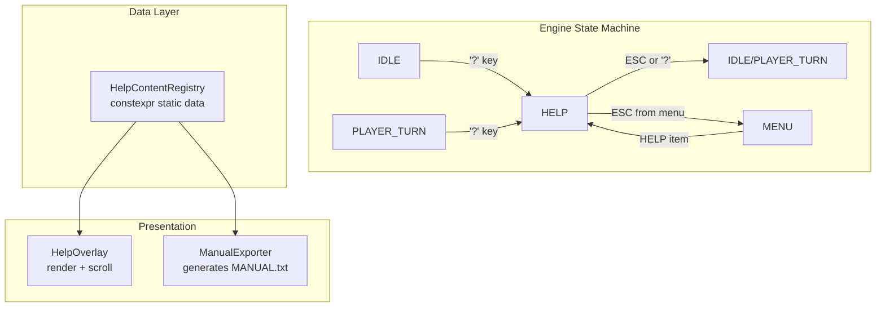

# Design Document: Help System

## Overview

The help system provides players with an in-game keybinding reference and a standalone manual file for offline reading. It follows the established modal overlay pattern used by CHARACTER_SHEET, LOOK, TABBED_MENU, and WORLD_MAP — adding a new `HELP` GameStatus state, a dedicated update/render cycle, and a static data registry that serves as the single source of truth for both the overlay and the generated MANUAL.txt file.

The architecture is intentionally simple: help content is a compile-time constant data structure (no Lua, no file I/O at runtime), and the manual exporter is a standalone utility function that can be called from a build script or a debug command.

## Architecture



The help system integrates at three points:

1. **PlayerAi::handleActionKey** — intercepts '?' to trigger `engine.beginHelp()`
2. **Engine::update / Engine::render** — new HELP state handlers (same pattern as WORLD_MAP, ADVANCES, etc.)
3. **Menu::pick** — new HELP MenuItemCode that triggers the overlay from the menu context

### Design Decisions

| Decision | Rationale |
|----------|-----------|
| `constexpr` static registry | No runtime allocation, no Lua dependency, trivially testable in isolation |
| Single `HELP` GameStatus for both menu and gameplay contexts | Avoids proliferating states; a `helpReturnToMenu` bool distinguishes exit behaviour |
| Paginator reuse for scrolling | Existing component; avoids duplicating page arithmetic |
| Manual as committed file (not build-generated) | Simpler CI; developers regenerate when content changes via a debug command or script |

## Components and Interfaces

### HelpContentRegistry (Headers/HelpContent.h)

A header-only, namespace-scoped static data structure. No class instantiation needed.

```cpp
// Headers/HelpContent.h
#pragma once
#include <array>
#include <string_view>
#include <span>

namespace HelpContent {

struct HelpEntry {
    std::string_view key;         // e.g. "g", "KP_5", "Arrow keys"
    std::string_view description; // e.g. "Pick up item"
};

struct HelpSection {
    std::string_view title;       // e.g. "Movement"
    std::span<const HelpEntry> entries;
};

// Section data (defined in Source/HelpContent.cpp as constexpr arrays)
extern const std::span<const HelpSection> allSections();

// Total line count (sections + entries + spacing) for scroll calculations
int totalLineCount();

} // namespace HelpContent
```

### HelpOverlay (Engine methods)

Following the project pattern, the overlay logic lives directly on Engine as `beginHelp()`, `updateHelp()`, `renderHelp()` methods — no separate class needed.

```cpp
// In Engine.h — new state and methods
struct HelpState {
    int scrollOffset = 0;       // first visible line index
    bool returnToMenu = false;  // true when opened from Menu context
};

// GameStatus enum addition:
// HELP  // help overlay is open

// Engine methods:
void beginHelp();
void beginHelpFromMenu();
void updateHelp();
void renderHelp();
```

### ManualExporter (Headers/ManualExporter.h)

A free function that iterates the registry and produces formatted ASCII text.

```cpp
// Headers/ManualExporter.h
#pragma once
#include <string>

namespace ManualExporter {

// Generates the full MANUAL.txt content as a string.
// version: e.g. "0.3.0"
std::string generate(std::string_view version);

// Writes generate() output to the given file path. Returns true on success.
bool writeToFile(std::string_view path, std::string_view version);

} // namespace ManualExporter
```

### Menu Integration

```cpp
// Gui.h — Menu::MenuItemCode addition:
HELP  // after AGILITY in the enum
```

The menu's `pick()` function adds the HELP item for both MAIN and PAUSE display modes. When selected, it calls `engine.beginHelpFromMenu()` which sets `helpState->returnToMenu = true`.

## Data Models

### HelpEntry

| Field | Type | Description |
|-------|------|-------------|
| `key` | `std::string_view` | The key name as displayed to the player (e.g. "g", "Arrow keys", "KP_1-KP_9") |
| `description` | `std::string_view` | Human-readable description of what the key does |

### HelpSection

| Field | Type | Description |
|-------|------|-------------|
| `title` | `std::string_view` | Section heading (e.g. "Movement", "Actions") |
| `entries` | `std::span<const HelpEntry>` | Ordered list of entries in this section |

### HelpState

| Field | Type | Description |
|-------|------|-------------|
| `scrollOffset` | `int` | Index of the first visible line (0 = top) |
| `returnToMenu` | `bool` | Whether ESC should return to menu (true) or gameplay (false) |

### Registry Content (Initial)

| Section | Entries |
|---------|---------|
| Movement | Arrow keys (4-dir), KP_1–KP_9 (8-dir + end turn), vi-keys h/j/k/l/y/u/b/n |
| Actions | g (pick up), s (shoot), r (reload), o (open door), a (aim), A (all-out attack), R (run), C (charge), KP_5 (end turn) |
| Overlays | i (inventory), c (character/equipment), l (look mode), x (advances), m (world map), e (equipment), ? (help) |
| Navigation | < (ascend stairs), > (descend stairs), ESC (save and return to menu) |

## Correctness Properties

*A property is a characteristic or behavior that should hold true across all valid executions of a system — essentially, a formal statement about what the system should do. Properties serve as the bridge between human-readable specifications and machine-verifiable correctness guarantees.*

### Property 1: Help close preserves game state and action points

*For any* game state (IDLE or PLAYER_TURN) and *for any* valid AP value, opening the help overlay and then closing it (via ESC or '?') SHALL return the engine to the original game state with the player's action points unchanged.

**Validates: Requirements 1.2, 1.3**

### Property 2: Registry preserves insertion order

*For any* sequence of HelpSections and *for any* sequence of HelpEntries within a section, querying the registry SHALL return sections in their defined order and entries within each section in their defined order.

**Validates: Requirements 3.1, 3.2, 3.4**

### Property 3: Entry formatting produces single-line key-description output

*For any* HelpEntry with a non-empty key and non-empty description, the formatted output line SHALL contain the key string followed by the description string with no embedded newline characters.

**Validates: Requirements 5.3**

### Property 4: Scroll offset remains within valid bounds

*For any* help content length and *for any* sequence of scroll inputs (Up, Down, PageUp, PageDown), the scroll offset SHALL remain in the range [0, max(0, totalLines - visibleLines)].

**Validates: Requirements 5.4**

### Property 5: Manual generation completeness

*For any* Help_Content_Registry state with N sections and M total entries, the generated manual text SHALL contain all N section titles and all M entry key-description pairs.

**Validates: Requirements 6.1**

### Property 6: Manual output is pure ASCII

*For any* Help_Content_Registry content, every character in the generated manual output SHALL have a codepoint in the range [0x0A, 0x7E] (printable ASCII plus newline/tab).

**Validates: Requirements 6.2**

### Property 7: Manual section formatting structure

*For any* HelpSection with at least one entry, the generated manual text for that section SHALL consist of: the section title on its own line, followed by a line of '-' characters of equal length, followed by one or more indented entry lines.

**Validates: Requirements 6.4**

## Error Handling

| Scenario | Handling |
|----------|----------|
| '?' pressed in an invalid state (TARGETING, INVENTORY, etc.) | Ignored — `handleActionKey` only runs in IDLE/PLAYER_TURN |
| Scroll beyond content bounds | Clamped by Paginator / manual bounds check — no crash |
| Empty registry (future-proof) | Overlay renders "No help content available." message |
| ManualExporter write failure | `writeToFile()` returns false; caller logs warning. No game crash |
| MANUAL.txt missing from repo at release time | Release workflow uses `-ErrorAction SilentlyContinue` and logs warning per Requirement 7.2 |

## Testing Strategy

### Property-Based Tests (RapidCheck, minimum 100 iterations)

The following properties are suitable for PBT because they test pure functions with well-defined input spaces:

| Property | Test Approach |
|----------|--------------|
| P1: Help close preserves state/AP | Generate random AP values (1–10), random prior state (IDLE/PLAYER_TURN), random close key (ESC/'?'). Verify state + AP unchanged. |
| P2: Registry order preservation | The registry is static constexpr data — verify order matches definition order. (This is effectively a compile-time guarantee; tested once as sanity check.) |
| P3: Entry format single-line | Generate random HelpEntry key/description strings (non-empty, no newlines in input). Verify formatted output has no newlines. |
| P4: Scroll bounds | Generate random totalLines (1–200), random visibleLines (5–50), random sequence of scroll commands (1–50 commands). Verify offset stays in [0, max(0, total-visible)]. |
| P5: Manual completeness | Generate random registry configurations (1–10 sections, 1–20 entries each). Run exporter. Verify all titles and keys appear in output. |
| P6: ASCII-only output | Generate random registry with arbitrary printable ASCII content. Run exporter. Verify all output chars are in valid range. |
| P7: Section format structure | Generate random sections with 1–10 entries. Run exporter. Parse output to verify title + dashes + indented entries pattern. |

**Library**: RapidCheck (already in project for PBT)
**Test tag**: `[help-system]` and `[pbt]`
**Minimum iterations**: 100 per property

### Unit Tests (Catch2)

| Test | Covers |
|------|--------|
| '?' key transitions IDLE → HELP | Requirement 1.1 |
| '?' key transitions PLAYER_TURN → HELP | Requirement 1.1 |
| Menu contains HELP item in MAIN mode | Requirement 2.1 |
| Menu contains HELP item in PAUSE mode | Requirement 2.1 |
| Menu HELP selection opens overlay | Requirement 2.2 |
| ESC from menu-opened help returns to menu | Requirement 2.3 |
| Movement section contains all expected keys | Requirement 4.1 |
| Actions section contains all expected keys | Requirement 4.2 |
| Overlays section contains all expected keys | Requirement 4.3 |
| Navigation section contains all expected keys | Requirement 4.4 |
| Manual includes title and version | Requirement 6.3 |
| Navigation instructions rendered at bottom | Requirement 5.5 |

### Integration / Manual Verification

| Check | Method |
|-------|--------|
| Full-screen overlay renders correctly | Visual playtest |
| Section headers visually distinct | Visual playtest |
| MANUAL.txt present in release zip | CI artifact inspection |
| Release continues without MANUAL.txt | CI workflow test (remove file, run staging step) |
