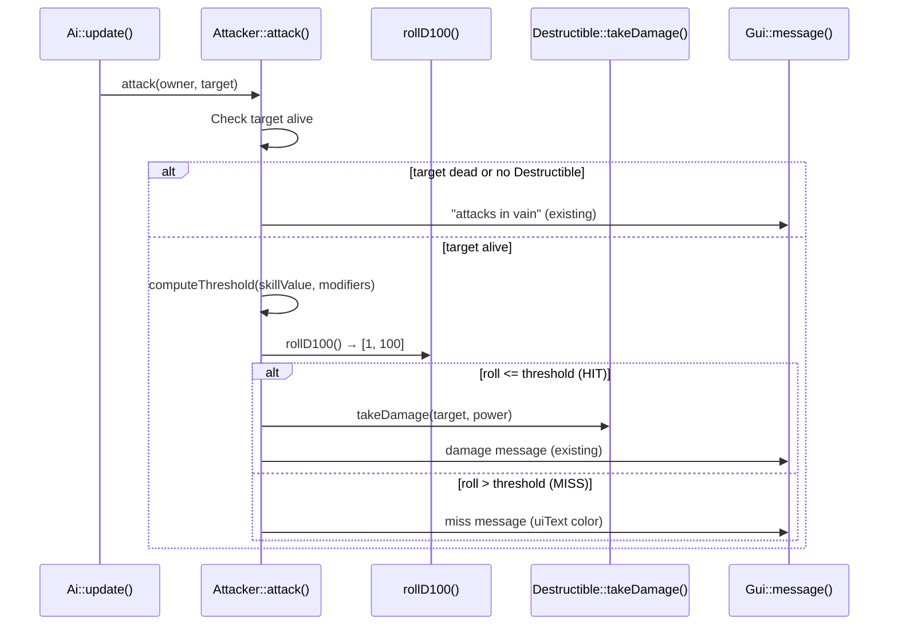

# Design Document: Hit Chance System

## Overview

This design introduces a d100 roll-under hit chance mechanic into the existing `Attacker::attack()` flow. Before damage is calculated, the system generates a random integer from 1–100 and compares it against the attacker's effective skill value (base skill + modifiers, clamped to 1–99). A roll equal to or below the threshold is a hit; above is a miss.

The design is minimally invasive: the hit check is a single guard inserted at the top of the existing attack method. The `Attacker` class gains one new integer field (`skillValue`) and a modifier vector. Lua scripts gain an optional `skill` field. Save/load adds one integer after the existing `power` float, with backward compatibility via a sentinel value.

## Architecture

The hit chance system lives entirely within the `Attacker` component. No new classes are needed. The RNG call is injected via a function pointer to enable deterministic testing.



### Design Decisions

1. **No separate HitChanceSystem class** — The logic is simple enough (threshold computation + comparison) to live as private methods on `Attacker`. This avoids adding a new component or indirection layer for what is fundamentally one `if` statement.

2. **Injected RNG for testability** — A `std::function<int()>` member (defaulting to a uniform [1, 100] distribution) allows tests to supply deterministic rolls without mocking the entire engine.

3. **Modifiers as a vector, not a map** — Modifiers are stored as `std::vector<int>`. This keeps the initial implementation simple. When equipment/status effects land later, they can push/pop modifiers. No keyed lookup is needed yet.

4. **Sentinel-based backward compatibility** — The save format appends skill after power. On load, a sentinel integer (0x534B) is written before the skill value. If the sentinel is missing (old save), the loader falls back to default skill 40. This mirrors the project's existing backward compat pattern (see Map::load sentinel).

## Components and Interfaces

### Modified: `Attacker` class

```cpp
class Attacker : public Persistent {
public:
    float power;
    int skillValue;                          // [1, 99], default 40
    std::vector<int> modifiers;              // situational modifiers (signed)
    std::function<int()> rollD100;           // injectable RNG, default: uniform [1,100]

    explicit Attacker(float power, int skillValue = 40);

    void attack(Actor* owner, Actor* target);

    // Computes effective threshold: clamp(skillValue + sum(modifiers), 1, 99)
    int computeThreshold() const;

    // Adds a modifier (positive = bonus, negative = penalty)
    void addModifier(int mod);

    // Removes the first occurrence of a modifier with the given value
    void removeModifier(int mod);

    // Clears all modifiers
    void clearModifiers();

    void save(TCODZip& zip) override;
    void load(TCODZip& zip) override;

private:
    static constexpr int DEFAULT_SKILL = 40;
    static constexpr int MIN_SKILL = 1;
    static constexpr int MAX_SKILL = 99;
    static constexpr int SKILL_SENTINEL = 0x534B; // "SK" marker for save compat

    static int clampSkill(int value);
    static int defaultRoll();  // uniform_int_distribution [1, 100]
};
```

### Modified: `Attacker::attack()` flow

```cpp
void Attacker::attack(Actor* owner, Actor* target) {
    if (target->destructible && !target->destructible->isDead()) {
        // ── NEW: Hit check ──
        const int threshold = computeThreshold();
        const int roll = rollD100();

        if (roll > threshold) {
            // Miss — log and return early
            engine.gui->message(Colors::uiText, "# attacks # but misses.",
                owner->name, target->name);
            return;
        }

        // ── Existing damage logic (unchanged) ──
        const float effectiveDamage = power - target->destructible->defense;
        if (effectiveDamage > 0) {
            const TCODColor messageColor = (owner == engine.player)
                ? Colors::damage : Colors::uiText;
            engine.gui->message(messageColor, "# attacks # for # damage.",
                owner->name, target->name, effectiveDamage);
        } else {
            engine.gui->message(Colors::uiText,
                "# attacks # but it has no effect!", owner->name, target->name);
        }
        target->destructible->takeDamage(target, power);
    } else {
        engine.gui->message(Colors::uiText, "# attacks # in vain.",
            owner->name, target->name);
    }
}
```

### Modified: Lua Bindings

**Config.lua** — new optional field:
```lua
config = {
    -- ... existing fields ...
    playerSkill = 50,  -- optional, defaults to 40 if absent
}
```

**Enemies.lua** — new optional field per template:
```lua
local enemies = {
    {
        chance  = 60,
        glyph   = string.byte("g"),
        name    = "Gretchin",
        color   = "desaturatedGreen",
        hp      = 5.0,
        defense = 0.0,
        corpse  = "dead Gretchin",
        xp      = 15,
        power   = 2.0,
        skill   = 25,  -- optional, defaults to 40 if absent
    },
    -- ...
}
```

**C++ `addActor` lambda change** — The existing lambda takes positional args. To avoid breaking the signature, the `skill` field is read from the Lua table directly (table-based enemy definitions) rather than adding a positional parameter. The `spawnEnemy` function passes the full table to `addActor`, which extracts `skill` with a default of 40.

### Modified: `Engine::init()`

After creating the player's `Attacker`, read `playerSkill` from the loaded config:

```cpp
newPlayer->attacker = std::make_unique<Attacker>(playerPower, playerSkill);
// where playerSkill comes from sol table with default 40:
// int playerSkill = config.get_or("playerSkill", 40);
```

## Data Models

### Attacker State

| Field | Type | Range | Default | Persisted |
|-------|------|-------|---------|-----------|
| `power` | `float` | > 0 | from Lua | Yes |
| `skillValue` | `int` | 1–99 | 40 | Yes |
| `modifiers` | `std::vector<int>` | any signed int | empty | No (transient) |
| `rollD100` | `std::function<int()>` | — | uniform [1,100] | No |

### Save Format (Attacker segment)

**New format:**
```
[float] power
[int]   SKILL_SENTINEL (0x534B)
[int]   skillValue
```

**Old format (pre-feature):**
```
[float] power
```

**Load logic:**
```cpp
void Attacker::load(TCODZip& zip) {
    power = zip.getFloat();
    int maybeSentinel = zip.getInt();
    if (maybeSentinel == SKILL_SENTINEL) {
        skillValue = clampSkill(zip.getInt());
    } else {
        // Old save — no sentinel found. The int we just read belongs to
        // the next field in the archive. We need to "unget" it.
        // Since TCODZip has no unget, we use a different approach:
        // Write skill BEFORE power in new format, using sentinel detection.
        // Actually — simpler: always write sentinel+skill AFTER power.
        // On old saves, the next getInt() after power returns whatever
        // the next component wrote. We detect this by checking the sentinel.
        // If it doesn't match, we consumed one int from the next section.
        //
        // REVISED APPROACH: Use the same pattern as Map — save a sentinel
        // before the Attacker payload. See revised save format below.
        skillValue = DEFAULT_SKILL;
    }
}
```

**Revised Save Approach (sentinel wraps entire Attacker):**

Since TCODZip has no "unget" or "peek" and consuming a wrong int corrupts the stream, the cleanest approach is:

```
[int]   ATTACKER_VERSION (1 for new, absent for old)
[float] power
[int]   skillValue  (only if version >= 1)
```

But this breaks old saves that start with a float. Instead, we use the fact that the Attacker segment is small and has a known old layout (just one float). The approach:

**Final approach — append-only with version counter:**

```cpp
void Attacker::save(TCODZip& zip) {
    zip.putFloat(power);
    // New fields appended after existing data:
    zip.putInt(SKILL_SENTINEL);
    zip.putInt(skillValue);
}

void Attacker::load(TCODZip& zip) {
    power = zip.getFloat();
    // Peek for sentinel — but we can't peek in TCODZip.
    // Use position-aware approach: the Actor::load knows whether
    // to expect new-format Attacker data.
}
```

**Cleanest solution — version field at Actor level:**

Looking at the existing code, `Actor::save/load` writes presence flags before component payloads. The simplest backward-compatible approach is to version the Attacker save format by writing a known integer count before the payload:

```cpp
// Save
void Attacker::save(TCODZip& zip) {
    zip.putInt(1);              // format version
    zip.putFloat(power);
    zip.putInt(skillValue);
}

// Load — old saves have no version int; they start with the power float.
// Since old Attacker::save wrote exactly 1 float (4 bytes) and new writes
// int + float + int, we need a way to distinguish.
```

**Adopted solution — the pragmatic route:**

After studying the codebase, the cleanest pattern that avoids corrupting the sequential archive is to treat old saves as having `skillValue = 40` by adding the skill field at the end and using a **save format version** stored elsewhere. However, since the project already handles this at the Map level with a sentinel, we adopt the same pattern:

The Attacker save becomes:
```cpp
void Attacker::save(TCODZip& zip) {
    zip.putFloat(power);          // existing field
    zip.putInt(SKILL_SENTINEL);   // 0x534B — marks new format
    zip.putInt(skillValue);       // new field
}
```

For loading, we cannot read an int and "put it back" if it doesn't match. But we can exploit the fact that **Actor::load controls the read sequence**. The approach:

Store a **save version** as part of the Actor save (before component flags). Old saves don't have this, but we can detect old format by the fact that Actor::load currently reads fields in a fixed order. Since modifying Actor::save/load is acceptable:

**Final adopted approach:**

Given the constraints of TCODZip (no peek/unget), the most robust approach used elsewhere in this codebase is the **sentinel-before-section** pattern (see `Map::save`). We apply it identically:

```cpp
static constexpr int ATTACKER_SAVE_V2 = 0x41544B32; // "ATK2"

void Attacker::save(TCODZip& zip) {
    zip.putInt(ATTACKER_SAVE_V2);  // sentinel: new format
    zip.putFloat(power);
    zip.putInt(skillValue);
}

void Attacker::load(TCODZip& zip) {
    // Try to read sentinel. In old saves, this reads power's bits as an int.
    // IEEE 754: power values 1.0–50.0 map to int values 0x3F800000–0x42480000,
    // which are all > 0x41544B32 for power >= 13.3. For safety, we check:
    int firstInt = zip.getInt();
    if (firstInt == ATTACKER_SAVE_V2) {
        // New format
        power = zip.getFloat();
        skillValue = clampSkill(zip.getInt());
    } else {
        // Old format: firstInt is actually the first 4 bytes of the power float.
        // Re-interpret as float.
        float oldPower;
        std::memcpy(&oldPower, &firstInt, sizeof(float));
        power = oldPower;
        skillValue = DEFAULT_SKILL;
    }
}
```

This works because:
- `ATTACKER_SAVE_V2` (0x41544B32) as a float ≈ 13.32, which is in the valid power range
- We need a sentinel that can't be confused with a valid power float

**Revised — use a value outside the power range:**

Since power values in the game are 2.0–5.0 (and unlikely to exceed ~20), we use a sentinel whose float interpretation is far outside this range:

```cpp
static constexpr int ATTACKER_SAVE_V2 = 0x7F534B00; // float interpretation ≈ 2.8e+38 (NaN-adjacent)
```

Actually, the cleanest approach given that power is always a small positive float (2.0–20.0 range based on game data):

```cpp
static constexpr int ATTACKER_SAVE_V2 = -1; // 0xFFFFFFFF as float = NaN, never a valid power
```

**Load logic:**
```cpp
void Attacker::load(TCODZip& zip) {
    int marker = zip.getInt();
    if (marker == ATTACKER_SAVE_V2) {
        power = zip.getFloat();
        skillValue = clampSkill(zip.getInt());
    } else {
        // marker contains the 4 bytes of old-format power (stored as float)
        std::memcpy(&power, &marker, sizeof(float));
        skillValue = DEFAULT_SKILL;
    }
}
```

Since valid power floats (2.0 = 0x40000000, 5.0 = 0x40A00000) will never be -1 (0xFFFFFFFF), this is safe.

## Correctness Properties

*A property is a characteristic or behavior that should hold true across all valid executions of a system — essentially, a formal statement about what the system should do. Properties serve as the bridge between human-readable specifications and machine-verifiable correctness guarantees.*

### Property 1: Skill value clamping

*For any* integer input `v`, constructing an `Attacker` with skill value `v` SHALL produce a stored `skillValue` equal to `clamp(v, 1, 99)` — that is, `max(1, min(99, v))`.

**Validates: Requirements 1.1**

### Property 2: Hit roll range

*For any* call to the default `rollD100()` function, the returned value SHALL be an integer in the inclusive range [1, 100].

**Validates: Requirements 2.1**

### Property 3: Hit determination correctness

*For any* skill value `s` in [1, 99], any list of modifiers `ms`, and any roll `r` in [1, 100], the attack hits if and only if `r <= clamp(s + sum(ms), 1, 99)`. Equivalently: hit ↔ roll ≤ threshold.

**Validates: Requirements 2.2, 2.3, 4.3, 7.1, 7.2, 7.3**

### Property 4: Threshold computation

*For any* base skill value `s` in [1, 99] and any list of signed integer modifiers `ms`, `computeThreshold()` SHALL return `clamp(s + sum(ms), 1, 99)` — always in the range [1, 99] inclusive, ensuring no guaranteed hit or guaranteed miss.

**Validates: Requirements 2.4, 5.1, 5.2**

### Property 5: Miss message content

*For any* attacker name `a` and target name `t`, when an attack misses, the generated message string SHALL contain `a`, `t`, and the substring "misses", and SHALL NOT use `Colors::damage` as its color.

**Validates: Requirements 3.1, 3.2, 3.3, 3.4**

### Property 6: Save/load round trip

*For any* valid `Attacker` state (power in [0.1, 50.0], skillValue in [1, 99]), serializing with `save()` and then deserializing with `load()` SHALL produce an `Attacker` with identical `power` and `skillValue` fields.

**Validates: Requirements 6.1, 6.2**

## Error Handling

| Scenario | Handling |
|----------|----------|
| `skillValue` provided outside [1, 99] | Clamped to nearest bound in constructor and `load()` |
| `playerSkill` missing from Config.lua | Default to 40 (sol2 `get_or` with fallback) |
| `skill` field missing from enemy template | Default to 40 (Lua `or` fallback) |
| Old save file without skill data | Sentinel detection → default 40 |
| `rollD100` function is null/unset | Should never happen (initialized in constructor); if somehow null, treat as miss with skill 40 |
| Modifier overflow (sum exceeds int range) | Practically impossible with small modifier counts; clamping to [1, 99] handles extreme sums |
| Target has no Destructible / is dead | Existing "attacks in vain" path unchanged; no hit roll performed |

## Testing Strategy

### Property-Based Tests (RapidCheck)

The project already uses Catch2 + RapidCheck. Each correctness property maps to one property-based test with minimum 100 iterations.

**Test file:** `Tests/test_hit_chance.cpp`

| Test | Property | Generators |
|------|----------|-----------|
| Skill clamping | Property 1 | `rc::gen::inRange(-1000, 1000)` |
| Roll range | Property 2 | Run `defaultRoll()` 100 times, assert [1, 100] |
| Hit determination | Property 3 | skill ∈ [1,99], modifiers ∈ [-50,50]×[0,5], roll ∈ [1,100] |
| Threshold computation | Property 4 | skill ∈ [1,99], modifiers list ∈ [-99,99]×[0,10] |
| Miss message content | Property 5 | random actor names (non-empty strings) |
| Save/load round trip | Property 6 | power ∈ [0.1, 50.0], skill ∈ [1,99] |

**Configuration:**
- Minimum 100 iterations per property (RapidCheck default is 100)
- Each test tagged: `// Feature: hit-chance-system, Property N: <description>`
- Tests use injected RNG (`rollD100 = [&]() { return fixedValue; }`) for deterministic hit/miss control

### Unit Tests (Catch2)

| Test | Covers |
|------|--------|
| Default skill is 40 | Req 1.2 |
| Miss skips damage (HP unchanged) | Req 2.3, 7.3 |
| Hit applies damage normally | Req 2.2, 7.2 |
| Dead target → no hit roll | Req 7.4 |
| Old save format loads with skill 40 | Req 6.3 |
| Miss message color ≠ Colors::damage | Req 3.3, 3.4 |

### Test Isolation

Tests inject a lambda for `rollD100` to control outcomes without mocking the engine. The `Attacker::computeThreshold()` function is pure and testable in isolation. Message formatting can be tested by capturing the format string pattern.
