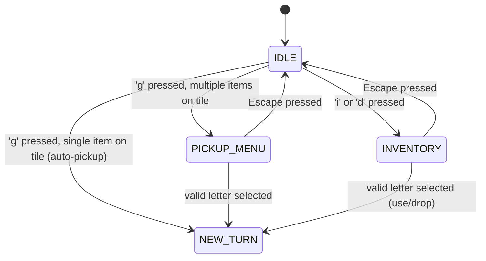

# Design Document: Inventory & Equipment UX

## Overview

This feature modifies two existing UI flows in the roguelike:

1. **Multi-item pickup selection** — When the player presses 'g' on a tile with multiple pickable items, a selection menu appears instead of auto-grabbing the first item. Single-item tiles retain the existing auto-pickup behavior.

2. **Inventory filtering** — The inventory menu ('i'/'d') now hides equipped items, showing only unequipped items available for use/drop. This prevents confusion between active gear and available inventory.

Both changes integrate into the existing `Engine` state machine by adding a new `PICKUP_MENU` game status and modifying the `INVENTORY` rendering/selection logic.

## Architecture

The design follows the existing state-machine pattern already used for `TARGETING` and `INVENTORY` states.



### Key Architectural Decisions

1. **New GameStatus value**: Add `PICKUP_MENU` to `Engine::GameStatus` enum. This follows the same pattern as `TARGETING` and `INVENTORY` — dedicated state with dedicated update/render methods.

2. **Pickup state struct**: A new `PickupMenuState` struct (analogous to `InventoryState` and `TargetingContext`) holds the list of pickable items on the tile. Stored as `std::optional<PickupMenuState>` in Engine.

3. **Filtering in renderInventory/updateInventory**: Rather than duplicating the inventory list, the existing methods build a filtered view (skip equipped items) at render/update time. No new data structure needed.

4. **No Lua changes**: Both features are purely C++ UI/logic changes. No script modifications required.

## Components and Interfaces

### New Types

```cpp
// Stores state for the pickup selection menu overlay.
struct PickupMenuState {
    // Raw pointers into engine.actors — valid while menu is open (no actor removal during menu).
    std::vector<Actor*> items;
};
```

### Modified: Engine (Engine.h / Engine.cpp)

**Header changes:**
- Add `PICKUP_MENU` to `GameStatus` enum
- Add `std::optional<PickupMenuState> pickupMenuState;`
- Add method declarations:
  - `void beginPickupMenu(const std::vector<Actor*>& items);`
  - `void updatePickupMenu();`
  - `void renderPickupMenu();`

**Source changes:**
- `update()`: Add `PICKUP_MENU` handling before IDLE (same pattern as TARGETING/INVENTORY)
- `render()`: Add `renderPickupMenu()` call when in PICKUP_MENU state
- `renderInventory()`: Filter out equipped items; reassign letter shortcuts based on filtered list
- `updateInventory()`: Map letter selection to filtered list index instead of raw inventory index

### Modified: PlayerAi (Ai.cpp)

**Changes to `handleActionKey` case 'g':**
- Collect all pickable items at player's position into a vector
- If 0 items: display "nothing here" message (existing behavior)
- If 1 item: auto-pickup (existing behavior, slightly refactored)
- If 2+ items: call `engine.beginPickupMenu(items)` and return without setting NEW_TURN

### Unchanged Components

- **Container.h/.cpp** — No changes. Inventory list structure unchanged.
- **Equipment.h/.cpp** — No changes. `isEquipped()` already exists and is sufficient.
- **Pickable.h/.cpp** — No changes. `pick()` method already handles the actual transfer.
- **Gui.h/.cpp** — No changes. Message logging works as-is.

## Data Models

No new persistent data. All new state (`PickupMenuState`) is transient UI state that exists only while the menu is open.

### PickupMenuState Lifecycle

1. Created by `beginPickupMenu()` — stores raw pointers to actors on the tile
2. Read by `renderPickupMenu()` and `updatePickupMenu()` each frame
3. Destroyed (set to `std::nullopt`) on item selection or Escape

### Inventory Filtering (No New Storage)

The filtered view is computed on-the-fly during `renderInventory()` and `updateInventory()` by iterating `owner->container->inventory` and skipping items where `owner->equipment->isEquipped(item)` returns true. This avoids any synchronization issues between the filtered list and the actual container.

## Correctness Properties

*A property is a characteristic or behavior that should hold true across all valid executions of a system — essentially, a formal statement about what the system should do. Properties serve as the bridge between human-readable specifications and machine-verifiable correctness guarantees.*

### Property 1: Pickup message identifies the item

*For any* pickable item with any valid name, after a successful pickup (whether auto-pickup or menu selection), the most recent GUI message SHALL contain that item's name.

**Validates: Requirements 1.2, 2.4**

### Property 2: Multi-item menu lists all tile items with sequential letters

*For any* set of N pickable items (where N ≥ 2, N ≤ 26) placed on the player's tile, the pickup menu SHALL contain exactly N entries, each with a sequential letter shortcut from 'a' to 'a'+N-1, and each entry's name SHALL match the corresponding item's name.

**Validates: Requirements 2.1, 2.2, 3.1**

### Property 3: Menu letter selection picks the correct item

*For any* pickup menu with N items and any valid selection index i (0 ≤ i < N), pressing the letter 'a'+i SHALL move the item at position i from the map into the player's inventory, leaving all other items on the tile.

**Validates: Requirements 2.3**

### Property 4: Inventory displays only unequipped items with sequential letters

*For any* container with M total items where K items are equipped (0 ≤ K ≤ M), the inventory menu SHALL display exactly M-K items, each assigned a sequential letter from 'a' to 'a'+(M-K-1), and no displayed item SHALL be currently equipped.

**Validates: Requirements 4.1, 4.2, 4.4**

### Property 5: Inventory selection maps to the correct filtered item

*For any* inventory state with M-K unequipped items and any valid selection index j (0 ≤ j < M-K), pressing the letter 'a'+j SHALL perform the pending action (use/drop) on the j-th unequipped item in container order, not the j-th item overall.

**Validates: Requirements 4.3**

## Error Handling

| Scenario | Handling |
|----------|----------|
| 'g' pressed on empty tile | Display "There is nothing here to pick up." — no state change |
| Container full during auto-pickup | Display "Your inventory is full!" — consume turn, no pickup |
| Container full during menu selection | Display "Your inventory is full!" — close menu, no pickup |
| Invalid letter pressed in pickup menu | Ignored — remain in PICKUP_MENU state |
| Invalid letter pressed in inventory menu | Ignored — remain in INVENTORY state (existing behavior) |
| Pickup menu with >26 items on tile | Truncate display to first 26 items (a-z). Extremely unlikely in practice. |

## Testing Strategy

### Property-Based Tests (Catch2 + Custom Generators)

The project uses Catch2 v3 for testing. Since Catch2 does not include a built-in PBT framework, property-based tests will use Catch2's `GENERATE` with custom random generators to produce randomized inputs over 100+ iterations.

Each property test:
- Runs a minimum of 100 iterations with randomized inputs
- References its design property in a tag comment
- Tests the logic layer (item collection, filtering, index mapping) independently of rendering

**Property test targets:**
- `filterInventory()` — pure function extracting unequipped items (Properties 4, 5)
- `collectPickableItems()` — pure function collecting items at a position (Property 2, 3)
- Pickup message generation (Property 1)

### Unit Tests (Example-Based)

- Escape closes pickup menu without side effects (Requirement 2.5)
- Empty tile produces correct message and no menu (Requirements 5.1, 5.2)
- Pickup menu frame is centered and matches inventory style (Requirement 3.2)
- Movement keys ignored during PICKUP_MENU state (Requirement 3.3)

### Integration Tests

- Full pickup flow: player on multi-item tile → menu opens → select item → item in inventory → turn advances
- Inventory menu with mixed equipped/unequipped items → equip via 'e' menu → reopen inventory → list updates
- Full inventory rejection during menu selection flow

### Test Library

- **Framework**: Catch2 v3 (amalgamated, already in Tests/lib/)
- **PBT approach**: `GENERATE(take(100, ...))` pattern with custom random Actor/Container factories
- **Tag format**: `// Feature: inventory-equipment-ux, Property N: <property text>`
