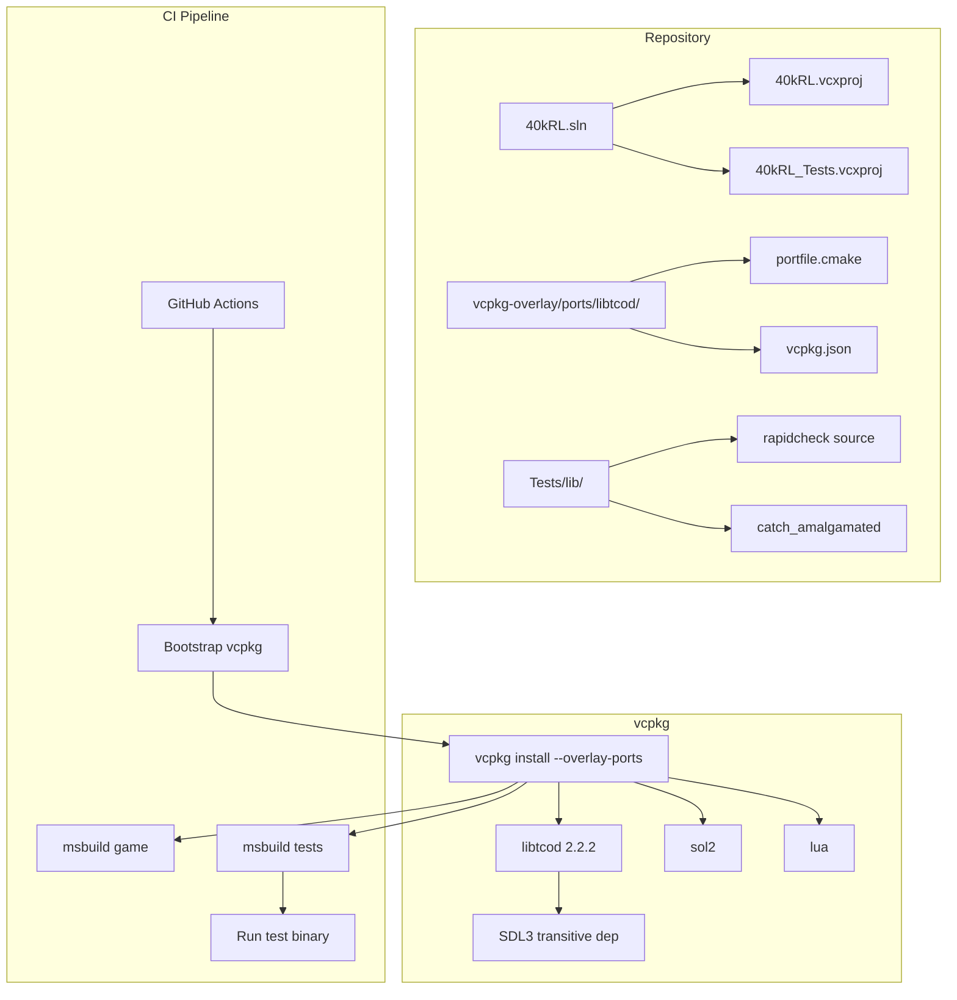

# Design Document: libtcod 2.2 Upgrade

## Overview

This design covers upgrading the 40kRL project from libtcod 1.15.0 (locally bundled, SDL2 backend) to libtcod 2.2.x (vcpkg-managed, SDL3 backend). The upgrade is primarily a build-system and API-compatibility change. The existing game logic remains unchanged — libtcod 2.x retains deprecated-but-functional C++ wrapper classes, so the migration strategy is:

1. Switch dependency acquisition from bundled binaries to a custom vcpkg overlay port
2. Fix the small set of breaking API changes (removed character constants, private field access, template signature)
3. Suppress deprecation warnings with a scoped pragma
4. Vendor RapidCheck for property-based testing
5. Re-enable CI with the new dependency chain

The project remains an MSBuild/Visual Studio solution (no CMake migration). vcpkg's MSBuild integration handles include paths and library linking automatically once `vcpkg integrate install` has run.

## Architecture



### Key Architectural Decisions

| Decision | Rationale |
|----------|-----------|
| Custom vcpkg overlay port | Official vcpkg registry only has libtcod 1.24.0. Overlay port pulls 2.2.2 from GitHub and builds with CMake. Minimal maintenance burden — update the port version hash when upgrading. |
| MSBuild stays (no CMake migration) | Project already uses MSBuild with vcpkg integration. Migrating to CMake is a large orthogonal change and out of scope. |
| Suppress C4996 globally in `<DisableSpecificWarnings>` | The project already does this (`4996` in .vcxproj). This is maintained rather than switching to scoped pragmas in main.h, since libtcod deprecation warnings originate from many headers and TCODColor constants used throughout source files. |
| Vendor RapidCheck source | RapidCheck is not in vcpkg. Vendoring source in Tests/lib/ mirrors the existing Catch2 pattern. |
| Replace TCOD_CHAR_* with integer literals | Using `static constexpr int` constants in a header provides named constants without depending on removed enums. |

## Components and Interfaces

### 1. vcpkg Overlay Port (`vcpkg-overlay/ports/libtcod/`)

**Files:**
- `vcpkg.json` — port manifest declaring name, version, and dependencies (SDL3, zlib, stb, lodepng, etc.)
- `portfile.cmake` — downloads libtcod 2.2.2 source tarball from GitHub, configures with CMake, installs

**Interface with build system:** CI and local builds pass `--overlay-ports=vcpkg-overlay/ports` to vcpkg. The port installs headers to `<vcpkg_root>/installed/x64-windows/include` and libraries to `<vcpkg_root>/installed/x64-windows/lib`.

### 2. Character Constants Header (`Headers/CharConstants.h`)

A new header providing named `constexpr int` replacements for removed `TCOD_CHAR_*` enumerators:

```cpp
#pragma once
// Unicode codepoints replacing removed TCOD_CHAR_* constants (libtcod 1.16+).
// Box Drawing block (U+2550–U+256C) and Miscellaneous Symbols.
namespace CharConst {
    constexpr int DCROSS      = 0x256C; // ╬
    constexpr int DTEES       = 0x2566; // ╦  (T-piece south)
    constexpr int DTEEN       = 0x2569; // ╩  (T-piece north)
    constexpr int DTEEE       = 0x2560; // ╠  (T-piece east)
    constexpr int DTEEW       = 0x2563; // ╣  (T-piece west)
    constexpr int DNE         = 0x255A; // ╚  (corner north-east)
    constexpr int DNW         = 0x255D; // ╝  (corner north-west)
    constexpr int DSE         = 0x2557; // ╗  (corner south-east)
    constexpr int DSW         = 0x2554; // ╔  (corner south-west)
    constexpr int DVLINE      = 0x2551; // ║
    constexpr int DHLINE      = 0x2550; // ═
    constexpr int RADIO_UNSET = 0x25CB; // ○
    constexpr int SPADE       = 0x2660; // ♠
}
```

### 3. Gui::message Template Fix (`Headers/Gui.h`)

The broken signature:
```cpp
template<typename TCODColor, typename T, typename...Args>
void message(const TCODColor& col, const T& text, const Args&&...args)
```

Fixed signature using proper forwarding references:
```cpp
template<typename Color, typename T, typename...Args>
void message(const Color& col, const T& text, Args&&...args)
```

The `makeStringList` helper also changes from `Args&&...args` (broken forwarding) to use a C++17 fold expression or `std::forward`:

```cpp
template<typename... Args>
std::vector<std::string> makeStringList(Args&&... args) {
    std::vector<std::string> result;
    (result.push_back(makeString(std::forward<Args>(args))), ...);
    return result;
}
```

### 4. Engine::nextLevel Glyph Access Fix (`Source/Engine.cpp`)

Replace direct private field access:
```cpp
// Before (broken — glyph is private):
if (stairs->glyph == '<') { ... }
stairs->glyph = isOutdoor ? '>' : '<';

// After (uses existing public accessors):
if (stairs->getGlyph() == '<') { ... }
stairs->setGlyph(isOutdoor ? '>' : '<');
```

### 5. CI Workflow Updates (`.github/workflows/ci.yml`)

Changes:
- Trigger: `on: [push, pull_request]` targeting main (replace `workflow_dispatch`)
- vcpkg install command adds `--overlay-ports=vcpkg-overlay/ports`
- Post-build DLL copy references SDL3.dll instead of SDL2.dll
- Test project include of RapidCheck source files

### 6. Project File Updates (`.vcxproj` files)

- Remove `libtcod.lib` and `SDL2.dll` from the repo root (no longer bundled)
- Test project: add RapidCheck source files to `<ClCompile>` ItemGroup
- Test project: update post-build copy to reference SDL3.dll
- Keep `<DisableSpecificWarnings>4996</DisableSpecificWarnings>` (already present)

## Data Models

No data model changes. The upgrade does not alter any game state, serialization format (TCODZip), or runtime data structures. All existing save files remain compatible since the TCODZip API is unchanged in libtcod 2.x.

## Correctness Properties

*A property is a characteristic or behavior that should hold true across all valid executions of a system — essentially, a formal statement about what the system should do. Properties serve as the bridge between human-readable specifications and machine-verifiable correctness guarantees.*

### Property 1: Wall glyph selection completeness and correctness

*For any* combination of four boolean neighbour flags (top, bottom, left, right), the `chooseWallGlyph` function SHALL return a value that is one of the 13 defined Unicode box-drawing codepoints (DCROSS, DTEES, DTEEN, DTEEE, DTEEW, DNE, DNW, DSE, DSW, DVLINE, DHLINE, RADIO_UNSET) — covering all 16 possible input combinations without returning an undefined value.

**Validates: Requirements 3.1, 3.4, 10.3**

### Property 2: Message template substitution correctness

*For any* input string containing N `#` placeholder characters and a list of N substitution arguments (each being a non-empty string that does not itself contain `#`), calling the Gui message formatting logic SHALL produce an output string that contains zero `#` characters and contains each substitution argument as a substring.

**Validates: Requirements 5.5**

## Error Handling

| Scenario | Handling |
|----------|----------|
| vcpkg overlay port fails to build libtcod | CI step fails with non-zero exit; developer sees CMake error output in GitHub Actions log |
| SDL3.dll missing at runtime | libtcod initialization fails with a descriptive OS-level DLL load error; game exits immediately |
| RapidCheck source fails to compile | Test project build fails in CI; error points to specific source file |
| Unknown wall neighbour configuration (all false) | `chooseWallGlyph` returns `CharConst::RADIO_UNSET` (○) as fallback — same behaviour as before |
| Gui::message called with zero substitution args but text contains `#` | `#` characters remain in output (existing behaviour, not a crash) |

## Testing Strategy

### Unit Tests (Example-Based)

| Test | What it verifies |
|------|-----------------|
| `test_char_constants_mapping` | All 13 CharConst values match expected Unicode codepoints |
| `test_wall_glyph_all_16_combos` | Exhaustive check of chooseWallGlyph for all 2⁴ inputs |
| `test_gui_message_lvalue_string` | message() compiles and runs with std::string lvalue args |
| `test_gui_message_literal` | message() compiles and runs with string literal args |
| `test_gui_message_mixed_types` | message() compiles and runs with int, float, string mix |
| `test_outdoor_terrain_glyphs` | Spade (0x2660), tilde, dot used for tree/water/ground |
| `test_actor_glyph_accessors` | getGlyph()/setGlyph() round-trip correctly |

### Property-Based Tests (RapidCheck)

| Property | Test description | Min iterations |
|----------|-----------------|----------------|
| Property 1 | Generate random bool⁴ tuples → verify chooseWallGlyph output ∈ valid set | 100 |
| Property 2 | Generate random template string with N placeholders + N args → verify no `#` remains and all args present | 100 |

**PBT Library:** RapidCheck (vendored source in `Tests/lib/`)
**Tag format:** `// Feature: libtcod-upgrade, Property 1: Wall glyph selection completeness and correctness`

### Integration Tests (CI-Level)

| Check | Method |
|-------|--------|
| libtcod 2.2 resolves via overlay port | vcpkg install succeeds in CI |
| SDL3.dll present in output | Post-build step + CI verification |
| All existing tests pass | CI runs test binary, reports exit code |
| Game project builds Debug+Release | CI matrix build |
| Test project builds Debug+Release | CI matrix build |
| No new W3 warnings | CI build with existing /W3 setting |

### Smoke Tests (Manual/CI)

- Game executable launches without DLL-not-found errors
- Dungeon level renders with box-drawing wall characters
- Outdoor level renders with tree/water/ground glyphs
- Gui messages display correctly in the HUD
