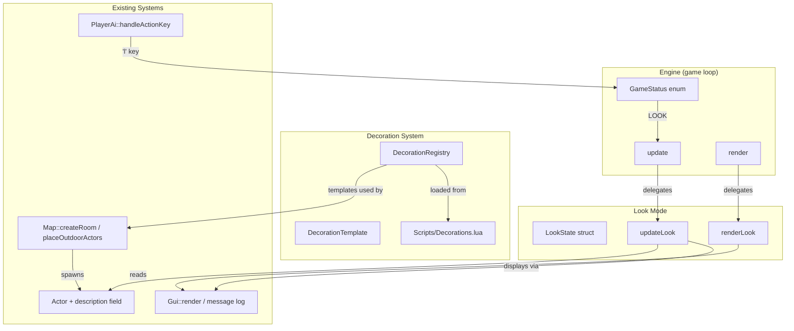

# Design Document: Look and Decorations

## Overview

This feature adds two related systems to 40kRL:

1. **Look Mode** — A new game state (`LOOK`) where the player moves a keyboard-driven cursor over the map to inspect visible tiles and read actor descriptions in the GUI panel.
2. **Decoration System** — Data-driven room decorations loaded from `Scripts/Decorations.lua` at startup, spawned during map generation, rendered via the existing Actor/rendering pipeline, and inspectable via look mode.

Both systems integrate with the existing actor-component architecture. Decorations are standard `Actor` instances with no gameplay components (no Ai, Attacker, Destructible, or Pickable), differentiated only by their properties and a new `description` field on `Actor`. Look mode follows the same overlay-state pattern used by TARGETING, INVENTORY, and PICKUP_MENU.

## Architecture



### State Machine Extension

The `Engine::GameStatus` enum gains a new `LOOK` value. When in `LOOK` state:
- `Engine::update()` calls `updateLook()` (no turn advancement, no AI).
- `Engine::render()` calls `renderLook()` after normal map/actor rendering to draw the cursor highlight.
- Input is consumed exclusively by the look-mode handler.

### Data Flow

1. **Startup**: `Engine::init()` loads `Scripts/Decorations.lua` → populates `decorationTemplates` vector.
2. **Map Generation**: `Map::createRoom()` and `Map::placeOutdoorActors()` call `Map::addDecorations()` which samples from `decorationTemplates` and emplaces decoration Actors into `engine.actors`.
3. **Gameplay**: Player presses `'l'` → `PlayerAi::handleActionKey` transitions to `LOOK` state → player navigates cursor → GUI shows actor descriptions → ESC/`'l'` exits.

## Components and Interfaces

### 1. Actor — `description` field

```cpp
// In Actor.h — new member
class Actor {
public:
    // ... existing members ...
    std::string description; // optional description shown in look mode (max 200 chars)
};
```

- Default-initialised to empty string.
- Persisted via save/load (append to existing Actor serialisation).
- Populated from Lua templates for decorations, enemies, and items (where desired).

### 2. DecorationTemplate struct

```cpp
// In Engine.h or a new Decoration.h
struct DecorationTemplate {
    int glyph;                // character code
    std::string name;         // max 30 characters
    TCODColor color;          // resolved from colour name string
    std::string description;  // max 120 characters
    bool blocks;              // whether it blocks movement
    int coverValue;           // 0-100, future cover system (no gameplay effect now)
};
```

### 3. DecorationRegistry — stored on Engine

```cpp
// In Engine.h
class Engine {
public:
    // ... existing members ...
    std::vector<DecorationTemplate> decorationTemplates; // loaded from Decorations.lua
};
```

Loading follows the same pattern as `equipmentTemplates` — a `sol::state` opens the file, iterates the table, validates fields, and pushes valid entries into the vector.

### 4. LookState struct

```cpp
// In Engine.h
struct LookState {
    int cursorX;  // world coordinates
    int cursorY;
};
```

### 5. Engine extensions

```cpp
// New GameStatus value
enum GameStatus {
    // ... existing ...
    LOOK       // look-mode cursor active
};

// New members
std::optional<LookState> lookState;

// New methods
void beginLook();
void updateLook();
void renderLook();
```

### 6. Map extensions

```cpp
// In Map.h — new method
void addDecorations(int x1, int y1, int x2, int y2);       // BSP rooms
void addOutdoorDecorations();                                // outdoor levels
```

### 7. PlayerAi extension

In `handleActionKey`, add a `case 'l':` that calls `engine.beginLook()`.

### 8. Gui extension

A helper method (or inline logic in `renderLook`) formats actor descriptions for the HUD:
- If tile is in FOV: list each actor's name + description.
- If explored but not in FOV: "You can't see that clearly from here."
- If unexplored: blank.

## Data Models

### DecorationTemplate (C++ struct)

| Field        | Type        | Constraints              | Default |
|-------------|-------------|--------------------------|---------|
| glyph       | int         | single char codepoint    | —       |
| name        | std::string | max 30 chars             | —       |
| color       | TCODColor   | valid Colors::colorFromName | —    |
| description | std::string | max 120 chars            | —       |
| blocks      | bool        | —                        | false   |
| coverValue  | int         | 0–100                    | 0       |

### LookState (C++ struct)

| Field   | Type | Constraints                        |
|---------|------|------------------------------------|
| cursorX | int  | 0 ≤ x < map width                 |
| cursorY | int  | 0 ≤ y < map height                |

### Actor::description (new field)

| Field       | Type        | Constraints  | Default |
|------------|-------------|--------------|---------|
| description | std::string | max 200 chars | ""     |

### Scripts/Decorations.lua schema

```lua
decorations = {
    {
        glyph       = "X",           -- single character string (required)
        name        = "ammo crate",  -- string, max 30 chars (required)
        color       = "lightYellow", -- valid colour name (required)
        description = "A battered ammunition crate stamped with Aquila markings.",
        blocks      = false,         -- boolean (required)
        cover_value = 25,            -- integer 0-100 (optional, default 0)
    },
    -- ... more entries ...
}
```

### Scripts/Config.lua additions

```lua
config = {
    -- ... existing fields ...
    maxRoomDecorations      = 3,   -- max decorations per BSP room (default 3)
    outdoorDecorationCount  = 8,   -- decorations on outdoor levels (default 8)
}
```


## Correctness Properties

*A property is a characteristic or behavior that should hold true across all valid executions of a system — essentially, a formal statement about what the system should do. Properties serve as the bridge between human-readable specifications and machine-verifiable correctness guarantees.*

### Property 1: Cursor movement stays within map bounds

*For any* cursor position (x, y) within a map of dimensions (W, H) and any movement direction (up, down, left, right), the resulting cursor position shall remain within [0, W−1] × [0, H−1], and shall differ from the original by at most one tile in the moved axis unless already at the boundary.

**Validates: Requirements 1.3**

### Property 2: Actor description formatting

*For any* actor name (non-empty string) and description string (possibly empty, max 200 chars), the formatted look-mode output shall equal the name alone when the description is empty, or "name: description" when the description is non-empty.

**Validates: Requirements 3.2, 3.3**

### Property 3: Description field serialisation round-trip

*For any* valid Actor description string (0 to 200 characters), serialising the Actor and then deserialising it shall produce an Actor whose description field is identical to the original.

**Validates: Requirements 3.4**

### Property 4: Look-mode displays all tile actors in list order

*For any* non-empty list of actors (excluding the player) positioned on the same in-FOV tile, the look-mode output shall contain every actor's formatted name+description in the same relative order they appear in the Engine actor list, separated by line breaks.

**Validates: Requirements 2.1, 2.4**

### Property 5: Invalid decoration entries are skipped during loading

*For any* decoration entry table that is missing at least one required field (glyph, name, colour, description, or blocks) or has an unrecognised colour name, the loader shall exclude it from the registry and the count of loaded templates shall equal the count of fully-valid entries in the input.

**Validates: Requirements 4.4**

### Property 6: Decoration spawn count bounded by config

*For any* maxRoomDecorations config value (including negative values), the number of decorations spawned in a single room shall be in [0, max(0, configValue)].

**Validates: Requirements 5.1, 5.5**

### Property 7: Decorations are placed on walkable unoccupied tiles

*For any* decoration actor spawned during map generation (BSP or outdoor), the tile it occupies shall be walkable (non-wall ground) and shall not be occupied by any other blocking actor at the time of placement.

**Validates: Requirements 5.2, 7.3**

### Property 8: Spawned decoration matches its template

*For any* decoration template in the registry, when an Actor is spawned from that template, the Actor shall have: blocks equal to template.blocks, fovOnly equal to true, description equal to template.description, coverValue equal to template.coverValue, and all gameplay components (ai, attacker, destructible, pickable) shall be null.

**Validates: Requirements 6.1, 6.2, 6.3, 6.4, 8.3**

## Error Handling

| Scenario | Response |
|----------|----------|
| `Scripts/Decorations.lua` missing or parse error | Log warning via `gui->message`, continue with empty `decorationTemplates` — no decorations spawn |
| Decoration entry missing required field | Skip entry, log warning identifying the entry index, continue loading remaining entries |
| Invalid colour name in decoration entry | Skip entry, log warning, continue |
| `cover_value` out of range (< 0 or > 100) | Clamp to [0, 100], log warning |
| `maxRoomDecorations` < 0 in Config.lua | Treat as 0 (no decorations) |
| No walkable tile available for decoration | Skip that placement silently (no error) |
| Cursor moved outside map bounds | Clamp to boundary — cursor stays at edge |
| Look mode entered during non-IDLE state | Ignore the key press — only respond in IDLE |
| Actor description exceeds 200 chars during Lua load | Truncate to 200 characters |

## Testing Strategy

### Unit Tests (Catch2)

- State transitions: 'l' key enters LOOK from IDLE, ESC/'l' exits to IDLE
- Cursor highlight colour differs from floor/wall colours
- No turn advancement during LOOK state
- Terrain descriptions for each tile type (floor, wall, tree, water)
- Corpses included in look output
- Player excluded from look output on own tile
- Explored-but-not-visible tile shows "can't see clearly" message
- Unexplored tile shows nothing
- Decoration template loading with all fields present
- Graceful handling of missing Lua file
- First room has no decorations
- Empty decoration registry → no crash, no decorations
- cover_value defaults to 0 when omitted
- Blocking decorations make tile impassable via `canWalk`

### Property-Based Tests (RapidCheck + Catch2)

- **Library**: RapidCheck (already used in the project via `lib/rapidcheck_catch.h`)
- **Minimum iterations**: 100 per property
- **Tag format**: `Feature: look-and-decorations, Property N: <title>`

Each of the 8 correctness properties above will be implemented as a single property-based test. The test file will be `Tests/test_look_and_decorations.cpp`.

Key generators needed:
- Random map dimensions (10–200 × 10–200)
- Random cursor positions within map bounds
- Random movement directions (4 cardinal)
- Random actor names (1–30 printable ASCII chars)
- Random descriptions (0–200 printable ASCII chars)
- Random DecorationTemplate structs with valid/invalid field combinations
- Random maxRoomDecorations config values (−5 to 10)
- Random room rectangles within map bounds

### Integration Tests

- Full Engine::init() with valid Decorations.lua → templates loaded, decorations present on generated map
- Outdoor level generation includes decorations on ground tiles
- Save/load cycle preserves decoration actors and descriptions
