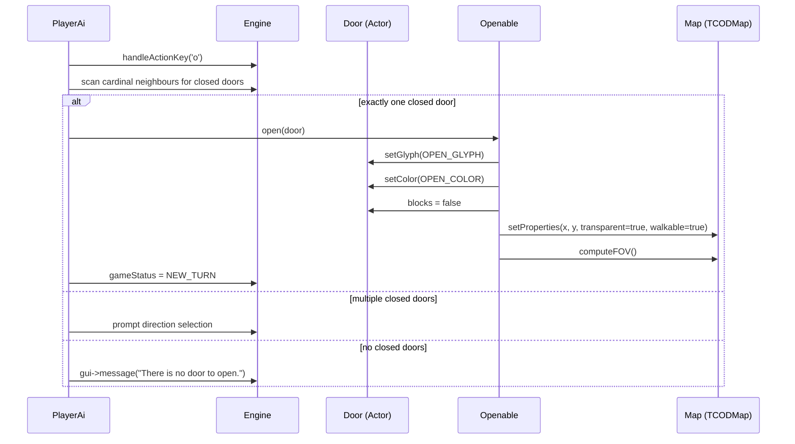
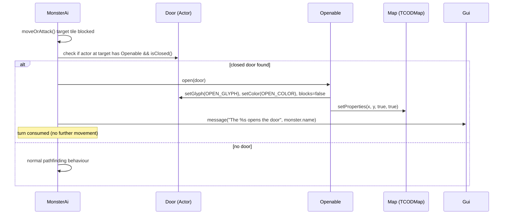

# Design Document — Map Doors

## Overview

This feature adds interactive doors to BSP dungeon maps. A door is an Actor entity with a new
`Openable` component that tracks open/closed state and manages the corresponding changes to the
Actor's glyph, colour, `blocks` flag, and the underlying `TCODMap` walkability/transparency
properties.

Doors are placed during BSP generation at room entrance tiles (the boundary between a corridor and
a room). The player opens doors with the 'o' key when cardinally adjacent; monsters open doors
automatically when their AI attempts to path through a closed door tile. Door state persists
through the TCODZip save/load system via the existing Actor serialization pipeline with a new
Openable component presence flag.

Design priorities:
1. **Minimal invasion** — Openable is a new optional component slot on Actor, following the exact
   pattern of Attacker/Destructible/Ai/etc.
2. **Spatial correctness** — opening/closing a door immediately updates the TCODMap so that FOV,
   scent, and pathfinding reflect the new state without any frame-lag.
3. **Deterministic generation** — door placement uses the same seeded RNG as the rest of BSP
   generation, so maps remain reproducible from a seed.

---

## Architecture

### Integration Points

```
┌─────────────────────────────────────────────────────────────────────┐
│ Engine                                                              │
│  actors list ──► Door Actor (blocks, fovOnly=false)                 │
│                    └─ Openable component (state, open/close logic)  │
│                                                                     │
│  Map                                                                │
│    TCODMap ◄── Openable::open()/close() update walkability/transp.  │
│    computeFOV() ◄── triggered after state change                    │
│                                                                     │
│  PlayerAi                                                           │
│    handleActionKey('o') ──► find adjacent closed doors ──► open     │
│    moveOrAttack() ──► if closed door at target: block + message     │
│                                                                     │
│  MonsterAi                                                          │
│    moveOrAttack() ──► if closed door at target: open + consume turn │
│                                                                     │
│  BspListener::visitNode()                                           │
│    L-shaped corridor creation ──► identify entrance tiles ──► place │
└─────────────────────────────────────────────────────────────────────┘
```

### Sequence: Player Opens Door



### Sequence: Monster Opens Door



---

## Components and Interfaces

### Openable Component

```cpp
// Headers/Openable.h
#pragma once
#include "Persistent.h"

class Actor;

// Component that makes an Actor into an interactive door.
// Tracks open/closed state and manages the side effects of state transitions
// (glyph, colour, blocks flag, TCODMap properties, FOV recompute).
class Openable : public Persistent {
public:
    Openable();  // initialises in CLOSED state

    bool isOpen() const;

    // Transitions from closed to open. Updates the owning Actor's glyph, colour,
    // blocks flag, and the Map's TCODMap properties. Triggers FOV recompute.
    void open(Actor* owner);

    // Transitions from open to closed. Inverse of open().
    void close(Actor* owner);

    void save(TCODZip& zip) override;
    void load(TCODZip& zip) override;

private:
    bool opened = false;
};
```

### Actor Integration

A new `std::shared_ptr<Openable> openable` field is added to Actor alongside the existing
component slots. The serialization pipeline gains a new presence flag after the last existing
component (characterSheet), maintaining backward compatibility with old saves that will read 0
for the new flag.

```cpp
// In Actor.h — added to the component block:
std::shared_ptr<Openable> openable;  // non-null for doors
```

### Door Factory Function

A helper function encapsulates door construction to ensure all invariants are satisfied:

```cpp
// In Map.h or a separate DoorFactory.h
std::unique_ptr<Actor> createDoor(int x, int y);
```

Implementation:
```cpp
std::unique_ptr<Actor> createDoor(int x, int y) {
    auto door = std::make_unique<Actor>(x, y, '+', "door", TCODColor{150, 100, 50});
    door->blocks  = true;
    door->fovOnly = false;
    door->openable = std::make_shared<Openable>();
    return door;
}
```

### Modified Interfaces

| Class | Change |
|-------|--------|
| `Actor` | Add `shared_ptr<Openable> openable` field |
| `Actor::save/load` | Add presence flag + payload for openable after characterSheet |
| `PlayerAi::handleActionKey` | Add 'o' case for door opening |
| `PlayerAi::moveOrAttack` | Add closed-door message before returning false |
| `MonsterAi::moveOrAttack` | Check for closed door before scent/movement logic |
| `BspListener::visitNode` | After corridor dig, identify and place doors at entrances |
| `Map` | No interface change; TCODMap properties managed by Openable |
| `Colors` | Add `doorClosed` and `doorOpen` constants |

---

## Data Models

### Openable State

| Field    | Type   | Notes                                      |
|----------|--------|--------------------------------------------|
| `opened` | `bool` | false = closed (default), true = open      |

### Door Actor Configuration

| Property    | Closed State          | Open State             |
|-------------|-----------------------|------------------------|
| `glyph`    | `'+'` (43)            | `'\''` (39, apostrophe)|
| `color`    | `{150, 100, 50}`      | `{100, 65, 30}`        |
| `blocks`   | `true`                | `false`                |
| `fovOnly`  | `false`               | `false`                |
| TCODMap walkable | `false`          | `true`                 |
| TCODMap transparent | `false`       | `true`                 |

### Serialization Extension

The Actor save/load stream gains one additional field after the existing characterSheet block:

```
... existing fields ...
int     hasCharacterSheet
[CharacterSheet payload if present]
int     hasOpenable          ← NEW
[Openable payload if present]
  int   opened              ← 0 or 1
```

Old saves without the openable flag will read 0 from the archive end (TCODZip returns 0 for
reads past end), which correctly means "no openable component" — backward compatible.

### Door Placement Algorithm

During BSP generation, after a corridor segment is dug, entrance tiles are identified as follows:

1. For each corridor tile `(cx, cy)`, check if it is cardinally adjacent to a room interior tile
   (already dug) and also cardinally adjacent to a wall tile in the perpendicular direction.
2. More precisely: a tile qualifies as a room entrance if it lies on the exact boundary where
   the corridor meets the room rectangle edge.

A simpler heuristic (used in implementation):
- After `createRoom()` digs a room, record the room bounds.
- When digging the L-shaped corridor, for each tile that transitions from wall to room-interior
  (the first/last tile of a corridor segment that touches a room edge), place a door.
- Track placed door positions in a `std::set<std::pair<int,int>>` to prevent duplicates.

---

## Correctness Properties

*A property is a characteristic or behavior that should hold true across all valid executions of a
system — essentially, a formal statement about what the system should do. Properties serve as the
bridge between human-readable specifications and machine-verifiable correctness guarantees.*

---

### Property 1: Door construction invariant

*For any* door created via the door factory function, the resulting Actor SHALL have: a non-null
Openable component in the closed state, `blocks == true`, `fovOnly == false`, glyph `'+'`, and
colour `{150, 100, 50}`.

**Validates: Requirements 1.1, 1.3, 1.4**

---

### Property 2: Door state consistency

*For any* door Actor with a non-null Openable component, the following invariants SHALL hold:
- If `openable->isOpen() == false`: glyph is `'+'`, colour is `{150, 100, 50}`, `blocks == true`,
  and the TCODMap at the door's position is not walkable and not transparent.
- If `openable->isOpen() == true`: glyph is `'\''`, colour is `{100, 65, 30}`, `blocks == false`,
  and the TCODMap at the door's position is walkable and transparent.

**Validates: Requirements 1.2, 2.1, 2.2, 2.3, 2.4, 3.1, 3.2**

---

### Property 3: State transition round trip

*For any* door Actor, calling `openable->open(door)` followed by `openable->close(door)` SHALL
restore all observable state (glyph, colour, blocks, TCODMap walkability, TCODMap transparency) to
the values held before the open call.

**Validates: Requirements 3.3, 3.4**

---

### Property 4: Serialization round trip

*For any* door Actor in either the open or closed state, serializing (save) and then deserializing
(load) the Actor SHALL produce a door with identical position, glyph, colour, name, blocks flag,
fovOnly flag, and Openable state. After load, the TCODMap properties at the door position SHALL
match the loaded state (walkable/transparent if open, not walkable/not transparent if closed).

**Validates: Requirements 1.5, 7.1, 7.2, 7.3, 7.4, 7.5**

---

### Property 5: Player opens exactly the single adjacent closed door

*For any* player position and exactly one closed door at a cardinal neighbour, when the player
presses 'o', the door's Openable state SHALL transition to open, and `gameStatus` SHALL advance to
`NEW_TURN`.

**Validates: Requirements 4.1**

---

### Property 6: Monster opens closed door on bump

*For any* monster with a non-null Ai that attempts to move into a tile occupied by a closed door
Actor, the door SHALL transition to open and the monster SHALL not change position (turn consumed).

**Validates: Requirements 5.1**

---

### Property 7: No duplicate door positions after generation

*For any* BSP-generated map, the set of positions occupied by door Actors SHALL contain no
duplicates — each `(x, y)` pair appears at most once.

**Validates: Requirements 6.5**

---

## Error Handling

| Scenario | Handling |
|----------|----------|
| Player presses 'o' with no adjacent closed doors | Gui message: "There is no door to open." No state change. |
| Player presses 'o' with multiple adjacent closed doors | Prompt for direction. If invalid direction or ESC, cancel without state change. |
| Player moves into closed door tile | Movement blocked (isWall returns true). Gui message: "The door is closed." |
| Monster AI target tile is closed door | Open door, consume turn, do not move. |
| Door position out of map bounds during generation | Skip placement (bounds check before createDoor). |
| Old save file without openable flag | TCODZip returns 0 for missing field → no Openable component created. Existing actors load correctly. |
| Openable::open() called on already-open door | No-op (guard: if already open, return immediately). |
| Openable::close() called on already-closed door | No-op (guard: if already closed, return immediately). |

---

## Testing Strategy

### PBT Applicability Assessment

This feature is well-suited for property-based testing. The Openable component is a pure
state machine with clear input/output behaviour: state transitions produce deterministic changes
to observable properties (glyph, colour, blocks, TCODMap). The serialization round-trip is a
classic PBT pattern. Door placement invariants (no duplicates, correct spatial configuration) can
be verified across many generated map seeds.

**PBT Library**: RapidCheck (already used in the project's test suite)
**Minimum iterations**: 100 per property test

### Property-Based Tests

Each correctness property maps to a single `rc::check` test:

| Property | Test Description | Generator Strategy |
|----------|-----------------|-------------------|
| 1 | Construction invariant | Generate random (x, y) positions, construct via factory |
| 2 | State consistency | Generate doors, randomly open/close, verify invariants |
| 3 | Round-trip transition | Generate doors, open then close, compare before/after |
| 4 | Serialization round trip | Generate doors in random states, save/load via TCODZip |
| 5 | Player opens adjacent door | Generate player + door configs with 1 adjacent door |
| 6 | Monster opens door on bump | Generate monster + closed door adjacent configurations |
| 7 | No duplicate positions | Generate maps from random seeds, collect door positions |

Tag format: `// Feature: map-doors, Property N: <property text>`

### Unit Tests (Example-Based)

- Player presses 'o' with no adjacent doors → message displayed, no state change
- Player presses 'o' with 2 adjacent doors → direction prompt triggered
- Player moves into closed door → blocked, message displayed
- Player moves into open door → movement succeeds
- Monster opens door → GUI message "The X opens the door"
- BSP generation produces doors only on BSP levels (not outdoor/WFC)
- Dimmed rendering of explored-but-not-in-FOV doors

### Integration Tests

- Full save/load cycle with doors in various states across multiple rooms
- BSP generation with known seed produces reproducible door placements
- FOV recompute after door open reveals previously hidden tiles
