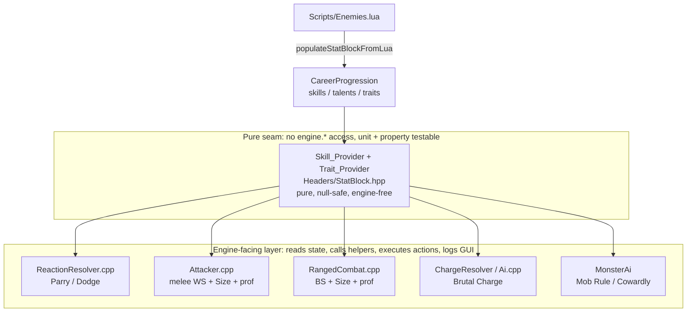

# Design Document

## Overview

This feature wires the stored-but-inert skill/talent/trait data on `CareerProgression` (parsed from `Scripts/Enemies.lua` by `populateStatBlockFromLua`) into the combat and AI pipeline. Today only two data points are live: the Dodge skill (`ReactionResolver::computeDodgeTarget` / `dodgeSucceeds`) and the melee Weapon Training talent (`WeaponTypes::proficiencyModifier`, consumed in `Attacker::resolveCharacterAttack`). Everything else the parser stores — Parry, Awareness, Brutal Charge, Sturdy, Size, Mob Rule, Cowardly, and ranged Weapon Training — has no gameplay effect.

The design extends the existing **Skill_Provider** pure-seam pattern (`Headers/StatBlock.hpp` / `Source/StatBlock.cpp`) with a set of new **Trait_Provider** free functions and combat/AI helpers. Every new helper is:

- **Pure** — deterministic; output depends only on its arguments.
- **Null-safe** — a `nullptr` actor or an actor with no `CareerProgression` reads as untrained / traitless and returns the helper's neutral value.
- **Engine-free** — zero `engine.*` access (`engine.gui`, `engine.map`, `engine.player`, …), so each helper is unit- and property-testable without initializing the `Engine` (per the test-isolation steering).

The engine-facing resolvers (`ReactionResolver.cpp`, `Attacker.cpp`, `RangedCombat.cpp`, `ChargeResolver`/`Ai.cpp`) and the `MonsterAi` layer remain the *only* code that reads live actor state, calls the helpers, and executes actions or emits GUI messages. This keeps the split mandated by the test-isolation steering: components compute, the game-loop layer performs side effects.

All game-rule defaults come from the Rogue Trader RPG rules and cite the `Reference/` file and section per the rt-mechanics-fallback steering.

### Scope Summary

| Area | Mechanic | Primary seam helper(s) | Integration point |
|---|---|---|---|
| 1 | Parry skill rank + weapon qualities | `parryBonus`, `parryQualityModifier`, `parryUnavailableFromQualities` | `ReactionResolver::resolveReaction` |
| 2 | Ranged Weapon Training penalty | `proficiencyModifier` (existing) | `RangedCombat::resolveCharacterAttack` |
| 3 | Awareness surprise test | `surpriseAvoidanceTarget`, `surpriseAvoided`, `SURPRISE_ATTACK_BONUS` | pure helper only (dependency A1) |
| 4 | Combat/AI traits | `hasTrait`, `brutalChargeBonus`, `isImmuneToKnockdown`, `getSizeCategory`, `sizeToHitModifier`, `decideMonsterAction` | `ChargeResolver`/`Ai.cpp`, `Attacker.cpp`, `RangedCombat.cpp`, `MonsterAi` |
| 5 | Data & compatibility | `hasTrait` exact match; no parser change | `populateStatBlockFromLua` (unchanged) |

### Flagged Dependencies

- **A1 — Surprise/initiative system does not exist.** This spec adds only the pure Awareness surprise helper and the `SURPRISE_ATTACK_BONUS` constant. It does **not** add a turn-order/initiative scheduler. Wiring the helper into a real surprise round is a follow-on dependency (Requirement 3.8).
- **A2 — Knockdown source is partial.** `StatusType::Prone` exists, but there is no dedicated "knockdown" event. This spec provides the pure `isImmuneToKnockdown` predicate ready for a future knockdown source to consult; it does not add a knockdown source (Requirement 6.5).
- **A3 — Size wound-threshold values undefined.** RT-Bestiary tabulates only the Size to-hit modifier, not wound-threshold numbers. This spec wires the to-hit modifier and treats the wound-threshold effect as requiring explicit user values before implementation (Requirement 7.7).
- **Mob Rule / Cowardly numeric values.** RT-Bestiary lists the trait names but no solo-combat numbers. The flee threshold, nearby-allies count, and radius are proposed below with rationale and require user confirmation before implementation (Requirement 8.6).

## Architecture

### The pure-seam pattern



The new helpers live alongside the existing Skill_Provider functions in `Headers/StatBlock.hpp` and `Source/StatBlock.cpp`. No new translation unit is strictly required for the pure helpers, but two new source files are introduced for cohesion (see Components) — and per the test-project steering, any new `.cpp` MUST be registered in **both** `40kRL.vcxproj` and `Tests/40kRL_Tests.vcxproj`.

### Where each mechanic plugs in

- **Parry** — `ReactionResolver::resolveReaction` currently offers Parry when `isMelee && hasEquippedMeleeWeapon(target)` and rolls against raw WS. The design replaces the raw-WS test with a clamped `WeaponSkill + parryBonus + parryQualityModifier`, adds an Unwieldy "cannot parry" gate, and routes success/fail through the existing `ReactionResult` values.
- **Ranged Weapon Training** — `RangedCombat::resolveCharacterAttack` computes `effectiveBS` without proficiency. The design adds `proficiencyModifier(shooter, group)` exactly as `Attacker::resolveCharacterAttack` already does for melee, closing the melee/ranged gap.
- **Awareness surprise** — new pure helper only; no call site yet (A1).
- **Brutal Charge** — the charge path in `MonsterAi::selectAndExecuteAction` (and the player `'C'` path in `PlayerAi::handleActionKey`) resolves a charge via `attacker->attack` with a temporary +20 WS modifier. Because `ChargeResolver::compute` only computes movement (not damage), the Brutal Charge damage bonus is threaded into the melee-damage path as a charge-only addend. See "Charge damage routing" below.
- **Sturdy** — pure `isImmuneToKnockdown` predicate; ready for a future knockdown source (A2).
- **Size** — `getSizeCategory(target)` + `sizeToHitModifier` added to effective-WS (Attacker) and effective-BS (RangedCombat) before the `[1, 99]` clamp.
- **Mob Rule / Cowardly** — a pure `decideMonsterAction` helper returns an intended action enum; `MonsterAi::selectAndExecuteAction` reads state, calls the helper, and executes.

### Charge damage routing (design decision)

`ChargeResolver::compute` is a movement/path validator and returns a `ChargeResult` with no damage field. The actual charge attack is resolved by `owner->attacker->attack(owner, engine.player)` in `Ai.cpp` after applying a temporary `+20` WS modifier. To satisfy Requirement 5 ("+3 on the charge path only, never on a standard melee attack") without polluting the standard melee path, the design adds an explicit **charge-damage flag** on the melee resolution:

- Add a transient `bool chargeBonusActive` (or an explicit `int bonusDamage` parameter) that the charge call site sets, and `Attacker::resolveCharacterAttack` reads to add `brutalChargeBonus(owner)` to the pre-floor `finalDamage`.
- The standard adjacent-attack path never sets the flag, so Requirement 5.4 holds by construction.
- The final-damage floor of `std::max(0, …)` (already present) satisfies Requirement 5.5.

This keeps the damage addition in the resolver (which already computes `finalDamage`) while making "is this a charge?" an explicit input rather than hidden global state, preserving purity of the `brutalChargeBonus` helper itself.

## Components and Interfaces

All new free functions extend the Skill_Provider seam and are declared in `Headers/StatBlock.hpp` (Trait_Provider + surprise helper) with combat-specific helpers grouped as noted. Signatures use `const Actor*` for null-safety and return by value.

### Trait_Provider (new, in `StatBlock.hpp` / `StatBlock.cpp`)

```cpp
// Size categories (RT-Bestiary, Size Categories table).
enum class SizeCategory : int {
    Puny = 0, Scrawny, Average, Hulking, Enormous, Massive
};

// Exact byte-for-byte match against CareerProgression::traits.
// Null-safe: nullptr / no career / empty traits -> false. (Req 8.1, 9.1)
bool hasTrait(const Actor* actor, const std::string& name);

// +3 if actor has "Brutal Charge", else 0 (incl. null / no career). (Req 5.1)
int brutalChargeBonus(const Actor* actor);

// true iff actor has "Sturdy"; side-effect-free, idempotent. (Req 6.1, 6.2)
bool isImmuneToKnockdown(const Actor* actor);

// Parses "Size (<Category>)" trait; unknown / missing / null -> Average. (Req 7.1, 7.2, 7.6)
SizeCategory getSizeCategory(const Actor* actor);

// Maps size category to its to-hit modifier. (Req 7.3)
int sizeToHitModifier(SizeCategory category);
```

`sizeToHitModifier` mapping (RT-Bestiary, Size Categories table): Puny -30, Scrawny -10, Average +0, Hulking +10, Enormous +20, Massive +30.

`getSizeCategory` scans `traits` for a string of the form `"Size (<Category>)"`, extracts the `<Category>` token, and matches it **case-sensitively** against the six names. Any string that is not present, not well-formed, or whose token is unrecognized resolves to `Average` (Req 7.2, 7.6), so unknown data never alters to-hit.

### Parry helpers (new, in `ReactionResolver.hpp` / `.cpp`, pure — no engine access)

```cpp
// Rank-based parry bonus: R*10 for R in {0,1,2} when Parry present,
// -20 (untrained) when absent. Null-safe -> caller supplies hasParry=false. (Req 1.1-1.3)
int parryBonus(int parryRank, bool hasParrySkill);

// Sum of +10 (Balanced) and -10 (Unbalanced) from the qualities list; else 0.
// Null-safe over an empty/absent list. (Req 2.1-2.3, 2.5)
int parryQualityModifier(const std::vector<std::string>& qualities);

// true iff qualities contains "Unwieldy" (Parry unavailable, precedence). (Req 2.4)
bool parryUnavailableFromQualities(const std::vector<std::string>& qualities);

// Final clamped parry target: clamp(WS + parryBonus + qualityMod, 0, 100). (Req 2.7, 1.4)
int computeParryTarget(int weaponSkill, int parryBonus, int qualityModifier);

// Success/fail with auto-1 / auto-100. (Req 1.5-1.7)
bool parrySucceeds(int roll, int parryTarget);
```

These mirror the existing `computeDodgeTarget` / `dodgeSucceeds` pair already in `ReactionResolver.cpp`, keeping Parry symmetric with Dodge.

### Surprise helper (new, in `StatBlock.hpp` / `.cpp`, pure — dependency A1)

```cpp
// RT-CoreMechanics §4 surprise bonus applied to a non-surprised attacker vs a
// surprised target. Exposed for a future surprise round. (Req 3.7)
inline constexpr int SURPRISE_ATTACK_BONUS = 30;

// clamp(Perception + awarenessModifier, 0, 100); awarenessModifier = R*10 when
// Awareness present, -20 when absent. Null-safe. (Req 3.1-3.4)
int surpriseAvoidanceTarget(int perception, int awarenessRank, bool hasAwareness);

// true = "not surprised", false = "surprised"; auto-1 not surprised, auto-100
// surprised. (Req 3.5, 3.6)
bool surpriseAvoided(int roll, int surpriseTarget);
```

### Monster AI decision helper (new, in `Ai.hpp` / a new `AiDecision.cpp`, pure — no engine access)

```cpp
enum class MonsterIntent : int { Approach, Attack, Flee };

// Inputs are plain values read by the Ai.cpp layer from live state, so the helper
// itself never touches engine.*. (Req 8.2-8.5, 10.1)
struct MonsterDecisionContext {
    bool  isCowardly       = false; // hasTrait(actor, "Cowardly")
    bool  hasMobRule       = false; // hasTrait(actor, "Mob Rule")
    int   currentWounds    = 0;
    int   maxWounds        = 0;
    int   nearbyAllies     = 0;     // allied actors within MOB_RULE_RADIUS
    bool  adjacentToPlayer = false;
};

MonsterIntent decideMonsterAction(const MonsterDecisionContext& ctx);
```

Decision logic:
- Mob Rule emboldenment: `emboldened = hasMobRule && nearbyAllies >= MOB_RULE_MIN_ALLIES` (Req 8.4).
- Flee: `isCowardly && !emboldened && currentWounds <= floor(maxWounds * COWARDLY_FLEE_FRACTION)` → `Flee` (Req 8.2).
- Otherwise the intent is `Attack` when `adjacentToPlayer`, else `Approach` — identical to a non-Cowardly actor (Req 8.3).

`MonsterAi::selectAndExecuteAction` computes `nearbyAllies` from `engine.actors`, builds the context, calls `decideMonsterAction`, and on `Flee` selects a move that increases distance from the player (a "move away" branch alongside the existing `moveToward`).

### Existing components consumed (unchanged interfaces)

- `Skill_Provider` (`getSkillRank`, `hasSkill`, `hasTalent`) — reused verbatim for Parry / Awareness / Weapon Training lookups (Req 9.2).
- `WeaponTypes::proficiencyModifier` / `hasProficiency` — reused for ranged proficiency (Req 4, model-based parity with melee).
- `ReactionResolver::hasEquippedMeleeWeapon` — reused for the "no melee weapon → no parry" gate (Req 2.6).
- `MeleeStats::qualities` (`Headers/Equippable.hpp`) — source of Balanced/Unbalanced/Unwieldy strings (Req 2).
- `populateStatBlockFromLua` (`Source/StatBlock.cpp`) — unchanged; stores skills/talents/traits into the same structures (Req 9.3).

## Data Models

### CareerProgression (unchanged storage, newly consumed)

```cpp
std::unordered_map<std::string, int> skills;   // "Parry"/"Awareness"/"Dodge" -> rank 0..2
std::unordered_set<std::string>      talents;   // "Weapon Training (<group>)"
std::vector<std::string>             traits;    // "Brutal Charge","Sturdy","Size (Hulking)","Mob Rule","Cowardly"
```

The serialized field set and order of `CareerProgression::save`/`load` are **not** changed (Req 10.3). No new persisted fields are added by this feature; all new behaviour reads existing data. Likewise `Attacker` (V3 sentinel: power + skillValue + modifiers) and `Equippable` save formats are untouched, so no MAJOR version bump is required (versioning steering; a MINOR bump is appropriate — new feature, saves compatible).

### Trait string vocabulary (A4 — accepted as-is)

Confirmed against `Scripts/Enemies.lua` / RT-Bestiary Ork and beast profiles: `"Brutal Charge"`, `"Sturdy"`, `"Mob Rule"`, `"Cowardly"`, and `"Size (<Category>)"` with categories `Puny | Scrawny | Average | Hulking | Enormous | Massive`. All helpers match these strings byte-for-byte (Req 9.1); no data migration is required (Req 9.3, 9.4).

### Proposed numeric constants (require user confirmation — Req 8.6)

| Constant | Proposed value | Rationale |
|---|---|---|
| `COWARDLY_FLEE_FRACTION` | 0.30 | Flee when wounds ≤ 30% of max — matches the roguelike "morale break at ~1/3 HP" convention; noticeable but not trivial. |
| `MOB_RULE_MIN_ALLIES` | 2 | Orks feel emboldened in a "mob"; 2+ nearby allies is a minimal but meaningful group. |
| `MOB_RULE_RADIUS` | 5 (Chebyshev tiles) | Roughly one screen-cluster; large enough to represent a mob, small enough that scattered allies don't count. |

These are flagged: RT-Bestiary lists Mob Rule/Cowardly by name only with no solo-combat numbers, so they must be confirmed by the user before implementation. The values above are the design's recommended defaults.

## Correctness Properties

*A property is a characteristic or behavior that should hold true across all valid executions of a system — essentially, a formal statement about what the system should do. Properties serve as the bridge between human-readable specifications and machine-verifiable correctness guarantees.*

The following properties are the consolidated result of the prework analysis (redundant per-criterion checks were merged). Each is universally quantified and maps to one property-based test (RapidCheck, ≥100 iterations). Note: this project's `rc::gen::inRange(a, b)` uses **inclusive** bounds `[a, b]`.

### Property 1: Parry bonus is correct across rank and presence

*For any* integer rank R and boolean `hasParrySkill`, `parryBonus(R, hasParrySkill)` returns `R * 10` when `hasParrySkill` is true (yielding +0/+10/+20 for R in {0,1,2}) and returns exactly `-20` when `hasParrySkill` is false, never applying both the rank bonus and the untrained penalty.

**Validates: Requirements 1.1, 1.2, 1.3**

### Property 2: Parry weapon-quality modifier and Balanced/Unbalanced symmetry

*For any* list of quality strings not containing "Unwieldy", `parryQualityModifier(qualities)` equals `10 * (count of "Balanced") - 10 * (count of "Unbalanced")`, and in particular a list containing both "Balanced" and "Unbalanced" (and nothing else that contributes) yields a net modifier of 0.

**Validates: Requirements 2.1, 2.2, 2.3, 2.5**

### Property 3: Unwieldy makes Parry unavailable with precedence

*For any* list of quality strings that contains "Unwieldy", `parryUnavailableFromQualities(qualities)` returns true regardless of any other qualities present (including "Balanced" and "Unbalanced"); for any list not containing "Unwieldy" it returns false.

**Validates: Requirements 2.4**

### Property 4: All computed target numbers and effective skills are clamped

*For any* weapon skill, parry bonus, quality modifier, perception, and awareness inputs, `computeParryTarget(...)` and `surpriseAvoidanceTarget(...)` lie in the inclusive range [0, 100]; and *for any* base skill, modifier sum, aim bonus, proficiency modifier, and size modifier, the effective WS (melee) and effective BS (ranged) lie in the inclusive range [1, 99].

**Validates: Requirements 1.4, 2.7, 3.4, 4.5, 7.4, 7.5, 10.6**

### Property 5: Parry monotonicity in skill rank (metamorphic)

*For any* fixed weapon skill and weapon-quality modifier, increasing the Parry skill rank never decreases the clamped Parry target number.

**Validates: Requirements 1.2, 1.4**

### Property 6: Parry / surprise roll resolution

*For any* roll in the inclusive range [2, 99] and any target, `parrySucceeds(roll, target)` is true iff `roll <= target`, and `surpriseAvoided(roll, target)` reports "not surprised" iff `roll <= target`; a roll of 1 is always a parry success / not surprised, and a roll of 100 is always a parry failure / surprised.

**Validates: Requirements 1.5, 1.6, 1.7, 3.5, 3.6**

### Property 7: Surprise-avoidance modifier is correct across rank and presence

*For any* perception value and integer rank R with boolean `hasAwareness`, the awareness modifier used by `surpriseAvoidanceTarget` is `R * 10` when `hasAwareness` is true and `-20` when false, never applying both, and the result is defined for an untrained/absent actor.

**Validates: Requirements 3.1, 3.2, 3.3**

### Property 8: Ranged/melee proficiency parity (model-based)

*For any* weapon group and talent state, the proficiency modifier applied to effective BS by the Ranged_Attack_Resolver equals the proficiency modifier applied to effective WS by the Melee_Attack_Resolver, and both equal `-20` when the matching `Weapon Training (<group>)` talent is absent and `0` when present.

**Validates: Requirements 4.1, 4.2, 4.3, 4.6**

### Property 9: Brutal Charge bonus and charge-only application

*For any* actor, `brutalChargeBonus(actor)` returns 3 when the actor's traits contain "Brutal Charge" and 0 in every other case (including null actor, no career, and traits without the entry); and the bonus is added only on the charge damage path so that a standard (non-charge) melee attack's final damage is identical to the same attack computed with a zero bonus.

**Validates: Requirements 5.1, 5.4**

### Property 10: Charge final damage is never negative

*For any* charge attack inputs (raw damage, armour, toughness, Brutal Charge state), the resolved charge final damage is greater than or equal to 0.

**Validates: Requirements 5.5**

### Property 11: Sturdy immunity predicate is correct, pure, and idempotent

*For any* actor, `isImmuneToKnockdown(actor)` returns true iff the actor's traits contain "Sturdy" and false otherwise (including null / no career); two consecutive calls on the same actor return the same result and neither call mutates the actor or its traits.

**Validates: Requirements 6.1, 6.2**

### Property 12: Size category parsing, default, and to-hit mapping

*For any* known size category C, an actor whose traits contain `"Size (C)"` resolves via `getSizeCategory` to C, and `sizeToHitModifier(C)` equals the RT-Bestiary value (Puny -30, Scrawny -10, Average +0, Hulking +10, Enormous +20, Massive +30); and *for any* actor with no Size trait, a null/careerless actor, or a Size string whose token is not an exact known category, `getSizeCategory` resolves to Average (+0).

**Validates: Requirements 7.1, 7.2, 7.3, 7.6**

### Property 13: hasTrait exact-match, null-safety across helpers

*For any* actor and trait name, `hasTrait(actor, name)` returns true iff `CareerProgression::traits` contains a byte-for-byte exact match for `name` and false otherwise (including null actor, no career, and empty traits); and for an actor with no `CareerProgression`, every new helper returns its neutral value (skill/talent/prof bonus 0, size Average, not immune to knockdown, Brutal Charge 0, no AI decision change).

**Validates: Requirements 8.1, 9.1, 10.5**

### Property 14: Monster AI decision — flee, embolden, and non-cowardly equivalence

*For any* `MonsterDecisionContext`: (a) when the actor is Cowardly, not emboldened by Mob Rule, and `currentWounds <= floor(maxWounds * COWARDLY_FLEE_FRACTION)`, `decideMonsterAction` returns `Flee`; (b) when the actor is emboldened (has Mob Rule and `nearbyAllies >= MOB_RULE_MIN_ALLIES`), it never returns `Flee`; and (c) when wounds are above the flee threshold, the returned intent equals the intent computed for an otherwise-identical non-Cowardly context (Attack if adjacent, else Approach).

**Validates: Requirements 8.2, 8.3, 8.4**

### Property 15: Serialization round-trip preserves component state

*For any* valid `CareerProgression`, `Attacker`, and `Equippable` instance, saving then loading the component reproduces a component with identical field values in the existing field set and order, so a save produced by the immediately preceding released version loads with identical state.

**Validates: Requirements 10.3, 10.4**

## Error Handling

All new helpers are total functions — they return a defined value for every input rather than throwing, consistent with the existing `computeDodgeTarget` / `proficiencyModifier` style.

- **Null / missing components** — `nullptr` actor or an actor with no `CareerProgression` is treated as untrained/traitless: skill and proficiency lookups return `SKILL_UNTRAINED` / neutral, `hasTrait` returns false, `getSizeCategory` returns `Average`, `brutalChargeBonus` returns 0, `isImmuneToKnockdown` returns false (Req 10.5). This reuses the existing null guards in `getSkillRank` / `hasSkill` / `hasTalent`.
- **Out-of-range numeric input** — any target number is clamped to [0, 100] and any effective WS/BS to [1, 99] via `std::clamp` before use; extreme or negative inputs cannot produce out-of-range output or exceptions and never touch `engine.*` (Req 10.6).
- **Malformed / unknown trait strings** — a Size string that does not exactly match `"Size (<KnownCategory>)"` resolves to `Average`; any trait name not in the wired set is mechanically inactive but does not prevent load/spawn (Req 7.6, 9.6).
- **Missing melee weapon** — Parry is made unavailable via the existing `hasEquippedMeleeWeapon` guard rather than erroring (Req 2.6).
- **Engine-facing side effects** — GUI messages, FOV checks, and actor mutation stay in `ReactionResolver.cpp` / `Attacker.cpp` / `RangedCombat.cpp` / `Ai.cpp`, guarded as today; the pure helpers emit none. This preserves test-binary safety (test-isolation steering).

### Flagged dependencies (no error path yet, documented)

- **A1 (surprise round)** — the surprise helper is provided but not wired; no scheduler is added (Req 3.8).
- **A2 (knockdown source)** — `isImmuneToKnockdown` is provided; if/when a knockdown source is added it MUST consult the predicate before applying (Req 6.3, 6.4, 6.5).
- **A3 (Size wound thresholds)** — not implemented; requires explicit user values before any wound-threshold change (Req 7.7).
- **Mob Rule / Cowardly numbers** — proposed defaults in Data Models require user confirmation before implementation (Req 8.6).

## Testing Strategy

Property-based testing **is** appropriate here: the six named helpers (parry bonus, weapon-quality modifier, surprise target, Brutal Charge bonus, Size modifier, AI decision) are pure functions with clear input/output behaviour and universal properties (mappings, clamps, symmetry, monotonicity, null-safety, round-trip). Per the tdd-workflow steering, tests are written first (expected to fail) and the developer then makes them pass.

### Dual approach

- **Unit tests (Catch2 v3)** — at least one example asserting a specific expected value for each of the six helpers (Req 10.2), plus example tests for resolver wiring that is not itself a pure helper: Parry success→`NEGATED` / fail→`FAILED` (1.8, 1.9), AI Dodge-selection when Parry unavailable and `NO_REACTION` when both unavailable (2.8, 2.9), no-weapon parry gate (2.6), size mod included in melee/ranged effective skill (7.4, 7.5), the `SURPRISE_ATTACK_BONUS == 30` constant (3.7), Lua parse regression (9.3, 9.4, 9.6), and `Scripts/Enemies.lua` load smoke (9.5).
- **Property tests (RapidCheck)** — one test per correctness property above, minimum **100 iterations** each. Generators must respect inclusive `rc::gen::inRange` bounds: use `inRange(0, MAX_SKILL_RANK)` for ranks, `inRange(2, 99)` for the normal-roll band, and `inRange(0, static_cast<int>(SizeCategory::Massive))` for size categories.

### Test tagging

Each property test carries a comment referencing its design property:

```
// Feature: npc-skills-talents-wiring, Property 12: Size category parsing, default, and to-hit mapping
```

### Test isolation and build wiring

- All helper tests run without initializing the `Engine` (no SDL/libtcod/Gui/Map). Helpers make zero `engine.*` calls, so the test binary links and runs safely (test-isolation steering).
- New source files (`AiDecision.cpp`, and any split-out helper `.cpp`) and their test files go in `Tests/` and MUST be registered in **both** `40kRL.vcxproj` and `Tests/40kRL_Tests.vcxproj` "Game source files" ItemGroup to avoid LNK2001 (test-project steering, Req 10.7).
- Build with the full MSBuild path (msbuild steering); run helper tests by tag, e.g. `.\x64\Debug\40kRL_Tests.exe "[npc-skills-talents-wiring]"`.

### Regression coverage

- Property 15 (serialization round-trip) and Property 8 (proficiency parity) plus explicit Dodge-value regression tests protect Requirements 10.3 and 10.4 (existing Dodge and melee proficiency behaviour unchanged for every input; save format and MINOR-only version bump preserved per versioning steering).
