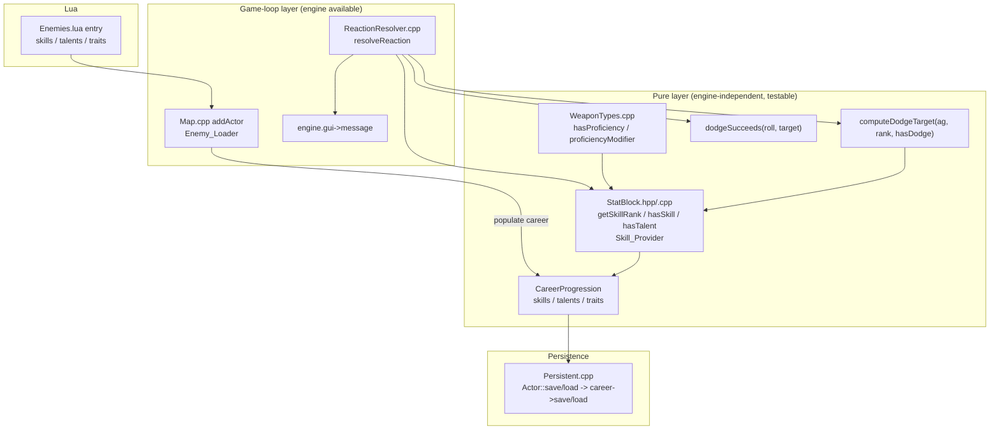

# Design Document

## Overview

This feature gives NPCs a full stat-block (characteristics + skills + talents + inert traits)
that shares one representation with the player, so combat resolution treats NPCs and the player
identically. It delivers three concrete outcomes:

1. **Dodge skill mechanic** — a d100 roll-under test against `Agility + Dodge-rank bonus`
   (or `Agility - 20` when untrained), resolved through one shared code path for player and NPC.
2. **NPC skills / talents / traits storage** parsed from optional sections in `Enemies.lua`,
   wiring the `Weapon Training (<Group>)` talent into the existing proficiency check so trained
   NPCs no longer eat the -20 penalty.
3. **Fixed-at-spawn invariant** — NPCs never earn XP or purchase advances.

### Key Design Decision (Requirement 6.3): Reuse `CareerProgression` for NPCs

NPCs reuse the **existing `CareerProgression` component** — attached to the NPC and populated
with skills/talents/traits from Lua — rather than introducing a new lightweight component. The
NPC's `career` is simply never advanced: `purchase`, `evaluateRankUp`, and XP awards are never
called on it.

Rationale:

- **Query sites need zero changes.** `hasProficiency` already reads `actor->career->talents`.
  Once NPCs carry a `career`, the proficiency check works uniformly with no branching by actor
  type.
- **Serialization is already implemented.** `CareerProgression::save`/`load` already serialize
  `skills`, `talents`, and `traits` (implemented in the charactersheet-tests feature), and
  `Actor::save`/`load` already write/read `career` behind a presence flag. NPC persistence
  therefore works with essentially no new serialization code.
- **The player already uses it.** A single representation for both actor types is exactly what
  Requirement 6 asks for.

The "fixed profile" invariant (Requirement 5) is preserved structurally: no code path calls
`purchase`/`evaluateRankUp` or mutates `xpPool`/`skills`/`talents` on an NPC. NPCs simply never
enter the advancement flow (which is driven by the player-only `CharacterSheet` / chargen UI).

### Skill_Provider abstraction

Combat code reads an actor's skills/talents through small **free helper functions** (the
Skill_Provider) rather than touching `actor->career` directly. These live in a new
`StatBlock.hpp` / `StatBlock.cpp`:

- `int getSkillRank(const Actor* actor, const std::string& skill)` — returns the rank from
  `actor->career->skills` if present, else `SKILL_UNTRAINED` sentinel.
- `bool hasSkill(const Actor* actor, const std::string& skill)` — presence test.
- `bool hasTalent(const Actor* actor, const std::string& talent)` — membership test on
  `actor->career->talents`.

Both player and NPC go through these helpers. They are pure with respect to the engine (no
`engine.*` access) and null-safe (an actor with no `career` reads as untrained / talentless),
which keeps them fully unit- and property-testable per the test-isolation rules.

### Dodge mechanic decomposition

The dodge computation is split into **pure functions** (engine-independent, testable) that
`resolveReaction` calls. The `engine.gui->message` logging stays in `resolveReaction` (the
game-loop layer where the engine is guaranteed initialized), fixing the current test-isolation
violation where the pure computation was inlined next to GUI calls.

## Architecture



Key architectural points:

- **Enemy_Loader** (`addActor`) reads the optional `skills`/`talents`/`traits` Lua tables and
  populates a `CareerProgression` attached to the NPC.
- **Skill_Provider** (`StatBlock`) is the single accessor layer over `actor->career`.
- **Dodge_Resolver** = `resolveReaction` + the pure `computeDodgeTarget` / `dodgeSucceeds`
  helpers; the effective-target formula has no per-actor-type branch.
- **Proficiency_Check** (`hasProficiency`) is refactored to read talents through the
  Skill_Provider so player and NPC share the accessor.
- **Persistence** reuses the already-implemented `CareerProgression` serialization behind the
  existing `Actor` presence flag.

## Components and Interfaces

### 1. StatBlock (new) — `Headers/StatBlock.hpp`, `Source/StatBlock.cpp`

The Skill_Provider: free functions that read an actor's stat-block uniformly for player and NPC.

```cpp
#pragma once
#include <string>

class Actor;

// Sentinel returned by getSkillRank when the actor lacks the skill (Untrained).
inline constexpr int SKILL_UNTRAINED = -1;

// Returns the actor's rank for the named skill, or SKILL_UNTRAINED if the actor
// has no career component or no entry for that skill. Null-safe (nullptr -> untrained).
int getSkillRank(const Actor* actor, const std::string& skill);

// Returns true iff the actor has a career component with an entry for the named skill.
bool hasSkill(const Actor* actor, const std::string& skill);

// Returns true iff the actor has a career component whose talent set contains `talent`.
// Null-safe (nullptr -> false).
bool hasTalent(const Actor* actor, const std::string& talent);
```

Implementation reads `actor->career->skills` / `actor->career->talents`. Because the player's
`career` is aliased into the `CharacterSheet` and NPCs get a plain `career`, both flow through
identically.

### 2. Dodge pure helpers (new) — declared in `Headers/ReactionResolver.hpp`

```cpp
// Computes the effective Dodge target number (before roll comparison).
//   hasDodgeSkill == true  -> clamp(agility + dodgeRank * 10, 0, 100)
//   hasDodgeSkill == false -> clamp(agility - 20,            0, 100)
// Pure and engine-independent. (Requirement 1.2, 1.3, 1.8)
int computeDodgeTarget(int agility, int dodgeRank, bool hasDodgeSkill);

// Resolves a d100 roll-under test against a Dodge target.
//   roll == 1   -> true  (auto-success)
//   roll == 100 -> false (auto-fail)
//   otherwise   -> roll <= dodgeTarget
// Pure and engine-independent. (Requirement 1.1, 1.6, 1.7)
bool dodgeSucceeds(int roll, int dodgeTarget);
```

### 3. ReactionResolver (modified) — `Source/ReactionResolver.cpp`

`resolveReaction` keeps its structure (availability check, reaction pick, budget use, roll) but
the DODGE branch is rewritten to use the pure helpers and the Skill_Provider:

```cpp
if (choice == ReactionChoice::DODGE) {
    int agility      = target->characteristics->get(CharId::Ag);
    bool hasDodge    = hasSkill(target, "Dodge");
    int dodgeRank    = hasDodge ? getSkillRank(target, "Dodge") : 0;
    int dodgeTarget  = computeDodgeTarget(agility, dodgeRank, hasDodge);

    if (dodgeSucceeds(roll, dodgeTarget)) {
        engine.gui->message(Colors::reactionEvent, "# dodges the attack!", target->name);
        return ReactionResult::NEGATED;
    }
    engine.gui->message(Colors::reactionEvent, "# fails to dodge.", target->name);
    return ReactionResult::FAILED;
}
```

- The formula lives entirely in `computeDodgeTarget`; there is **no branch on actor type**
  (Requirement 1.5), so identical Agility + Dodge rank yield identical thresholds for player and
  NPC.
- `getSkillRank` reads through the Skill_Provider (Requirement 1.4).
- The PARRY branch is unchanged (still WS-based roll-under), satisfying Requirement 1.9. Parry's
  auto-success/fail behaviour is out of scope this feature (deferred, see Roadmap).

Note: `dodgeRank` passed to `computeDodgeTarget` when untrained is irrelevant (the `hasDodgeSkill
== false` path ignores it), but we pass `0` for clarity.

### 4. WeaponTypes / Proficiency_Check (modified) — `Source/WeaponTypes.cpp`

`hasProficiency` is refactored to use the Skill_Provider so it reads talents through the same
accessor for player and NPC:

```cpp
bool hasProficiency(const Actor* actor, WeaponGroup group) {
    std::string talentStr = "Weapon Training (" + std::string(weaponGroupName(group)) + ")";
    return hasTalent(actor, talentStr);   // null-safe; reads actor->career->talents
}
```

Behaviour is identical to today for the player and for NPCs-without-training (returns false ->
-20), but now an NPC whose parsed `talents` set contains the matching string returns 0
(Requirement 4.1, 4.4). `proficiencyModifier` is unchanged.

### 5. Enemy_Loader (modified) — `Source/Map.cpp` `addActor`

After the `Characteristics` component is attached, parse the three optional tables and populate a
`CareerProgression` on the NPC:

```cpp
// ── Parse optional skills / talents / traits into a CareerProgression ──
sol::optional<sol::table> skillsTbl  = entry["skills"];
sol::optional<sol::table> talentsTbl = entry["talents"];
sol::optional<sol::table> traitsTbl  = entry["traits"];

if (skillsTbl || talentsTbl || traitsTbl) {
    auto career = std::make_shared<CareerProgression>();

    if (skillsTbl) {
        for (auto& kv : *skillsTbl) {
            std::string skillName = kv.first.as<std::string>();
            int rank = kv.second.as<int>();
            if (rank < 0) rank = 0;                 // Requirement 3.5: clamp negative to 0
            if (rank > MAX_SKILL_RANK) rank = MAX_SKILL_RANK; // cap high ranks at 2
            career->skills[skillName] = rank;
        }
    }
    if (talentsTbl) {
        for (size_t i = 1; i <= talentsTbl->size(); ++i) {
            sol::optional<std::string> t = (*talentsTbl)[i];
            if (t) career->talents.insert(*t);
        }
    }
    if (traitsTbl) {
        for (size_t i = 1; i <= traitsTbl->size(); ++i) {
            sol::optional<std::string> tr = (*traitsTbl)[i];
            if (tr) career->traits.push_back(*tr);
        }
    }
    monster->career = career;
}
```

- Absent sections leave the NPC with **no career** (equivalent to empty skill map / talent set /
  trait list through the Skill_Provider), satisfying Requirements 3.3, 3.4, 3.7 and the
  backward-compatible-spawn requirement 3.9. Existing entries (Gretchin, Ork, etc.) spawn
  unchanged.
- **Clamp rule (documented, resolving the requirements' apparent conflict):** a parsed rank is
  clamped to the inclusive range `[0, 2]` — negatives become `0` (explicit Requirement 3.5),
  and values above `2` are capped at `2` to match the `CareerProgression::skills` rank
  convention (0 = Trained, 1 = +10, 2 = +20). `MAX_SKILL_RANK = 2`.
- Talent strings are stored verbatim; designers must use the exact `Weapon Training (<Group>)`
  format (Requirement 3.8) so they match what `hasProficiency` constructs. No translation layer.

### 6. Persistence (verified, minimal/no change) — `Source/Persistent.cpp`

Investigation of `Actor::save`/`Actor::load` confirms the career round-trip already exists:

- `save` writes `zip.putInt(career != nullptr); if (career) career->save(zip);`
- `load` reads the flag and, when set, constructs a `CareerProgression` and calls `load`.

For the **player**, a following `CharacterSheet` presence flag causes `career` to be re-aliased
into the sheet; NPCs have no `CharacterSheet`, so their standalone `career` (built by the
Enemy_Loader) is saved and restored directly. `CareerProgression::save`/`load` already serialize
`skills`, `talents`, and `traits` as count-then-elements.

Therefore NPC skill/talent/trait persistence (Requirement 7) works with **no new serialization
code**. Pre-feature saves have NPCs with no career flag (reads `0` at archive end -> no career ->
untrained/empty), satisfying the backward-compat load requirement 7.4.

The design records one guard to verify during implementation: NPCs must not accidentally receive
a `CharacterSheet` (they never do today), so the load re-aliasing path stays player-only.

## Data Models

### CareerProgression (existing, reused for NPCs)

```cpp
class CareerProgression : public Persistent {
    std::string homeworldName;   // empty for NPCs
    std::string careerName;      // empty for NPCs
    int currentRank = 1;         // stays 1 for NPCs
    int xpPool = 0;              // stays 0 for NPCs (never awarded)
    int spentXp = 0;             // stays 0 for NPCs (never spent)
    std::unordered_map<std::string, int> skills;   // skill name -> rank {0,1,2}
    std::unordered_set<std::string>      talents;  // e.g. "Weapon Training (Primitive)"
    std::vector<std::string>             traits;   // inert this feature
    // ... purchase / evaluateRankUp NEVER called for NPCs ...
};
```

For NPCs, only `skills`, `talents`, and `traits` carry meaningful data; the XP/rank fields remain
at their defaults and are never mutated.

### Skill_Rank convention

| Rank | Meaning | Dodge bonus |
|------|---------|-------------|
| absent | Untrained | Agility - 20 |
| 0 | Trained | +0 |
| 1 | +10 | +10 |
| 2 | +20 | +20 |

`getSkillRank` returns `SKILL_UNTRAINED (-1)` when the skill is absent; callers that need the
"untrained vs rank" distinction pair it with `hasSkill`.

### Enemies.lua schema (extended, backward compatible)

```lua
{
    chance = 75, glyph = string.byte("o"), name = "Ork", color = "desaturatedGreen",
    hp = 20.0, defense = 0.0, corpse = "dead Ork", xp = 35, power = 3.0, skill = 35,
    ws = 35, bs = 20, s = 40, t = 40, ag = 25, int = 15, per = 25, wp = 25, fel = 15,

    -- NEW optional sections (all omittable):
    skills  = { Dodge = 1, Awareness = 0 },        -- name -> integer rank (clamped to [0,2])
    talents = { "Weapon Training (Primitive)" },   -- exact Weapon Training (<Group>) format
    traits  = { "Sturdy", "Brutal Charge" },       -- recorded but mechanically inert
}
```

`<Group>` values: `Las, SP, Bolt, Melta, Plasma, Flame, Primitive, Launcher, Exotic`
(the `weaponGroupName` values from `WeaponTypes.cpp`).

## Correctness Properties

*A property is a characteristic or behavior that should hold true across all valid executions of
a system — essentially, a formal statement about what the system should do. Properties serve as
the bridge between human-readable specifications and machine-verifiable correctness guarantees.*

These properties inform property-based tests in the `Tests/` project using Catch2 v3 + RapidCheck
(minimum 100 iterations), tagged `[npc-stat-blocks]`. RapidCheck `inRange(a, b)` is INCLUSIVE;
index generators must use `inRange(0, N - 1)`. Dodge and Skill_Provider properties must run
without initializing the global Engine (no `engine.gui`, no `engine.map`), per the test-isolation
rules — this is why `computeDodgeTarget`, `dodgeSucceeds`, and the Skill_Provider accessors are
pure and null-safe.

### Property 1: Dodge target formula

*For any* Agility `A` in `[1, 99]` and any Dodge Skill_Rank `R` in `{0, 1, 2}`,
`computeDodgeTarget(A, R, true) == clamp(A + R * 10, 0, 100)`, and for any `A` in `[1, 99]`,
`computeDodgeTarget(A, R, false) == clamp(A - 20, 0, 100)`; the result is always within
`[0, 100]`. The value is computed identically regardless of actor type.

**Validates: Requirements 1.2, 1.3, 1.8**

### Property 2: Dodge monotonicity

*For any* fixed Agility `A` in `[1, 99]` and any fixed roll, increasing the Dodge Skill_Rank
(from `R1` to `R2 >= R1`, skilled) never decreases the effective target number and therefore
never turns a succeeding roll into a failing one.

**Validates: Requirements 1.2**

### Property 3: Roll-under with auto-success and auto-fail

*For any* effective Dodge target `T` in `[0, 100]`, `dodgeSucceeds(1, T) == true` (auto-success),
`dodgeSucceeds(100, T) == false` (auto-fail), and for any roll `r` in `[2, 99]`,
`dodgeSucceeds(r, T) == (r <= T)`.

**Validates: Requirements 1.1, 1.6, 1.7**

### Property 4: Player/NPC dodge equivalence

*For any* Agility `A` in `[1, 99]`, Dodge Skill_Rank `R` in `{0, 1, 2}` (or untrained), and roll,
a Player-shaped Actor and an NPC-shaped Actor configured with the same Agility and the same Dodge
skill state produce the same effective target number and the same Dodge success outcome.

**Validates: Requirements 1.4, 1.5, 6.1**

### Property 5: Skill_Provider accessor semantics

*For any* skill mapping and talent set on an Actor's stat-block, `getSkillRank` returns the stored
rank for present skill names and `SKILL_UNTRAINED` for absent names; `hasSkill` is true iff the
name is present; `hasTalent` is true iff the talent string is a member; and an Actor with no
career reads as untrained with no talents. These results are identical for Player-shaped and
NPC-shaped Actors holding the same data.

**Validates: Requirements 2.1, 2.2, 2.3, 2.4, 2.5**

### Property 6: Proficiency equivalence

*For any* `WeaponGroup` and any talent set, `proficiencyModifier(actor, group) == 0` iff the
talent set contains the exact string `"Weapon Training (" + weaponGroupName(group) + ")"`, and
`-20` otherwise; this holds identically for Player-shaped and NPC-shaped Actors.

**Validates: Requirements 3.8, 4.1, 4.2, 4.3, 4.4**

### Property 7: Lua parse round-trip with clamp

*For any* generated `skills` mapping (integer ranks, possibly negative or above 2), `talents`
list, and `traits` list emitted as an `Enemies.lua` entry and parsed by the Enemy_Loader, the
spawned NPC's skill mapping equals the declared mapping with each rank clamped to `[0, 2]`, the
talent set equals the declared talents, and the trait list equals the declared traits in order.

**Validates: Requirements 3.1, 3.2, 3.5, 3.6**

### Property 8: Backward-compatible spawn

*For any* enemy entry that omits `skills`, `talents`, and `traits`, spawning succeeds without
error and the resulting NPC reads as having an empty skill mapping, empty talent set, and empty
trait list through the Skill_Provider.

**Validates: Requirements 2.7, 3.3, 3.4, 3.7, 3.9**

### Property 9: Skills/talents/traits serialization round-trip

*For any* generated `CareerProgression` (skill mapping, talent set, trait list), saving to a
`TCODZip` archive and loading it back yields an equivalent skill mapping, an equivalent talent
set, and an equivalent trait list (order preserved for traits).

**Validates: Requirements 7.1, 7.2, 7.3**

### Property 10: Traits round-trip and inertness

*For any* generated trait list, saving then loading yields an equivalent trait list, and
resolving any combat sequence produces the same outcomes whether or not the traits are present
(traits are mechanically inert this feature).

**Validates: Requirements 2.6, 8.1, 8.2**

### Property 11: Fixed-profile invariant

*For any* sequence of attacks resolved against or by an NPC, the NPC's base characteristics,
skill mapping, talent set, and trait list — and its `xpPool`/`spentXp` — remain unchanged
(ignoring temporary status-effect or injury modifiers already defined by other systems).

**Validates: Requirements 5.1, 5.2, 5.3, 6.2**

## Error Handling

- **Missing optional Lua sections:** `skills`/`talents`/`traits` are all optional. When all
  three are absent, no `career` is attached and the Skill_Provider reports untrained/empty. No
  warning is emitted (this is the common, valid case for legacy entries).
- **Malformed skill rank values:** A non-integer or out-of-range rank is coerced/clamped:
  negatives → `0`, values above `2` → `2`. Parsing continues; the NPC still spawns.
- **Non-string talent/trait entries:** `sol::optional<std::string>` guards each list element;
  entries that fail to convert are skipped rather than aborting the spawn.
- **Empty talent/trait strings:** Stored as-is (an empty string never matches a
  `Weapon Training (<Group>)` lookup, so it is harmless). Consistent with
  `CareerProgression::load`'s null-guard behaviour.
- **Actors without a `career` component:** All Skill_Provider helpers are null-safe. A `nullptr`
  actor or an actor with no `career` yields untrained ranks and no talents rather than
  dereferencing.
- **Dodge with a null `characteristics`:** `resolveReaction` already returns `NO_REACTION` when
  `target->characteristics` is null, so `computeDodgeTarget` is only ever called with a valid
  Agility read.
- **Pre-feature save compatibility:** Old saves have NPCs whose career presence flag reads `0`
  (or is absent at archive end → `0`), producing NPCs with no career and therefore empty stat
  blocks. No migration step is required.
- **Engine isolation:** No pure helper touches `engine.*`. GUI logging in `resolveReaction`
  remains at the game-loop layer where the engine is initialized.

## Testing Strategy

This feature IS suitable for property-based testing: the dodge formula, the Skill_Provider
accessors, the proficiency check, the Lua parse, and the serialization round-trip are all pure
(or purely data-driven) with universal properties over large input spaces. PBT is used for those;
example/integration tests cover the specific non-universal cases.

### Dual approach

- **Property tests (RapidCheck, min 100 iterations)** for the 11 correctness properties above.
- **Unit / example tests (Catch2 v3)** for specific cases and the non-property criteria:
  - Parry path unchanged (Requirement 1.9) — a WS-based roll-under example for player and NPC.
  - A representative `Weapon Training (Primitive)` NPC is proficient with the Primitive group
    (Requirement 3.8 authoring convention).
  - Pre-feature save loads an NPC with empty stat block (Requirement 7.4).

### Property test configuration

- Library: **RapidCheck** (already used in the project). Do NOT hand-roll property testing.
- Each property test runs a minimum of **100 iterations** via `rc::check`.
- Each test is tagged `[npc-stat-blocks]` and annotated with a comment in the format:
  `// Feature: npc-stat-blocks, Property {number}: {property_text}`
- Each correctness property maps to a **single** property-based test.
- Index/enum generators use inclusive `inRange(0, N - 1)` and
  `inRange(0, static_cast<int>(WeaponGroup::EXOTIC))` for weapon groups.

### Test isolation & harnesses

- Dodge (`computeDodgeTarget`, `dodgeSucceeds`), Skill_Provider (`getSkillRank`, `hasSkill`,
  `hasTalent`), and proficiency (`hasProficiency`, `proficiencyModifier`) tests construct
  `Actor` + `CareerProgression` directly and never initialize the global `Engine`.
- **Lua parse tests (Property 7, 8)** need a small harness that runs the `addActor` parsing
  logic. To keep this engine-free, the parsing of the three tables into a `CareerProgression`
  should be factored into a testable free function (e.g.
  `void populateStatBlockFromLua(CareerProgression&, const sol::table& entry)` in `StatBlock`),
  which the test drives with an in-memory `sol::state`. `Map.cpp addActor` calls this helper.
  This avoids exercising monster placement / equipment resolution (which touch `engine`).
- **Serialization tests (Property 9, 10)** use an in-memory `TCODZip` save/load round-trip on a
  `CareerProgression`, independent of `Actor` and `Engine`.
- **Fixed-profile / inertness tests (Property 10, 11)** drive the attack/reaction pipeline with
  injected `rollD100` (as `resolveReaction` already supports) and assert stat-block equality
  before/after, guarding any `engine.gui` calls per test-isolation rules (or asserting only on
  the pure stat-block state that does not require GUI).

### Project wiring

- New source file `Source/StatBlock.cpp` must be added to **both** `40kRL.vcxproj` and
  `Tests/40kRL_Tests.vcxproj` (Game source files ItemGroup), per the test-project rule.
- New test file (e.g. `Tests/test_npc_stat_blocks.cpp`) added to `Tests/40kRL_Tests.vcxproj`.
- Tests follow the TDD workflow: written to fail first, then the implementation makes them pass.

## Roadmap — Deferred Mechanics (Requirement 8.3)

The following are stored on NPC/player stat-blocks but remain **mechanically inert** this feature,
recorded for future work:

- **All non-Dodge skills** (e.g. `Awareness`, `Perception`-based tests) — stored, not yet wired
  into any test resolution.
- **All talents except `Weapon Training (<Group>)`** — stored in the talent set but apply no
  combat effect.
- **All traits** (e.g. `Sturdy`, `Brutal Charge`) — recorded in the trait list, mirroring the
  player's inert traits vector; no combat effect.
- **Parry skill-rank bonus** — Parry retains its current Weapon-Skill-based roll-under behaviour;
  a Parry skill bonus (analogous to the Dodge bonus) is explicitly deferred. When implemented, it
  will reuse the same Skill_Provider + pure-helper pattern established here for Dodge.
