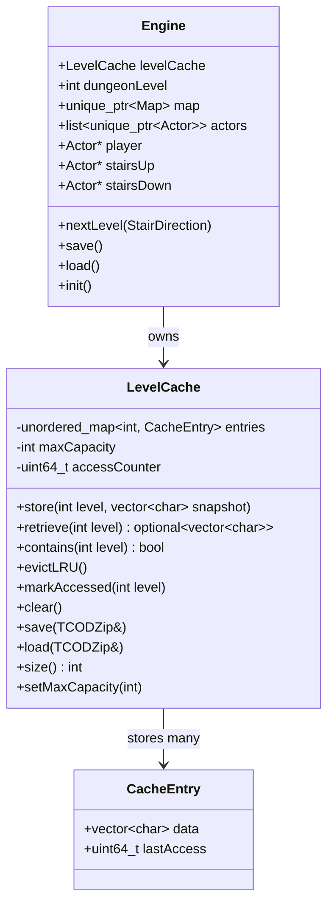
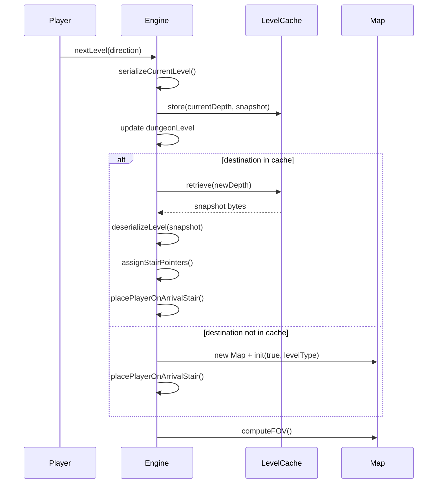

# Design Document: Persistent Levels

## Overview

This design introduces a **LevelCache** that stores serialized level snapshots keyed by dungeon depth. When the player transitions via stairs, the departing level is serialized into a binary blob and cached. On return, the blob is deserialized to restore the level exactly as left. The cache is persisted in the save file and bounded by an LRU eviction policy configured via `Config.lua`.

The approach preserves the existing `TCODZip`-based serialization infrastructure. Snapshots are stored as raw byte vectors (`std::vector<char>`) rather than live objects, keeping memory predictable and avoiding dangling pointer issues.

### Key Design Decisions

1. **Binary blobs over live objects** — Snapshots are `TCODZip` archives saved to memory buffers. This avoids holding multiple `TCODMap` instances (which own GPU/FOV resources) and simplifies lifetime management.
2. **LRU eviction** — A bounded cache prevents unbounded memory growth during deep runs. The default of 30 levels covers a full dungeon (21 levels) with headroom.
3. **Sentinel-based format versioning** — A unique sentinel value after `dungeonLevel` in the save file signals the presence of cache data, maintaining backward compatibility with old saves.
4. **Existing save/load patterns reused** — Actors and Map already have `save(TCODZip&)` / `load(TCODZip&)`. The cache simply wraps these in a per-level archive.

## Architecture



### Data Flow: Stair Transition



## Components and Interfaces

### LevelCache Class

**Header: `Headers/LevelCache.h`**

```cpp
#pragma once
#include <cstdint>
#include <optional>
#include <unordered_map>
#include <vector>

class TCODZip;

// Stores serialized level snapshots with LRU eviction.
class LevelCache {
public:
    explicit LevelCache(int maxCapacity = 30);

    // Store a snapshot for the given dungeon level. Evicts LRU if at capacity.
    void store(int level, std::vector<char> snapshot);

    // Retrieve a snapshot if cached. Marks as most-recently-accessed.
    std::optional<std::vector<char>> retrieve(int level);

    // Check if a level is cached without affecting access order.
    bool contains(int level) const;

    // Remove all entries.
    void clear();

    // Persist cache to/from save file.
    void save(TCODZip& zip) const;
    void load(TCODZip& zip);

    // Number of cached entries.
    int size() const;

    // Update max capacity (clamped to [2, 200]).
    void setMaxCapacity(int cap);
    int getMaxCapacity() const;

private:
    struct CacheEntry {
        std::vector<char> data;
        uint64_t lastAccess = 0;
    };

    std::unordered_map<int, CacheEntry> entries;
    int maxCapacity;
    uint64_t accessCounter = 0;

    void evictLRU();
};
```

### Engine Integration Points

**Modified methods:**

1. **`Engine::nextLevel(StairDirection)`** — Restructured into three phases:
   - **Phase 1: Serialize departing level** — Serialize current map + non-player actors into a `TCODZip` buffer, store in `levelCache`.
   - **Phase 2: Transition** — Update `dungeonLevel`, clear `actors` (except player), reset stair pointers.
   - **Phase 3: Load or generate destination** — Check `levelCache.contains(newDepth)`. If hit: deserialize. If miss: generate fresh.

2. **`Engine::save()`** — After writing `dungeonLevel`, write the level-cache sentinel, then delegate to `levelCache.save(zip)`.

3. **`Engine::load()`** — After reading `dungeonLevel`, check for sentinel. If present, call `levelCache.load(zip)`. If absent, initialize empty cache (old save compatibility).

4. **`Engine::init()`** — Read `maxCachedLevels` from `Config.lua`, construct `levelCache` with that capacity.

5. **`Engine::term()`** — Call `levelCache.clear()`.

**New helper methods on Engine:**

```cpp
// Serialize current map + non-player actors into a byte buffer.
std::vector<char> serializeCurrentLevel() const;

// Deserialize a byte buffer into the active map + actors.
// Assigns stairsUp/stairsDown pointers, orders dead actors behind living.
void deserializeLevel(const std::vector<char>& snapshot);
```

### Config.lua Integration

Add to `Scripts/Config.lua`:

```lua
config = {
    -- ... existing fields ...

    -- Maximum number of previously-visited levels kept in memory.
    -- Minimum: 2, Maximum: 200, Default: 30.
    maxCachedLevels = 30,
}
```

Read during `Engine::init()` alongside existing config loading:

```cpp
int maxCached = 30;
maxCached = config.get_or("maxCachedLevels", maxCached);
if (maxCached < 2 || maxCached > 200) {
    maxCached = std::clamp(maxCached, 2, 200);
    gui->message(Colors::damage, "Warning: maxCachedLevels clamped to %d.", maxCached);
}
levelCache.setMaxCapacity(maxCached);
```

## Data Models

### Level Snapshot Format (TCODZip in-memory archive)

Each snapshot is a self-contained TCODZip archive stored as `std::vector<char>`:

```
┌─────────────────────────────────────────┐
│ Map Section                             │
│   SAVE_VERSION_SENTINEL (0x4F444F52)    │
│   levelType (int)                       │
│   seed (int)                            │
│   tiles[width*height]: explored, scent  │
│   currentScentValue (int)               │
│   terrainTypes[width*height] (outdoor)  │
│   width (int)                           │
│   height (int)                          │
├─────────────────────────────────────────┤
│ Actor Count (int)                       │
├─────────────────────────────────────────┤
│ Actor[0]: full save() output            │
│ Actor[1]: full save() output            │
│ ...                                     │
│ Actor[N-1]: full save() output          │
└─────────────────────────────────────────┘
```

**Note on Map serialization extension:** The existing `Map::save()` writes sentinel + levelType + seed + tiles + currentScentValue. For outdoor levels, terrain types must also be persisted to avoid re-running Perlin noise (which the seed alone reproduces, but terrain classification thresholds could differ). We add:
- After `currentScentValue`: write `terrainTypes` array (one byte per tile) for OUTDOOR levels only.
- Write `width` and `height` so the snapshot is self-describing.

### Save File Format (Extended)

```
┌─────────────────────────────────────────┐
│ Existing Save Format                    │
│   mapWidth, mapHeight                   │
│   Map::save()                           │
│   Camera::save()                        │
│   Player::save()                        │
│   Equipment presence + data             │
│   StairsUp presence + data              │
│   StairsDown presence + data            │
│   Actor count + Actor::save() × N       │
│   Gui::save()                           │
│   dungeonLevel (int)                    │
├─────────────────────────────────────────┤
│ NEW: Level Cache Sentinel (0x4C564C43)  │
│ NEW: Level Cache entry count (int)      │
│ NEW: For each entry:                    │
│   dungeon level number (int)            │
│   snapshot byte count (int)             │
│   snapshot bytes (char[])               │
└─────────────────────────────────────────┘
```

**Sentinel value:** `0x4C564C43` (ASCII "LVLC"). Chosen to avoid collision with any valid `dungeonLevel` value (0–20) or actor count.

### LRU Eviction Mechanism

The `LevelCache` uses a monotonically increasing `accessCounter` (uint64_t) to track recency:

1. **On `store(level, snapshot)`:** Increment `accessCounter`, assign to new entry's `lastAccess`. If `entries.size() >= maxCapacity`, call `evictLRU()` first.
2. **On `retrieve(level)`:** Increment `accessCounter`, update entry's `lastAccess`. Return snapshot data.
3. **`evictLRU()`:** Linear scan of `entries` to find minimum `lastAccess`. Erase that entry.

With max 200 entries and transitions happening at human-input speed, the linear scan is negligible.

## Correctness Properties

*A property is a characteristic or behavior that should hold true across all valid executions of a system — essentially, a formal statement about what the system should do. Properties serve as the bridge between human-readable specifications and machine-verifiable correctness guarantees.*

### Property 1: Map Serialization Round-Trip

*For any* valid Map state (with arbitrary seed, level type, explored flags, scent values, terrain types, and currentScentValue), serializing the Map into a snapshot and then deserializing it should produce a Map with identical seed, levelType, tile explored flags, tile scent values, terrain types (for outdoor), and currentScentValue.

**Validates: Requirements 1.2, 2.2**

### Property 2: Actor Serialization Round-Trip

*For any* valid Actor with arbitrary component combinations (Attacker, Destructible, Ai, Pickable, Container, Equippable — including dead actors with hp ≤ 0 and corpseName set), serializing and then deserializing the Actor should produce an Actor with identical position, glyph, color, name, blocks, fovOnly, description, and all component field values.

**Validates: Requirements 1.3, 2.3, 6.1, 6.2, 6.3, 6.4, 7.1**

### Property 3: Cache Store and Retrieve

*For any* dungeon level number and any snapshot data, after calling `store(level, snapshot)`, calling `retrieve(level)` should return data identical to the stored snapshot. Storing a second snapshot for the same level should make only the second snapshot retrievable.

**Validates: Requirements 1.4, 1.5**

### Property 4: Level Cache Save-File Round-Trip

*For any* set of cached level snapshots (0 to maxCapacity entries, with arbitrary level numbers and snapshot data), saving the LevelCache to a TCODZip archive and then loading from that archive should produce a LevelCache with identical entries (same level keys, same snapshot data, same entry count).

**Validates: Requirements 4.1, 4.2, 4.3**

### Property 5: LRU Eviction Correctness

*For any* sequence of `store` and `retrieve` operations on a LevelCache at capacity, when a new entry must be stored, the evicted entry should always be the one whose most recent access (store or retrieve) occurred earliest in the operation sequence.

**Validates: Requirements 5.4, 5.5**

### Property 6: Player Exclusion from Snapshots

*For any* actor list that includes the player, calling `serializeCurrentLevel()` should produce a snapshot that, when deserialized, contains exactly `actors.size() - 1` actors (all non-player actors), and none of the deserialized actors is the player.

**Validates: Requirements 6.5**

### Property 7: Dead-Behind-Living Render Order

*For any* deserialized actor list containing both dead actors (hp ≤ 0) and living actors, all dead actors should appear before (i.e., earlier in the list than) all living actors, ensuring living actors render on top.

**Validates: Requirements 6.6**

### Property 8: Stair Pointer Assignment After Restoration

*For any* deserialized actor list containing actors with glyph '<' and/or '>', after `deserializeLevel()` completes, `stairsUp` should point to the actor with glyph '<' (or be nullptr if none exists) and `stairsDown` should point to the actor with glyph '>' (or be nullptr if none exists).

**Validates: Requirements 7.2, 7.3, 7.4**

### Property 9: Player Placement at Arrival Stair

*For any* stair transition with direction D and a destination level containing stairs, the player's position after restoration should equal: the stairs-up position when D is DOWN, or the stairs-down position when D is UP.

**Validates: Requirements 2.4, 3.3**

### Property 10: FOV Recompute Preserves Explored Flags

*For any* set of previously-explored tiles on a restored map, after calling `computeFOV()`, all tiles that were marked explored before the call remain explored. Tiles newly in FOV are additionally marked explored.

**Validates: Requirements 2.5**

### Property 11: Stair Creation Bounds Invariant

*For any* dungeon level in [0, 20], after fresh level generation: stairsUp is non-null if and only if level > 0, and stairsDown is non-null if and only if level < 20.

**Validates: Requirements 3.4**

### Property 12: Config Clamping for maxCachedLevels

*For any* integer value read from Config.lua's `maxCachedLevels` field, the effective capacity used by LevelCache should be `std::clamp(value, 2, 200)`.

**Validates: Requirements 5.2, 5.3**

## Error Handling

### Deserialization Failures

- **Corrupted snapshot in save file:** When `LevelCache::load()` encounters a snapshot that fails to deserialize (byte count mismatch, negative entry count), it logs a GUI warning identifying the dungeon level, discards that entry, and continues loading remaining entries. The discarded level is treated as unvisited.

- **Missing expected stair in restored level:** If the restored actor list lacks the expected arrival stair (e.g., depth 5 has no '<' actor), the engine checks for corruption. If *any* expected stair for that depth is missing (depth > 0 needs '<', depth < 20 needs '>'), the snapshot is discarded and a fresh level is generated instead (Requirement 7.5).

- **Fallback player placement:** If the arrival stair is absent but the level is otherwise valid (edge case where only the arrival stair is missing but the other stair exists), player is placed at the first stair found, or at (1,1) if no stairs exist. A warning is logged to the GUI (Requirement 2.6).

### Config Errors

- **Invalid maxCachedLevels:** Values outside [2, 200] are clamped silently with a GUI warning. Non-integer or missing values use the default of 30.

- **Config.lua load failure:** If `Config.lua` cannot be read (file missing, Lua parse error), the default capacity of 30 is used. No crash.

### Save File Compatibility

- **Old save without sentinel:** After reading `dungeonLevel`, if the next int is not `0x4C564C43`, the load code treats the save as pre-cache format: initializes an empty `LevelCache` and does not attempt to read further cache data. The game continues normally with the active level loaded.

- **Dead player:** `Engine::save()` deletes the save file and clears the level cache from memory. No partial writes.

### Memory Pressure

- **Snapshot size estimation:** A typical level snapshot is approximately:
  - Map: 4 + 4 + 4 + (160×86×2×4) + 4 ≈ 110 KB for tiles
  - Actors: ~50 actors × ~200 bytes = ~10 KB
  - Total: ~120 KB per level
  - 30 levels ≈ 3.6 MB — well within acceptable limits.
- **LRU eviction guarantees bounded memory** regardless of how many levels the player visits.

## Testing Strategy

### Property-Based Tests (Catch2 + rapidcheck)

The project uses Catch2 v3 for testing. Property-based tests will use **rapidcheck** (a C++ property-based testing library compatible with Catch2). Each property test runs a minimum of **100 iterations** with randomly generated inputs.

**Library:** rapidcheck (header-only, added to `Tests/lib/`)
**Configuration:** Default 100 iterations per property, increased for critical round-trip properties.

Each property test is tagged with a comment referencing the design property:
```
// Feature: persistent-levels, Property 1: Map Serialization Round-Trip
```

**Properties to implement:**

| # | Property | Generator Strategy |
|---|----------|--------------------|
| 1 | Map round-trip | Random seed, level type, explored/scent arrays, terrain types |
| 2 | Actor round-trip | Random actors with random component presence and field values |
| 3 | Cache store/retrieve | Random level numbers, random byte vectors as snapshots |
| 4 | Cache save-file round-trip | Random cache states with 0–N entries |
| 5 | LRU eviction | Random operation sequences (store/retrieve) on a small-capacity cache |
| 6 | Player exclusion | Random actor lists with player at random position |
| 7 | Dead-behind-living order | Random mixed dead/living actor lists |
| 8 | Stair pointer assignment | Random actor lists with/without stair glyphs |
| 9 | Player placement | Random stair positions + random direction |
| 10 | FOV preserves explored | Random explored flag arrays + random player position |
| 11 | Stair bounds | Random dungeon level in [0, 20] |
| 12 | Config clamping | Random integers (including negatives, large values) |

### Unit Tests (Example-Based)

- **Old save format loading:** Load a pre-sentinel save file, verify game starts with empty cache.
- **Dead player save:** Set player dead, call save(), verify file deleted and cache cleared.
- **Fresh generation on cache miss:** Verify new map is generated when destination not in cache.
- **Eviction makes level unvisited:** Fill cache, evict a level, verify fresh generation on return.
- **Active level not counted:** Verify active level doesn't count toward max capacity.
- **Corrupted snapshot handling:** Inject bad data, verify graceful skip and warning.
- **Missing stair triggers regeneration:** Create snapshot without expected stair, verify fresh gen.

### Integration Tests

- **Full stair round-trip:** Descend stairs, verify level cached, ascend back, verify restoration matches departure state (actors, explored flags, items).
- **Save/load with cache:** Build up 3 cached levels, save, reload, traverse to cached level, verify correct restoration.
- **LRU eviction in gameplay:** Visit enough levels to trigger eviction, return to evicted level, verify fresh generation.

