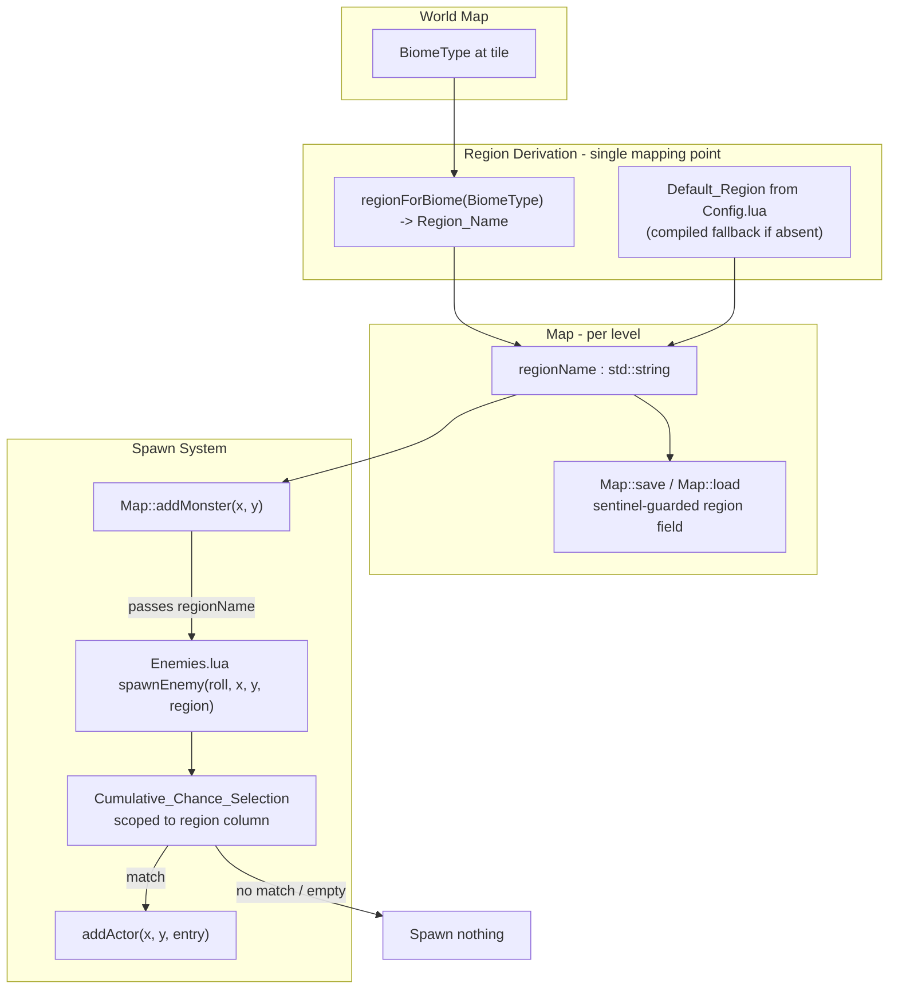

# Design Document

## Overview

This feature adds a **region data layer** over each generated level that controls which NPCs (enemies) spawn there. A region is a named classification applied at whole-level granularity, derived from the existing `BiomeType` world-map enumeration. Each enemy template in `Scripts/Enemies.lua` declares its spawn chance **per region** (a keyed table) instead of a single flat integer, and the C++ spawn path (`Map::addMonster` → Lua `spawnEnemy`) passes the active level's region name into Lua so the correct per-region chance column is selected.

In this first iteration, region names are deliberately identical to the race names that spawn in them (an `Ork` region contains Orks). The data structures and the C++/Lua call boundary are shaped so that later iterations can decouple region names from race names, support weighted multi-race regions, add per-tile granularity, and add neighbour-region fallback — all without a breaking redesign.

### Design Goals

1. **Whole-level region assignment** derived from `BiomeType`, retained for the level's lifetime and persisted across save/load.
2. **Per-region enemy chance tables** in `Enemies.lua`, preserving the existing cumulative-selection algorithm.
3. **A single mapping point** (`BiomeType → Region_Name`) so future per-tile granularity can supply a region per spawn location without changing the selection interface.
4. **Backward-compatible persistence** using the project's sentinel-guarded `TCODZip` append pattern, so pre-region saves load cleanly with a default region.
5. **Graceful fallbacks** for a missing world-map context (default region), a missing/empty region column (no spawn), and a Lua load failure (hard-coded Ork spawn).

### Key Architectural Findings (from code review)

- `Map` (Headers/Map.hpp) owns per-level state (`levelType`, `seed`, `tiles`, terrain, WFC data) and implements `save(TCODZip&)` / `load(TCODZip&)` using sentinel-guarded, append-only fields for backward compatibility (`"ODOR"`, `"DIMS"`, `"WFCG"`).
- `Map::addMonster(int x, int y)` (Source/Map.cpp) opens a fresh `sol::state`, injects the `addActor` callback, runs `Scripts/Enemies.lua`, and calls `spawnEnemy(roll, x, y)` with `roll = rng->getInt(0, 100)`. On any `sol::error` it falls back to a hard-coded Ork/Nob spawn.
- Levels are created via `map->init(withActors, LevelType)` in three places: `Engine::init` (initial context-free BSP level), `Engine::nextLevel` (BSP/OUTDOOR by depth), and the world-map fast-travel handler (WFC hive-city level). Only fast-travel currently has world-map `BiomeType` context available (`worldMapState->biomes[...]`).
- `BiomeType` (Headers/WorldMap.hpp) is a total 5-value enum: `TOXIC_SWAMP`, `DEAD_FOREST`, `ASH_DESERT`, `WASTELAND`, `HIVE_CITY`.
- Config is read from `Scripts/Config.lua` via `sol` `get_or` with compiled C++ defaults (see the outdoor/WFC parameters and `Map::initOutdoor`).
- Level snapshots are cached (`levelCache`) and persisted through `Map::save`/`Map::load`; a level's region must round-trip through this path.

## Architecture

The region layer sits between level generation and enemy spawning. It introduces one new piece of per-level state (`regionName`), one derivation function (`BiomeType → Region_Name`), and one new parameter on the C++/Lua spawn boundary.



### Region Assignment Flow (by level source)

| Level source | Region derivation | Requirement |
|---|---|---|
| OUTDOOR level with a biome | `regionForBiome(level biome)` | 1.2 |
| BSP level entered from a world-map tile | `regionForBiome(world-map tile biome)` | 1.3 |
| Level generated without any biome context (initial BSP level) | `Default_Region` (config, else compiled fallback) | 1.6, 2.1–2.3 |
| WFC hive-city level (fast-travel) | `regionForBiome(HIVE_CITY)` | 1.3, 1.4 |

Because `HIVE_CITY` currently has no distinct enemy set in `Enemies.lua`, an unmatched region resolves to the empty-region fallback (Requirement 6) unless a matching column exists. To keep the game playable in this iteration (Requirement 7), the `Default_Region` and the biome-to-region mapping default to `Ork` where no other race set exists yet (see Data Models).

### Ownership and Responsibility

- **`Map`** owns `regionName` (a `std::string`), exposes `getRegionName()` / `setRegionName()`, and serializes it in `save`/`load`. This mirrors how `Map` already owns `levelType` and `seed`.
- **`Map::addMonster`** reads `regionName` from its owning `Map` and passes it as the new 4th argument to `spawnEnemy`.
- **A single free function `regionForBiome(BiomeType)`** (declared alongside `BiomeType` in `Headers/WorldMap.hpp`, defined in `Source/WorldMap.cpp`) is the *only* place biome→region derivation happens (Requirement 9.3). Region assignment at level-creation sites calls this function or the default-region helper.
- **`Enemies.lua`** owns the per-region chance tables and the region-scoped cumulative selection; `spawnEnemy` gains a `region` parameter.

## Components and Interfaces

### 1. `regionForBiome` (C++ derivation — single mapping point)

Declared in `Headers/WorldMap.hpp`, defined in `Source/WorldMap.cpp`.

```cpp
// Total mapping: every BiomeType maps to exactly one Region_Name (a race name in this iteration).
// This is the single point of BiomeType -> Region_Name derivation (Requirement 9.3).
std::string regionForBiome(BiomeType biome);
```

Behaviour: a `switch` over all five `BiomeType` values returning a race-name string. The mapping is total — every input yields exactly one region name (Requirement 1.4). In this iteration all biomes map to `"Ork"` except where a distinct race set is introduced later; this keeps existing spawning intact (Requirement 7). The table is centralised so later iterations can expand it (new races) or bypass it (per-tile granularity) without touching the spawn interface.

### 2. Default region resolution (C++)

A small helper reads the configured default region from `Scripts/Config.lua` with a compiled fallback.

```cpp
// Returns the configured Default_Region, or a compiled fallback ("Ork") if the
// config value is absent/empty. Never returns an empty string (Requirement 2.3).
std::string resolveDefaultRegion();  // reads config.defaultRegion via sol get_or
```

- Reads `config.defaultRegion` from `Scripts/Config.lua` using the existing `sol` + `get_or` pattern (Requirement 2.2).
- Compiled fallback constant `DEFAULT_REGION_FALLBACK = "Ork"` guarantees every level has a defined region (Requirement 2.3).

### 3. `Map` region state

`Headers/Map.hpp` additions:

```cpp
public:
    const std::string& getRegionName() const { return regionName; }
    void setRegionName(const std::string& region) { regionName = region; }

private:
    std::string regionName; // whole-level region; empty until assigned, then treated as Default_Region
```

- Assigned once at level creation and retained unchanged for the level's lifetime (Requirement 1.1). Whole-level granularity means every spawn on the level uses this single value (Requirements 1.5, 3.1, 3.2).

### 4. `Map::save` / `Map::load` region persistence

Region is appended to the existing `Map::save`/`Map::load` stream using the project's sentinel-guarded pattern, so pre-region snapshots remain loadable.

```cpp
// In Map::save (appended after the existing WFC/DIMS sections):
static constexpr int REGION_SENTINEL = 0x52474E4D; // "RGNM"
zip.putInt(REGION_SENTINEL);
zip.putString(regionName.c_str());

// In Map::load (appended read, guarded by sentinel):
int maybeRegion = zip.getInt();
if (maybeRegion == REGION_SENTINEL) {
    const char* r = zip.getString();
    regionName = (r && *r) ? r : resolveDefaultRegion(); // malformed/empty -> default (Req 8.5)
} else {
    regionName = resolveDefaultRegion(); // pre-region save -> default (Req 8.4)
}
```

- On persist, the region string is written verbatim (Requirement 8.1).
- On restore with a valid sentinel + non-empty string, the region is restored byte-for-byte identical (Requirements 8.2, 8.3).
- Pre-region records (no sentinel) or absent/malformed region strings resolve to `Default_Region` and loading continues without aborting (Requirements 8.4, 8.5).

> Note: The sentinel must be appended at the very end of the current `Map::save` stream so it does not disturb the ordered reads of existing sections. Because `TCODZip::getInt()` returns 0 on an exhausted archive, the `REGION_SENTINEL` (a non-zero constant) cannot be mistaken for end-of-stream in an old save.

### 5. `Map::addMonster` — passing the region into Lua

`Source/Map.cpp`:

```cpp
void Map::addMonster(int x, int y)
{
    TCODRandom* rng = TCODRandom::getInstance();
    const int roll = rng->getInt(0, 100);
    const std::string region = regionName.empty() ? resolveDefaultRegion() : regionName;

    try {
        // ... existing sol::state setup and addActor injection ...
        lua.script_file("Scripts/Enemies.lua");
        lua["spawnEnemy"](roll, x, y, region);   // 4th arg added (Requirement 5.1)
    } catch (const sol::error& /*e*/) {
        // Unchanged hard-coded Ork/Nob fallback (Requirement 7.4)
    }
}
```

- Passes the active level region as the new 4th argument (Requirements 5.1, 5.2). The C++/Lua boundary passes a **string**, so region names can later differ from race names without changing the call signature (Requirement 9.2).

### 6. `Scripts/Enemies.lua` — per-region chance tables and region-scoped selection

Each `Enemy_Entry` replaces its flat `chance` integer with a `chance` **table** keyed by `Region_Name`:

```lua
-- Per-region cumulative chance. Keys are Region_Name strings.
-- The Ork column reproduces the previous flat distribution:
--   Gretchin 50, Ork 75, Shoota Boy 90, Nob 100.
{ name = "Gretchin",   chance = { Ork = 50 },  glyph = string.byte("g"), ... },
{ name = "Ork",        chance = { Ork = 75 },  glyph = string.byte("o"), ... },
{ name = "Shoota Boy", chance = { Ork = 90 },  glyph = string.byte("o"), ... },
{ name = "Nob",        chance = { Ork = 100 }, glyph = string.byte("N"), ... },

function spawnEnemy(roll, x, y, region)
    for _, e in ipairs(enemies) do
        local threshold = e.chance[region]           -- nil if entry has no column for region
        if threshold ~= nil and roll < threshold then
            addActor(x, y, e)
            return
        end
    end
    -- No matching entry for this region -> spawn nothing (Requirements 4.5, 6.1, 6.2)
end
```

- `chance` is a keyed table so new region keys can be added without changing the function signature (Requirement 9.1).
- Cumulative selection iterates entries in declaration order and picks the first entry whose region-scoped threshold exceeds `roll` (Requirements 4.2, 4.4).
- An entry with no key for the requested region is treated as chance 0 and is never selected for that region (Requirement 4.3).
- If no entry in the requested column has a chance greater than the roll (including a wholly empty/absent column), `spawnEnemy` returns without calling `addActor`, leaving the tile unoccupied (Requirements 4.5, 6.1, 6.2).
- The Ork column reproduces the exact previous distribution and retains all existing template fields (Requirements 7.1, 7.2, 7.3).

### 7. `Scripts/Config.lua` — default region config

Add a single configurable key:

```lua
config = {
    -- ... existing keys ...
    defaultRegion = "Ork",   -- Region_Name applied to levels generated without world-map context
}
```

### 8. Level-creation call sites (region assignment)

Region is assigned immediately after each `map->init(...)` where a fresh level is generated:

- **`Engine::init`** (initial BSP level, no biome context): `map->setRegionName(resolveDefaultRegion());` (Requirements 1.6, 2.1).
- **`Engine::nextLevel`** (BSP/OUTDOOR): assign from the entering world-map tile biome when available, else `resolveDefaultRegion()` (Requirements 1.2, 1.3, 1.6).
- **Fast-travel WFC level**: `map->setRegionName(regionForBiome(destinationBiome));` using the world-map tile the player travels to (Requirement 1.3).
- **Cache/persist restore paths** set the region via `Map::load` (Requirement 8), so no extra assignment is needed there.

## Data Models

### Region_Name (string)

A region is represented as a plain `std::string` on the C++ side and a string key on the Lua side. This is the extensibility keystone: strings decouple the transport format from any enum, so region names can later diverge from race names (Requirement 9.2). In this iteration the only region name in use is `"Ork"`.

### BiomeType → Region_Name mapping (total)

| BiomeType | Region_Name (this iteration) |
|---|---|
| `TOXIC_SWAMP` | `"Ork"` |
| `DEAD_FOREST` | `"Ork"` |
| `ASH_DESERT` | `"Ork"` |
| `WASTELAND` | `"Ork"` |
| `HIVE_CITY` | `"Ork"` |

The mapping is total (every enum value maps to exactly one name) and centralised in `regionForBiome`. All values currently map to `"Ork"` so enemies keep spawning everywhere (Requirement 7); later iterations replace individual rows with new race regions without changing any caller.

### Region_Chance_Table (Lua)

A per-`Enemy_Entry` table mapping `Region_Name` → cumulative chance integer in `[0, 100]`:

```lua
chance = { Ork = 50 }          -- Gretchin: appears only in the Ork region column
```

- Missing key ⇒ treated as 0 for that region (never selected) (Requirement 4.3).
- Values are cumulative thresholds within a region column, preserving the existing selection semantics (Requirements 4.1, 4.2, 4.4).

### Persisted level record (region field)

Appended to the existing `Map` serialization stream:

| Field | Type | Notes |
|---|---|---|
| `REGION_SENTINEL` | int (`0x52474E4D`) | Marks presence of the region field; absent in pre-region saves. |
| `regionName` | string | Verbatim region string; empty/malformed ⇒ `Default_Region` on load. |

### Enemy_Entry (unchanged fields)

All existing template fields (`glyph`, `name`, `color`, `hp`, `defense`, `corpse`, `xp`, `power`, `skill`, characteristics, `equipment`, `dropChance`, `equipTier`, `skills`, `talents`, `traits`) are preserved unchanged (Requirement 7.1). Only the `chance` field changes from an integer to a keyed table.

## Correctness Properties

*A property is a characteristic or behavior that should hold true across all valid executions of a system — essentially, a formal statement about what the system should do. Properties serve as the bridge between human-readable specifications and machine-verifiable correctness guarantees.*

The region layer contains pure, input-varying logic (biome→region derivation, region-scoped cumulative selection, and serialization round-trip) that is well suited to property-based testing. The following properties consolidate the testable acceptance criteria (see the prework analysis); structural, config-wiring, schema, and error-path criteria are validated by example/edge-case/integration tests in the Testing Strategy instead.

### Property 1: Biome-to-region mapping is total and deterministic

*For any* `BiomeType` value, `regionForBiome` returns exactly one non-empty `Region_Name`, and calling it again with the same biome returns a string-equal result. Because the same derivation function serves every level source (outdoor, BSP-from-world-tile), this single property covers derivation at all call sites.

**Validates: Requirements 1.2, 1.3, 1.4**

### Property 2: Region-scoped cumulative selection is correct

*For any* region column (a set of `Enemy_Entry` cumulative thresholds keyed by the requested `Region_Name`, where a missing key is treated as chance 0) and *any* integer roll in `[0, 100]`, `spawnEnemy` selects the first `Enemy_Entry` in declaration order whose region-scoped threshold is strictly greater than the roll, matching a reference cumulative-selection model. Entries without a key for the requested region are never selected, and a column with no entry whose threshold exceeds the roll (including an all-zero or absent column) yields no selection.

**Validates: Requirements 4.2, 4.3, 4.4, 4.5, 7.3**

### Property 3: Spawn-call fidelity and empty-region no-spawn

*For any* region column and *any* roll in `[0, 100]`, `spawnEnemy` calls the injected `addActor` exactly once with the entry chosen by the selection model when a selection exists, and calls `addActor` zero times when no entry matches — leaving the spawn location unoccupied.

**Validates: Requirements 5.3, 6.1, 6.2**

### Property 4: Region persistence round-trip

*For any* `Region_Name` string assigned to a level, persisting that level and then restoring it yields a string-equal `Region_Name`.

**Validates: Requirements 8.1, 8.2, 8.3**

## Error Handling

| Condition | Handling | Requirement |
|---|---|---|
| Level generated with no world-map biome context | Assign `resolveDefaultRegion()` (config value, else compiled fallback). | 1.6, 2.1 |
| `config.defaultRegion` absent/empty in `Config.lua` | Use compiled fallback `DEFAULT_REGION_FALLBACK = "Ork"`; region is never empty. | 2.3 |
| Requested region column empty or absent in `Enemies.lua` | `spawnEnemy` returns without calling `addActor`; tile stays unoccupied. | 4.5, 6.1, 6.2 |
| `Enemies.lua` fails to load or execute (`sol::error`) | Fall back to existing hard-coded Ork/Nob spawn (unchanged behaviour). | 7.4 |
| Pre-region save snapshot (no `REGION_SENTINEL`) | On load, assign `resolveDefaultRegion()`; continue without aborting. | 8.4 |
| Stored region string absent/malformed/empty on restore | Assign `resolveDefaultRegion()`; continue the load without aborting. | 8.5 |

Consistent with the project's `test-isolation` steering, `regionForBiome`, `resolveDefaultRegion`, and the region-scoped selection logic must not touch `engine.gui`, `engine.map`, or `engine.player`. Any warning logging on the config/persistence fallback paths follows the existing `Map`/`Persistent` pattern where the engine is known to be initialized, or is guarded with `if (engine.gui)`.

## Testing Strategy

This feature uses a dual approach: property-based tests for the input-varying pure logic, and example/edge-case/integration tests for structural, config-wiring, schema, and error-path behaviour. Tests use Catch2 v3 and RapidCheck (per project steering) and live in `Tests/`, added to `Tests/40kRL_Tests.vcxproj`. Per TDD steering, tests are written before implementation. Any new C++ source file (e.g., `Source/WorldMap.cpp` if not already present) must be added to **both** `40kRL.vcxproj` and `Tests/40kRL_Tests.vcxproj`.

### Property-Based Tests

- A property-based testing library (RapidCheck) is used — property tests are not hand-rolled.
- Each property test runs a minimum of **100 iterations** via `rc::check`.
- Each test is tagged with a comment referencing its design property, in the format:
  **Feature: region-based-npc-spawns, Property {number}: {property_text}**
- Each correctness property is implemented by a **single** property-based test:
  - **Property 1** — generate across all `BiomeType` values (`rc::gen::inRange(0, static_cast<int>(BiomeType::HIVE_CITY))`); assert `regionForBiome` returns a non-empty, deterministic name.
  - **Property 2** — generate a region column of cumulative thresholds (and entries lacking the key) plus a roll in `[0, 100]`; assert the selected entry equals a reference cumulative-selection model result (first-in-order with threshold > roll; missing-key = 0; empty column = none). Exercised against the Lua `spawnEnemy` via a `sol::state` with a spy `addActor`.
  - **Property 3** — generate a region column and roll; count `addActor` invocations via an injected spy and assert exactly one call with the model-selected entry, or zero calls when no selection exists.
  - **Property 4** — generate an arbitrary `Region_Name` string; assign to a `Map`, `save` to `TCODZip`, `load` into a fresh `Map`, and assert `getRegionName()` is string-equal. Generators should include empty and non-ASCII strings to exercise the malformed-string branch (which resolves to `Default_Region`).

### Unit / Example / Edge-Case Tests

- **Config wiring (2.2, INTEGRATION):** load a `Config.lua` with a known `defaultRegion`; assert `resolveDefaultRegion()` returns it.
- **Compiled fallback (2.3, EDGE_CASE):** with no `defaultRegion` key, assert `resolveDefaultRegion()` returns the non-empty compiled fallback.
- **Whole-level granularity (1.5, 3.1, 3.2, EXAMPLE):** assert `Map::addMonster` passes the level's `regionName` (not a per-tile value) for several spawn positions.
- **Region assignment single/retained (1.1, EXAMPLE):** after assignment, `getRegionName()` returns one non-empty value and is unchanged on repeated reads.
- **Default on context-free level (1.6, 2.1, EXAMPLE):** a level created without biome context reports `regionName == Default_Region`.
- **Enemy schema (4.1, EXAMPLE):** load `Enemies.lua`; assert each entry's `chance` is a keyed table with integer values in `[0, 100]`.
- **Ork set retained (7.1, 7.2, EXAMPLE):** assert Gretchin/Ork/Shoota Boy/Nob exist with expected template fields and `chance.Ork` equals 50/75/90/100 respectively.
- **Lua failure fallback (7.4, EDGE_CASE):** force a Lua load/exec error; assert the hard-coded Ork/Nob spawn path runs.
- **Persistence backward compat (8.4, 8.5, EDGE_CASE):** load a pre-region snapshot (no sentinel) and a snapshot with an empty/garbled region; assert both resolve to `Default_Region` and the load completes.

### Balance Note

Property tests cover the general, input-varying logic (derivation totality, selection correctness, spawn-call fidelity, persistence round-trip). Unit tests are kept focused on concrete examples, schema/data integrity, config wiring, and error/edge paths rather than duplicating the input coverage the property tests already provide.
