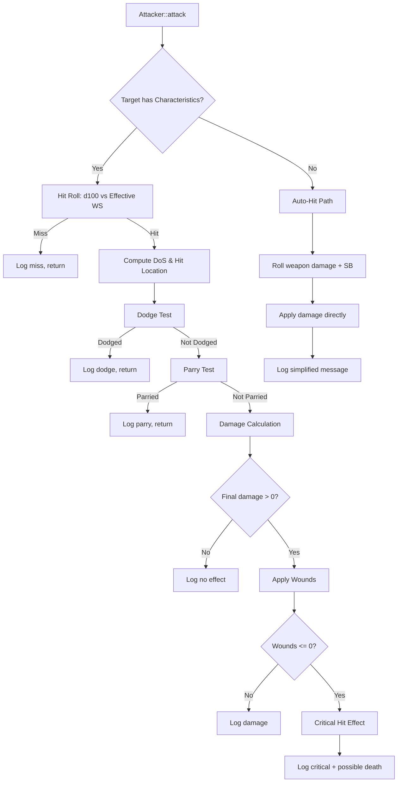

# Design Document: Rogue Trader Melee Combat

## Overview

This design replaces the existing `Attacker::attack()` method (a simple "roll d100 vs threshold, deal power minus defence" formula) with a full Rogue Trader RPG melee combat pipeline. The new system resolves attacks in discrete steps: hit roll → hit location → opposed defence tests (dodge/parry) → damage calculation with per-location armour → critical hit effects. A reusable `DiceRoller` utility handles `NdX` string parsing and rolling throughout the system.

The design preserves the existing component architecture (Actor owns optional `Attacker`, `Destructible`, `Characteristics`, `Equipment` pointers) and extends it minimally. Non-character destructibles (objects without `Characteristics`) use a simplified auto-hit path that bypasses the full pipeline.

## Architecture



The attack pipeline lives entirely within `Attacker::attack()`. Supporting logic is factored into:

- **DiceRoller** — Static utility class for `NdX` parsing and rolling
- **HitLocationTable** — Static lookup from reversed d100 → body location enum
- **MeleeStats** — POD struct stored on `Equippable` for weapon damage/penetration/qualities
- **ArmourProfile** — POD struct stored on `Equippable` for per-location armour values

## Components and Interfaces

### New Types

```cpp
// Headers/DiceRoller.h
#pragma once
#include <string>
#include <functional>
#include <optional>

struct DiceSpec {
    int count;   // N (number of dice, 1-9)
    int sides;   // X (sides per die, 1-100)
};

class DiceRoller {
public:
    // Parses "NdX" format. Returns nullopt on invalid input.
    static std::optional<DiceSpec> parse(const std::string& spec);

    // Formats a DiceSpec back to "NdX" string.
    static std::string format(const DiceSpec& spec);

    // Rolls N dice of X sides and returns the sum.
    // Uses the provided RNG function (defaults to uniform random).
    static int roll(const DiceSpec& spec, 
                    std::function<int(int)> rollDie = nullptr);

    // Convenience: parse + roll in one call. Returns 0 on invalid spec.
    static int rollFromString(const std::string& spec,
                              std::function<int(int)> rollDie = nullptr);
private:
    static int defaultRollDie(int sides);
};
```

```cpp
// Headers/HitLocation.h
#pragma once

enum class HitLocation : int {
    HEAD = 0,
    RIGHT_ARM,
    LEFT_ARM,
    BODY,
    RIGHT_LEG,
    LEFT_LEG,
    COUNT
};

namespace HitLocationTable {
    // Reverses the d100 roll digits and maps to a HitLocation.
    // Input: the original d100 roll (1-100).
    HitLocation resolve(int d100Roll);

    // Returns display name for a HitLocation ("Head", "Body", etc.)
    const char* name(HitLocation loc);
}
```

```cpp
// New fields added to Equippable / EquipmentTemplate

struct MeleeStats {
    DiceSpec damageDice = {1, 5};  // default "1d5"
    int penetration = 0;
    std::vector<std::string> qualities;  // e.g., "Balanced", "Tearing"
};

struct ArmourProfile {
    std::array<int, static_cast<int>(HitLocation::COUNT)> values = {};
    // Indexed by HitLocation enum
};
```

### Modified Types

**Equippable** gains:
```cpp
std::optional<MeleeStats> meleeStats;      // present for weapons
std::optional<ArmourProfile> armourProfile; // present for armour
```

**EquipmentTemplate** gains:
```cpp
std::optional<MeleeStats> meleeStats;
std::optional<ArmourProfile> armourProfile;
```

**Attacker** changes:
- `power` field retained for save-compat but no longer used in the new damage formula
- New private helpers: `resolveCharacterAttack()`, `resolveDestructibleAttack()`
- `rollD100` injectable remains for testing
- New injectable: `std::function<int(int)> rollDie` for weapon damage dice (defaults to uniform random `[1, sides]`)
- Save format version bumped with new sentinel `ATTACKER_SAVE_V3 = -2`

**Equipment** gains:
```cpp
// Sums armour values from all equipped items for a specific hit location.
int getArmourAtLocation(HitLocation loc) const;
```

### Combat Pipeline Detail

**Effective WS Calculation:**
```
effectiveWS = clamp(attacker.characteristics->get(CharId::WS) + sum(attacker.modifiers), 1, 99)
```

This replaces the old `computeThreshold()` which used `skillValue`. The `skillValue` field is retained for save-compat but the pipeline reads from `Characteristics::WS`.

**Degrees of Success/Failure:**
```
DoS = floor((effectiveWS - roll) / 10)   // on success
DoF = floor((roll - effectiveWS) / 10)   // on failure
Both guaranteed >= 0
```

**Hit Location Resolution:**
```
reversed = (roll % 10) * 10 + (roll / 10)
// For roll in [1,9]: tens digit is 0, so reversed = digit * 10
Map reversed to location range:
  01-10: Head
  11-20: Right Arm
  21-30: Left Arm
  31-70: Body
  71-80: Right Leg
  81-00: Left Leg
```

**Dodge Test:**
```
dodgeRoll = d100 vs target.Ag
If dodgeRoll <= Ag: dodge succeeds, negates 1 + dodgeDoS hits
Only one dodge attempt per attack action
```

**Parry Test:**
```
Requires target has melee weapon equipped (WEAPON slot with meleeStats)
parryRoll = d100 vs target.WS
If parryRoll <= WS: parry succeeds, negates 1 + parryDoS hits
Only one parry attempt per attack action
```

**Damage Calculation:**
```
rawDamage = DiceRoller::roll(weapon.meleeStats.damageDice) + attacker.bonus(CharId::S)
effectiveArmour = max(0, equipment.getArmourAtLocation(hitLoc) - weapon.meleeStats.penetration)
finalDamage = max(0, rawDamage - effectiveArmour - target.bonus(CharId::T))
```

**Critical Hits:**
```
If finalDamage reduces hp to <= 0:
  critMagnitude = abs(remaining hp)  // how far past zero
  Apply critical effect based on hitLocation + critMagnitude
  If critMagnitude >= 5: trigger death
```

### Non-Character Destructible Path

When target has `Destructible` but no `Characteristics`:
```
damage = DiceRoller::roll(weapon.meleeStats.damageDice) + attackerSB
// No armour, no TB, no hit roll, no dodge/parry
target->destructible->takeDamage(target, damage)
```

If attacker also has no `Characteristics`, use default SB of 3.

## Data Models

### Equipment.lua Schema Extensions

**Melee weapons** gain an optional `melee` table:
```lua
{
    name = "Chainsword",
    glyph = "/",
    color = "lightBlue",
    slot = "weapon",
    weight = 3.5,
    value = 50,
    power = 3.0,       -- legacy field, kept for compat
    defense = 0.0,
    maxHp = 0.0,
    skill = 0,
    tier = "uncommon",
    melee = {
        damageDice = "1d10",
        penetration = 2,
        qualities = {"Tearing", "Balanced"},
    },
}
```

**Armour items** gain an optional `armourLocations` table:
```lua
{
    name = "Flak Armor",
    glyph = "[",
    color = "lighterOrange",
    slot = "body",
    weight = 8.0,
    value = 30,
    power = 0.0,
    defense = 2.0,  -- legacy uniform value
    maxHp = 0.0,
    skill = -5,
    tier = "uncommon",
    armourLocations = {
        head = 0,
        body = 3,
        leftArm = 3,
        rightArm = 3,
        leftLeg = 3,
        rightLeg = 3,
    },
}
```

**Fallback behaviour:**
- Weapons without `melee` table: assigned `MeleeStats{DiceSpec{1,5}, 0, {}}` (legacy default)
- Armour without `armourLocations`: body slot → defense value applied to Body, Arms, Legs; head slot → defense value applied to Head only

### EquipmentTemplate Data Model

```cpp
struct EquipmentTemplate {
    std::string name;
    int glyph;
    TCODColor color;
    EquipmentSlot slot;
    float weight;
    int value;
    StatModifiers modifiers;
    ItemTier tier = ItemTier::COMMON;
    // --- New fields ---
    std::optional<MeleeStats> meleeStats;        // weapons only
    std::optional<ArmourProfile> armourProfile;  // armour only
};
```

### Serialization Versioning

**Attacker save format V3** (sentinel = -2):
```
putInt(-2)          // sentinel
putFloat(power)     // legacy compat
putInt(skillValue)  // legacy compat
putInt(modifiers.size())
for each modifier: putInt(modifier)
```

Load detects version by reading first int:
- `-2` → V3 format (new)
- `-1` → V2 format (current)
- Other → V1 format (power float reinterpreted from int)

The `Equippable` serialization is extended similarly to persist `MeleeStats` and `ArmourProfile` when present, using a version sentinel.

### Critical Hit Effects Table

A static data table mapping `(HitLocation, magnitude)` → effect description string. Effects are purely narrative in the initial implementation (logged to Gui), with death triggered at magnitude ≥ 5. Future iterations can add mechanical effects (limb damage, stun).

```cpp
namespace CriticalEffects {
    struct CritEffect {
        std::string description;
        bool fatal;
    };
    
    // Returns the critical effect for a given location and damage magnitude.
    // magnitude is clamped to [1, 10] for table lookup.
    CritEffect resolve(HitLocation location, int magnitude);
}
```


## Correctness Properties

*A property is a characteristic or behavior that should hold true across all valid executions of a system — essentially, a formal statement about what the system should do. Properties serve as the bridge between human-readable specifications and machine-verifiable correctness guarantees.*

### Property 1: Hit classification correctness

*For any* effective WS value in [1, 99] and any d100 roll in [1, 100], the hit classification SHALL equal `(roll <= effectiveWS)`: true means success, false means failure.

**Validates: Requirements 1.2, 1.3**

### Property 2: Effective WS clamping invariant

*For any* base WS in [1, 99] and any set of integer modifiers (including extreme positive and negative values), the computed effective WS SHALL always be in the range [1, 99].

**Validates: Requirements 1.4**

### Property 3: Degrees of Success computation

*For any* successful hit (roll <= effectiveWS), the Degrees of Success SHALL equal `floor((effectiveWS - roll) / 10)` and SHALL be >= 0.

**Validates: Requirements 2.1, 2.3**

### Property 4: Degrees of Failure computation

*For any* failed hit (roll > effectiveWS), the Degrees of Failure SHALL equal `floor((roll - effectiveWS) / 10)` and SHALL be >= 0.

**Validates: Requirements 2.2, 2.4**

### Property 5: Hit location digit reversal and table mapping

*For any* d100 roll in [1, 100], reversing the digits (treating single-digit rolls as having a tens digit of 0) and mapping through the Hit Location Table SHALL produce a valid HitLocation enum value, and the reversal function SHALL satisfy: `reverse(roll) = (roll % 10) * 10 + (roll / 10)`, with 100 treated as 00 for mapping purposes.

**Validates: Requirements 3.1, 3.2, 3.3**

### Property 6: Opposed test hit negation formula

*For any* opposed test (dodge or parry) where the roll succeeds (roll <= characteristic), the number of hits negated SHALL equal `1 + floor((characteristic - roll) / 10)`.

**Validates: Requirements 4.2, 5.2**

### Property 7: Effective armour calculation

*For any* location armour value >= 0 and weapon penetration value >= 0, the effective armour SHALL equal `max(0, locationArmour - penetration)`.

**Validates: Requirements 6.2**

### Property 8: Final damage calculation

*For any* raw damage >= 0, effective armour >= 0, and Toughness Bonus >= 0, the final damage SHALL equal `max(0, rawDamage - effectiveArmour - toughnessBonus)`.

**Validates: Requirements 6.3**

### Property 9: Raw damage formula

*For any* valid DiceSpec result (sum of N dice) and any Strength Bonus in [0, 9], raw damage SHALL equal `diceResult + strengthBonus`.

**Validates: Requirements 6.1, 10.3**

### Property 10: Critical magnitude computation

*For any* current HP > 0 and final damage > current HP, the critical magnitude SHALL equal `finalDamage - currentHP` (the amount by which damage exceeds remaining wounds).

**Validates: Requirements 7.1**

### Property 11: Critical death threshold

*For any* critical magnitude value, the system SHALL trigger death if and only if `magnitude >= 5`.

**Validates: Requirements 7.3**

### Property 12: Armour sum by location

*For any* set of equipped items with ArmourProfiles and any HitLocation, `getArmourAtLocation(loc)` SHALL equal the sum of each equipped item's armour value at that location.

**Validates: Requirements 9.4**

### Property 13: DiceRoller NdX round-trip

*For any* valid DiceSpec (count in [1, 9], sides in [1, 100]), formatting to string then parsing back SHALL produce an equivalent DiceSpec (i.e., `parse(format(spec)) == spec`).

**Validates: Requirements 12.4**

### Property 14: DiceRoller roll bounds

*For any* valid DiceSpec with count N and sides X, rolling with any valid die function (each die returning a value in [1, X]) SHALL produce a sum in the range [N, N * X].

**Validates: Requirements 12.2**

### Property 15: Attacker serialization round-trip

*For any* valid Attacker state (power as float, skillValue in [1, 99], arbitrary modifier list), serializing then deserializing SHALL produce an Attacker with equivalent power, skillValue, and modifiers.

**Validates: Requirements 13.4**

## Error Handling

### Invalid Dice Strings
When `DiceRoller::parse()` receives a string not matching the `NdX` pattern (N in 1-9, X in 1-100), it returns `std::nullopt`. The `rollFromString()` convenience method returns 0 and the Equipment Loader logs a warning via `engine.gui->message()` and skips the weapon entry.

### Missing Characteristics
When an attacker has no `Characteristics` component (should not happen in normal gameplay for character actors), the system falls back to the auto-hit path with a default SB of 3. This handles edge cases like traps or environmental damage sources.

### Missing Weapon
When a character attacks without a weapon equipped (WEAPON slot empty), the system uses a default `MeleeStats{DiceSpec{1, 5}, 0, {}}` representing unarmed combat (1d5 damage, 0 penetration).

### Dead Targets
Attacking a dead target (hp <= 0) logs "attacks in vain" and returns early, preserving the existing behavior.

### Save File Compatibility
The load function detects format version by sentinel:
- `-2` → V3 (new format with modifiers)
- `-1` → V2 (current format: power + skillValue)  
- Other → V1 (legacy: power only, default skillValue = 40)

All three paths produce a valid Attacker state. Unknown versions default to safe values.

### Armour Gaps
If no armour covers a hit location (all equipped items have 0 for that location), effective armour is 0 and the full damage (minus TB) applies. This is intentional — unarmoured locations are vulnerable.

### Critical Effect Table Overflow
Critical magnitude is clamped to [1, 10] for table lookup. Values above 10 use the severity-10 entry (always fatal). Values below 1 should not occur (they imply no critical hit happened).

## Testing Strategy

### Property-Based Tests (Catch2 v3 + custom generators)

The project uses Catch2 v3 (amalgamated). Since Catch2 does not include a built-in PBT framework, we implement a lightweight property test harness using `GENERATE()` with random seeds across 100+ iterations per property. Each test uses Catch2's `GENERATE(take(100, random(...)))` pattern or a custom loop with a seeded PRNG.

**Library**: Catch2 v3 with custom random generators  
**Minimum iterations**: 100 per property  
**Tag format**: `[pbt]` section tag + comment referencing the property  

Properties to implement:
1. Hit classification (Property 1)
2. Effective WS clamping (Property 2)
3. DoS computation (Property 3)
4. DoF computation (Property 4)
5. Hit location reversal + mapping (Property 5)
6. Opposed test negation formula (Property 6)
7. Effective armour (Property 7)
8. Final damage (Property 8)
9. Raw damage formula (Property 9)
10. Critical magnitude (Property 10)
11. Critical death threshold (Property 11)
12. Armour sum by location (Property 12)
13. DiceRoller round-trip (Property 13)
14. DiceRoller roll bounds (Property 14)
15. Attacker serialization round-trip (Property 15)

### Unit Tests (Example-Based)

Example-based tests for:
- Full pipeline integration (known rolls → known outcomes)
- Dodge/parry skipping when unarmed
- Non-character destructible auto-hit path
- Default SB of 3 for attackers without Characteristics
- Legacy weapon fallback to default MeleeStats
- Combat log message format verification
- Equipment.lua parsing with and without melee/armourLocations tables
- Invalid damageDice strings being skipped with warning
- Save/load V1 → V3 migration path

### Integration Tests

- Full attack scenario with injectable RNG producing a specific outcome chain
- Equipment loading from a Lua string with melee + armourLocations
- Save/load round-trip with actual TCODZip archive

### Test File Organization

```
Tests/
  test_dice_roller.cpp          -- Properties 13, 14 + edge cases
  test_hit_location.cpp         -- Property 5 + table exhaustive check
  test_combat_formulas.cpp      -- Properties 1-4, 6-11
  test_armour_system.cpp        -- Property 12 + fallback examples
  test_attacker_serialization.cpp -- Property 15
  test_melee_pipeline.cpp       -- Full integration examples
```
