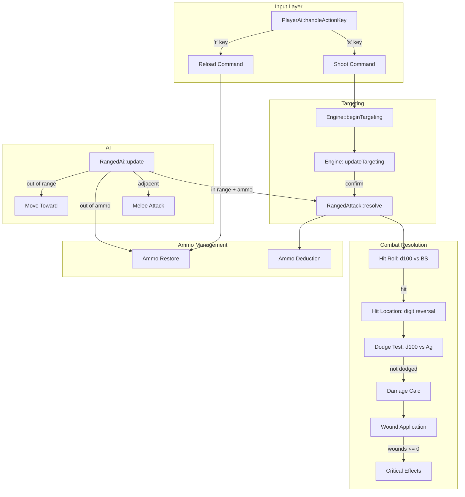

# Design Document: Rogue Trader Ranged Combat

## Overview

This design adds a complete ranged combat system to the 40kRL roguelike, complementing the existing melee pipeline. The system reuses the existing tile-targeting infrastructure for target selection, mirrors the melee combat resolution structure (d100 roll-under, hit location, dodge, damage), and introduces ammunition management and a new AI behaviour for ranged enemies.

Key design goals:
- **Consistency with melee**: Same hit location system, same dodge mechanics, same critical hit system, same injectable RNG pattern for deterministic testing
- **Minimal coupling**: Ranged logic lives in its own `RangedAttacker` component (or extends Attacker), keeping the melee path untouched
- **Data-driven**: Ranged weapons defined in Equipment.lua with a `ranged` table alongside optional `melee` table
- **AI extensibility**: New `RangedAi` class inherits from `Ai` base, selected automatically based on enemy equipment

## Architecture



The ranged combat pipeline sits parallel to the melee pipeline. Both share:
- `HitLocationTable::resolve()` for hit location determination
- `DiceRoller::roll()` for damage dice
- `CriticalEffects::resolve()` for critical hit effects
- `Equipment::getArmourAtLocation()` for armour queries
- Injectable `rollD100` and `rollDie` functions for testing

## Components and Interfaces

### RangedStats (Data Structure)

Added to `Equippable.h` alongside `MeleeStats`:

```cpp
struct RangedStats {
    DiceSpec damageDice = {1, 10};  // e.g., "1d10" for laspistol
    int penetration = 0;            // armour penetration value
    int range = 30;                 // max range in tiles
    int rateOfFire = 1;             // shots per attack action
    int clipSize = 6;               // max ammo capacity
    int reloadTime = 1;             // turns to reload (always 1 for now)
};
```

### Equippable Extension

```cpp
class Equippable : public Persistent {
public:
    // ... existing fields ...
    std::optional<RangedStats> rangedStats;  // present for ranged weapons
    int currentAmmo = 0;                     // runtime ammo counter (not part of template)
    // ...
};
```

`currentAmmo` is a mutable runtime field on the Equippable instance (not the template). It tracks remaining shots and is serialized/deserialized with the weapon.

### EquipmentTemplate Extension

```cpp
struct EquipmentTemplate {
    // ... existing fields ...
    std::optional<RangedStats> rangedStats;  // parsed from "ranged" table in Equipment.lua
};
```

### RangedAttacker (Free Functions or Attacker Extension)

Design decision: Rather than creating a separate `RangedAttacker` component, ranged attack resolution is implemented as free functions in a new `RangedCombat.h/.cpp` module. This avoids adding another component to Actor and keeps the ranged logic testable in isolation.

```cpp
namespace RangedCombat {
    struct RangedContext {
        Actor* shooter;
        Actor* target;
        RangedStats weaponStats;
        int currentAmmo;           // ammo before firing
        std::function<int()> rollD100;
        std::function<int(int)> rollDie;
    };

    struct RangedResult {
        bool hit = false;
        int doS = 0;
        HitLocation location = HitLocation::BODY;
        bool dodged = false;
        int finalDamage = 0;
        int ammoConsumed = 0;
        bool targetKilled = false;
    };

    // Resolves a full ranged attack against a character (has Characteristics)
    RangedResult resolveCharacterAttack(const RangedContext& ctx);

    // Resolves a ranged attack against a destructible (no Characteristics)
    RangedResult resolveDestructibleAttack(const RangedContext& ctx);

    // Top-level dispatch: checks target type, resolves, logs messages, applies wounds
    void resolve(Actor* shooter, Actor* target,
                 std::function<int()> rollD100 = nullptr,
                 std::function<int(int)> rollDie = nullptr);
}
```

### RangedAi (New AI Class)

```cpp
class RangedAi : public Ai {
public:
    void update(Actor* owner) override;
    void save(TCODZip& zip) override;
    void load(TCODZip& zip) override;

private:
    void shoot(Actor* owner, Actor* target);
    void reload(Actor* owner);
    void moveToward(Actor* owner, int targetX, int targetY);
    void followScent(Actor* owner);
};
```

Added to `AiType` enum:
```cpp
enum class AiType {
    PLAYER          = 0,
    MONSTER         = 1,
    CONFUSED_MONSTER = 2,
    RANGED_MONSTER  = 3  // NEW
};
```

### Player Integration

In `PlayerAi::handleActionKey()`, two new cases:

- `'s'`: Validate ranged weapon equipped + ammo > 0, then call `Engine::beginTargeting()` with weapon range. On target confirmation, call `RangedCombat::resolve()`.
- `'r'`: Validate ranged weapon equipped + ammo < clipSize, then set `currentAmmo = clipSize` and advance turn.

### Targeting Integration

The existing `TargetingContext` struct is reused. A new field distinguishes ranged attack targeting from item targeting:

```cpp
struct TargetingContext {
    // ... existing fields ...
    bool isRangedAttack = false;  // NEW: true when targeting for shoot action
};
```

When `isRangedAttack` is true, `Engine::updateTargeting()` on confirmation calls `RangedCombat::resolve()` instead of applying an item effect. Validation ensures the target tile has a living actor within FOV and weapon range.

## Data Models

### Equipment.lua Ranged Table Schema

```lua
{
    name    = "Laspistol",
    glyph   = ")",
    color   = "lightRed",
    slot    = "weapon",
    weight  = 1.5,
    value   = 20,
    tier    = "common",
    melee = {
        damageDice = "1d5",   -- pistol-whip fallback
        penetration = 0,
        qualities = {},
    },
    ranged = {
        damageDice  = "1d10",
        penetration = 0,
        range       = 30,
        rateOfFire  = 1,
        clipSize    = 30,
        reloadTime  = 1,
    },
}
```

Weapons with only a `ranged` table and no `melee` table get auto-assigned default melee stats (`1d5`, pen 0, no qualities) for pistol-whip attacks.

### RangedStats Defaults

| Field | Default | Validation |
|-------|---------|-----------|
| damageDice | required | Must parse via DiceRoller::parse() |
| penetration | 0 | >= 0 |
| range | 30 | >= 1 |
| rateOfFire | 1 | >= 1 |
| clipSize | 6 | >= 1 |
| reloadTime | 1 | >= 1 |

### AI Assignment Logic

During enemy spawn (in the equipment-attachment phase):
1. After equipping items from `EnemyEquipmentConfig`, check weapon slot
2. If weapon's `EquipmentTemplate` has `rangedStats` → assign `RangedAi`
3. Otherwise → assign `MonsterAi` (existing behaviour)

### Serialization Format

Equippable save format adds a new version sentinel:

```
EQUIPPABLE_SAVE_V2 = -10  // new sentinel
[existing fields: slot, modifiers, weight, value]
[hasMeleeStats flag]
[meleeStats if present]
[hasArmourProfile flag]
[armourProfile if present]
[hasRangedStats flag]        // NEW
[rangedStats if present]     // NEW: damageDice string, pen, range, rof, clip, reload
[currentAmmo]                // NEW: always written if rangedStats present
```

## Correctness Properties

*A property is a characteristic or behavior that should hold true across all valid executions of a system — essentially, a formal statement about what the system should do. Properties serve as the bridge between human-readable specifications and machine-verifiable correctness guarantees.*

### Property 1: Ranged hit classification

*For any* d100 roll value in [1, 100] and any Effective BS in [1, 99], the ranged attack is classified as a hit if and only if roll <= Effective BS, and as a miss if and only if roll > Effective BS.

**Validates: Requirements 3.1, 3.2, 3.3**

### Property 2: Effective BS clamping

*For any* base Ballistic Skill in [1, 99] and any set of integer modifiers (positive or negative), the computed Effective BS shall always be in the range [1, 99].

**Validates: Requirements 3.4, 10.6**

### Property 3: Degrees of Success computation

*For any* successful ranged hit (roll <= Effective BS), the Degrees of Success shall equal floor((Effective BS - roll) / 10), and the result shall always be >= 0.

**Validates: Requirements 3.5**

### Property 4: Degrees of Failure computation

*For any* failed ranged hit (roll > Effective BS), the Degrees of Failure shall equal floor((roll - Effective BS) / 10), and the result shall always be >= 0.

**Validates: Requirements 3.6**

### Property 5: Dodge negation formula

*For any* Agility value in [1, 99] and dodge roll in [1, 100], when the dodge roll <= Agility, the number of hits negated shall equal 1 + floor((Agility - dodgeRoll) / 10). When the dodge roll > Agility, zero hits are negated.

**Validates: Requirements 5.1, 5.2, 5.3**

### Property 6: Ranged raw damage excludes Strength Bonus

*For any* ranged weapon damage dice result, the raw ranged damage shall equal the dice result alone (no Strength Bonus added), regardless of the shooter's Strength characteristic.

**Validates: Requirements 6.1**

### Property 7: Effective armour formula

*For any* location armour value >= 0 and weapon penetration value >= 0, the effective armour shall equal max(0, location_armour - penetration).

**Validates: Requirements 6.2**

### Property 8: Final damage formula

*For any* raw damage value >= 0, effective armour >= 0, and Toughness Bonus >= 0, the final damage shall equal max(0, raw_damage - effective_armour - Toughness_Bonus).

**Validates: Requirements 6.3**

### Property 9: Ammunition consumption

*For any* ranged weapon with currentAmmo >= rateOfFire, after resolving a ranged attack the new ammo count shall equal currentAmmo - rateOfFire, and shall always be >= 0.

**Validates: Requirements 7.1**

### Property 10: Destructible direct damage

*For any* ranged weapon damage dice result and any Destructible actor (no Characteristics), the Destructible's HP shall be reduced by exactly the dice result (no armour subtraction, no Toughness Bonus subtraction).

**Validates: Requirements 14.3, 14.4**

### Property 11: Equippable ranged serialization round-trip

*For any* valid Equippable state containing RangedStats (with any valid damageDice, penetration, range, rateOfFire, clipSize, reloadTime) and any currentAmmo in [0, clipSize], serializing then deserializing shall produce an equivalent Equippable state.

**Validates: Requirements 15.1, 15.2, 15.4**

## Error Handling

| Error Condition | Response | User Feedback |
|----------------|----------|---------------|
| Player presses 's' with no ranged weapon | Block action, remain in IDLE | "You have no ranged weapon equipped." |
| Player presses 's' with zero ammo | Block action, remain in IDLE | "Your weapon is empty. Press 'r' to reload." |
| Player presses 'r' with no ranged weapon | Block action, remain in IDLE | "You have no ranged weapon to reload." |
| Player presses 'r' with full ammo | Block action, remain in IDLE | "Your weapon is already fully loaded." |
| Target tile has no living actor | Reject selection, remain in TARGETING | Cursor color indicates invalid target |
| Target tile is out of FOV/range | Reject selection, remain in TARGETING | Cursor color indicates out-of-range |
| Target tile blocked by wall (LoS) | Reject selection, remain in TARGETING | Cursor color indicates invalid target |
| AI attempts ranged attack with zero ammo | AI reloads instead | "[Actor]'s weapon clicks empty" (if unexpected) |
| Equipment.lua "ranged" table has invalid damageDice | Skip weapon entry, continue loading | Warning logged to stderr |
| Equipment.lua "ranged" table missing required field | Use defaults for missing fields | Warning logged to stderr |
| Deserializing old save without rangedStats | Treat as melee-only weapon | No rangedStats set, currentAmmo = 0 |

### Graceful Degradation

- If a weapon has `rangedStats` but somehow `currentAmmo` is negative after deserialization, clamp to 0
- If `rateOfFire` exceeds `currentAmmo` during an attack, consume all remaining ammo (fire partial burst)
- The player can always cancel targeting with Escape (existing behaviour)

## Testing Strategy

### Property-Based Tests (Catch2 GENERATE(), 100+ iterations)

Property-based testing applies strongly to this feature because:
- Combat formulas are pure functions with clear input/output behaviour
- The input space is large (all combinations of skill values, rolls, armour, damage)
- Universal properties should hold across all valid inputs

**Library**: Catch2 v3 with `GENERATE()` macro for random input generation (same pattern as melee combat tests in `Tests/test_combat_formulas.cpp`)

**Configuration**: Minimum 100 iterations per property test, injectable RNG for reproducibility.

**Tag format**: `[pbt]` tag on all property test cases.

**Tests to implement** (one test per property, tagged with property reference):

| Test | Property | Tag |
|------|----------|-----|
| Ranged hit classification | Property 1 | `Feature: rogue-trader-ranged-combat, Property 1: hit classification` |
| Effective BS clamping | Property 2 | `Feature: rogue-trader-ranged-combat, Property 2: BS clamping` |
| DoS computation | Property 3 | `Feature: rogue-trader-ranged-combat, Property 3: DoS` |
| DoF computation | Property 4 | `Feature: rogue-trader-ranged-combat, Property 4: DoF` |
| Dodge negation formula | Property 5 | `Feature: rogue-trader-ranged-combat, Property 5: dodge negation` |
| Raw damage excludes SB | Property 6 | `Feature: rogue-trader-ranged-combat, Property 6: raw damage no SB` |
| Effective armour formula | Property 7 | `Feature: rogue-trader-ranged-combat, Property 7: effective armour` |
| Final damage formula | Property 8 | `Feature: rogue-trader-ranged-combat, Property 8: final damage` |
| Ammo consumption | Property 9 | `Feature: rogue-trader-ranged-combat, Property 9: ammo consumption` |
| Destructible direct damage | Property 10 | `Feature: rogue-trader-ranged-combat, Property 10: destructible damage` |
| Equippable serialization round-trip | Property 11 | `Feature: rogue-trader-ranged-combat, Property 11: serialization round-trip` |

### Unit Tests (Example-Based)

Example-based unit tests cover specific scenarios, edge cases, and integration points:

- **Input handling**: 's' key with weapon/no weapon/no ammo triggers correct state transitions
- **Reload handling**: 'r' key with partial/full/no weapon triggers correct behaviour
- **Combat log messages**: Verify exact message format strings for each combat event
- **AI assignment**: Enemies with ranged weapons get RangedAi, others get MonsterAi
- **Equipment.lua parsing**: Valid ranged table parsed correctly, invalid damageDice skipped, default melee assigned for ranged-only weapons, dual-mode weapons valid
- **Destructible path**: Auto-hit, no dodge, ammo consumed
- **No parry against ranged**: Target with melee weapon doesn't get parry test
- **Backward compatibility**: Loading saves without rangedStats works

### Integration Tests

Integration tests requiring map/actor setup:

- **RangedAi behaviour**: Shoot at range, melee when adjacent, move when out of range, reload when empty, follow scent when no LoS
- **LoS validation**: Wall blocks targeting, FOV boundary respected
- **Full pipeline**: Player shoots target, complete flow from 's' press through damage application
- **MonsterAi preservation**: Existing melee AI tests still pass unchanged

### Test File Organization

```
Tests/
├── test_ranged_combat.cpp       # Property tests (Properties 1-10) + formula unit tests
├── test_ranged_serialization.cpp # Property 11 + backward compat unit tests
├── test_ranged_pipeline.cpp     # Integration tests: full attack pipeline, AI behaviour
├── test_ranged_input.cpp        # Unit tests: 's' and 'r' key handling
└── test_equipment_ranged.cpp    # Unit tests: Equipment.lua ranged parsing
```

