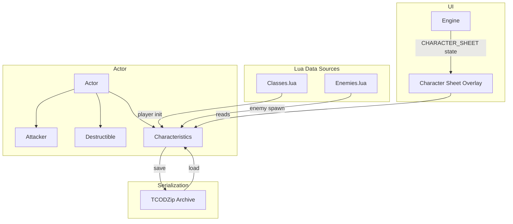

# Design Document: Rogue Trader Stats

## Overview

This feature adds a `Characteristics` component to the Actor entity-component system, representing the nine standard Rogue Trader RPG characteristics. The component stores clamped integer values (1–99) and provides bonus calculations (value ÷ 10). Player values are loaded from `Classes.lua`, enemy values from `Enemies.lua` (with sensible defaults when fields are omitted). A character sheet overlay lets the player view their stats. The component integrates with the existing `TCODZip` save/load system and coexists with the current `Attacker`/`Destructible` combat components without altering their behavior.

### Design Rationale

The nine characteristics are added as a new optional `shared_ptr<Characteristics>` component on Actor, following the same pattern as `Attacker`, `Destructible`, `Ai`, etc. This preserves backward compatibility — actors without the component (items, corpses, stairs) are unaffected. The overlay follows the existing pattern established by `INVENTORY`, `PICKUP_MENU`, and `LOOK` states: a new `CHARACTER_SHEET` enum value, optional state struct, and begin/update/render methods on Engine.

## Architecture



The feature touches three layers:

1. **Data Layer** — The `Characteristics` class stores values, enforces clamping, computes bonuses, and handles serialization.
2. **Loading Layer** — `Engine::init()` and `Map::addMonster()` read characteristic fields from Lua and populate the component.
3. **Presentation Layer** — A new `CHARACTER_SHEET` game state and overlay renders the player's stats.

## Components and Interfaces

### Characteristics (new class)

```cpp
// Headers/Characteristics.h
#pragma once

#include <array>
#include <string_view>

// Index order matches the fixed serialization order.
enum class CharId : int {
    WS = 0, BS, S, T, Ag, Int, Per, WP, Fel, COUNT
};

// Stores the nine Rogue Trader RPG characteristics for an Actor.
// All values are clamped to [1, 99]. Bonus = value / 10 (integer division).
class Characteristics : public Persistent {
public:
    static constexpr int MIN_VALUE = 1;
    static constexpr int MAX_VALUE = 99;
    static constexpr int CHAR_COUNT = static_cast<int>(CharId::COUNT);

    // Constructs with all characteristics set to the given default (clamped).
    explicit Characteristics(int defaultValue = 30);

    // Get/set individual characteristics (clamped on set).
    int  get(CharId id) const;
    void set(CharId id, int value);

    // Bonus = value / 10 (integer division, always in [0, 9]).
    int  bonus(CharId id) const;

    // Abbreviated display name for a characteristic.
    static std::string_view abbreviation(CharId id);

    // Serialization — writes/reads all 9 values in fixed CharId order.
    void save(TCODZip& zip) override;
    void load(TCODZip& zip) override;

private:
    std::array<int, CHAR_COUNT> values_;

    static int clamp(int value);
};
```

### Actor Integration

A new optional component pointer is added to `Actor`:

```cpp
// In Actor.h — new member alongside existing components:
std::shared_ptr<Characteristics> characteristics;
```

The `Actor::save()` and `Actor::load()` methods are extended to write/read a presence flag and delegate to `Characteristics::save()`/`load()` when the component is present. This follows the same pattern used by other optional components.

### Engine State Extension

```cpp
// In Engine.h GameStatus enum — new value:
CHARACTER_SHEET  // character sheet overlay is open

// New optional state struct:
struct CharacterSheetState {};  // no additional state needed (reads player directly)

// New Engine members:
std::optional<CharacterSheetState> characterSheetState;

// New Engine methods:
void beginCharacterSheet();
void updateCharacterSheet();
void renderCharacterSheet();
```

### Lua Loading Interface

Player characteristics are read in `Engine::init()` after existing class fields:

```cpp
// In Engine::init(), after reading playerSkill:
int charWS  = cls.get_or("ws",  30);
int charBS  = cls.get_or("bs",  30);
int charS   = cls.get_or("s",   30);
int charT   = cls.get_or("t",   30);
int charAg  = cls.get_or("ag",  30);
int charInt = cls.get_or("int", 30);
int charPer = cls.get_or("per", 30);
int charWP  = cls.get_or("wp",  30);
int charFel = cls.get_or("fel", 30);
```

Enemy characteristics are read during monster spawning in `Map::addMonster()` from the Lua table entry, with a default of 20 for omitted fields.

## Data Models

### Characteristics Storage

| Field | Type | Range | Default (Player) | Default (Enemy) |
|-------|------|-------|-------------------|-----------------|
| WS    | int  | 1–99  | 30                | 20              |
| BS    | int  | 1–99  | 30                | 20              |
| S     | int  | 1–99  | 30                | 20              |
| T     | int  | 1–99  | 30                | 20              |
| Ag    | int  | 1–99  | 30                | 20              |
| Int   | int  | 1–99  | 30                | 20              |
| Per   | int  | 1–99  | 30                | 20              |
| WP    | int  | 1–99  | 30                | 20              |
| Fel   | int  | 1–99  | 30                | 20              |

### Serialization Format

The `Characteristics` component is serialized as part of the Actor save block:

```
[existing Actor fields...]
[int: hasCharacteristics (1 or 0)]
  if hasCharacteristics:
    [int: WS] [int: BS] [int: S] [int: T] [int: Ag]
    [int: Int] [int: Per] [int: WP] [int: Fel]
[existing component saves continue...]
```

All values are written via `TCODZip::putInt()` / `TCODZip::getInt()` in the fixed `CharId` enum order.

### Lua Schema Extension

**Classes.lua** (player):
```lua
defaultClass = {
    -- existing fields...
    hp = 30.0, defense = 2.0, power = 5.0, skill = 50, invSize = 26,
    -- new characteristic fields (all optional, default 30):
    ws = 40, bs = 45, s = 40, t = 40, ag = 35, int = 30, per = 35, wp = 35, fel = 25,
}
```

**Enemies.lua** (per enemy template):
```lua
{
    -- existing fields...
    chance = 60, glyph = string.byte("g"), name = "Gretchin", ...
    -- new characteristic fields (all optional, default 20):
    ws = 25, bs = 15, s = 20, t = 20, ag = 30, int = 15, per = 25, wp = 15, fel = 10,
}
```


## Correctness Properties

*A property is a characteristic or behavior that should hold true across all valid executions of a system — essentially, a formal statement about what the system should do. Properties serve as the bridge between human-readable specifications and machine-verifiable correctness guarantees.*

### Property 1: Clamping preserves range invariant

*For any* integer value (including negatives, zero, and values exceeding 99), when assigned to any characteristic via `set()`, the stored value SHALL equal `max(1, min(99, input))`. Consequently, `get()` always returns a value in [1, 99].

**Validates: Requirements 1.2, 1.3**

### Property 2: Bonus equals integer division by 10

*For any* characteristic with a stored value `v` (which is always in [1, 99] per Property 1), `bonus()` SHALL return `v / 10` using integer division (truncating toward zero).

**Validates: Requirements 1.4**

### Property 3: Serialization round-trip

*For any* valid `Characteristics` instance (9 values each in [1, 99]), saving to a `TCODZip` archive and loading into a fresh `Characteristics` instance SHALL produce values identical to the original for all nine characteristics.

**Validates: Requirements 4.1, 4.2, 4.3**

### Property 4: Non-exit keys are ignored in CHARACTER_SHEET state

*For any* key press that is neither 'c' nor Escape, while the Engine is in `CHARACTER_SHEET` state, the game state SHALL remain `CHARACTER_SHEET` and no gameplay actions SHALL be processed.

**Validates: Requirements 5.4**

### Property 5: Character sheet displays all characteristics with correct values and bonuses

*For any* set of nine characteristic values in [1, 99], the character sheet render output SHALL contain all nine abbreviated names (WS, BS, S, T, Ag, Int, Per, WP, Fel) paired with their numeric value and computed bonus (value / 10).

**Validates: Requirements 6.3**

## Error Handling

| Scenario | Behavior |
|----------|----------|
| Characteristic value < 1 assigned | Clamped to 1 silently |
| Characteristic value > 99 assigned | Clamped to 99 silently |
| `Classes.lua` missing or malformed | All characteristics default to 30 (same pattern as existing hp/power defaults) |
| `Enemies.lua` template missing characteristic fields | Missing fields default to 20 |
| Save archive from version without characteristics | `Actor::load()` reads the `hasCharacteristics` flag as 0, skips loading — actor has no characteristics component (graceful backward compat) |
| `characteristics` is null on an actor during combat | No effect — combat system only uses `Attacker` and `Destructible`, never reads `characteristics` |
| Character sheet opened when player has no characteristics (should not happen) | Render "N/A" for all values as defensive fallback |

## Testing Strategy

### Property-Based Tests (RapidCheck via Catch2)

Each property test runs a minimum of 100 iterations using the existing RapidCheck + Catch2 integration in the project.

| Property | Test Description | Library |
|----------|------------------|---------|
| Property 1 | Generate random ints, set on Characteristics, verify `get() == clamp(input)` | RapidCheck |
| Property 2 | Generate random values in [1, 99], set characteristic, verify `bonus() == value / 10` | RapidCheck |
| Property 3 | Generate 9 random values in [1, 99], save to TCODZip, load into new instance, verify equality | RapidCheck |
| Property 4 | Generate random SDL keycodes excluding 'c' and ESC, verify state remains CHARACTER_SHEET | RapidCheck |
| Property 5 | Generate 9 random values, build Characteristics, render to console, verify all labels/values/bonuses present | RapidCheck |

**Tag format**: `Feature: rogue-trader-stats, Property N: <description>`

### Unit Tests (Catch2 example-based)

| Test | Validates |
|------|-----------|
| Characteristics constructor sets all 9 fields to default | Req 1.1 |
| `abbreviation()` returns correct 2-3 letter strings for all 9 IDs | Req 6.3, 6.4 |
| Player init with full Classes.lua reads all 9 values correctly | Req 2.1 |
| Player init with partial Classes.lua defaults missing to 30 | Req 2.2, 2.3 |
| Enemy spawn reads characteristics from template | Req 3.1, 3.3 |
| Enemy spawn defaults missing characteristics to 20 | Req 3.2 |
| Pressing 'c' in IDLE transitions to CHARACTER_SHEET | Req 5.1 |
| Pressing ESC in CHARACTER_SHEET transitions to IDLE | Req 5.2 |
| Pressing 'c' in CHARACTER_SHEET transitions to IDLE | Req 5.3 |
| Player retains Attacker and Destructible alongside Characteristics | Req 7.1, 7.2 |
| Combat calculation uses Attacker/Destructible, not Characteristics | Req 7.3 |

### Integration Tests

| Test | Validates |
|------|-----------|
| Full save/load cycle preserves player characteristics | Req 4.3 |
| Loading a pre-characteristics save file does not crash | Backward compat |
| Enemy spawn via Lua produces correct component attachment | Req 3.1, 3.3, 7.2 |
