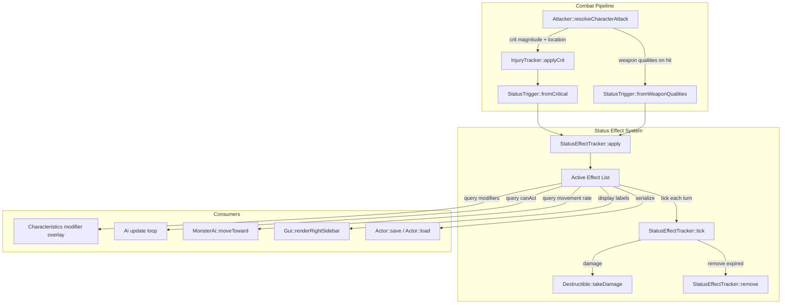
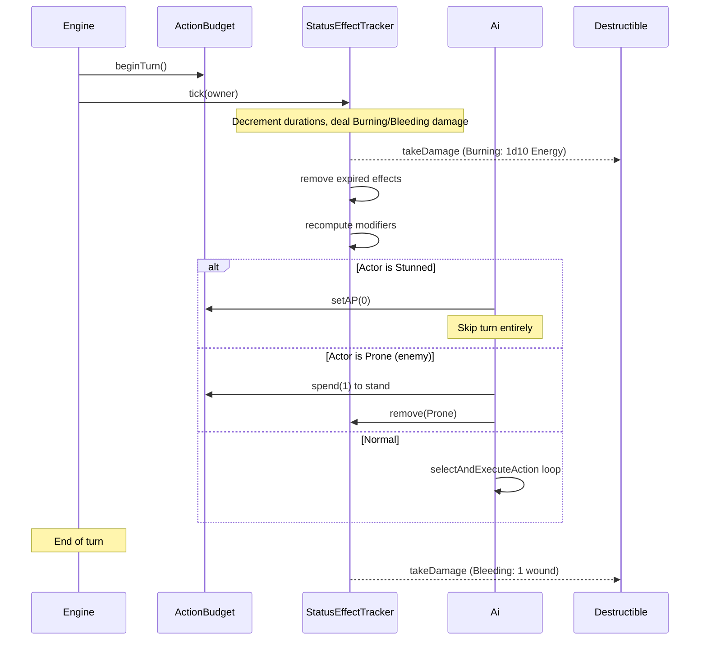

# Design Document: Status Effects

## Overview

The status effect system extends 40kRL's combat model with named conditions that modify actor behaviour and characteristics over time. Effects are triggered by the existing critical injury pipeline (based on hit location, crit magnitude, and damage type) and by weapon qualities defined in Lua. The system sits between the InjuryTracker (which tracks cumulative crit magnitude and flat stat penalties) and the Ai/ActionBudget layer (which governs actor actions each turn).

### Design Goals

- **Minimal coupling**: The `StatusEffectTracker` component is owned by `Actor` alongside `InjuryTracker` — it does not replace the existing debuff table but adds higher-level named conditions on top.
- **Data-driven triggers**: A constexpr lookup table maps (DamageType, HitLocation, magnitude threshold) → StatusType, keeping crit-to-status logic declarative.
- **Uniform application**: Both players and enemies share the same tick/modifier logic; AI simply queries the tracker to decide whether to skip turns or stand up.
- **Serialization continuity**: Uses the established Actor sentinel pattern (presence flag + payload), appended after the ActionBudget section for backward compatibility.

## Architecture



### Turn Lifecycle Integration



## Components and Interfaces

### StatusType Enum

```cpp
// Headers/StatusEffects.h
enum class StatusType : int {
    Burning = 0,
    Prone,
    Stunned,
    Bleeding,
    Missing_Right_Arm,
    Missing_Left_Arm,
    Missing_Right_Leg,
    Missing_Left_Leg,
    Blinded,
    Poisoned,
    COUNT
};
```

### StatusEffect Struct

```cpp
struct StatusEffect {
    StatusType type;
    int duration;           // turns remaining; 0 = permanent
    std::string source;     // human-readable origin (e.g., "Energy Head crit 5")

    bool isPermanent() const { return duration == 0; }
};
```

### StatusEffectTracker Class

```cpp
// Headers/StatusEffectTracker.h
class StatusEffectTracker : public Persistent {
public:
    StatusEffectTracker();

    // Apply a new effect. Handles stacking (refresh if new > existing, keep permanent).
    void apply(Actor* owner, StatusType type, int duration, const std::string& source);

    // Remove a specific effect type. Reverses modifier-based mechanical effects.
    void remove(Actor* owner, StatusType type);

    // Called at the start of the actor's turn. Decrements durations, deals tick damage.
    // Returns true if actor can act this turn (false if Stunned).
    bool tickStartOfTurn(Actor* owner);

    // Called at the end of the actor's turn. Deals Bleeding damage.
    void tickEndOfTurn(Actor* owner);

    // Query interface
    bool has(StatusType type) const;
    int getRemainingDuration(StatusType type) const;
    const std::vector<StatusEffect>& getActiveEffects() const;
    bool canAct() const;               // false if Stunned
    bool isMovementHalved() const;     // true if any Missing_Leg
    int getWSModifier() const;         // sum of WS penalties from active effects
    int getBSModifier() const;         // sum of BS penalties from active effects

    // Serialization
    void save(TCODZip& zip) override;
    void load(TCODZip& zip) override;

    // Reapply all characteristic modifiers after load
    void reapplyModifiers(Actor* owner);

private:
    std::vector<StatusEffect> effects_;

    void applyModifiers(Actor* owner, StatusType type);
    void removeModifiers(Actor* owner, StatusType type);
    void logApplication(Actor* owner, StatusType type);
    void logExpiry(Actor* owner, StatusType type);
};
```

### StatusTrigger Namespace (Crit-to-Status Mapping)

```cpp
// Headers/StatusTrigger.h
#include "WeaponTypes.h"
#include "HitLocation.h"
#include "StatusEffects.h"
#include <vector>

namespace StatusTrigger {
    struct TriggerEntry {
        DamageType damageType;
        HitLocation location;
        int minMagnitude;       // minimum crit magnitude to trigger
        StatusType status;
        int duration;           // 0 = permanent, >0 = turns
    };

    // Constexpr table of all crit→status mappings (per RT-CriticalEffects).
    // Caller iterates and applies all matching entries for a given (damageType, loc, magnitude).
    extern const std::vector<TriggerEntry>& getCritTriggerTable();

    // Convenience: apply all matching status effects for this crit event.
    void fromCritical(Actor* target, DamageType dmgType, HitLocation loc, int magnitude);

    // Apply status effects from weapon qualities (called after damage dealt).
    void fromWeaponQualities(Actor* target, const std::vector<std::string>& qualities);
}
```

### Integration Points

#### 1. Attacker::resolveCharacterAttack (combat pipeline)

After the existing `injuryTracker->applyCrit()` call:
```cpp
// After crit debuffs applied, trigger status effects based on damage type + location
DamageType dmgType = DamageType::I; // default Impact
if (owner->equipment) {
    Actor* weaponItem = owner->equipment->getSlot(EquipmentSlot::WEAPON);
    if (weaponItem && weaponItem->equippable && weaponItem->equippable->damageType) {
        dmgType = *weaponItem->equippable->damageType;
    }
}
StatusTrigger::fromCritical(target, dmgType, loc, critMagnitude);

// After any successful hit (crit or normal), apply weapon quality effects
if (owner->equipment) {
    Actor* weaponItem = owner->equipment->getSlot(EquipmentSlot::WEAPON);
    if (weaponItem && weaponItem->equippable && weaponItem->equippable->meleeStats) {
        StatusTrigger::fromWeaponQualities(target, weaponItem->equippable->meleeStats->qualities);
    }
}
```

#### 2. MonsterAi::selectAndExecuteAction (AI awareness)

```cpp
bool MonsterAi::selectAndExecuteAction(Actor* owner) {
    // Check if stunned — skip turn
    if (owner->statusTracker && !owner->statusTracker->canAct()) {
        owner->actionBudget->setAP(0);
        return false;
    }

    // Check if prone — spend 1 AP to stand first
    if (owner->statusTracker && owner->statusTracker->has(StatusType::Prone)) {
        if (owner->actionBudget->canAfford(1)) {
            owner->actionBudget->spend(1);
            owner->statusTracker->remove(owner, StatusType::Prone);
            // If no AP remains, end turn
            if (owner->actionBudget->getAP() <= 0) return false;
        } else {
            return false; // can't afford to stand
        }
    }

    // Existing action selection logic...
    // Movement uses halved rate if isMovementHalved()
}
```

#### 3. Gui::renderRightSidebar (UI display)

Status labels rendered below the existing HP/AP bars:
```cpp
// In renderRightSidebar, after existing content:
if (engine.player->statusTracker) {
    const auto& effects = engine.player->statusTracker->getActiveEffects();
    int yOffset = /* next available row */;
    for (const auto& effect : effects) {
        TCODColor color = effect.isPermanent() ? Colors::damage : Colors::lightGrey;
        std::string label = statusAbbreviation(effect.type);
        if (!effect.isPermanent()) {
            label += " " + std::to_string(effect.duration);
        }
        rightSidebarConsole->printf(1, yOffset++, "%s", label.c_str());
    }
}
```

#### 4. Actor Save/Load (serialization)

Appended after the existing `actionBudget` section in `Actor::save()` / `Actor::load()`:
```cpp
// In Actor::save():
zip.putInt(statusTracker != nullptr);
if (statusTracker) statusTracker->save(zip);

// In Actor::load():
const bool hasStatusTracker = zip.getInt();
if (hasStatusTracker) {
    statusTracker = std::make_unique<StatusEffectTracker>();
    statusTracker->load(zip);
    statusTracker->reapplyModifiers(this);
}
```

#### 5. PlayerAi (stand up action)

A new key binding (e.g., 'u' for "stand Up") in `PlayerAi::handleActionKey`:
```cpp
case 'u': // stand up from prone
{
    if (!owner->statusTracker || !owner->statusTracker->has(StatusType::Prone)) {
        engine.gui->message(Colors::lightGrey, "You are not prone.");
        return;
    }
    if (!owner->actionBudget->canAfford(1)) {
        engine.gui->message(Colors::lightGrey, "Not enough AP to stand up.");
        return;
    }
    owner->actionBudget->spend(1);
    owner->statusTracker->remove(owner, StatusType::Prone);
    engine.gui->message(Colors::playerAction, "You stand up.");
    return;
}
```

## Data Models

### StatusEffect Data

| Field | Type | Description |
|-------|------|-------------|
| type | `StatusType` | Enum identifying the condition |
| duration | `int` | Turns remaining (0 = permanent, positive = temporary) |
| source | `std::string` | Human-readable origin for UI/debug |

### Crit Trigger Table (compile-time data)

| DamageType | HitLocation | Min Magnitude | Status | Duration |
|-----------|-------------|---------------|--------|----------|
| Energy | Head | 3 | Blinded | 1d5 |
| Energy | Head | 5 | Burning | 3 |
| Energy | Right_Arm | 5 | Missing_Right_Arm | 0 (perm) |
| Energy | Left_Arm | 5 | Missing_Left_Arm | 0 (perm) |
| Energy | Body | 3 | Burning | 3 |
| Energy | Right_Leg | 5 | Missing_Right_Leg | 0 (perm) |
| Energy | Left_Leg | 5 | Missing_Left_Leg | 0 (perm) |
| Impact | Head | 1 | Stunned | 1 |
| Impact | Body | 5 | Prone | 0 (until stand) |
| Impact | Right_Arm | 6 | Missing_Right_Arm | 0 (perm) |
| Impact | Left_Arm | 6 | Missing_Left_Arm | 0 (perm) |
| Impact | Right_Leg | 6 | Missing_Right_Leg | 0 (perm) |
| Impact | Left_Leg | 6 | Missing_Left_Leg | 0 (perm) |
| Rending | Head | 1 | Bleeding | 0 (perm) |
| Rending | Head | 5 | Blinded | 1d5 |
| Rending | Right_Arm | 6 | Missing_Right_Arm | 0 (perm) |
| Rending | Left_Arm | 6 | Missing_Left_Arm | 0 (perm) |
| Rending | Right_Leg | 5 | Missing_Right_Leg | 0 (perm) |
| Rending | Left_Leg | 5 | Missing_Left_Leg | 0 (perm) |
| Rending | Body | 4 | Bleeding | 0 (perm) |
| Rending | Body | 4 | Prone | 0 (until stand) |
| Explosive | Head | 1 | Stunned | 1 |
| Explosive | Right_Arm | 4 | Missing_Right_Arm | 0 (perm) |
| Explosive | Left_Arm | 4 | Missing_Left_Arm | 0 (perm) |
| Explosive | Right_Leg | 4 | Missing_Right_Leg | 0 (perm) |
| Explosive | Left_Leg | 4 | Missing_Left_Leg | 0 (perm) |
| Explosive | Body | 4 | Bleeding | 0 (perm) |
| Explosive | Body | 4 | Prone | 0 (until stand) |

### Weapon Quality → Status Mapping

| Quality String | Status | Duration |
|---------------|--------|----------|
| "Flame" | Burning | 3 |
| "Shocking" | Stunned | 1 |
| "Toxic" | Poisoned | 5 |

### Mechanical Effects Summary

| Status | Modifiers | Tick Damage | Movement | Can Act |
|--------|-----------|-------------|----------|---------|
| Burning | — | 1d10 Energy/turn (start) | Normal | Yes |
| Prone | WS -10 | — | Normal | Yes |
| Stunned | Evasion -20 | — | Normal | **No** (skip turn) |
| Bleeding | — | 1 wound/turn (end) | Normal | Yes |
| Missing_Arm | Cannot equip weapon in that slot | — | Normal | Yes |
| Missing_Leg | — | — | **Halved** (2 AP/tile) | Yes |
| Blinded | WS -30, BS -30 | — | Normal | Yes |
| Poisoned | S -10, T -10, Ag -10 | — | Normal | Yes |

### Prone Targeting Modifier

When targeting a Prone actor with a ranged attack, the attacker receives a -10 modifier (the target is harder to hit at range). This is applied in the ranged combat resolution path by querying `target->statusTracker->has(StatusType::Prone)`.

### Blinded Attacker Bonus

When any actor attacks a Blinded target, the attacker receives +30 to their attack roll. This is applied in both melee and ranged resolution by querying `target->statusTracker->has(StatusType::Blinded)`.

### Serialization Format

```
[StatusEffectTracker presence flag: int (0 or 1)]
  [effect count: int]
  For each effect:
    [type: int (StatusType enum)]
    [duration: int]
    [source: string]
```

This follows the existing Actor component sentinel pattern — old saves without the `statusTracker` presence flag will read 0 from the exhausted archive, resulting in no tracker being created (backward-compatible).

## Correctness Properties

*A property is a characteristic or behavior that should hold true across all valid executions of a system — essentially, a formal statement about what the system should do. Properties serve as the bridge between human-readable specifications and machine-verifiable correctness guarantees.*

### Property 1: Critical Trigger Table Correctness

*For any* valid combination of (DamageType, HitLocation, magnitude) where magnitude meets or exceeds a trigger threshold defined in the crit trigger table, calling `StatusTrigger::fromCritical` SHALL apply exactly the StatusType(s) specified by the table to the target actor.

**Validates: Requirements 2.1, 2.2, 2.3, 2.4, 2.5, 2.6, 2.7, 2.8, 2.9, 2.10, 2.11, 2.12, 2.13, 2.14, 2.15, 2.16, 2.17, 2.18**

### Property 2: Weapon Quality Trigger Correctness

*For any* weapon qualities list containing a status-triggering quality string ("Flame", "Shocking", or "Toxic"), calling `StatusTrigger::fromWeaponQualities` SHALL apply the corresponding StatusType with the correct default duration to the target actor.

**Validates: Requirements 3.1, 3.2, 3.3**

### Property 3: Duration Tick and Expiry

*For any* temporary status effect (duration > 0) applied to an actor, calling `tickStartOfTurn` SHALL decrement the duration by exactly 1, and when the duration reaches 0 after decrement, the effect SHALL be removed from the active effects list and its associated characteristic modifiers SHALL be reversed.

**Validates: Requirements 1.4, 4.1, 4.2**

### Property 4: Modifier Application and Removal Symmetry

*For any* status effect type that modifies characteristics (Prone: WS -10; Stunned: Evasion -20; Blinded: WS -30, BS -30; Poisoned: S -10, T -10, Ag -10), applying the status SHALL add the specified modifier to the actor's characteristics, and removing the status SHALL subtract the same modifier, resulting in the original characteristic values being restored.

**Validates: Requirements 5.2, 5.4, 5.9, 5.11, 10.3**

### Property 5: Burning Tick Damage

*For any* actor with an active Burning status, calling `tickStartOfTurn` SHALL deal damage in the range [1, 10] (1d10 Energy, ignoring armour) to the actor's HP.

**Validates: Requirements 5.1, 9.3**

### Property 6: Bleeding Tick Damage

*For any* actor with an active Bleeding status, calling `tickEndOfTurn` SHALL deal exactly 1 wound of damage to the actor's HP.

**Validates: Requirements 5.5, 9.4**

### Property 7: Stacking Rules — Duration Refresh

*For any* status type already active on an actor with remaining duration D1, applying the same status type with duration D2 SHALL result in the active duration being max(D1, D2). Additionally, if the existing instance is permanent (duration 0), any temporary reapplication SHALL leave the permanent instance unchanged.

**Validates: Requirements 6.1, 6.2, 6.4**

### Property 8: Serialization Round-Trip

*For any* actor with an arbitrary set of active status effects (varying types, durations, and source strings), serializing via `save()` then deserializing via `load()` followed by `reapplyModifiers()` SHALL produce an identical set of active effects with matching types, durations, and sources, and the actor's characteristic modifiers SHALL be restored to their pre-save values.

**Validates: Requirements 7.1, 7.2**

### Property 9: Multiple Statuses Coexist

*For any* set of distinct StatusType values applied to a single actor, all applied statuses SHALL be simultaneously active and independently queryable via `has()`.

**Validates: Requirements 6.3, 6.5, 6.6**

### Property 10: Stand From Prone

*For any* actor with the Prone status and at least 1 AP remaining, executing the stand action SHALL remove the Prone status, consume exactly 1 AP, and reverse the WS -10 modifier. If AP is 0, the stand action SHALL fail and Prone SHALL remain active.

**Validates: Requirements 5.12, 10.1, 10.2, 10.3**

### Property 11: StatusEffect Data Integrity

*For any* StatusEffect constructed with a valid StatusType, non-negative duration, and source string, querying the struct's fields SHALL return the original construction values, and `isPermanent()` SHALL return true if and only if duration equals 0.

**Validates: Requirements 1.2, 1.3**

### Property 12: Status Abbreviation Mapping

*For any* valid StatusType enum value, calling `statusAbbreviation()` SHALL return a non-empty string of at most 5 characters matching the expected abbreviation for that type.

**Validates: Requirements 8.1**

## Error Handling

### Invalid Inputs

| Scenario | Handling |
|----------|----------|
| `apply()` called with negative duration | Clamp to 0 (treat as permanent). Log warning in debug mode. |
| `apply()` called with invalid StatusType (>= COUNT) | No-op. Return early without modifying state. |
| `remove()` called for a status not currently active | No-op. No error — idempotent removal. |
| `fromCritical()` called with magnitude < 1 or > 9 | Clamp to [1, 9] before table lookup. |
| `fromCritical()` called with invalid DamageType/HitLocation | No-op. No matching trigger entries. |
| `tickStartOfTurn()` called on actor with null destructible | Skip damage-dealing effects (Burning). Log warning. |
| Burning tick kills actor | `die()` is called. Remaining effects are not processed. |
| Bleeding tick kills actor | `die()` is called. |

### Edge Cases

| Scenario | Behaviour |
|----------|-----------|
| Stunned actor receives another Stun | Duration refreshed per stacking rules. |
| Prone actor receives Prone again | No-op (already Prone, duration is "until stand"). |
| Both legs missing | Both Missing_Leg statuses active; `isMovementHalved()` still returns true (no double-halving). |
| Both arms missing | Both Missing_Arm statuses active; no weapon can be equipped. |
| Actor dies during tick | Remaining tick processing is halted. Dead actors are not ticked again. |
| Status applied to dead actor | No-op. `apply()` checks `destructible->isDead()` first. |

### Backward Compatibility

- Old saves lacking the `statusTracker` presence flag: `getInt()` returns 0 from exhausted archive → no tracker created, actor starts with no effects.
- No migration needed — statuses are additive to the existing InjuryTracker debuffs.

## Testing Strategy

### Property-Based Tests (RapidCheck + Catch2)

The following tests use RapidCheck (via `rc::check`) with a minimum of 100 iterations each. Each test references its design property and is tagged with `[status-effects]`.

| Test | Property | Generator Strategy |
|------|----------|-------------------|
| Crit trigger table | Property 1 | Generate random (DamageType, HitLocation, magnitude∈[1,9]). Filter to combinations that should trigger. Verify correct statuses applied. |
| Weapon quality trigger | Property 2 | Generate random qualities list from {"Flame","Shocking","Toxic"} + noise strings. Verify correct statuses. |
| Duration tick/expiry | Property 3 | Generate random positive duration ∈[1,20]. Tick that many times. Verify effect is removed at 0. |
| Modifier symmetry | Property 4 | Generate random modifier-producing StatusType. Apply, record modifier delta. Remove, verify delta is 0. |
| Burning damage range | Property 5 | Apply Burning, inject deterministic RNG, tick. Verify damage ∈[1,10]. |
| Bleeding damage | Property 6 | Apply Bleeding with random HP, tick end-of-turn, verify HP decreased by 1. |
| Stacking rules | Property 7 | Generate two durations (D1, D2). Apply D1 first, then D2. Verify result = max(D1, D2). Also test permanent vs temporary. |
| Serialization round-trip | Property 8 | Generate random vector of StatusEffects. Save to buffer, load from buffer. Verify equality. |
| Multiple coexistence | Property 9 | Generate random subset of StatusTypes. Apply all. Verify all queryable. |
| Stand from Prone | Property 10 | Generate random AP ∈[0,2]. Apply Prone. Attempt stand. Verify correct outcome based on AP. |
| Data integrity | Property 11 | Generate random type, duration, source. Construct. Verify fields. |
| Abbreviation mapping | Property 12 | Iterate all StatusType values. Verify non-empty abbreviation ≤5 chars. |

### Unit Tests (Catch2 Example-Based)

| Test | Coverage |
|------|----------|
| Specific crit scenarios (Energy Head mag 3, Impact Body mag 5) | Req 2 examples |
| Default durations (Stunned=1, Burning=3, Poisoned=5) | Req 4.3, 4.4, 4.7 |
| Blinded duration in [1,5] range | Req 4.5 |
| Bleeding never auto-expires | Req 4.6 |
| Missing_Arm prevents weapon equip | Req 5.6, 5.7 |
| Missing_Leg movement halving | Req 5.8 |
| Blinded +30 attacker bonus | Req 5.10 |
| Prone -10 ranged targeting | Req 5.3 |
| Missing_Right and Missing_Left are distinct | Req 6.5, 6.6 |
| Old save without status data loads cleanly | Req 7.3, 7.4 |
| UI abbreviation strings correct | Req 8.1 |
| Message logged on apply/expire | Req 8.2, 8.3 |
| Insufficient AP to stand | Req 10.2 |

### Integration Tests

| Test | Coverage |
|------|----------|
| Full combat: attack with Flame weapon → Burning applied → tick deals damage | Req 3.1, 5.1 |
| Full combat: crit pipeline → status applied → AI skips turn | Req 2.6, 9.1 |
| Save → load → effects persist and modifiers reapplied | Req 7 |
| Lua Equipment.lua qualities parsed correctly | Req 3.4 |

### Test Configuration

- Library: RapidCheck (header-only, already available via vcpkg) + Catch2 v3
- Minimum iterations: 100 per property test
- Tag: `[status-effects]`
- Tag format in comments: `// Feature: status-effects, Property N: <description>`
- Test file: `Tests/test_status_effects.cpp`
