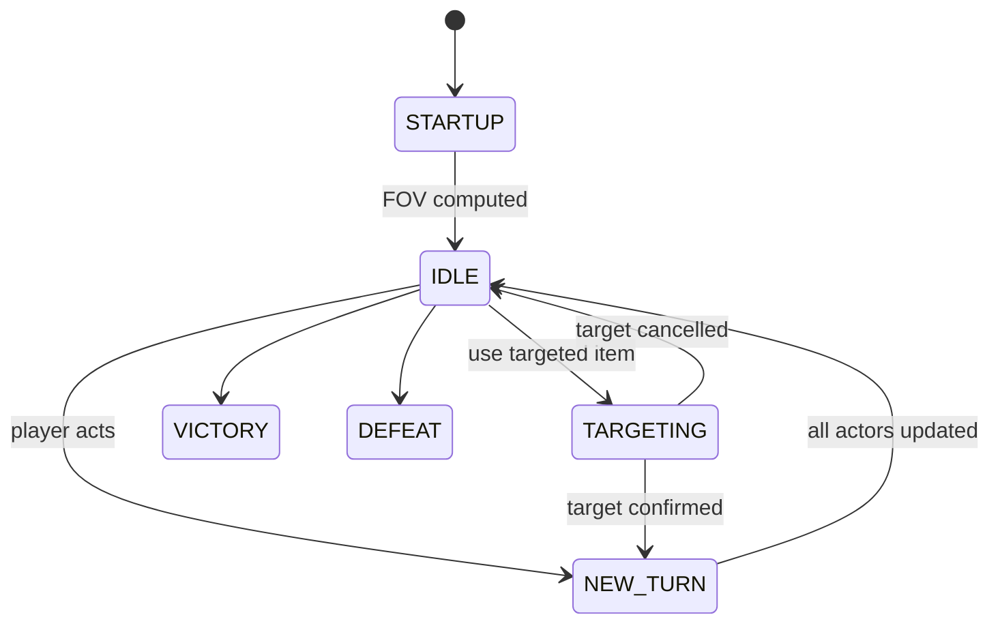
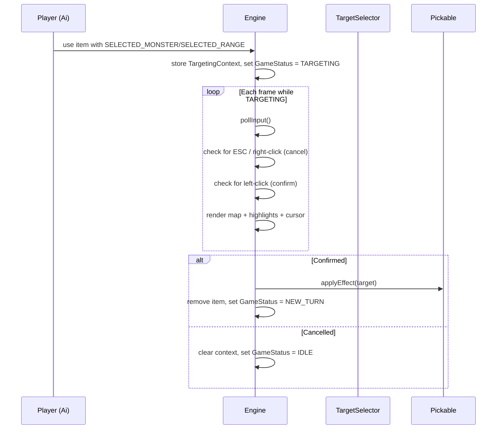

# Design Document: Tile Targeting

## Overview

This design replaces the blocking `pickAtTile` secondary render loop with a state-machine-driven targeting system that operates entirely within the main game loop. The current implementation calls `TCODConsole::flush()` and `SDL_WaitEvent` from a nested loop, which is incompatible with libtcod 2.2.0 + SDL3 (where all rendering must happen in the single main loop cycle).

The refactored system introduces:
1. A **TARGETING** value in the `GameStatus` enum — the main loop branches into targeting-specific update/render paths when active.
2. A **TargetingContext** struct storing everything needed to complete a targeting interaction (item, owner, range, selector type).
3. Refactored **inventory menu** and **Menu::pick** to use `pollInput` instead of the deprecated `TCODSystem::waitForEvent`.

The design preserves the existing component architecture (Pickable → TargetSelector → Effect) and simply changes *how* tile selection is initiated and resolved.

## Architecture



### Control Flow During TARGETING



### Key Design Decisions

1. **TargetingContext on Engine**: Stored as an `std::optional<TargetingContext>` member. This avoids heap allocation and makes lifecycle management trivial — `std::nullopt` means "not targeting."

2. **TargetSelector no longer calls pickAtTile**: Instead of blocking, `selectTargets()` for SELECTED_MONSTER/SELECTED_RANGE sets up the TargetingContext and returns immediately with an empty target list. The actual effect application happens when the player confirms a tile.

3. **Inventory menu becomes a game state**: Rather than blocking with `waitForEvent`, the inventory renders as an overlay during `Engine::render()` and processes input during `Engine::update()` when a new `INVENTORY` status is active. This follows the same non-blocking pattern.

4. **Menu::pick already refactored**: Looking at the current source, `Menu::pick` already uses `pollInput` and its own flush loop. However, it still contains a blocking `while` loop with `flush()`. For the main menu (MAIN mode) this is acceptable since nothing else is running. For PAUSE mode (level-up), it must be integrated into the main loop or kept as-is since it's a brief blocking moment. The requirements specify it must use `pollInput` — the current code already does, so the remaining work is removing the internal `flush()` loop for PAUSE mode and making it frame-by-frame.

## Components and Interfaces

### TargetingContext

```cpp
// Headers/TargetingContext.h
#pragma once

#include "Pickable.h"

// Stores all state needed while the Engine is in TARGETING mode.
// Populated when the player uses a targeted item; consumed when
// the player confirms or cancels.
struct TargetingContext {
    Actor* item;                          // the item being used (still in inventory)
    Actor* owner;                         // the actor using the item (always the player)
    float maxRange;                       // 0 = unlimited
    TargetSelector::SelectorType type;    // SELECTED_MONSTER or SELECTED_RANGE
    Effect* effect;                       // the effect to apply on confirmation
    float aoeRange;                       // for SELECTED_RANGE: radius of the AoE
};
```

### Modified GameStatus Enum

```cpp
// In Engine.h
enum GameStatus {
    STARTUP,
    IDLE,
    NEW_TURN,
    VICTORY,
    DEFEAT,
    TARGETING,    // new: tile selection in progress
    INVENTORY     // new: inventory menu is open
};
```

### Engine Additions

```cpp
// Engine.h — new members
#include <optional>

std::optional<TargetingContext> targetingCtx;  // active only during TARGETING state

// Enters targeting mode. Called by TargetSelector instead of pickAtTile.
void beginTargeting(Actor* item, Actor* owner, float maxRange,
                    TargetSelector::SelectorType type, Effect* effect,
                    float aoeRange = 0.0f);

// Processes one frame of targeting input. Called from update() when TARGETING.
void updateTargeting();

// Renders targeting highlights. Called from render() when TARGETING.
void renderTargeting();
```

### Modified TargetSelector

```cpp
// Pickable.h — TargetSelector changes
class TargetSelector : public Persistent {
public:
    // ...existing...

    // NEW: initiates targeting mode for SELECTED_MONSTER/SELECTED_RANGE.
    // Returns false to signal "targeting started, effect not yet applied."
    // Returns true for immediate selectors (SELF, CLOSEST_MONSTER, WEARER_RANGE).
    bool selectTargets(Actor* wearer, Actor* itemActor, TCODList<Actor*>& list);

    float getRange() const { return range; }
    SelectorType getType() const { return type; }

    // ...existing save/load...
};
```

### Inventory State

```cpp
// Engine.h — inventory state
struct InventoryState {
    Actor* owner = nullptr;           // whose inventory is displayed
    enum class Action { USE, DROP } pendingAction = Action::USE;
};
std::optional<InventoryState> inventoryState;

void beginInventory(Actor* owner, InventoryState::Action action);
void updateInventory();
void renderInventory();
```

## Data Models

### TargetingContext Lifecycle

| Phase | `gameStatus` | `targetingCtx` | Description |
|-------|-------------|----------------|-------------|
| Normal play | IDLE | `std::nullopt` | No targeting active |
| Item used | TARGETING | populated | Waiting for player tile selection |
| Confirmed | → NEW_TURN | cleared | Effect applied, item consumed |
| Cancelled | → IDLE | cleared | No effect, item preserved |

### Highlight Colours

| Element | RGB | Purpose |
|---------|-----|---------|
| Valid tile highlight | foreground brightened 20% | Marks in-range, in-FOV tiles |
| Cursor (valid) | white background `{255, 255, 255}` | Shows the tile under cursor |
| Cursor (invalid) | no highlight | Out-of-range/FOV tiles get no cursor |

### Validation Logic (per-frame in updateTargeting)

```
on left-click:
    worldPos = camera.getWorldLocation(mouse.cellX, mouse.cellY)
    if NOT map.isInFOV(worldPos):         → ignore click
    if maxRange > 0 AND distance > maxRange: → ignore click
    if type == SELECTED_MONSTER:
        actor = getActorAt(worldPos)
        if actor == nullptr OR actor.isDead(): → ignore click
        apply effect to actor
    if type == SELECTED_RANGE:
        apply effect to all living actors within aoeRange of worldPos
    consume item, clear context, gameStatus = NEW_TURN

on right-click OR ESC:
    clear context, gameStatus = IDLE
```

## Correctness Properties

*A property is a characteristic or behavior that should hold true across all valid executions of a system — essentially, a formal statement about what the system should do. Properties serve as the bridge between human-readable specifications and machine-verifiable correctness guarantees.*

### Property 1: Targeted item use initiates TARGETING with valid context

*For any* item with SelectorType SELECTED_MONSTER or SELECTED_RANGE, when `beginTargeting` is called with that item's selector type, max range, effect, and owning actor, the Engine's gameStatus SHALL be TARGETING and the targetingCtx SHALL contain the correct item pointer, owner pointer, max range, and selector type.

**Validates: Requirements 2.1, 2.2, 2.3, 7.2**

### Property 2: TARGETING state suppresses normal game updates

*For any* game state where gameStatus is TARGETING, and *for any* key input (movement keys, action keys) or actor AI update attempt, no actor positions SHALL change and no AI update logic SHALL execute.

**Validates: Requirements 1.2**

### Property 3: Tile validity predicate

*For any* tile coordinate (x, y), a max range value, and a player position, the tile is a valid targeting candidate if and only if `map.isInFOV(x, y)` is true AND (maxRange == 0 OR player.getDistance(x, y) <= maxRange). Left-clicking a tile that does not satisfy this predicate SHALL leave gameStatus as TARGETING with no effect applied.

**Validates: Requirements 3.4, 6.1, 6.2**

### Property 4: SELECTED_MONSTER requires living actor on tile

*For any* confirmed tile in TARGETING state with SelectorType SELECTED_MONSTER, if the tile contains a living actor the effect SHALL be applied to that actor, and if the tile contains no living actor the gameStatus SHALL remain TARGETING with no effect applied.

**Validates: Requirements 4.2, 4.3**

### Property 5: SELECTED_RANGE applies effect to all actors within AoE

*For any* confirmed tile in TARGETING state with SelectorType SELECTED_RANGE, the effect SHALL be applied to exactly the set of living non-player actors whose distance from the confirmed tile is less than or equal to the AoE range.

**Validates: Requirements 4.4**

### Property 6: Successful confirmation consumes item and advances turn

*For any* successful targeting confirmation (valid tile, valid target), the used item SHALL be removed from the player's inventory (inventory size decreases by one), and gameStatus SHALL transition to NEW_TURN.

**Validates: Requirements 4.1, 4.5, 4.6**

### Property 7: Cancellation restores pre-targeting state

*For any* TARGETING state, when ESC is pressed or right-click occurs, gameStatus SHALL transition to IDLE, targetingCtx SHALL be std::nullopt, and the player's inventory SHALL be unchanged (same items, same count).

**Validates: Requirements 5.1, 5.2, 5.3, 5.4, 5.5**

### Property 8: Inventory key mapping

*For any* inventory of size N (0 ≤ N ≤ 26) and *for any* key press, if the key is 'a' + i where 0 ≤ i < N then the i-th item SHALL be returned; if the key is ESC or 'a' + i where i ≥ N then no item SHALL be returned (null).

**Validates: Requirements 8.3, 8.4**

### Property 9: Menu navigation wraps and Enter returns selection

*For any* menu with N items (N ≥ 1) and *for any* sequence of Up/Down key presses, the highlighted index SHALL remain in [0, N-1] wrapping cyclically, and pressing Enter SHALL return the MenuItemCode of the currently highlighted item.

**Validates: Requirements 9.3, 9.4**

### Property 10: Pixel-to-cell coordinate conversion

*For any* non-negative pixel coordinates (px, py) and positive cell dimensions (cw, ch), the resulting cell coordinates SHALL be (px / cw, py / ch) using integer division.

**Validates: Requirements 10.2**


## Error Handling

### Null Item/Effect Pointers

If `beginTargeting` is called with a null item, null owner, or null effect pointer, it SHALL log a warning via `gui->message` and return without transitioning to TARGETING. The game remains in IDLE state.

### Camera Out-of-Bounds

When `Camera::getWorldLocation` returns coordinates outside the map bounds (negative or >= map dimensions), the targeting system treats the tile as invalid (same as out-of-FOV). No array-index-out-of-bounds access occurs because `Map::isInFOV` internally bounds-checks coordinates.

### Stale TargetingContext

If `targetingCtx` somehow contains a dangling item pointer (e.g., the item was destroyed by another system), the confirmation path checks that the item still exists in the owner's inventory before applying the effect. If not found, targeting is cancelled with a warning message.

### Inventory Full During AoE

For SELECTED_RANGE, if the effect fails to apply to some targets (e.g., a heal on a full-health actor), the item is still consumed as long as at least one target received the effect. If zero targets were affected, the item is NOT consumed and targeting transitions to IDLE with a "no valid targets" message.

### Edge Cases

- **Max range = 0**: Treated as unlimited range — all FOV tiles are valid.
- **Player clicks their own tile**: Valid for SELECTED_RANGE (AoE centred on self); for SELECTED_MONSTER, only valid if a living non-player actor occupies the same tile as the player.
- **Window close during TARGETING**: The main loop's `TCODConsole::isWindowClosed()` check handles this — the game saves and exits normally.

## Testing Strategy

### Unit Tests (Catch2)

Unit tests verify specific examples and edge cases:

- `beginTargeting` with null pointers does not crash or transition state.
- `beginTargeting` with SELF/CLOSEST_MONSTER/WEARER_RANGE does NOT enter TARGETING (these resolve immediately).
- Inventory menu renders correct number of items for boundary sizes (0, 1, 26).
- Camera::getWorldLocation round-trips with Camera::apply for known offsets.
- Menu wraps at boundaries (index 0 + Up → last item, last item + Down → 0).

### Property-Based Tests (Catch2 + custom generators)

Property tests validate universal correctness across randomized inputs. Each property test runs a minimum of 100 iterations. The project uses Catch2's `GENERATE` with random seeds to produce varied inputs.

- **Feature: tile-targeting, Property 1**: Generate random items with SELECTED_MONSTER/SELECTED_RANGE selectors and random ranges. Verify state transition and context population.
- **Feature: tile-targeting, Property 2**: Generate random movement/action key inputs during TARGETING. Verify no actor state changes.
- **Feature: tile-targeting, Property 3**: Generate random tile coordinates, player positions, ranges, and FOV states. Verify the validity predicate matches `isInFOV && inRange`.
- **Feature: tile-targeting, Property 4**: Generate random actor placements on tiles. Confirm with SELECTED_MONSTER — verify effect applies IFF tile has living actor.
- **Feature: tile-targeting, Property 5**: Generate random actor distributions around a target tile. Verify exactly the in-range actors receive the effect.
- **Feature: tile-targeting, Property 6**: Generate random successful targeting scenarios. Verify item removal and NEW_TURN transition.
- **Feature: tile-targeting, Property 7**: Generate random TARGETING contexts and cancel inputs. Verify IDLE + nullopt + inventory unchanged.
- **Feature: tile-targeting, Property 8**: Generate random inventory sizes and key presses. Verify correct item selection or null.
- **Feature: tile-targeting, Property 9**: Generate random menu sizes and Up/Down/Enter sequences. Verify index wrapping and correct return code.
- **Feature: tile-targeting, Property 10**: Generate random pixel coordinates and cell sizes. Verify integer division correctness.

### Integration Tests

- Full item-use flow: player picks up scroll → uses it → enters TARGETING → clicks valid tile → effect applies → item consumed.
- Cancellation flow: player uses scroll → enters TARGETING → presses ESC → returns to IDLE with item intact.
- Menu flow: open main menu → navigate with arrows → select with Enter → correct action taken.
- Inventory flow: open inventory with 'i' → press valid key → item is used/equipped.

### Test Configuration

- **Framework**: Catch2 v3 (amalgamated, in Tests/lib/)
- **Property iterations**: Minimum 100 per property via `GENERATE(take(100, ...))`
- **Mocking strategy**: Engine globals are set up in test fixtures; Map/FOV state is configured directly via the TCODMap API. No external mocking framework needed — the game's component architecture allows injecting test state.
- **Tag format**: Each property test is tagged with `[property][tile-targeting]` and includes a comment: `// Feature: tile-targeting, Property N: <description>`
