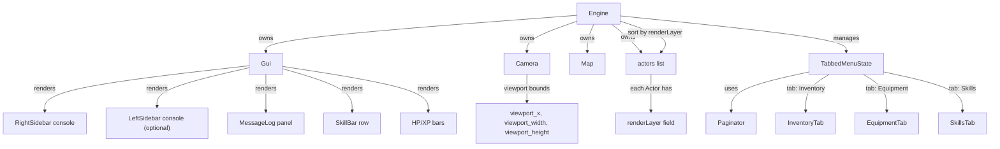

# Design Document — UI Rework

## Overview

This design transforms the current 80×50 single-panel layout into a 120×50 multi-panel interface with persistent sidebars, a non-overlapping message log, a skill shortcut bar, z-ordered actor rendering, tabbed modal menus with pagination, improved character generation descriptions, and CP437 tileset remapping.

The existing `Engine(80, 50)` initialization becomes `Engine(120, 50)`. The map viewport shrinks to accommodate sidebars, while the underlying map dimensions (160×86) remain unchanged. The Camera class is updated to target the new viewport bounds. All modal overlays (inventory, character sheet, advances) are consolidated into a single tabbed menu system with pagination support.

**Key design decisions:**

1. **Sidebar as data-driven render pass** — Sidebars query player state each frame and render into dedicated `TCODConsole` sub-consoles. No sidebar state is persisted in save files.
2. **Render layers via integer field on Actor** — A new `renderLayer` field on Actor controls draw order. The existing `sendToBack` pattern is preserved for backward compatibility but render-layer sorting is the primary mechanism.
3. **Tabbed menu as state machine** — A single `TabbedMenuState` struct replaces the separate `InventoryState`/`CharacterSheetState`/`AdvancesState` overlays, each becoming a tab with independent scroll state.
4. **Pagination as a reusable utility** — A `Paginator` struct encapsulates page arithmetic and is shared by all scrollable lists (inventory, skills, advances, pickup menu).
5. **CP437 tileset loaded via libtcod's custom font API** — `TCODConsole::setCustomFont("terminal.png", TCOD_FONT_LAYOUT_CP437, 16, 16)` before `initRoot()`.

---

## Architecture

### New Screen Layout (120×50)

```
┌──────────────────────────────────────────────────────────────────────────────────────────────────────────────────────────┐
│  Left Sidebar (20 cols)  │           Map Viewport (76 cols × 42 rows)                │  Right Sidebar (24 cols)         │
│  [optional — disabled    │                                                           │  ┌─ Equipment ─────────────────┐ │
│   by default]            │                                                           │  │ Weapon: Laspistol           │ │
│                          │                                                           │  │ Offhand: Combat Knife       │ │
│                          │                                                           │  │ Head: --empty--             │ │
│                          │                                                           │  │ Body: Flak Armour           │ │
│                          │                                                           │  ├─ Ammo ───────────────────── │ │
│                          │                                                           │  │ Laspistol: 4/6              │ │
│                          │                                                           │  ├─ Characteristics ────────── │ │
│                          │                                                           │  │ WS 35  BS 42  S 30         │ │
│                          │                                                           │  │ T 28   Ag 40  Int 32       │ │
│                          │                                                           │  │ Per 38 WP 30  Fel 25       │ │
│                          │                                                           │  ├─ Skills ────────────────── │ │
│                          │                                                           │  │ Dodge                       │ │
│                          │                                                           │  │ Awareness                   │ │
│                          │                                                           │  └─────────────────────────────┘ │
├──────────────────────────┼───────────────────────────────────────────────────────────┼──────────────────────────────────┤ row 42
│                          │  Message Log (76 cols × 6 rows)                            │                                  │
│  HP Bar / Dungeon Lv     │  > You fire the Laspistol at the Ork Boy.                 │                                  │
│                          │  > The Ork Boy takes 8 damage.                            │                                  │
│                          │  > You pick up the Combat Knife.                          │                                  │
├──────────────────────────┼───────────────────────────────────────────────────────────┼──────────────────────────────────┤ row 48
│                          │  Skill Bar: [1] Dodge  [2] Parry  [3] Aimed Shot          │                                  │
└──────────────────────────┴───────────────────────────────────────────────────────────┴──────────────────────────────────┘ row 50
```

### Layout Constants (New)

| Constant                | Value | Notes                                      |
|-------------------------|-------|--------------------------------------------|
| `SCREEN_WIDTH`          | 120   | Root console width                         |
| `SCREEN_HEIGHT`         | 50    | Root console height                        |
| `RIGHT_SIDEBAR_WIDTH`   | 24    | Fixed right sidebar                        |
| `LEFT_SIDEBAR_WIDTH`    | 20    | Left sidebar (when enabled)                |
| `LEFT_SIDEBAR_ENABLED`  | false | Default: disabled                          |
| `VIEWPORT_X`            | 0     | (or LEFT_SIDEBAR_WIDTH when enabled)       |
| `VIEWPORT_WIDTH`        | 96    | SCREEN_WIDTH - RIGHT_SIDEBAR_WIDTH (- LEFT if enabled) |
| `VIEWPORT_HEIGHT`       | 42    | SCREEN_HEIGHT - HUD_HEIGHT                 |
| `HUD_HEIGHT`            | 8     | Bottom panel (message log + skill bar)     |
| `MSG_LOG_HEIGHT`        | 6     | Message log rows                           |
| `SKILL_BAR_HEIGHT`      | 1     | Skill bar row count                        |
| `TILESET_CHAR_WIDTH`    | 16    | CP437 tile pixel width                     |
| `TILESET_CHAR_HEIGHT`   | 16    | CP437 tile pixel height                    |

### Component Interaction Diagram



---

## Components and Interfaces

### Modified: Engine

```cpp
// New constants added to Engine or Constants.h
namespace layout {
    inline constexpr int SCREEN_WIDTH         = 120;
    inline constexpr int SCREEN_HEIGHT        = 50;
    inline constexpr int RIGHT_SIDEBAR_WIDTH  = 24;
    inline constexpr int LEFT_SIDEBAR_WIDTH   = 20;
    inline constexpr bool LEFT_SIDEBAR_ENABLED = false;
    inline constexpr int HUD_HEIGHT           = 8;
    inline constexpr int MSG_LOG_HEIGHT       = 6;
    inline constexpr int SKILL_BAR_HEIGHT     = 1;

    // Derived
    inline constexpr int VIEWPORT_X      = LEFT_SIDEBAR_ENABLED ? LEFT_SIDEBAR_WIDTH : 0;
    inline constexpr int VIEWPORT_WIDTH  = SCREEN_WIDTH - RIGHT_SIDEBAR_WIDTH
                                           - (LEFT_SIDEBAR_ENABLED ? LEFT_SIDEBAR_WIDTH : 0);
    inline constexpr int VIEWPORT_HEIGHT = SCREEN_HEIGHT - HUD_HEIGHT;
}
```

Engine constructor changes from `Engine(80, 50)` to `Engine(layout::SCREEN_WIDTH, layout::SCREEN_HEIGHT)`.

Before `initRoot()`, the engine calls:
```cpp
TCODConsole::setCustomFont("terminal.png", TCOD_FONT_LAYOUT_CP437, 16, 16);
```

### Modified: Camera

Camera viewport dimensions update to match `layout::VIEWPORT_WIDTH × layout::VIEWPORT_HEIGHT`. The camera offset is recalculated so the player centres within the new viewport:

```cpp
Camera(layout::VIEWPORT_X, 0, layout::VIEWPORT_WIDTH, layout::VIEWPORT_HEIGHT, mapWidth, mapHeight);
```

### Modified: Actor — Render Layer

```cpp
// New field on Actor
int renderLayer = 0;

// Render layer constants
namespace RenderLayers {
    inline constexpr int DECORATION = 0;
    inline constexpr int ITEM       = 1;
    inline constexpr int DOOR       = 2;
    inline constexpr int CORPSE     = 3;
    inline constexpr int LIVING     = 4;
}
```

`renderLayer` is assigned at actor creation based on component presence:
- Has `ai` or is player → `LIVING`
- Has `openable` (door) → `DOOR`
- Has `pickable` (item) → `ITEM`
- Otherwise (decoration) → `DECORATION`

On death, `renderLayer` is set to `CORPSE`.

### New: Paginator Utility

```cpp
struct Paginator {
    int totalItems = 0;
    int pageSize = 20;       // items per page
    int currentPage = 0;

    int totalPages() const;       // ceil(totalItems / pageSize)
    int startIndex() const;       // currentPage * pageSize
    int endIndex() const;         // min(startIndex + pageSize, totalItems)
    int displayCount() const;     // endIndex - startIndex
    bool canAdvance() const;      // currentPage < totalPages - 1
    bool canRetreat() const;      // currentPage > 0
    void nextPage();              // ++currentPage (clamped)
    void prevPage();              // --currentPage (clamped to 0)
    std::string indicator() const; // "Page 2/5" format string
};
```

### New: TabbedMenuState

```cpp
struct TabbedMenuState {
    enum class Tab { INVENTORY = 0, EQUIPMENT, SKILLS, COUNT };
    Tab activeTab = Tab::INVENTORY;

    // Per-tab scroll state preserved across tab switches
    std::array<Paginator, static_cast<int>(Tab::COUNT)> paginators;

    // Inventory tab action (use/drop)
    InventoryState::Action pendingAction = InventoryState::Action::USE;

    void cycleTab();              // activeTab = (activeTab + 1) % COUNT
    Paginator& activePaginator(); // paginators[static_cast<int>(activeTab)]
};
```

### Modified: Gui — Sidebar Rendering

The `Gui` class gains new sub-consoles and render methods:

```cpp
class Gui {
    // Existing
    std::unique_ptr<TCODConsole> hudConsole;
    
    // New sub-consoles
    std::unique_ptr<TCODConsole> rightSidebarConsole;
    std::unique_ptr<TCODConsole> leftSidebarConsole;  // nullptr if disabled
    
    // New render methods
    void renderRightSidebar();
    void renderLeftSidebar();
    void renderMessageLog();     // replaces inline message rendering
    void renderSkillBar();
    
    // Message log (replaces existing bounded deque)
    static constexpr int MSG_LOG_CAPACITY = layout::MSG_LOG_HEIGHT;
    // ...existing log list, capacity updated to MSG_LOG_CAPACITY
};
```

### Modified: Gui — Message Log Fix

The message log no longer shares screen space with mouse-look or targeting messages. It renders into a dedicated region of the HUD panel. All messages — combat, exploration, targeting — flow through the same `gui->message()` API and append to the single log. The log capacity increases from 5 to 6 (MSG_LOG_HEIGHT).

### New: SkillBarEntry

```cpp
struct SkillBarEntry {
    std::string name;
    char keybinding;       // '1' through '9'
    bool available;        // false if on cooldown or prerequisites unmet
};
```

The skill bar queries the player's active combat skills each frame and builds a vector of `SkillBarEntry` for rendering.

### Modified: Character Generation — Description Display

`HomeworldTemplate` and `CareerTemplate` gain a `std::string description` field populated from Lua:

```cpp
struct HomeworldTemplate {
    std::string name;
    std::string description;  // NEW: lore text from Homeworlds.lua
    std::array<int, 9> characteristicMods;
    // ...
};

struct CareerTemplate {
    std::string name;
    std::string description;  // NEW: lore text from Careers.lua
    // ...
};
```

The chargen render function displays the description for the currently highlighted option in a text area beside or below the selection list.

---

## Data Models

### Layout Geometry Model

```cpp
struct LayoutRect {
    int x, y, width, height;
    
    bool intersects(const LayoutRect& other) const {
        return x < other.x + other.width && x + width > other.x
            && y < other.y + other.height && y + height > other.y;
    }
};

// Computed layout rectangles (derived from constants)
struct ScreenLayout {
    LayoutRect viewport;       // {VIEWPORT_X, 0, VIEWPORT_WIDTH, VIEWPORT_HEIGHT}
    LayoutRect rightSidebar;   // {SCREEN_WIDTH - RIGHT_SIDEBAR_WIDTH, 0, RIGHT_SIDEBAR_WIDTH, SCREEN_HEIGHT}
    LayoutRect leftSidebar;    // {0, 0, LEFT_SIDEBAR_WIDTH, SCREEN_HEIGHT} (if enabled)
    LayoutRect messageLog;     // {VIEWPORT_X, VIEWPORT_HEIGHT, VIEWPORT_WIDTH, MSG_LOG_HEIGHT}
    LayoutRect skillBar;       // {VIEWPORT_X, VIEWPORT_HEIGHT + MSG_LOG_HEIGHT + 1, VIEWPORT_WIDTH, SKILL_BAR_HEIGHT}
    LayoutRect hudBars;        // {0, VIEWPORT_HEIGHT, VIEWPORT_X or BAR_WIDTH, HUD_HEIGHT}
};
```

### Render Layer Assignment Table

| Actor Category          | Components Present              | Render Layer |
|------------------------|---------------------------------|--------------|
| Decoration             | none of ai/destructible/attacker| 0            |
| Item                   | pickable                        | 1            |
| Door                   | openable                        | 2            |
| Corpse                 | destructible (hp <= 0)          | 3            |
| Living creature        | ai, or is player                | 4            |

### Paginator State Model

| Field        | Type | Invariant                                      |
|--------------|------|------------------------------------------------|
| totalItems   | int  | >= 0                                           |
| pageSize     | int  | > 0                                            |
| currentPage  | int  | 0 <= currentPage < totalPages() (or 0 if empty)|

### Tabbed Menu State Model

| Field           | Type                  | Invariant                              |
|-----------------|-----------------------|----------------------------------------|
| activeTab       | Tab enum              | 0 <= activeTab < Tab::COUNT            |
| paginators      | array<Paginator, 3>   | each independently managed             |
| pendingAction   | InventoryState::Action| USE or DROP                            |

### CP437 Glyph Mapping

All actor glyphs reference standard CP437 codepoints (0–255). The tileset is a 16×16 grid where tile position = `(codepoint % 16, codepoint / 16)`.

Key mappings:
| Symbol | CP437 Codepoint | Usage            |
|--------|----------------|------------------|
| @      | 64             | Player           |
| <      | 60             | Stairs up        |
| >      | 62             | Stairs down      |
| +      | 43             | Closed door      |
| /      | 47             | Open door        |
| .      | 250            | Floor (middle dot)|
| #      | 35             | Wall (fallback)  |
| !      | 33             | Potion           |
| ?      | 63             | Scroll           |

Box-drawing wall characters use CP437 codepoints 179–218 (single/double line segments).

---

## Correctness Properties

*A property is a characteristic or behavior that should hold true across all valid executions of a system — essentially, a formal statement about what the system should do. Properties serve as the bridge between human-readable specifications and machine-verifiable correctness guarantees.*

---

### Property 1: Layout geometry non-overlap invariant

*For any* valid layout configuration (with or without left sidebar enabled), the Map_Viewport, Right_Sidebar, Left_Sidebar (when enabled), and Message_Log rectangles SHALL NOT overlap — i.e., no two layout rectangles intersect, and their union fills the screen without gaps in the primary regions.

**Validates: Requirements 1.4, 4.1**

---

### Property 2: Right sidebar content completeness

*For any* player state with arbitrary equipment loadout (including empty slots), arbitrary characteristic values, and arbitrary skill set, the right sidebar content function SHALL produce output containing: (a) the name of every equipped item grouped by its slot, (b) a placeholder label for every empty slot, (c) current ammo and max capacity for any equipped ranged weapon, (d) all nine characteristic abbreviations with their numeric values, and (e) the name of every passive skill.

**Validates: Requirements 2.1, 2.2, 2.3, 2.4, 2.5**

---

### Property 3: Message log bounded-buffer invariant

*For any* sequence of messages added to the message log, the log SHALL: (a) never contain more than MSG_LOG_CAPACITY entries, (b) maintain messages in insertion order (oldest first), (c) when at capacity, remove only the oldest message to make room for a new one, and (d) each message occupies exactly one entry (no overwriting of existing entries).

**Validates: Requirements 4.2, 4.3, 4.4, 4.5**

---

### Property 4: Skill bar availability color selection

*For any* skill bar entry, the color selection function SHALL return a dimmed color variant when `available == false` and the normal skill color when `available == true`.

**Validates: Requirements 5.1, 5.3**

---

### Property 5: Render layer assignment by actor category

*For any* actor, the render layer assignment function SHALL return: DECORATION (0) if the actor has none of ai/destructible/attacker, ITEM (1) if it has pickable, DOOR (2) if it has openable, CORPSE (3) if destructible with hp <= 0, and LIVING (4) if it has ai or is the player. Living actors always have a strictly higher layer than items, doors, and decorations.

**Validates: Requirements 6.1, 6.3**

---

### Property 6: Render order sort invariant

*For any* set of actors with assigned render layers, the render-sorted sequence SHALL be in non-decreasing render layer order. When two actors share the same render layer and the same tile, the actor inserted later in the list SHALL appear after (rendered on top of) the earlier one.

**Validates: Requirements 6.2, 6.4**

---

### Property 7: Tab cycling is modular arithmetic

*For any* starting active tab index in [0, Tab::COUNT), calling `cycleTab()` SHALL set the active tab to `(current + 1) % Tab::COUNT`. The resulting index is always a valid tab.

**Validates: Requirements 7.2**

---

### Property 8: Tab scroll position round-trip preservation

*For any* sequence of tab switches where each tab's paginator is modified (page advanced or retreated), returning to a previously visited tab SHALL restore that tab's paginator `currentPage` to the value it had when the tab was last active.

**Validates: Requirements 7.4**

---

### Property 9: Pagination state machine correctness

*For any* Paginator with `totalItems >= 0` and `pageSize > 0`: (a) `displayCount()` SHALL equal `min(pageSize, totalItems - startIndex())`, (b) `totalPages()` SHALL equal `ceil(totalItems / pageSize)` (minimum 1), (c) `nextPage()` SHALL increment currentPage by 1 iff `canAdvance()`, (d) `prevPage()` SHALL decrement currentPage by 1 iff `canRetreat()`, and (e) `indicator()` SHALL return a string containing the correct current page (1-indexed) and total page count.

**Validates: Requirements 8.1, 8.2, 8.3, 8.4**

---

### Property 10: Character generation description display

*For any* homeworld or career template with a non-empty description field, when that option is highlighted in the character generation menu, the rendered output SHALL contain the template's description text.

**Validates: Requirements 9.1, 9.2, 9.5**

---

### Property 11: CP437 glyph mapping correctness

*For any* CP437 codepoint in [0, 255], the tileset mapping function SHALL produce tile coordinates `(codepoint % 16, codepoint / 16)`. For any actor glyph value, it SHALL be a valid CP437 codepoint in [0, 255].

**Validates: Requirements 10.1, 10.2, 10.3**

---

## Error Handling

| Scenario                                    | Handling                                                       |
|---------------------------------------------|----------------------------------------------------------------|
| terminal.png tileset file missing            | Log error to stderr, fall back to libtcod built-in 8×8 font    |
| Right sidebar data unavailable (null player) | Render empty sidebar with placeholder text                     |
| Left sidebar enabled but no talent data      | Render empty sidebar with "No talents" label                   |
| Paginator totalItems set to negative         | Clamp to 0; totalPages returns 1                               |
| Tab index out of bounds                      | Modular wrap via `% Tab::COUNT`                                |
| Render layer not assigned (default 0)        | Actor renders at DECORATION layer (lowest); harmless fallback  |
| Message log receives empty string            | Silently discard; do not add empty entry to log                |
| Skill bar has more skills than fit on screen | Truncate display at available width; no crash                  |
| Non-CP437 glyph detected at runtime          | Log warning, remap to '?' (codepoint 63) as fallback          |
| Homeworld/Career template missing description| Display "No description available." placeholder text           |

---

## Testing Strategy

### PBT Applicability Assessment

This feature contains significant pure logic amenable to property-based testing:
- **Paginator** — pure arithmetic functions with clear input/output
- **Layout geometry** — pure computation from constants, testable as invariants
- **Render layer assignment** — pure function from actor components to integer
- **Render sorting** — sort invariant over generated actor lists
- **Tab cycling** — modular arithmetic
- **Message log** — bounded buffer with clear invariants
- **Skill bar color selection** — pure boolean → color mapping
- **CP437 mapping** — pure arithmetic

UI rendering itself (blitting consoles to screen) is NOT suitable for PBT and will use visual inspection and example-based integration tests.

### Property-Based Testing Library

**RapidCheck** — already used in this project's test suite (see existing tests in `Tests/`). Each property test runs a minimum of 100 iterations.

### Dual Testing Approach

**Property-based tests** (RapidCheck, 100+ iterations each):
- All 11 correctness properties above
- Tag format: `// Feature: ui-rework, Property N: <property_text>`

**Unit tests** (Catch2, example-based):
- Smoke tests for layout constants (screen width >= 120, height >= 50, sidebar width >= 20)
- Specific CP437 glyph values (player = 64, stairs = 60/62)
- Left sidebar disabled → viewport fills available space
- Tabbed menu open/close state transitions
- Skill bar with empty skill set renders empty bar
- Chargen with template missing description shows placeholder

**Integration tests**:
- Load Homeworlds.lua and Careers.lua → verify all templates have description fields
- Full render cycle with new layout → no crashes, no out-of-bounds console writes
- Save/load round-trip with new renderLayer field preserved

### Test Configuration

```cpp
// Example property test structure
rc::check("Feature: ui-rework, Property 9: Pagination state machine correctness", []() {
    const int totalItems = *rc::gen::inRange(0, 500);
    const int pageSize = *rc::gen::inRange(1, 50);
    Paginator p{totalItems, pageSize, 0};
    
    RC_ASSERT(p.displayCount() == std::min(pageSize, totalItems - p.startIndex()));
    RC_ASSERT(p.totalPages() == std::max(1, (totalItems + pageSize - 1) / pageSize));
    // ...
});
```
