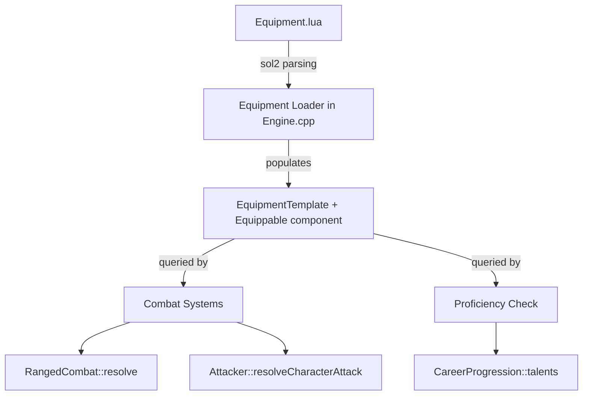

# Design Document: Weapon Types

## Overview

This feature extends the existing Equipment system with weapon classification metadata from the Rogue Trader RPG. Every weapon gains three classification enums — Size Classification, Weapon Group, and Damage Type — and ranged weapons carry an explicit Range Stat. These classifications drive three downstream mechanics:

1. **Proficiency penalties**: A −20 attack modifier when a character wields a weapon group they lack training in (via CareerProgression talents).
2. **Critical-hit table selection**: Damage Type selects the correct injury table (Energy, Explosive, Impact, Rending).
3. **Combat-mode restrictions**: Size Classification gates whether a weapon can fire ranged attacks at adjacent targets (Pistol: yes, Basic/Heavy: no).

The design extends the existing Lua→C++ pipeline: new optional string fields in `Equipment.lua` are parsed by the Equipment Loader in `Engine.cpp`, stored on the `Equippable` component, and queried at runtime by combat and proficiency systems.

## Architecture

The feature touches four layers of the existing architecture:



### Design Decisions

1. **Enums over strings**: Classification fields are stored as C++ `enum class` values, not raw strings. This provides compile-time safety, fast comparison, and typed accessors. String-to-enum conversion happens once at load time.

2. **Validation at load, not at runtime**: The Equipment Loader rejects invalid entries at startup with descriptive warnings. Runtime code can assume classification fields are always valid (or absent for non-weapons).

3. **Optional fields for non-weapons**: Armour and shields don't carry weapon classifications. Fields use `std::optional` so non-weapon equipment is unaffected.

4. **Proficiency via existing talent system**: The `CareerProgression::talents` set already stores acquired talent names as strings. Weapon Group proficiency is checked by looking for a talent named `"Weapon Training (<Group>)"` (e.g., `"Weapon Training (Las)"`). No new talent infrastructure is needed.

5. **Save format versioning**: A new `EQUIPPABLE_SAVE_V3` sentinel extends the existing versioned save/load pattern. Old saves without classification data load with `std::nullopt` values (graceful degradation).

6. **Range stat consolidation**: The `RangedStats::range` field already exists and defaults to 30. Requirement 4 adds explicit validation that Lua entries must provide a positive integer. No new field is needed — just validation enforcement.

## Components and Interfaces

### New Enums (Headers/WeaponTypes.h)

```cpp
#pragma once
#include <optional>
#include <string>
#include <string_view>

// Physical form-factor classification for weapons.
// Drives combat-mode restrictions (melee-only, pistol-in-melee, basic/heavy blocked in melee).
enum class SizeClassification {
    MELEE,    // melee-only, adjacent targets
    PISTOL,   // can fire at adjacent targets
    BASIC,    // cannot fire at adjacent targets
    HEAVY,    // cannot fire at adjacent targets
    THROWN    // ranged, any tile within range stat
};

// Technology/mechanism proficiency category.
// Drives the −20 penalty when character lacks "Weapon Training (<Group>)".
enum class WeaponGroup {
    LAS,
    SP,
    BOLT,
    MELTA,
    PLASMA,
    FLAME,
    PRIMITIVE,
    LAUNCHER,
    EXOTIC
};

// Type of harm inflicted. Selects the critical-hit injury table.
enum class DamageType {
    E,  // Energy
    X,  // Explosive
    I,  // Impact
    R   // Rending
};

// Parsing utilities: return std::nullopt on unrecognised input.
std::optional<SizeClassification> parseSizeClassification(std::string_view str);
std::optional<WeaponGroup> parseWeaponGroup(std::string_view str);
std::optional<DamageType> parseDamageType(std::string_view str);

// Display name for each enum value (for UI and error messages).
std::string_view sizeClassificationName(SizeClassification sc);
std::string_view weaponGroupName(WeaponGroup wg);
std::string_view damageTypeName(DamageType dt);
```

### Modified: Equippable Component (Headers/Equippable.h)

New fields added to the `Equippable` class:

```cpp
#include "WeaponTypes.h"

class Equippable : public Persistent {
public:
    // ... existing fields unchanged ...

    // Weapon classification metadata (empty for non-weapon items)
    std::optional<SizeClassification> sizeClass;
    std::optional<WeaponGroup> weaponGroup;
    std::optional<DamageType> damageType;

    // ... existing methods ...
    void save(TCODZip& zip) override;  // extended to V3
    void load(TCODZip& zip) override;  // handles V0/V1/V2/V3
};
```

### Modified: EquipmentTemplate (Headers/Engine.h)

```cpp
struct EquipmentTemplate {
    // ... existing fields ...
    std::optional<SizeClassification> sizeClass;
    std::optional<WeaponGroup> weaponGroup;
    std::optional<DamageType> damageType;
};
```

### New: Proficiency Check Utility

A free function in the combat/proficiency layer:

```cpp
// Returns true if the actor has the required weapon training talent.
// Checks CareerProgression::talents for "Weapon Training (<GroupName>)".
bool hasProficiency(const Actor* actor, WeaponGroup group);

// Returns the proficiency penalty (0 or -20) for the given actor and weapon.
int proficiencyModifier(const Actor* actor, WeaponGroup group);
```

### Modified: RangedCombat (combat-mode restriction)

The `RangedCombat::resolve` function gains an adjacency check before firing:

```cpp
// New check at the top of resolve():
// If shooter is adjacent to target (distance == 1) and weapon is Basic or Heavy,
// block the attack with a message.
```

### Modified: Equipment Loader (Engine.cpp)

The loader gains three new string field reads and validations per weapon entry:
- `sizeClass` → `parseSizeClassification()`
- `weaponGroup` → `parseWeaponGroup()`
- `damageType` → `parseDamageType()`

Validation rules:
- Weapon entries (have melee or ranged stats): all three fields required
- Non-weapon entries (armour, shields): all three fields skipped silently

## Data Models

### Enum Value Mappings

| Lua String | SizeClassification |
|---|---|
| `"Melee"` | `MELEE` |
| `"Pistol"` | `PISTOL` |
| `"Basic"` | `BASIC` |
| `"Heavy"` | `HEAVY` |
| `"Thrown"` | `THROWN` |

| Lua String | WeaponGroup |
|---|---|
| `"Las"` | `LAS` |
| `"SP"` | `SP` |
| `"Bolt"` | `BOLT` |
| `"Melta"` | `MELTA` |
| `"Plasma"` | `PLASMA` |
| `"Flame"` | `FLAME` |
| `"Primitive"` | `PRIMITIVE` |
| `"Launcher"` | `LAUNCHER` |
| `"Exotic"` | `EXOTIC` |

| Lua String | DamageType |
|---|---|
| `"E"` | `E` (Energy) |
| `"X"` | `X` (Explosive) |
| `"I"` | `I` (Impact) |
| `"R"` | `R` (Rending) |

### Serialization Format (V3)

The `Equippable::save` writes a new sentinel `EQUIPPABLE_SAVE_V3 = -20` followed by all existing V2 data, then:

```
int hasClassification (0 or 1)
if hasClassification:
    int sizeClass (cast from enum)
    int weaponGroup (cast from enum)
    int damageType (cast from enum)
```

On load, V3 reads classification data. V2/V1/V0 loads leave classification fields as `std::nullopt` (old saves degrade gracefully — weapons loaded from old saves won't trigger proficiency checks or mode restrictions until the game re-matches them against Equipment.lua templates).

### Equipment.lua Schema Extension

Each weapon entry gains three new string fields:

```lua
{
    name = "Laspistol",
    -- ... existing fields ...
    sizeClass   = "Pistol",
    weaponGroup = "Las",
    damageType  = "E",
    ranged = {
        -- range field is now validated: must be > 0, defaults to 30 if absent
        range = 30,
        -- ...
    },
}
```

### Proficiency Talent Naming Convention

Talents follow the pattern: `"Weapon Training (<GroupName>)"` where `<GroupName>` is the display name of the WeaponGroup enum value (e.g., "Las", "SP", "Bolt", "Primitive", "Exotic").

This convention is consistent with how `CareerProgression::talents` already stores talent names as free-form strings loaded from `Talents.lua`.


## Correctness Properties

*A property is a characteristic or behavior that should hold true across all valid executions of a system — essentially, a formal statement about what the system should do. Properties serve as the bridge between human-readable specifications and machine-verifiable correctness guarantees.*

### Property 1: Parser round-trip for classification enums

*For any* string `s`, `parseSizeClassification(s)` returns a value if and only if `s` is one of the five valid Size Classification strings, and for every valid string, `sizeClassificationName(parseSizeClassification(s).value()) == s`. The same property holds for `parseWeaponGroup` (9 valid values) and `parseDamageType` (4 valid values).

**Validates: Requirements 1.1, 1.2, 1.3, 2.1, 2.2, 2.3, 3.1, 3.2, 3.3**

### Property 2: Range acceptance predicate

*For any* integer `n`, the range validation logic accepts `n` as a valid range if and only if `n > 0`. Accepted values are stored unchanged on `RangedStats::range`; rejected values cause the weapon entry to be skipped.

**Validates: Requirements 4.1, 4.2, 4.3**

### Property 3: Equip preserves classification metadata

*For any* Equippable with classification fields set (sizeClass, weaponGroup, damageType), calling `Equipment::equip` on the item and then reading the classification fields produces the identical values that were set before equipping.

**Validates: Requirements 5.4**

### Property 4: Proficiency modifier is determined by talent membership

*For any* WeaponGroup `g` and any character (represented by their talent set), `proficiencyModifier(actor, g)` equals −20 if the talent set does not contain `"Weapon Training (<groupName>)"`, and equals 0 if it does.

**Validates: Requirements 6.1, 6.2**

### Property 5: Proficiency penalty stacks additively

*For any* Attacker with an existing set of modifiers summing to `S`, adding the proficiency penalty of −20 results in a new `computeThreshold()` that equals `clamp(skillValue + S - 20, 1, 99)`.

**Validates: Requirements 6.3**

### Property 6: Size classification combat-mode gate

*For any* weapon with a SizeClassification and any target distance `d`:
- If sizeClass is `PISTOL`: ranged attack is allowed at all distances ≤ range (including d=1).
- If sizeClass is `BASIC` or `HEAVY`: ranged attack is allowed only at distances > 1 and ≤ range.
- If sizeClass is `MELEE`: only melee attack allowed (d must equal 1).
- If sizeClass is `THROWN`: ranged attack is allowed at all distances ≤ range.

**Validates: Requirements 7.1, 7.2, 7.4, 7.5**

### Property 7: Serialization round-trip for classification data

*For any* valid combination of (SizeClassification, WeaponGroup, DamageType) stored on an Equippable, saving to a TCODZip buffer and loading from that buffer produces an Equippable with identical classification values.

**Validates: Requirements 9.1, 9.2**

### Property 8: Weapon entry validation completeness

*For any* Equipment.lua entry that contains a `melee` or `ranged` table, the entry is accepted by the loader if and only if all three classification fields (`sizeClass`, `weaponGroup`, `damageType`) are present and valid.

**Validates: Requirements 8.2, 1.4, 2.4, 3.4**

## Error Handling

### Load-Time Validation Errors

All classification validation errors are handled at Equipment Loader time (game initialization). The loader follows the existing pattern established for other fields:

1. **Invalid enum string**: Log a warning naming the weapon and the invalid field value, skip the entire entry. Pattern: `"Equipment.lua: skipping '<name>' — invalid <field> '<value>'."`.

2. **Missing required field on weapon**: Log a warning naming the weapon and the missing field, skip the entry. Pattern: `"Equipment.lua: skipping '<name>' — missing required <field>."`.

3. **Invalid range value**: Log a warning and skip. Pattern: `"Equipment.lua: skipping '<name>' — range must be > 0."`.

4. **Non-weapon items missing classification**: No warning, no skip. Armour and offhand items without sizeClass/weaponGroup/damageType are accepted silently.

### Runtime Error Handling

- **Old save files (V2 or earlier)**: Classification fields load as `std::nullopt`. Combat systems treat missing classification as "no restriction" — the proficiency penalty is not applied, and the combat-mode gate is not enforced. This allows old saves to remain playable.

- **Equipped weapon without classification**: Defensive null checks (`if (equippable->sizeClass)`) before combat-mode gates and proficiency checks. No crash, no penalty applied.

### Error Strategy Summary

| Error Condition | Handling | User Impact |
|---|---|---|
| Invalid sizeClass string in Lua | Warning + skip entry | Weapon not available in game |
| Invalid weaponGroup string in Lua | Warning + skip entry | Weapon not available |
| Invalid damageType string in Lua | Warning + skip entry | Weapon not available |
| Missing classification on weapon | Warning + skip entry | Weapon not available |
| Missing classification on armour | Silent accept | No impact |
| Range ≤ 0 in Lua | Warning + skip entry | Weapon not available |
| Old save without classification | Load as nullopt | No penalties applied |

## Testing Strategy

### Property-Based Tests (RapidCheck)

Property-based tests validate the universal correctness properties defined above. Each property test runs minimum 100 iterations with randomly generated inputs.

**Library**: RapidCheck (already used in the project via Catch2 integration)

**Test file**: `Tests/test_weapon_types.cpp`

Properties to implement:
1. **Parser round-trip**: Generate arbitrary strings (including the valid set and random garbage). Verify parse→name round-trips for valid inputs and returns nullopt for invalid inputs.
2. **Range acceptance**: Generate random integers (positive, zero, negative). Verify acceptance predicate matches `n > 0`.
3. **Equip preserves classification**: Generate random (SizeClassification, WeaponGroup, DamageType) tuples. Set on Equippable, call equip, verify unchanged.
4. **Proficiency modifier**: Generate random WeaponGroup and random talent sets. Verify modifier is −20 iff matching talent absent.
5. **Proficiency stacking**: Generate random modifier vectors and verify threshold computation.
6. **Size-class combat gate**: Generate random (SizeClassification, distance) pairs. Verify allowed/blocked matches the rules.
7. **Serialization round-trip**: Generate random classification tuples, save to buffer, load, verify equality.
8. **Weapon validation completeness**: Generate weapon entries with random subsets of fields present/absent. Verify acceptance iff all three present and valid.

Configuration:
- Minimum 100 iterations per property
- Tag format: `// Feature: weapon-types, Property N: <title>`

### Unit Tests (Catch2)

Example-based tests for specific scenarios and edge cases:

**Test file**: `Tests/test_weapon_types.cpp`

1. **Default range value**: Ranged entry without `range` field gets default 30.
2. **Non-weapon items accepted without classification**: Armour entries load without sizeClass/weaponGroup/damageType.
3. **Adjacency message**: Firing Basic weapon at adjacent target produces the expected message.
4. **Melee-only restriction**: Melee weapon cannot attack at distance > 1.
5. **Existing weapon retrofit values**: Verify all 10 existing weapons in Equipment.lua have correct classification metadata (one CHECK per weapon).
6. **Old save compatibility**: V2 save data loads with nullopt classification fields.

### Integration Tests

1. **Full Equipment.lua load**: Load the actual Equipment.lua file and verify all weapon entries have non-null classification fields after loading.
2. **Combat flow with proficiency**: Create an actor without "Weapon Training (Las)", equip a Las weapon, attack, verify −20 is applied to the attack threshold.
