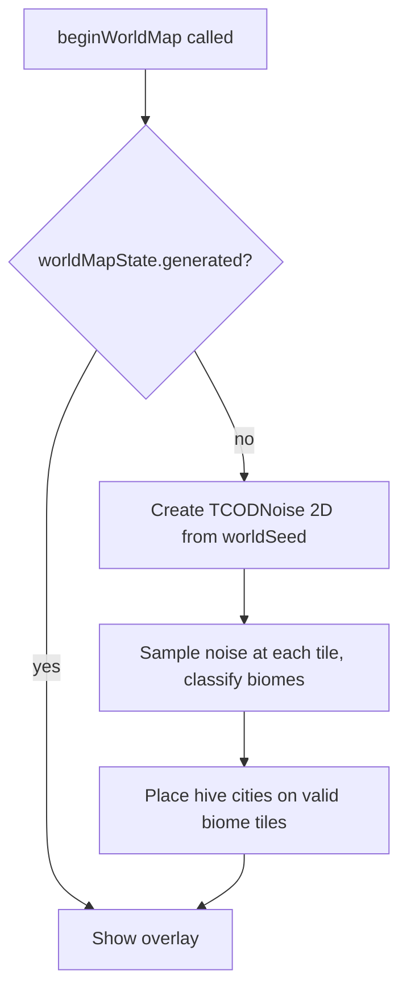

# Design Document — World Map

## Overview

The world map adds a strategic navigation layer to 40kRL, allowing the player to view and
fast-travel across a planetary surface. It is implemented as a modal overlay (toggled with 'm')
following the same begin/update/render pattern used by the inventory, look mode, and character
sheet. Terrain is generated using libtcod's `TCODNoise` Perlin noise at a scale of 10km per tile,
classified into biomes (wasteland, ash desert, dead forest, toxic swamp), and rendered with
distinct glyphs and colours. Hive cities are placed as fast-travel destinations with minimum
separation constraints. The world map state persists across save/load cycles using the existing
`TCODZip` archive, with backward compatibility for pre-world-map saves.

Key design decisions:

1. **Overlay, not a separate map object** — The world map is purely a UI overlay with its own
   data. It does not replace or interact with the dungeon `Map`; it exists as a
   `WorldMapState` struct owned by Engine, active only when `GameStatus == WORLD_MAP`.
2. **Generate-from-seed, store metadata** — Terrain is regenerated deterministically from a
   stored seed rather than persisting the full tile grid. Only city positions/names and player
   position are serialized.
3. **Biome thresholds reuse outdoor noise pattern** — The same `TCODNoise` + threshold approach
   used for outdoor level generation is applied at strategic scale with different threshold
   bands to produce biome variety.
4. **WFC placeholder** — Fast-travel generates a BSP level until the WFC hive generator is
   implemented, keeping the feature functional without blocking on a separate spec.

---

## Architecture

### Integration with Engine State Machine

```
                        ┌─────────────────────────────┐
                        │            IDLE              │
                        │  (player input → actions)    │
                        └──┬──────┬──────┬──────┬─────┘
                           │      │      │      │
                      'i'  │ 'l'  │ 'c'  │ 'm'  │
                           ▼      ▼      ▼      ▼
                      INVENTORY  LOOK  CHAR   WORLD_MAP
                        │      │      │      │
                       ESC    ESC    ESC   ESC/'m'
                        │      │      │      │
                        └──────┴──────┴──────┘
                                   │
                                   ▼
                                 IDLE
```

`WORLD_MAP` follows the identical lifecycle as the other modal overlays:
- `beginWorldMap()` — populates `std::optional<WorldMapState>`, sets `gameStatus = WORLD_MAP`
- `updateWorldMap()` — processes cursor movement, fast-travel, dismiss
- `renderWorldMap()` — blits a `TCODConsole` overlay onto the root console

### Data Flow

```
┌────────────────────────────────────────────────────────────┐
│                    Engine (singleton)                        │
│                                                            │
│  std::optional<WorldMapState> worldMapState                │
│    ├── worldSeed      : uint32_t                           │
│    ├── playerX, playerY : int (world map coords)           │
│    ├── cursorX, cursorY : int                              │
│    ├── cities          : std::vector<HiveCity>             │
│    ├── biomes          : std::vector<BiomeType>  (160×86)  │
│    └── generated       : bool                              │
│                                                            │
│  Serialized in game.sav:                                   │
│    [marker][seed][px][py][cityCount][...cities...]          │
└────────────────────────────────────────────────────────────┘
```

### World Map Generation Pipeline



---

## Components and Interfaces

### New Enum: BiomeType

```cpp
enum class BiomeType : uint8_t {
    TOXIC_SWAMP  = 0,  // lowest noise values
    DEAD_FOREST  = 1,
    ASH_DESERT   = 2,
    WASTELAND    = 3,  // highest noise values
    HIVE_CITY    = 4   // overridden by placement
};
```

### New Struct: HiveCity

```cpp
struct HiveCity {
    int x;              // world map tile coordinate
    int y;              // world map tile coordinate
    std::string name;   // up to 64 characters
};
```

### New Struct: WorldMapState

```cpp
struct WorldMapState {
    uint32_t worldSeed = 0;
    int playerX = 0;
    int playerY = 0;
    int cursorX = 0;
    int cursorY = 0;
    std::vector<BiomeType> biomes;          // flat 160×86 array
    std::vector<HiveCity> cities;
    bool generated = false;                 // true after first generation
};
```

### Engine Additions

| Addition | Type | Purpose |
|----------|------|---------|
| `WORLD_MAP` | GameStatus enum value | New state machine state |
| `worldMapState` | `std::optional<WorldMapState>` | Active overlay state |
| `beginWorldMap()` | method | Initialise overlay, generate if needed |
| `updateWorldMap()` | method | Handle cursor/fast-travel/dismiss input |
| `renderWorldMap()` | method | Blit world map console to root |

### Biome Classification Thresholds

Noise values are in [-1.0, 1.0]. The thresholds divide the range into four biomes:

| Biome | Noise Range | Glyph | Colour |
|-------|------------|-------|--------|
| Toxic Swamp | `< -0.4` | `~` | Green (0, 180, 0) |
| Dead Forest | `[-0.4, -0.1)` | `♠` (0x06) | Dark Grey (80, 80, 80) |
| Ash Desert | `[-0.1, 0.2)` | `.` | Tan (180, 150, 80) |
| Wasteland | `≥ 0.2` | `,` | Brown (140, 100, 40) |
| Hive City (override) | N/A | `#` | Bright White (255, 255, 255) |

These thresholds are configurable via `Scripts/Config.lua`:
- `worldMapSwampThreshold` (default: -0.4)
- `worldMapForestThreshold` (default: -0.1)
- `worldMapDesertThreshold` (default: 0.2)

### Rendering Constants

```cpp
static constexpr int WORLD_MAP_WIDTH  = 160;
static constexpr int WORLD_MAP_HEIGHT = 86;
static constexpr int WORLD_MAP_OVERLAY_W = 80;  // matches screen width
static constexpr int WORLD_MAP_OVERLAY_H = 50;  // matches screen height
```

The overlay uses a dedicated `TCODConsole(WORLD_MAP_OVERLAY_W, WORLD_MAP_OVERLAY_H)`:
- Row 0: box-drawing top border with centred "World Map" title
- Rows 1–48: map tiles (viewport into the 160×86 map, scrollable with cursor)
- Row 49: box-drawing bottom border with status line (biome name + city name)

When the map is larger than the viewport (it is: 160×86 vs 78×48 interior), the view scrolls
to keep the cursor centred, clamped to map bounds.

---

## Data Models

### WorldMapState (detailed field semantics)

| Field | Type | Semantics |
|-------|------|-----------|
| `worldSeed` | `uint32_t` | Deterministic seed for noise + city placement RNG |
| `playerX`, `playerY` | `int` | Player's current tile on the world map (0-indexed) |
| `cursorX`, `cursorY` | `int` | Cursor position for navigation (starts at playerX/Y) |
| `biomes` | `std::vector<BiomeType>` | Flat array [x + y * 160], one entry per tile |
| `cities` | `std::vector<HiveCity>` | Placed hive cities (max 20) |
| `generated` | `bool` | False until terrain + cities are computed |

### Save Format Extension

The world map data is appended after the existing save stream (after `LevelCache::save`):

```
── World Map Save Section ──────────────────────────────────
 1. int    presenceMarker  (0x574D = 'WM', indicates world map data follows)
 2. int    worldSeed       (uint32_t stored as int)
 3. int    playerX
 4. int    playerY
 5. int    cityCount       (0..20)
 6. foreach city:
      int    x
      int    y
      string name          (TCODZip putString, null-terminated)
── End World Map Section ───────────────────────────────────
```

**Backward compatibility**: If the next int after `LevelCache::save` is not `0x574D`, the
loader treats it as a pre-world-map save and generates a fresh world map.

**Validation**: If `cityCount > 20` or `cityCount < 0`, the loader discards world map data
and regenerates.

### Noise Generation Parameters

| Parameter | Config Key | Default | Valid Range |
|-----------|-----------|---------|-------------|
| Noise scale | `worldMapNoiseScale` | 0.03 | (0.0, 1.0) |
| Octaves | `worldMapOctaves` | 4 | [1, 8] |
| Lacunarity | `worldMapLacunarity` | 2.0 | [1.0, 4.0] |
| Swamp threshold | `worldMapSwampThreshold` | -0.4 | [-1.0, 1.0] |
| Forest threshold | `worldMapForestThreshold` | -0.1 | [-1.0, 1.0] |
| Desert threshold | `worldMapDesertThreshold` | 0.2 | [-1.0, 1.0] |
| City count | `worldMapCityCount` | 3 | [1, 20] |
| City separation | `worldMapCitySeparation` | 15 | [1, 80] |

### Hive City Placement Algorithm

```
1. Create TCODRandom from worldSeed
2. For each city i in [0, cityCount):
   a. For attempt in [0, 100):
      - Pick random (x, y) from RNG
      - Check biome is WASTELAND or ASH_DESERT
      - Check Euclidean distance to all previously placed cities ≥ separation
      - If valid: place city, assign name from Lua table (index i), break
   b. If all 100 attempts fail: log warning, skip this city
3. Mark biomes[x + y * width] = HIVE_CITY for each placed city
```

### City Name Table (Scripts/Config.lua)

```lua
config.worldMapCityNames = {
    "Hive Primus",
    "Hive Secundus",
    "Hive Tertius",
    "Hive Quartus",
    "Hive Quintus"
}
```

If the name table has fewer entries than the configured city count, numeric suffixes are
appended (e.g., "Hive Primus 2").

---


## Correctness Properties

*A property is a characteristic or behavior that should hold true across all valid executions of a
system — essentially, a formal statement about what the system should do. Properties serve as the
bridge between human-readable specifications and machine-verifiable correctness guarantees.*

---

### Property 1: Biome classification is consistent with threshold ordering

*For any* noise value `v` in [-1.0, 1.0] and any valid set of thresholds
`(swamp < forest < desert)`, classifying `v` SHALL produce:
- TOXIC_SWAMP if `v < swampThreshold`
- DEAD_FOREST if `swampThreshold <= v < forestThreshold`
- ASH_DESERT if `forestThreshold <= v < desertThreshold`
- WASTELAND if `v >= desertThreshold`

The classification function is a total function with no gaps or overlaps.

**Validates: Requirements 2.3, 3.1**

---

### Property 2: World map terrain generation is deterministic

*For any* seed value (uint32_t), generating the world map biome array twice with the same seed,
noise scale, octave count, lacunarity, and thresholds SHALL produce element-wise identical biome
vectors.

**Validates: Requirements 2.5, 8.2**

---

### Property 3: Hive city placement is deterministic

*For any* seed value (uint32_t), running the hive city placement algorithm twice with the same
seed and configuration parameters SHALL produce identical city lists (same count, same positions,
same name assignments).

**Validates: Requirements 8.3**

---

### Property 4: Hive city minimum separation invariant

*For any* generated world map with placed hive cities, every pair of cities `(ci, cj)` where
`i ≠ j` SHALL satisfy `euclidean_distance(ci, cj) >= configured_separation`.

**Validates: Requirements 5.2**

---

### Property 5: Hive cities are placed only on valid biomes

*For any* generated world map, every placed hive city at position `(x, y)` SHALL have a base
biome (before the HIVE_CITY override) of either WASTELAND or ASH_DESERT.

**Validates: Requirements 5.3**

---

### Property 6: Hive city names are unique

*For any* generated world map, all placed hive cities SHALL have pairwise distinct name strings.

**Validates: Requirements 5.4**

---

### Property 7: World map state serialization round-trip

*For any* valid `WorldMapState` (with valid seed, player position within bounds, 0–20 cities
with positions in bounds and names ≤ 64 chars), serializing to a `TCODZip` archive and then
deserializing SHALL produce an equivalent state: same seed, same player position, same city
count, and same city positions and names.

**Validates: Requirements 7.1, 7.2**

---

### Property 8: Cursor movement with boundary clamping

*For any* cursor position `(cx, cy)` within bounds `[0, width-1] × [0, height-1]` and any
directional input `(dx, dy)` from the set of 8 cardinal/diagonal directions, after processing:
- If `(cx+dx, cy+dy)` is within bounds: cursor SHALL equal `(cx+dx, cy+dy)`
- If `(cx+dx, cy+dy)` is out of bounds: cursor SHALL remain at `(cx, cy)`

**Validates: Requirements 4.2, 4.3**

---

### Property 9: Status line reflects cursor biome

*For any* cursor position `(cx, cy)` on the world map, the status line text SHALL contain the
biome name string corresponding to `biomes[cx + cy * width]`. If a hive city occupies that
tile, the status line SHALL additionally contain the city's name string.

**Validates: Requirements 3.6, 4.4**

---

### Property 10: No game logic executes during WORLD_MAP state

*For any* game state where `gameStatus == WORLD_MAP` and any sequence of keyboard inputs
processed by `updateWorldMap()`, the following SHALL remain unchanged:
- All actor positions (x, y)
- `map->currentScentValue`
- `dungeonLevel`

**Validates: Requirements 1.3**

---

### Property 11: WORLD_MAP transition is guarded by IDLE state

*For any* `GameStatus` value that is not `IDLE` (STARTUP, NEW_TURN, VICTORY, DEFEAT, TARGETING,
INVENTORY, PICKUP_MENU, LOOK, CHARACTER_SHEET, WORLD_MAP), simulating an 'm' keypress SHALL
leave `gameStatus` unchanged and `worldMapState` unchanged (either nullopt or already active).

**Validates: Requirements 9.3**

---

### Property 12: World map guarantees minimum connected ground region

*For any* seed, after the world map generation algorithm completes (including retry logic), the
biome array SHALL contain at least one connected component of non-swamp, non-forest tiles
(wasteland or ash desert) with size ≥ the configured minimum playable area for city placement.

**Validates: Requirements 2.8**

---

## Error Handling

| Scenario | Behaviour |
|----------|-----------|
| Config.lua missing or malformed | Use compiled defaults for all world map parameters |
| Threshold values outside [-1.0, 1.0] | Clamp to bounds, log warning via `gui->message` |
| Octaves < 1 or > 8 | Clamp to [1, 8], log warning |
| City placement fails (100 attempts exhausted) | Place as many cities as possible, log warning with count |
| City name table shorter than city count | Append numeric suffixes to duplicated names |
| Save file has no world map marker (0x574D) | Generate fresh world map from derived seed, log info |
| Save file has cityCount > 20 or < 0 | Discard world map data, regenerate, log warning |
| Save file truncated mid-world-map-section | Discard partial data, regenerate, log warning |
| Fast-travel to city with unimplemented WFC | Generate BSP_Level as placeholder |
| Enter pressed on non-city tile | Display "No destination available" message |
| Enter pressed on current-location city | Display "Already at location" message, no travel |
| Debug seed input not a valid number | Ignore input, remain in WORLD_MAP state |

---

## Testing Strategy

### PBT Applicability Assessment

This feature contains significant pure-function logic amenable to property-based testing:
- **Biome classification** — a pure function from (noise_value, thresholds) → BiomeType
- **Deterministic generation** — seed → biome array is a pure mapping
- **City placement invariants** — separation distance, biome validity, name uniqueness
- **Serialization round-trip** — save/load of WorldMapState
- **Cursor movement** — pure state transition (position, direction) → new position

UI rendering (glyph/colour output, TCODConsole blitting) and integration concerns (fast-travel
level generation, LevelCache interaction) are not suitable for PBT.

### Property-Based Testing Library

**Catch2 v3** with custom generators. Catch2 v3 supports `GENERATE()` with random value
producers. For more sophisticated shrinking, the project can optionally integrate
**RapidCheck** (header-only). Given that the project already uses Catch2 v3 for testing,
property tests will use Catch2's `GENERATE(random(...))` with a loop of 100+ iterations per
property, keeping the dependency footprint minimal.

### Property Test Configuration

- Minimum 100 iterations per property test
- Each property test tagged with: `// Feature: world-map, Property N: <property_text>`
- Tag format example: `// Feature: world-map, Property 2: World map terrain generation is deterministic`

### Unit Tests (Example-Based)

| Test | Coverage |
|------|----------|
| 'm' key in IDLE → WORLD_MAP | Req 1.1 |
| ESC in WORLD_MAP → IDLE | Req 1.2 |
| beginWorldMap initialises cursor at player position | Req 4.1 |
| Each BiomeType has a unique (glyph, colour) pair | Req 3.2 |
| Fast-travel with BSP placeholder generates valid map | Req 6.4 |
| Gui message contains city name on fast-travel | Req 6.5 |
| Enter on non-city tile shows "no destination" | Req 6.6 |
| Enter on current city shows "already here" | Req 6.7 |
| World seed is non-zero after new game init | Req 8.1 |
| Debug mode displays seed in status line | Req 8.4 |
| Pre-world-map save file loads gracefully | Req 7.3 |

### Integration Tests

| Test | Coverage |
|------|----------|
| Full fast-travel cycle: open map → select city → travel → verify new level + position | Req 6.1–6.5 |
| Save with world map → load → verify terrain matches + cities restored | Req 7.1–7.4 |
| LevelCache stores departing level on fast-travel | Req 6.2 |

### Property Tests

| Property | Test Description | Min Iterations |
|----------|-----------------|----------------|
| 1 | classifyBiome(v, thresholds) is total and consistent | 100 |
| 2 | generateWorldMap(seed) == generateWorldMap(seed) | 100 |
| 3 | placeCities(seed) == placeCities(seed) | 100 |
| 4 | All city pairs satisfy distance >= separation | 100 |
| 5 | All cities on WASTELAND or ASH_DESERT tiles | 100 |
| 6 | All city names are pairwise distinct | 100 |
| 7 | serialize(state) → deserialize → equivalent state | 100 |
| 8 | moveCursor(pos, dir) respects bounds | 100 |
| 9 | statusLine(pos) contains biome name (+ city name) | 100 |
| 10 | No actor/scent/level changes during WORLD_MAP | 100 |
| 11 | 'm' in non-IDLE state does not transition | 100 |
| 12 | Generated map has sufficient connected ground | 100 |
